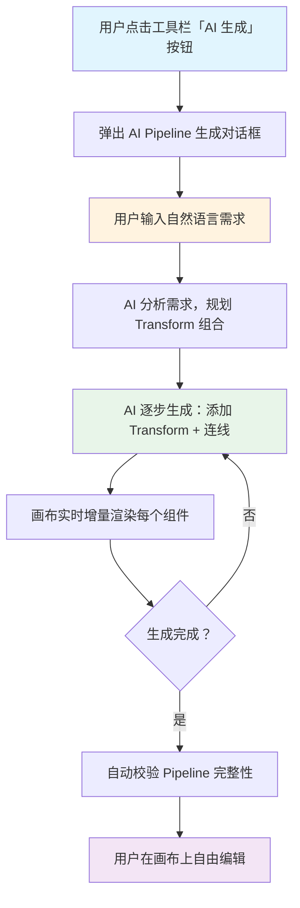
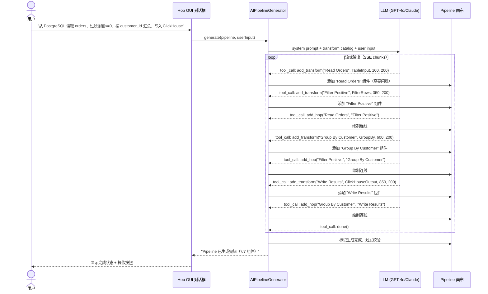
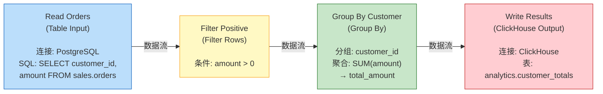
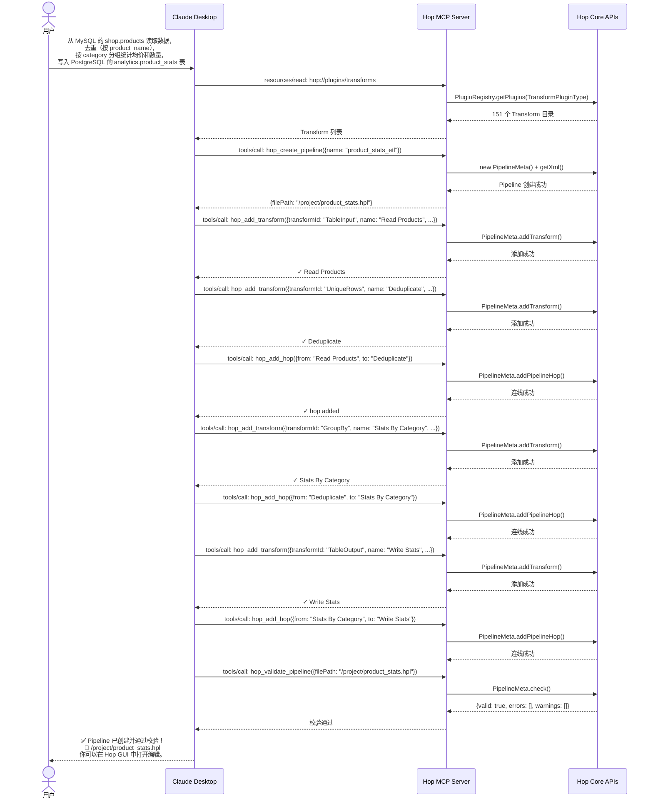
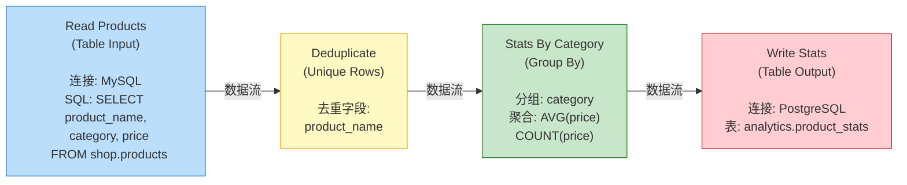
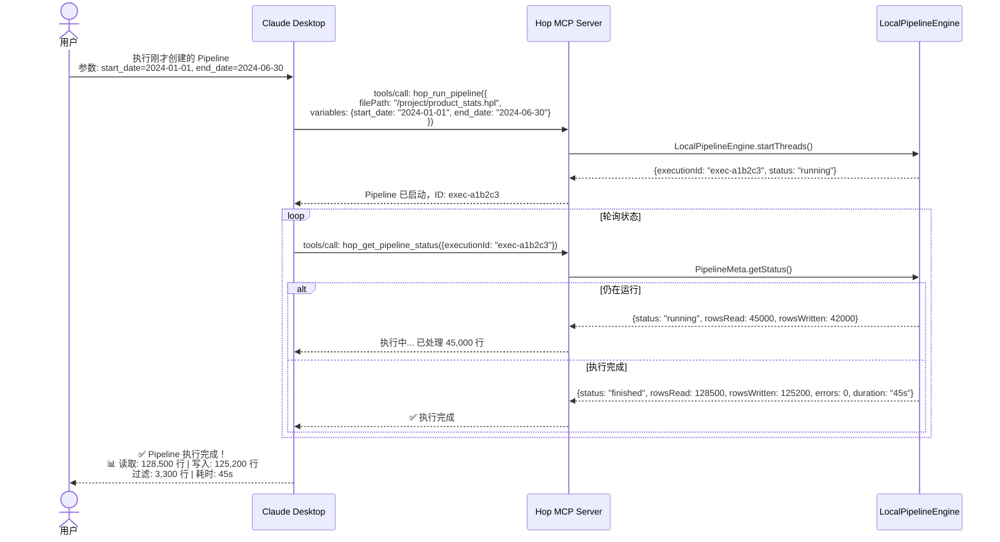
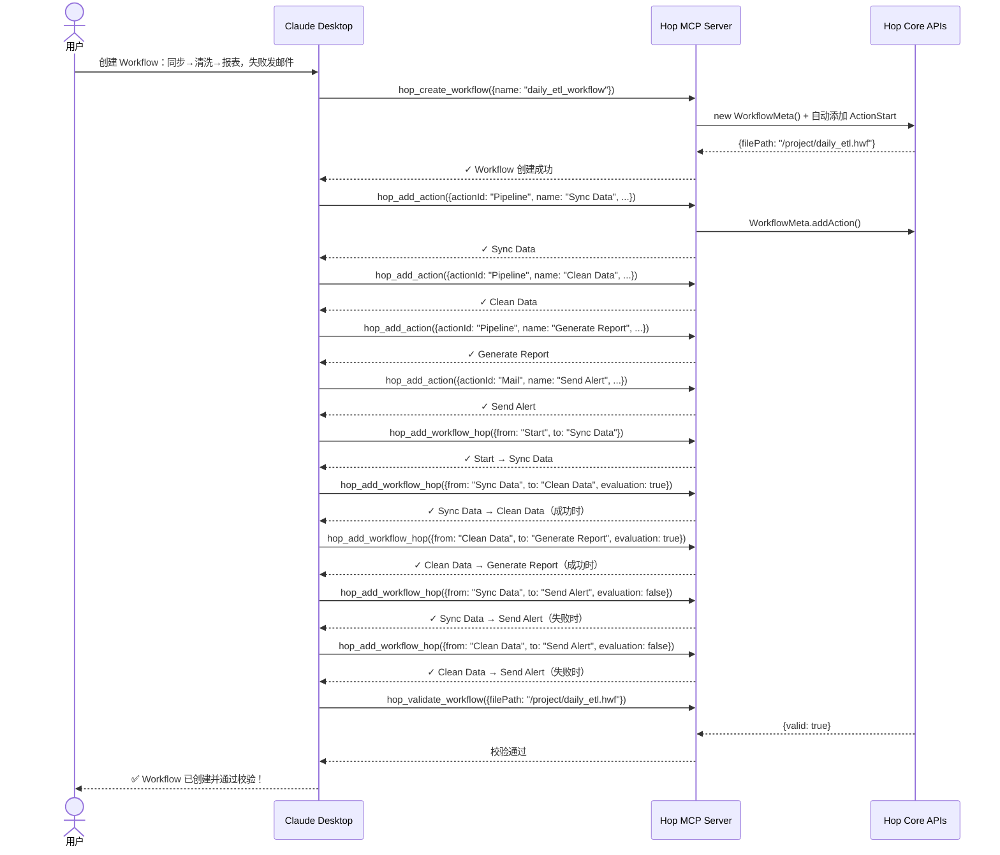
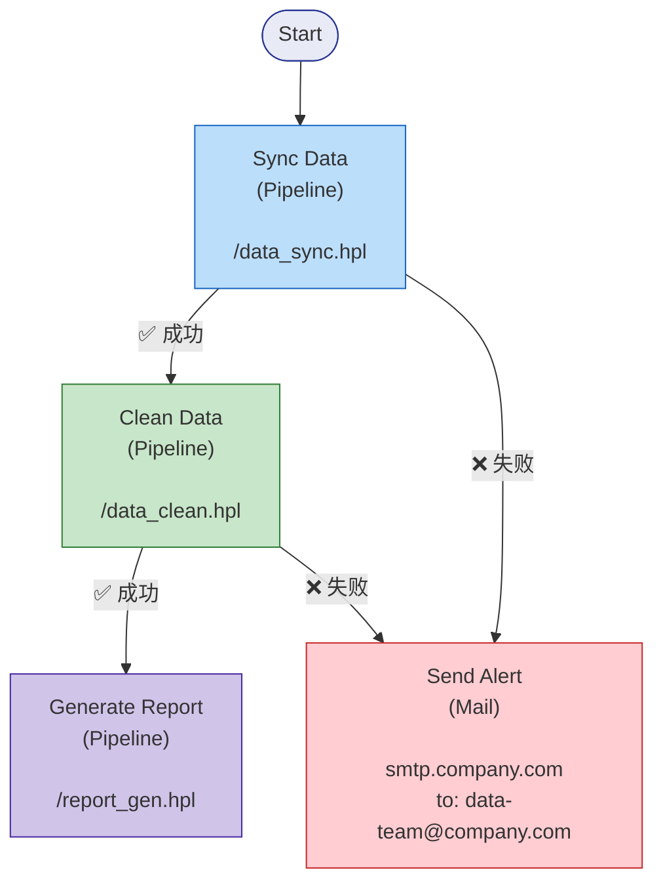
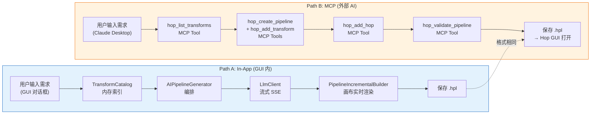

# 智能化 ETL Pipeline 生成方案

## 1. 项目背景与目标

Qi Hop data processor 是一个数据/元数据编排平台，支持通过拖拽方式在画布上构建 ETL Pipeline。目前 Qi Hop data processor 已具备：

- 150+ Transform 插件（输入、输出、转换、脚本等）
- 拖拽式画布编辑器（桌面 RCP / 网页 RAP 双端）
- LLM 对话助手（LlmAssistant）+ RAG 知识库（Qdrant）
- LanguageModelChat Transform（在 pipeline 中调用 LLM）

**核心目标**：用户通过自然语言描述 ETL 需求，AI 自动生成完整 Pipeline，并以流式逐步渲染的方式呈现构建过程，生成完成后用户可自由编辑修改。

### 关键约束

- **双端支持**：同时适配 RCP（SWT 桌面端）和 RAP（Web 端）UI 框架
- **输入方式**：自然语言对话框，用户输入中文/英文描述
- **渲染粒度**：组件级实时渲染 + AI 规划时显示进度状态
- **干预程度**：完全自动生成，生成后自由编辑修改

## 2. 用户交互流程

```
1. 用户点击「AI 生成」按钮（工具栏或画布上下文）
2. 弹出聊天对话框（AIPipelineGeneratorDialog）
3. 用户输入自然语言需求
   「从 PostgreSQL 读取订单表，过滤掉金额<=0 的记录，
    按用户ID分组汇总，结果写入 ClickHouse」
4. AI 开始生成：
   ├─ 对话框显示推理过程：「正在分析需求...需要: Table Input → Filter → Group By → Output」
   ├─ [画布] 出现 "Table Input" 组件
   ├─ [画布] 出现 "Filter Rows" 组件 + 连线
   ├─ [画布] 出现 "Group By" 组件 + 连线
   ├─ [画布] 出现 "ClickHouse Output" 组件 + 连线
   └─ 对话框提示：「Pipeline 已生成完毕，您可以拖拽调整」
5. 用户在画布上自由编辑、修改、运行
6. 支持 Ctrl+Z 逐步回退 AI 的每一步操作
```

## 3. 系统架构

### 3.1 模块划分

```
hop-ui (ui/)
├── assistant/
│   ├── AIPipelineGenerator.java              ← 核心生成器（编排整个流程）
│   ├── AIPipelineGeneratorDialog.java        ← 生成对话框（SWT 组件）
│   ├── AIPipelineGeneratorFacade.java        ← 抽象门面（RAP/RCP 双端适配）
│   ├── PipelineStreamParser.java             ← 流式结果解析器
│   ├── PipelineIncrementalBuilder.java       ← 增量构建器
│   ├── TransformCatalog.java                 ← Transform 目录索引
│   ├── GenerationProgressEvent.java          ← 进度事件
│   └── GenerationProgressListener.java       ← 进度监听器接口

hop-rap (rap/)
├── ...
└── AIPipelineGeneratorFacadeImpl.java        ← RAP 实现（ServerPush + Canvas 推送）

hop-rcp (rcp/)
├── ...
└── AIPipelineGeneratorFacadeImpl.java        ← RCP 实现（直接操作 SWT Canvas）
```

### 3.2 核心架构图

```
┌─────────────────────────────────────────────────────────────┐
│  Hop GUI (RCP / RAP)                                          │
│  ┌──────────────────────┐  ┌──────────────────────────────┐  │
│  │ AIPipelineGenerator  │  │ Pipeline Canvas               │  │
│  │ Dialog               │  │  - PipelinePainter (RCP)     │  │
│  │  - 聊天输入框          │  │  - canvas.js (RAP)          │  │
│  │  - 推理过程流式显示     │  │  - 增量渲染                  │  │
│  │  - 进度状态指示        │  │  - 高亮最新添加组件           │  │
│  └──────────┬───────────┘  └──────────────┬───────────────┘  │
│             │                              ▲                   │
└─────────────┼──────────────────────────────┼───────────────────┘
              │                              │
     ┌────────▼──────────────────────────────┴───────────┐
     │  AIPipelineGenerator (核心服务层)                    │
     │  ┌──────────────┐  ┌──────────────┐  ┌──────────┐  │
     │  │StreamParser  │  │PipelineBuilder│  │UndoRecorder│  │
     │  │ (流式解析)    │  │ (增量构建)    │  │ (操作记录)  │  │
     │  └──────┬───────┘  └──────┬───────┘  └──────────┘  │
     └─────────┼────────────────┼──────────────────────────┘
               │                │
     ┌─────────▼────────────────▼──────────────────────────┐
     │  LLM Service Layer (复用现有 LlmClient)              │
     │  - 流式 SSE + Function Calling / Tool Use            │
     │  - Transform Catalog (插件清单 => 系统提示词)          │
     │  - 支持 OpenAI / Anthropic / Ollama 等               │
     │  - 可选 RAG 增强                                     │
     └────────────────────────────────────────────────────┘
```

### 3.3 核心组件职责

#### TransformCatalog

- **位置**：`ui/src/main/java/org/apache/hop/ui/hopgui/assistant/TransformCatalog.java`
- **职责**：启动时从 `PluginRegistry.getPlugins(TransformPluginType.class)` 扫描所有 Transform 插件，构建结构化目录供 LLM 引用
- **数据模型**：

```json
{
  "transforms": [
    {
      "id": "CsvInput",
      "name": "CSV file input",
      "category": "Input",
      "description": "Read data from a CSV file",
      "keywords": ["csv", "file", "input", "text"],
      "supportedEngines": ["Local", "Beam"],
      "maxInputs": 0,
      "maxOutputs": 1
    }
  ]
}
```

- 支持按 `category`、`keywords` 检索
- 输出为 JSON 格式，通过 system prompt 或 RAG 提供给 LLM
- 在 Hop 启动时懒加载，缓存到内存

#### AIPipelineGenerator

- **位置**：`ui/src/main/java/org/apache/hop/ui/hopgui/assistant/AIPipelineGenerator.java`
- **职责**：编排整个 AI 生成流程

```java
public class AIPipelineGenerator {
    private final LlmClient llmClient;
    private final PipelineStreamParser streamParser;
    private final PipelineIncrementalBuilder builder;
    private final TransformCatalog catalog;

    /**
     * 启动 AI 生成流程
     * @param pipeline  当前编辑的 PipelineMeta（副本）
     * @param userInput 用户自然语言输入
     */
    public void generate(PipelineMeta pipeline, String userInput);

    /**
     * 暂停生成
     */
    public void pause();

    /**
     * 停止生成
     */
    public void stop();
}
```

- 流程：
  1. 从 `TransformCatalog` 获取目录 JSON
  2. 构建 system prompt（目录 + 约束 + 可用函数）
  3. 调用 `LlmClient` 发起流式对话请求
  4. 逐 chunk 交给 `PipelineStreamParser` 解析
  5. 将完整动作交给 `PipelineIncrementalBuilder` 执行
  6. 派发 `GenerationProgressEvent` 给 UI 更新

#### PipelineStreamParser

- **位置**：`ui/src/main/java/org/apache/hop/ui/hopgui/assistant/PipelineStreamParser.java`
- **职责**：从 LLM 流式输出中提取结构化动作

支持两种模式（主 + 备）：

**模式 A — Function Calling（首选）**：

LLM 返回 tool\_calls，每个 call 对应一个 pipeline 操作：

```
tool_call: add_transform(name="Read CSV", type="CsvInput", x=100, y=200)
tool_call: add_hop(from="Read CSV", to="Filter Rows")
tool_call: done()
```

**模式 B — 结构化文本标记（备选）**：

```
##ACTION: add_transform
name: Read CSV
type: CsvInput
x: 100
y: 200
---
```

- 解析完一个完整动作后回调 `PipelineIncrementalBuilder`
- 支持增量解析：即使 chunk 边界在动作中间也能正确处理

#### PipelineIncrementalBuilder

- **位置**：`ui/src/main/java/org/apache/hop/ui/hopgui/assistant/PipelineIncrementalBuilder.java`
- **职责**：对 `PipelineMeta` 执行增量操作

```java
public class PipelineIncrementalBuilder {
    private final PipelineMeta pipeline;
    private final HopGuiPipelineUndoDelegate undoDelegate;

    /**
     * 添加一个 transform 组件
     */
    public TransformMeta addTransform(String name, String pluginId, int x, int y);

    /**
     * 在两个组件之间建立连线
     */
    public PipelineHopMeta addHop(String fromName, String toName);

    /**
     * 设置组件位置
     */
    public void setPosition(String name, int x, int y);

    /**
     * 标记生成完成
     */
    public void markDone();

    /**
     * 获取当前 AI 生成的所有操作列表（用于批量撤销）
     */
    public List<GenerationAction> getActions();
}
```

- 每个操作通过 `AbstractMeta.addUndo()` 记录到 undo 栈（`TYPE_UNDO_NEW`）
- 每个操作完成后触发 `GenerationProgressEvent`

#### AIPipelineGeneratorDialog

- **位置**：`ui/src/main/java/org/apache/hop/ui/hopgui/assistant/AIPipelineGeneratorDialog.java`
- **SWT 对话框组件**，包含：
  - 消息列表区域（用户消息 + AI 推理过程 + 构建日志）
  - 文本输入框 + 发送按钮
  - 进度指示器（生成中 / 暂停 / 完成状态）
  - 停止生成按钮

#### AIPipelineGeneratorFacade

- **位置**：`ui/src/main/java/org/apache/hop/ui/hopgui/assistant/AIPipelineGeneratorFacade.java`
- **抽象门面**，隔离 RAP/RCP 的差异

```java
public abstract class AIPipelineGeneratorFacade {
    /**
     * 获取当前画布的 PipelineMeta
     */
    public abstract PipelineMeta getPipelineMeta();

    /**
     * 触发画布增量重绘
     */
    public abstract void requestRedraw();

    /**
     * 高亮显示指定组件
     */
    public abstract void highlightTransform(String name);

    /**
     * 打开生成对话框
     */
    public abstract void openGeneratorDialog();
}
```

- **RCP 实现**：直接操作 `HopGuiPipelineGraph`，调用 `canvas.redraw()`
- **RAP 实现**：通过 `CanvasFacade.setData()` 推送状态 + `ServerPushSession` 主动刷新

## 4. AI 集成设计

### 4.1 现有基础设施复用

| 现有组件                      | 文件位置                                       | 复用方式                                 |
| ------------------------- | ------------------------------------------ | ------------------------------------ |
| `LlmClient`               | `ui/.../assistant/LlmClient.java`          | 复用流式 SSE 请求能力，新增 function calling 支持 |
| `LlmAssistantConfig`      | `ui/.../assistant/LlmAssistantConfig.java` | 复用 LLM 配置（API URL / Key / Model）     |
| `KnowledgeBaseService`    | `ui/.../assistant/knowledgebase/`          | 可选：为 transform 文档做 RAG 检索            |
| `LanguageModelChatMeta` 等 | `plugins/transforms/languagemodelchat/`    | 参考其 LangChain4j 集成模式（如函数调用格式）        |

### 4.2 LLM Prompt 设计

#### System Prompt 模板

```
你是一个 Apache Hop ETL Pipeline 生成助手。
你的任务是根据用户的需求，生成一个包含多个 Transform 组件的 Pipeline。

可选组件目录：
{transform_catalog_json}

约束规则：
1. 每次添加一个组件或连接线，使用一个 function call
2. 严格遵循数据流方向：输入类组件 → 处理类组件 → 输出类组件
3. 为每个组件选择合适的画布位置（从左到右布局）
4. 用 add_transform 函数添加组件，x 表示水平位置，y 表示垂直位置
5. 用 add_hop 函数建立连线
6. 组件名称在 pipeline 内必须唯一
7. 所有组件添加完成后调用 done() 标记完成

可用函数：
- add_transform(name, type, x, y)
- add_hop(from, to)
- done()
```

#### Tool / Function 定义

```json
[
  {
    "name": "add_transform",
    "description": "在 pipeline 画布中添加一个 transform 组件",
    "parameters": {
      "type": "object",
      "properties": {
        "name": {"type": "string", "description": "组件实例名称，在 pipeline 内必须唯一"},
        "type": {"type": "string", "description": "组件类型 ID，来自上述组件目录"},
        "x": {"type": "integer", "description": "画布 X 坐标"},
        "y": {"type": "integer", "description": "画布 Y 坐标"}
      },
      "required": ["name", "type", "x", "y"]
    }
  },
  {
    "name": "add_hop",
    "description": "在两个组件之间建立数据连线",
    "parameters": {
      "type": "object",
      "properties": {
        "from": {"type": "string", "description": "源组件名称"},
        "to": {"type": "string", "description": "目标组件名称"}
      },
      "required": ["from", "to"]
    }
  },
  {
    "name": "done",
    "description": "标记 pipeline 生成完成，不再添加更多组件",
    "parameters": {"type": "object", "properties": {}}
  }
]
```

### 4.3 自动布局策略

LLM 生成的坐标由 `PipelineIncrementalBuilder` 的自动布局算法辅助：

```
1. 将 transforms 按 categories 分层：
   Layer 0 (输入层): x=100, categories=[Input, Lookup]
   Layer 1 (处理层): x=400, categories=[Transform, Scripting, Flow, Joins]
   Layer 2 (输出层): x=700, categories=[Output, Mapping]

2. 同层内垂直排列：
   y = 100 + index * 100

3. 特殊流（错误流、Info 流）放置在组件下方 80px 处

4. 允许 LLM 通过 add_transform 的 x/y 参数覆盖默认位置
```

布局算法封装在 `PipelineIncrementalBuilder` 中。

### 4.4 支持模型

基于现有 `LlmClient` 的架构，天然支持：

| 模型                          | 支持方式                | 备注                     |
| --------------------------- | ------------------- | ---------------------- |
| OpenAI GPT-4o / GPT-4o-mini | 原生 Function Calling | 首选                     |
| Anthropic Claude 3.5 Sonnet | 原生 Tool Use         | 首选                     |
| Ollama (本地模型)               | 兼容 OpenAI API       | Function Calling 需模型支持 |
| Mistral AI                  | 兼容 OpenAI API       | Function Calling 需模型支持 |
| 其他 LiteLLM 代理模型             | 通过 LiteLLM 代理       | 使用 OpenAI 兼容格式         |

## 5. 流式增量渲染机制

### 5.1 核心渲染流程

```
LLM Streaming Response (SSE chunks)
        │
        ▼
  PipelineStreamParser.parse(chunk)
        │
        ▼
  提取完整动作（add_transform / add_hop / done）
        │
        ▼
  PipelineIncrementalBuilder.execute(action)
        │
        ├─ pipelineMeta.addTransform(...)
        ├─ pipelineMeta.addHop(...)
        └─ undoDelegate.addUndo(...)
        │
        ▼
  触发 GenerationProgressEvent（含新增/修改的组件信息）
        │
        ▼
  UI 层响应事件:
  ├─ RCP: timerExec(batchTimeout) → canvas.redraw() → PipelinePainter 重绘
  └─ RAP: CanvasFacade.setData() → JavaScript canvas.js 重绘
        │
        ▼
  对话框更新进度: "已部署 3/5 组件"
```

### 5.2 帧率优化（去抖批处理）

AI 可能在短时间内密集输出多个 function call。避免每次操作都触发全量重绘：

```java
// 在 PipelineIncrementalBuilder 中实现去抖逻辑
private final Timer batchTimer = new Timer(30, e -> {
    // 30ms 窗口内收集的变更统一触发重绘
    facade.requestRedraw();
    facade.highlightTransform(lastAddedName);
    fireProgressEvent(pendingCount, totalCount);
});
batchTimer.setRepeats(false); // 仅触发一次
```

- 30ms 去抖窗口，窗口内到达的多个变更合并为一次重绘
- 合并后的一次重绘中包含所有新增组件和连线
- 最新添加的组件获得高亮效果（闪烁边框）

### 5.3 进度反馈

生成过程中对话框持续更新：

```
User: 从 PostgreSQL 读取订单表，过滤掉金额<=0...

[AI 推理] 正在分析需求...
→ 需要读取数据 → 过滤 → 输出
需要组件: Table Input, Filter Rows, ClickHouse Output

[构建进度] ■■■□□□ 3/5 组件已部署
[操作日志]
✓ 添加组件 "Table Input" (x=100, y=100)
✓ 添加组件 "Filter Rows" (x=400, y=100)
✓ 连接 Table Input → Filter Rows
⋯ 生成中...
```

### 5.4 RAP Web 端推送实现

RAP 端利用已有基础设施：

1. **ServerPushSession**：复用 `ServerPushSessionFacade` 建立服务端推送通道
2. **Canvas 数据更新**：每次变更后调用 `canvas.setData("nodes", updatedNodes)` + `canvas.setData("hops", updatedHops)`
3. **触发重绘**：在 UI 线程中调用 `canvas.redraw()`，RAP 框架将 Paint 事件序列化到客户端
4. **客户端渲染**：`canvas.js` 的 `handleEvent(SWT.Paint)` 读取最新的 `getData()` 并重绘整个画布

```java
// RAP AIPipelineGeneratorFacadeImpl
public void requestRedraw() {
    ServerPushSessionFacade.start(); // 确保推送通道开启
    hopGui.getDisplay().asyncExec(() -> {
        CanvasFacade.setData(canvas, pipelineMeta); // 推送完整状态
        canvas.redraw(); // 触发客户端重绘
    });
}
```

考虑极端网络延迟场景：在生成过程中将 `ServerPushSession` 保持激活，批量推送减少往返。

## 6. 与现有系统的集成

### 6.1 Pipeline 元数据模型复用

AI 生成的 Pipeline 完全复用现有 `PipelineMeta` 数据结构：

| AI 操作             | 对应 PipelineMeta 操作                         |
| ----------------- | ------------------------------------------ |
| `add_transform` → | `pipelineMeta.addTransform(transformMeta)` |
| `add_hop` →       | `pipelineMeta.addPipelineHop(hopMeta)`     |
| `set_position` →  | `transformMeta.setLocation(x, y)`          |
| `done` →          | `pipelineMeta.clearChanged()` + 校验         |

无需新增任何序列化格式。最终结果仍保存为标准 `.hpl` XML 文件。

### 6.2 Undo/Redo 集成

AI 生成的每个操作都通过 `AbstractMeta.addUndo()` 记录：

- 操作类型：`TYPE_UNDO_NEW`（新增组件 / 连线）
- 撤销粒度：**逐操作撤销**——按一次 Ctrl+Z 回退一个 function call
- 批量撤销：支持「回退到生成开始前」的一键操作
- 实现方式：`PipelineIncrementalBuilder` 生成开始时标记 `startPosition`，生成结束后用户可以回退到该位置

### 6.3 Pipeline 校验

生成完成后自动触发校验：

```java
// AIPipelineGenerator.markDone() 中
pipelineCheckDelegate.checkPipeline(pipelineMeta);
```

- 检查项：组件配置完整性、无孤立组件、数据流连续性
- 校验结果展示在对话框中，允许用户一键定位问题组件

### 6.4 持久化

- AI 生成的 Pipeline 无需特殊存储格式
- 编辑、保存、运行完全复用现有机制
- 旧版 Hop 可以直接打开 AI 生成的 `.hpl` 文件

## 7. 实施计划

### Phase 1：核心基础设施（7 人日）

| 任务                                                     | 工作量 | 产出文件                                                       |
| ------------------------------------------------------ | --- | ---------------------------------------------------------- |
| TransformCatalog 实现                                    | 1d  | `TransformCatalog.java`                                    |
| PipelineIncrementalBuilder 实现                          | 2d  | `PipelineIncrementalBuilder.java`, `GenerationAction.java` |
| PipelineStreamParser 实现                                | 2d  | `PipelineStreamParser.java`                                |
| AIPipelineGenerator 核心 + LlmClient Function Calling 增强 | 2d  | `AIPipelineGenerator.java`, `LlmClient.java` 修改            |

### Phase 2：桌面端 UI（RCP）（4.5 人日）

| 任务                               | 工作量  | 产出文件                                       |
| -------------------------------- | ---- | ------------------------------------------ |
| AIPipelineGeneratorDialog SWT 实现 | 2d   | `AIPipelineGeneratorDialog.java`           |
| 增量渲染集成                           | 1d   | `AIPipelineGeneratorFacadeImpl.java (rcp)` |
| Undo 集成                          | 1d   | `HopGuiPipelineUndoDelegate.java` 修改       |
| 工具栏入口按钮 + 快捷键                    | 0.5d | `HopGui.java` 修改                           |

### Phase 3：Web 端 UI（RAP）（5 人日）

| 任务                                  | 工作量  | 产出文件                                       |
| ----------------------------------- | ---- | ------------------------------------------ |
| AIPipelineGeneratorFacadeImpl (RAP) | 2d   | `AIPipelineGeneratorFacadeImpl.java (rap)` |
| ServerPushSession 集成                | 1d   | 复用已有 `ServerPushSessionFacade`             |
| Canvas 增量推送优化                       | 1.5d | `CanvasFacadeImpl.java` 增强                 |
| RAP 端 SWT Dialog 适配                 | 0.5d | RAP 兼容测试                                   |

### Phase 4：AI 调优与测试（7 人日）

| 任务                                | 工作量 |
| --------------------------------- | --- |
| Prompt 工程迭代优化                     | 2d  |
| 多模型兼容测试（GPT-4o / Claude / Ollama） | 2d  |
| 复杂场景测试（分支、合并、多输入输出）               | 2d  |
| 性能测试 + 帧率调优                       | 1d  |

### 总计工作量：约 23.5 人日

## 8. 技术风险与缓解

| 风险                                   | 影响             | 概率 | 缓解措施                            |
| ------------------------------------ | -------------- | -- | ------------------------------- |
| LLM 生成的 pluginId 不存在或不对应             | pipeline 含无效组件 | 中  | TransformCatalog 约束 + 生成后自动校验替换 |
| 流式解析在 Function Calling 模式下 chunk 不完整 | 解析失败或丢失参数      | 低  | 缓冲区累积 + 跨 chunk 合并              |
| 大量组件（>30）时频繁重绘导致 UI 卡顿               | 用户体验下降         | 中  | 30ms 去抖批处理 + 渐进式渲染              |
| RAP 端网络延迟导致渲染滞后                      | 用户感知卡顿         | 中  | 推理文本先行展示 + 操作批量合并减少推送次数         |
| LLM 无法正确理解复杂嵌套需求（如多分支条件）             | 生成结果不符合预期      | 低  | 多轮对话修正 + 生成后用户可拖拽修改             |

## 9. 未来扩展方向

- **多轮迭代生成**：用户可在生成完成后追加指令（"在这个 pipeline 里再加一个排序组件"）
- **组件配置 AI 填充**：AI 不仅添加组件，还自动填入关键配置（表名、SQL 语句、文件路径）
- **Pipeline 优化建议**：AI 分析现有 pipeline 提出性能优化建议（并行度、数据分区等）
- **模板匹配**：用户输入模糊需求时，AI 先匹配最相似的项目模板再定制化调整
- **AI 测试数据生成**：为 pipeline 的每个组件自动生成测试数据用于预览
- **MCP Server 集成**：提供独立的 MCP Server 模块，支持 Claude Desktop / Codex / Cursor 等外部 AI 客户端通过 MCP 协议远程创建和管理 Pipeline/Workflow（详见 Section 11-16）

## 10. 操作流程全景演示

本章通过完整的端到端示例，展示两种路径下 AI 生成 ETL Pipeline 的真实操作流程。

### 10.1 Path A：In-App 对话生成 Pipeline

#### 用户交互流程



#### AI 生成过程示意



#### 生成的 Pipeline 结构



#### 生成结果：标准 .hpl 文件

AI 生成的 Pipeline 最终保存为标准 Hop XML 格式，可在任何 Hop 版本中打开：

```xml
<?xml version="1.0" encoding="UTF-8"?>
<pipeline>
  <info>
    <pipeline_version>2.19.0</pipeline_version>
    <pipeline_type>Normal</pipeline_type>
  </info>
  <transform>
    <name>Read Orders</name>
    <type>TableInput</type>
    <GUI><xloc>100</xloc><yloc>200</yloc></GUI>
    <connection>PostgreSQL</connection>
    <sql>SELECT customer_id, amount FROM sales.orders</sql>
  </transform>
  <transform>
    <name>Filter Positive Amount</name>
    <type>FilterRows</type>
    <GUI><xloc>350</xloc><yloc>200</yloc></GUI>
    <condition>
      <field>amount</field>
      <condition>larger</condition>
      <value>0</value>
    </condition>
  </transform>
  <transform>
    <name>Group By Customer</name>
    <type>GroupBy</type>
    <GUI><xloc>600</xloc><yloc>200</yloc></GUI>
    <group>
      <field>customer_id</field>
    </group>
    <aggregate>
      <field>amount</field>
      <type>SUM</type>
      <rename>total_amount</rename>
    </aggregate>
  </transform>
  <transform>
    <name>Write Results</name>
    <type>ClickHouseOutput</type>
    <GUI><xloc>850</xloc><yloc>200</yloc></GUI>
    <connection>ClickHouse</connection>
    <schema>analytics</schema>
    <table>customer_totals</table>
  </transform>
  <order>
    <hop><from>Read Orders</from><to>Filter Positive Amount</to><enabled>Y</enabled></hop>
    <hop><from>Filter Positive Amount</from><to>Group By Customer</to><enabled>Y</enabled></hop>
    <hop><from>Group By Customer</from><to>Write Results</to><enabled>Y</enabled></hop>
  </order>
</pipeline>
```

---

### 10.2 Path B：MCP 对话生成 Pipeline

#### 用户在 Claude Desktop 中的完整对话



#### 生成的 Pipeline 结构



---

### 10.3 MCP 执行 Pipeline 演示

MCP 不仅能创建 Pipeline，还能直接执行和监控：



---

### 10.4 MCP 生成 Workflow 演示

Workflow 用于编排多个 Pipeline 和条件分支：

#### 用户需求

> 创建一个 Workflow：
> 1. 先运行数据同步 Pipeline
> 2. 成功后运行数据清洗 Pipeline
> 3. 清洗完成后运行报表生成 Pipeline
> 4. 如果任何步骤失败，发送邮件告警

#### Workflow 生成过程



#### Workflow 结构可视化



---

### 10.5 In-App vs MCP 全流程对比

同一个 ETL 需求在两种路径下的完整操作对比：



| 步骤 | Path A (In-App) | Path B (MCP) |
|------|-----------------|--------------|
| **1. 输入需求** | Hop GUI 对话框 | Claude Desktop / Codex / Cursor |
| **2. 组件发现** | `TransformCatalog` 内存索引 | `hop_list_transforms` MCP Tool |
| **3. 创建 Pipeline** | `AIPipelineGenerator` 编排 | `hop_create_pipeline` MCP Tool |
| **4. 添加 Transform** | `add_transform` function call | `hop_add_transform` MCP Tool |
| **5. 连接组件** | `add_hop` function call | `hop_add_hop` MCP Tool |
| **6. 校验** | `PipelineMeta.check()` | `hop_validate_pipeline` MCP Tool |
| **7. 渲染** | 画布实时增量渲染 | 生成 .hpl 文件，Hop GUI 打开 |
| **8. 执行** | 画布上直接运行 | `hop_run_pipeline` MCP Tool |
| **9. 多轮修改** | 对话框继续输入 | Claude Desktop 继续对话 |
| **10. 持久化** | 保存为 .hpl | 保存为 .hpl（格式相同） |

**关键区别**：
- **Path A** 体验更流畅（实时渲染），但受限于 Hop GUI 环境
- **Path B** 工具链更丰富（可同时调用 DB Schema、文件系统等其他 MCP Server），但需要在 Hop 中打开文件

---

### 10.6 MCP 工具调用全景图

下图展示一次完整的 MCP Pipeline 创建过程中，所有工具调用的执行顺序：

```mermaid
flowchart TD
    Start(["用户输入需求"]) --> Discover["hop_list_transforms\n(发现可用组件)"]
    Discover --> Schema["hop_get_transform_schema\n(获取配置 schema)"]
    Schema --> Create["hop_create_pipeline\n(创建空 Pipeline)"]
    Create --> T1["hop_add_transform\nRead Products (TableInput)"]
    T1 --> T2["hop_add_transform\nDeduplicate (UniqueRows)"]
    T2 --> H1["hop_add_hop\nRead Products → Deduplicate"]
    H1 --> T3["hop_add_transform\nStats By Category (GroupBy)"]
    T3 --> H2["hop_add_hop\nDeduplicate → Stats By Category"]
    H2 --> T4["hop_add_transform\nWrite Stats (TableOutput)"]
    T4 --> H3["hop_add_hop\nStats By Category → Write Stats"]
    H3 --> Validate["hop_validate_pipeline\n(校验 Pipeline)"]
    Validate --> Run["hop_run_pipeline\n(执行 Pipeline)"]
    Run --> Status{"hop_get_pipeline_status\n(轮询状态)"}
    Status -->|"running"| Status
    Status -->|"finished"| Done(["执行完成"])

    style Start fill:#e1f5fe
    style Discover fill:#fff3e0
    style Schema fill:#fff3e0
    style Create fill:#e8f5e9
    style T1 fill:#c8e6c9
    style T2 fill:#c8e6c9
    style T3 fill:#c8e6c9
    style T4 fill:#c8e6c9
    style H1 fill:#f3e5f5
    style H2 fill:#f3e5f5
    style H3 fill:#f3e5f5
    style Validate fill:#fff9c4
    style Run fill:#ffcdd2
    style Status fill:#e0f7fa
    style Done fill:#e8f5e9
```



---

## 11. Codex+MCP 双模架构总览

### 11.1 双模架构

Qi Hop 的智能化 ETL 生成支持两条并行路径，互为补充：

```
┌─────────────────────────────────────────────────────────────────────────┐
│                        用户自然语言输入                                   │
└──────────┬────────────────────────────────────────────┬─────────────────┘
           │                                            │
    ┌──────▼──────────────────┐            ┌────────────▼────────────────┐
    │  Path A: In-App (GUI)   │            │  Path B: MCP (External AI)  │
    │                         │            │                             │
    │  Hop GUI 对话框          │            │  Claude Desktop / Codex     │
    │    ↓                    │            │  Cursor / VS Code Copilot   │
    │  AIPipelineGenerator    │            │    ↓                        │
    │    ↓                    │            │  MCP Client (内置)           │
    │  LlmClient (SSE)        │            │    ↓  [STDIO / JSON-RPC]    │
    │    ↓                    │            │  Hop MCP Server (独立进程)   │
    │  PipelineIncrementalBuilder          │    ↓                        │
    │    ↓                    │            │  Hop Core Java APIs         │
    │  PipelineMeta (画布实时渲染)│          │    ↓                        │
    └─────────────────────────┘            │  .hpl / .hwf 文件           │
                                           │    ↓                        │
                                           │  Hop GUI 打开编辑            │
                                           └─────────────────────────────┘
```

### 11.2 两种路径对比

| 维度 | Path A: In-App（Section 3-8） | Path B: MCP（Section 11-16） |
|------|-------------------------------|-------------------------------|
| AI 客户端 | Hop 内置 LLM 对话框 | 外部 AI（Claude/Codex/Cursor） |
| 通信方式 | 直接 Java 方法调用 | MCP 协议（JSON-RPC 2.0 over STDIO） |
| 渲染方式 | 实时增量渲染到画布 | 生成 .hpl/.hwf 文件，用户在 Hop 中打开 |
| 部署方式 | 嵌入 Hop GUI（RCP/RAP） | 独立进程，与 Hop GUI 完全解耦 |
| 多工具协作 | 单一 LLM 对话 | AI 可同时调用多个 MCP Server（Hop + DB + 文件系统） |
| 适用场景 | 快速原型、边聊边改 | 复杂编排、多工具协作、CI/CD 自动化 |
| 代码侵入性 | 需修改 Hop GUI 代码 | 新增独立 Maven 模块，零侵入 |
| 支持的 AI 模型 | 受限于 LlmClient 支持的模型 | 任意 MCP 兼容的 AI 客户端 |

### 11.3 MCP 的核心价值

- **标准化**：任何 MCP 兼容的 AI 客户端都能操控 Hop，无需定制集成
- **解耦**：MCP Server 不依赖 GUI，可在无头（headless）环境运行
- **组合性**：AI 可同时调用多个 MCP Server 实现跨系统编排（如 Hop + 数据库 Schema + 文件系统）
- **可审计**：所有操作通过 MCP 协议走 JSON-RPC，天然可日志化和审计
- **演进独立**：MCP Server 与 Hop GUI 独立演进，互不影响

### 11.4 典型使用场景

**场景 1：Claude Desktop 对话生成 Pipeline**
```
用户 → Claude Desktop: "从 PostgreSQL 读取 orders 表，过滤金额>0，
                        按 user_id 汇总，写入 ClickHouse"
Claude → hop_create_pipeline → hop_add_transform × 4 → hop_add_hop × 3
Claude → hop_validate_pipeline
Claude → 用户: "Pipeline 已生成，文件在 /project/etl/orders_summary.hpl"
用户 → Hop GUI: 打开文件，可视化编辑
```

**场景 2：Cursor 代码辅助 + MCP 自动生成**
```
开发者在 Cursor 中编写数据处理脚本
→ 选中代码片段，右键 "Generate Hop Pipeline"
→ Cursor 通过 MCP 调用 Hop tools 自动生成对应 Pipeline
→ 开发者在 Hop GUI 中微调
```

**场景 3：CI/CD 自动化 Pipeline 管理**
```
CI 流水线 → 启动 Hop MCP Server (STDIO)
→ 调用 hop_validate_pipeline 校验所有 Pipeline
→ 调用 hop_run_pipeline 执行测试 Pipeline
→ 输出测试报告
```

**场景 4：多 Agent 数据编排**
```
Agent 1 (数据建模): 分析数据源，生成数据模型
→ Agent 2 (ETL 设计): 基于数据模型，通过 MCP 生成 Hop Pipeline
→ Agent 3 (质量校验): 通过 MCP 校验 Pipeline 并添加数据质量检查
```

## 12. MCP Server 模块设计

### 12.1 技术选型

| 组件 | 选型 | 说明 |
|------|------|------|
| MCP 协议实现 | Java MCP SDK `mcp-core` v2.0.0 | 官方 SDK，MIT 许可，支持 STDIO 传输 |
| JSON 序列化 | Jackson 2.x | 与 Hop 现有 JSON 序列化一致 |
| 传输层 | STDIO（首选） | `System.in`/`System.out` + JSON-RPC 2.0，零网络开销 |
| Pipeline/Workflow 操作 | `hop-core` + `hop-engine` Java API | 直接复用 `PipelineMeta`/`WorkflowMeta` API |
| 插件发现 | `PluginRegistry` | 复用现有插件注册表 |
| Schema 提取 | `@HopMetadataProperty` 注解反射 | 自动提取 Transform/Action 配置字段 |

### 12.2 模块结构

```
hop-mcp/                                    ← 新增顶层 Maven 模块
├── pom.xml
├── src/main/java/org/apache/hop/mcp/
│   ├── HopMcpServer.java                   ← 入口：初始化 MCP Server + 注册 tools/resources
│   ├── HopMcpConfig.java                   ← 配置模型（项目目录、Hop Server 连接等）
│   │
│   ├── transport/
│   │   └── StdioTransport.java             ← STDIO 传输层封装
│   │
│   ├── tools/
│   │   ├── HopTool.java                    ← Tool 基类（公共日志、错误处理）
│   │   │
│   │   ├── discovery/                      ← 发现类 Tools
│   │   │   ├── ListTransformsTool.java
│   │   │   ├── GetTransformSchemaTool.java
│   │   │   ├── ListActionsTool.java
│   │   │   └── GetActionSchemaTool.java
│   │   │
│   │   ├── pipeline/                       ← Pipeline CRUD Tools
│   │   │   ├── CreatePipelineTool.java
│   │   │   ├── GetPipelineTool.java
│   │   │   ├── AddTransformTool.java
│   │   │   ├── AddHopTool.java
│   │   │   ├── UpdateTransformTool.java
│   │   │   ├── RemoveTransformTool.java
│   │   │   └── ValidatePipelineTool.java
│   │   │
│   │   ├── workflow/                       ← Workflow CRUD Tools
│   │   │   ├── CreateWorkflowTool.java
│   │   │   ├── AddActionTool.java
│   │   │   ├── AddWorkflowHopTool.java
│   │   │   └── ValidateWorkflowTool.java
│   │   │
│   │   └── execution/                      ← 执行类 Tools
│   │       ├── RunPipelineTool.java
│   │       ├── RunWorkflowTool.java
│   │       ├── GetPipelineStatusTool.java
│   │       └── StopPipelineTool.java
│   │
│   ├── resources/
│   │   ├── PluginCatalogResource.java      ← Transform/Action 完整目录
│   │   ├── PipelineMetadataResource.java   ← Pipeline 结构（JSON）
│   │   ├── DatabaseConnectionsResource.java← 数据库连接列表
│   │   └── TableSchemaResource.java        ← 表结构查询
│   │
│   └── prompts/
│       ├── EtlPipelineBuilderPrompt.java   ← 引导式 Pipeline 构建
│       ├── DataQualityCheckPrompt.java     ← 数据质量检查模板
│       ├── MigrationAssistantPrompt.java   ← Kettle 迁移辅助
│       └── PipelineOptimizerPrompt.java    ← 性能优化建议
│
└── src/main/resources/
    └── mcp-server-config.json              ← 默认配置
```

### 12.3 配置模型

```java
public class HopMcpConfig {
    private String projectDirectory;      // Pipeline/Workflow 文件存储根目录
    private String hopServerUrl;          // 可选：远程 Hop Server 地址
    private String hopServerUser;         // 可选：Hop Server 用户名
    private String hopServerPassword;     // 可选：Hop Server 密码
    private String defaultRunConfig;      // 默认运行配置（默认 "local"）
    private boolean autoLayout = true;    // 是否自动布局新增组件
    private boolean validateOnCreate = true; // 创建后是否自动校验
}
```

默认配置文件 `mcp-server-config.json`：
```json
{
  "projectDirectory": "./hop-projects",
  "hopServerUrl": null,
  "defaultRunConfig": "local",
  "autoLayout": true,
  "validateOnCreate": true
}
```

### 12.4 启动流程

```java
public class HopMcpServer {
    public static void main(String[] args) throws Exception {
        // 1. 加载配置
        HopMcpConfig config = HopMcpConfig.load(args);

        // 2. 初始化 Hop 运行时（加载插件、元数据提供者等）
        HopEnvironment.init();

        // 3. 构建并启动 MCP Server
        McpServer.sync(new StdioTransport(System.in, System.out))
            .serverInfo("qi-hop-mcp", "1.0.0")
            .capabilities(ServerCapabilities.builder()
                .tools(true)
                .resources(true)
                .prompts(true)
                .build())
            // Discovery Tools
            .tool(new ListTransformsTool())
            .tool(new GetTransformSchemaTool())
            .tool(new ListActionsTool())
            .tool(new GetActionSchemaTool())
            // Pipeline CRUD Tools
            .tool(new CreatePipelineTool(config))
            .tool(new GetPipelineTool(config))
            .tool(new AddTransformTool(config))
            .tool(new AddHopTool(config))
            .tool(new UpdateTransformTool(config))
            .tool(new RemoveTransformTool(config))
            .tool(new ValidatePipelineTool(config))
            // Workflow CRUD Tools
            .tool(new CreateWorkflowTool(config))
            .tool(new AddActionTool(config))
            .tool(new AddWorkflowHopTool(config))
            .tool(new ValidateWorkflowTool(config))
            // Execution Tools
            .tool(new RunPipelineTool(config))
            .tool(new RunWorkflowTool(config))
            .tool(new GetPipelineStatusTool(config))
            .tool(new StopPipelineTool(config))
            // Resources
            .resource(new PluginCatalogResource())
            .resource(new PipelineMetadataResource(config))
            .resource(new DatabaseConnectionsResource())
            .resource(new TableSchemaResource(config))
            // Prompts
            .prompt(new EtlPipelineBuilderPrompt())
            .prompt(new DataQualityCheckPrompt())
            .prompt(new MigrationAssistantPrompt())
            .prompt(new PipelineOptimizerPrompt())
            .build()
            .run(); // 阻塞运行，直到 STDIO 关闭
    }
}
```

### 12.5 Maven 依赖

```xml
<project>
    <parent>
        <groupId>org.apache.hop</groupId>
        <artifactId>hop</artifactId>
        <version>2.19.0-SNAPSHOT</version>
    </parent>
    <artifactId>hop-mcp</artifactId>
    <name>Hop MCP Server</name>

    <dependencies>
        <!-- MCP Protocol -->
        <dependency>
            <groupId>io.modelcontextprotocol</groupId>
            <artifactId>mcp-core</artifactId>
            <version>2.0.0</version>
        </dependency>
        <dependency>
            <groupId>io.modelcontextprotocol</groupId>
            <artifactId>mcp-json-jackson2</artifactId>
            <version>2.0.0</version>
        </dependency>

        <!-- Hop Core -->
        <dependency>
            <groupId>org.apache.hop</groupId>
            <artifactId>hop-core</artifactId>
            <version>${project.version}</version>
        </dependency>
        <dependency>
            <groupId>org.apache.hop</groupId>
            <artifactId>hop-engine</artifactId>
            <version>${project.version}</version>
        </dependency>

        <!-- Jackson (JSON) -->
        <dependency>
            <groupId>com.fasterxml.jackson.core</groupId>
            <artifactId>jackson-databind</artifactId>
        </dependency>
    </dependencies>
</project>
```

### 12.6 Claude Desktop / Codex 配置

用户在 Claude Desktop 的 `claude_desktop_config.json` 中添加：

```json
{
  "mcpServers": {
    "qi-hop": {
      "command": "java",
      "args": ["-jar", "/path/to/hop-mcp-2.19.0-SNAPSHOT.jar"],
      "env": {
        "HOP_PROJECT_DIR": "/path/to/my/etl/project"
      }
    }
  }
}
```

在 Cursor 的 `.cursor/mcp.json` 中添加：

```json
{
  "mcpServers": {
    "qi-hop": {
      "command": "java",
      "args": ["-jar", "/path/to/hop-mcp-2.19.0-SNAPSHOT.jar"]
    }
  }
}
```

## 13. MCP Tool 详细定义

### 13.1 Discovery Tools（发现类）

#### `hop_list_transforms`

列出所有可用的 Transform 插件类型。

```json
{
  "name": "hop_list_transforms",
  "description": "列出所有可用的 Transform（步骤）类型，包括名称、分类、描述和关键词",
  "inputSchema": {
    "type": "object",
    "properties": {
      "category": {
        "type": "string",
        "description": "按分类过滤（如 Input, Output, Transform, Scripting 等），不填则返回全部"
      },
      "keyword": {
        "type": "string",
        "description": "按关键词搜索过滤"
      }
    },
    "additionalProperties": false
  }
}
```

**实现逻辑**：
```java
public class ListTransformsTool implements HopTool {
    @Override
    public Object execute(Map<String, Object> args) {
        String category = (String) args.get("category");
        String keyword = (String) args.get("keyword");

        List<IPlugin> plugins = PluginRegistry.getInstance()
            .getPlugins(TransformPluginType.class);

        return plugins.stream()
            .filter(p -> category == null || p.getCategoryDescription().equals(category))
            .filter(p -> keyword == null || matchesKeyword(p, keyword))
            .map(p -> Map.of(
                "id", p.getId(),
                "name", p.getName(),
                "category", p.getCategoryDescription(),
                "description", p.getDescription(),
                "keywords", p.getKeywords()
            ))
            .toList();
    }
}
```

#### `hop_get_transform_schema`

获取指定 Transform 类型的配置字段 schema。

```json
{
  "name": "hop_get_transform_schema",
  "description": "获取指定 Transform 类型的完整配置 schema，包括所有字段名称、类型、默认值和注入键",
  "inputSchema": {
    "type": "object",
    "properties": {
      "transformId": {
        "type": "string",
        "description": "Transform 类型 ID（如 TableInput, CsvInput, FilterRows）"
      }
    },
    "required": ["transformId"],
    "additionalProperties": false
  }
}
```

**实现逻辑**：通过反射扫描 `ITransformMeta` 实现类的 `@HopMetadataProperty` 注解，自动提取字段信息：
```java
public Object execute(Map<String, Object> args) {
    String transformId = (String) args.get("transformId");

    IPlugin plugin = PluginRegistry.getInstance()
        .findPluginWithId(TransformPluginType.class, transformId);
    Class<?> metaClass = plugin.loadClass(ITransformMeta.class);

    List<Map<String, Object>> fields = new ArrayList<>();
    for (Field field : metaClass.getDeclaredFields()) {
        HopMetadataProperty ann = field.getAnnotation(HopMetadataProperty.class);
        if (ann != null) {
            fields.add(Map.of(
                "name", field.getName(),
                "injectionKey", ann.injectionKey(),
                "type", field.getType().getSimpleName(),
                "key", ann.key()
            ));
        }
    }
    return Map.of("transformId", transformId, "fields", fields);
}
```

#### `hop_list_actions`

列出所有可用的 Workflow Action 类型。参数和返回与 `hop_list_transforms` 类似，但针对 `ActionPluginType`。

#### `hop_get_action_schema`

获取指定 Action 类型的配置 schema。实现与 `hop_get_transform_schema` 类似。

### 13.2 Pipeline CRUD Tools

#### `hop_create_pipeline`

创建一个新的空 Pipeline 文件。

```json
{
  "name": "hop_create_pipeline",
  "description": "创建一个新的空 Pipeline（.hpl 文件），返回文件路径",
  "inputSchema": {
    "type": "object",
    "properties": {
      "name": {
        "type": "string",
        "description": "Pipeline 名称"
      },
      "directory": {
        "type": "string",
        "description": "存储目录（相对于 projectDirectory），不填则存放在根目录"
      }
    },
    "required": ["name"],
    "additionalProperties": false
  }
}
```

**返回值**：
```json
{
  "filePath": "/project/etl/orders_summary.hpl",
  "name": "orders_summary",
  "metadata": {
    "pipelineType": "Normal",
    "version": "2.19.0"
  }
}
```

**实现逻辑**：
```java
public Object execute(Map<String, Object> args) {
    String name = (String) args.get("name");
    String directory = (String) args.getOrDefault("directory", "");

    PipelineMeta pipeline = new PipelineMeta();
    pipeline.setName(name);

    String fullPath = Paths.get(config.getProjectDirectory(), directory, name + ".hpl").toString();
    pipeline.setFilename(fullPath);

    // 写入空 Pipeline XML
    String xml = pipeline.getXml(new Variables());
    Files.writeString(Path.of(fullPath), xml);

    if (config.isValidateOnCreate()) {
        pipeline.check(new ArrayList<>(), Variables(), ...);
    }

    return Map.of("filePath", fullPath, "name", name);
}
```

#### `hop_get_pipeline`

读取指定 Pipeline 的完整结构（transforms + hops），以 JSON 格式返回。

```json
{
  "name": "hop_get_pipeline",
  "description": "读取 Pipeline 的完整结构，包括所有 transforms、hops 和配置",
  "inputSchema": {
    "type": "object",
    "properties": {
      "filePath": {
        "type": "string",
        "description": "Pipeline 文件路径"
      }
    },
    "required": ["filePath"],
    "additionalProperties": false
  }
}
```

**返回值**：
```json
{
  "name": "orders_summary",
  "filePath": "/project/etl/orders_summary.hpl",
  "transforms": [
    {
      "name": "Read Orders",
      "type": "TableInput",
      "location": {"x": 100, "y": 100},
      "config": {"connection": "PostgreSQL", "sql": "SELECT * FROM orders"}
    },
    {
      "name": "Filter Positive",
      "type": "FilterRows",
      "location": {"x": 300, "y": 100},
      "config": {"condition": "amount > 0"}
    }
  ],
  "hops": [
    {"from": "Read Orders", "to": "Filter Positive", "enabled": true}
  ]
}
```

#### `hop_add_transform`

向 Pipeline 添加一个 Transform 组件。

```json
{
  "name": "hop_add_transform",
  "description": "向 Pipeline 添加一个 Transform（步骤）组件，自动布局或手动指定坐标",
  "inputSchema": {
    "type": "object",
    "properties": {
      "filePath": {
        "type": "string",
        "description": "Pipeline 文件路径"
      },
      "transformId": {
        "type": "string",
        "description": "Transform 类型 ID（如 TableInput, FilterRows）"
      },
      "name": {
        "type": "string",
        "description": "Transform 实例名称（Pipeline 内必须唯一）"
      },
      "x": {
        "type": "integer",
        "description": "画布 X 坐标（autoLayout=true 时可省略）"
      },
      "y": {
        "type": "integer",
        "description": "画布 Y 坐标（autoLayout=true 时可省略）"
      },
      "config": {
        "type": "object",
        "description": "Transform 配置（字段名对应 @HopMetadataProperty 的 injectionKey）"
      }
    },
    "required": ["filePath", "transformId", "name"],
    "additionalProperties": false
  }
}
```

**实现逻辑**：
```java
public Object execute(Map<String Object> args) {
    String filePath = (String) args.get("filePath");
    String transformId = (String) args.get("transformId");
    String name = (String) args.get("name");
    Map<String, Object> config = (Map<String, Object>) args.get("config");

    // 1. 加载 Pipeline
    PipelineMeta pipeline = loadPipeline(filePath);

    // 2. 创建 ITransformMeta 实例
    IPlugin plugin = PluginRegistry.getInstance()
        .findPluginWithId(TransformPluginType.class, transformId);
    ITransformMeta transformMeta = (ITransformMeta) plugin.loadClass(ITransformMeta.class)
        .getDeclaredConstructor().newInstance();
    transformMeta.setDefault();

    // 3. 通过 injectionKey 填充配置
    if (config != null) {
        HopMetadataInjector.injectProperties(transformMeta, config, metadataProvider);
    }

    // 4. 包装为 TransformMeta 并设置位置
    TransformMeta meta = new TransformMeta(transformId, name, transformMeta);
    if (config.containsKey("x") && config.containsKey("y")) {
        meta.setLocation((int) config.get("x"), (int) config.get("y"));
    } else if (config.isAutoLayout()) {
        autoLayout(pipeline, meta);
    }

    // 5. 添加到 Pipeline
    pipeline.addTransform(meta);

    // 6. 保存
    savePipeline(pipeline, filePath);

    return Map.of("name", name, "type", transformId, "location", meta.getLocation());
}
```

#### `hop_add_hop`

在两个 Transform 之间建立数据连线。

```json
{
  "name": "hop_add_hop",
  "description": "在两个 Transform 之间建立数据连线（hop）",
  "inputSchema": {
    "type": "object",
    "properties": {
      "filePath": {
        "type": "string",
        "description": "Pipeline 文件路径"
      },
      "from": {
        "type": "string",
        "description": "源 Transform 名称"
      },
      "to": {
        "type": "string",
        "description": "目标 Transform 名称"
      },
      "enabled": {
        "type": "boolean",
        "description": "是否启用该连线（默认 true）",
        "default": true
      }
    },
    "required": ["filePath", "from", "to"],
    "additionalProperties": false
  }
}
```

#### `hop_update_transform`

更新已有 Transform 的配置。

```json
{
  "name": "hop_update_transform",
  "description": "更新 Pipeline 中已有 Transform 的配置字段",
  "inputSchema": {
    "type": "object",
    "properties": {
      "filePath": {
        "type": "string",
        "description": "Pipeline 文件路径"
      },
      "name": {
        "type": "string",
        "description": "Transform 实例名称"
      },
      "config": {
        "type": "object",
        "description": "要更新的配置字段（仅传入需要修改的字段）"
      }
    },
    "required": ["filePath", "name", "config"],
    "additionalProperties": false
  }
}
```

#### `hop_remove_transform`

移除 Pipeline 中的 Transform 及其关联的 hop。

```json
{
  "name": "hop_remove_transform",
  "description": "从 Pipeline 中移除一个 Transform 及其所有关联的 hop",
  "inputSchema": {
    "type": "object",
    "properties": {
      "filePath": {
        "type": "string",
        "description": "Pipeline 文件路径"
      },
      "name": {
        "type": "string",
        "description": "要移除的 Transform 名称"
      }
    },
    "required": ["filePath", "name"],
    "additionalProperties": false
  }
}
```

#### `hop_validate_pipeline`

校验 Pipeline 的完整性和正确性。

```json
{
  "name": "hop_validate_pipeline",
  "description": "校验 Pipeline 配置的完整性，检查组件连接、配置缺失等问题",
  "inputSchema": {
    "type": "object",
    "properties": {
      "filePath": {
        "type": "string",
        "description": "Pipeline 文件路径"
      }
    },
    "required": ["filePath"],
    "additionalProperties": false
  }
}
```

**返回值**：
```json
{
  "valid": false,
  "errors": [
    {"transform": "Filter Positive", "message": "未配置过滤条件"},
    {"type": "connectivity", "message": "Transform 'Sort' 未连接到任何下游组件"}
  ],
  "warnings": [
    {"transform": "Read Orders", "message": "建议添加 LIMIT 子句以避免全表扫描"}
  ]
}
```

### 13.3 Workflow CRUD Tools

#### `hop_create_workflow`

创建新的 Workflow 文件（自动包含 ActionStart 入口点）。

```json
{
  "name": "hop_create_workflow",
  "description": "创建一个新的空 Workflow（.hwf 文件），自动添加 Start 入口点",
  "inputSchema": {
    "type": "object",
    "properties": {
      "name": {
        "type": "string",
        "description": "Workflow 名称"
      },
      "directory": {
        "type": "string",
        "description": "存储目录（相对于 projectDirectory）"
      }
    },
    "required": ["name"],
    "additionalProperties": false
  }
}
```

**实现要点**：创建 Workflow 时自动添加 `ActionStart` 作为第一个 Action，位置在 (100, 100)。

#### `hop_add_action`

向 Workflow 添加 Action。

```json
{
  "name": "hop_add_action",
  "description": "向 Workflow 添加一个 Action 组件",
  "inputSchema": {
    "type": "object",
    "properties": {
      "filePath": {"type": "string", "description": "Workflow 文件路径"},
      "actionId": {"type": "string", "description": "Action 类型 ID（如 Pipeline, Shell, FileExists）"},
      "name": {"type": "string", "description": "Action 实例名称"},
      "x": {"type": "integer", "description": "画布 X 坐标"},
      "y": {"type": "integer", "description": "画布 Y 坐标"},
      "config": {"type": "object", "description": "Action 配置"}
    },
    "required": ["filePath", "actionId", "name"],
    "additionalProperties": false
  }
}
```

#### `hop_add_workflow_hop`

在两个 Action 之间建立条件连线。

```json
{
  "name": "hop_add_workflow_hop",
  "description": "在两个 Action 之间建立条件连线，支持成功/失败/无条件跳转",
  "inputSchema": {
    "type": "object",
    "properties": {
      "filePath": {"type": "string", "description": "Workflow 文件路径"},
      "from": {"type": "string", "description": "源 Action 名称"},
      "to": {"type": "string", "description": "目标 Action 名称"},
      "evaluation": {
        "type": "boolean",
        "description": "true=成功时跳转, false=失败时跳转（默认 true）",
        "default": true
      },
      "unconditional": {
        "type": "boolean",
        "description": "true=无条件跳转（覆盖 evaluation）（默认 false）",
        "default": false
      }
    },
    "required": ["filePath", "from", "to"],
    "additionalProperties": false
  }
}
```

#### `hop_validate_workflow`

校验 Workflow 完整性。检查是否有 Start 入口、所有 Action 是否有入边（除 Start 外）、hop 条件是否完整。

### 13.4 Execution Tools（执行类）

#### `hop_run_pipeline`

执行 Pipeline。

```json
{
  "name": "hop_run_pipeline",
  "description": "执行一个 Pipeline，支持本地执行或远程执行（通过 Hop Server）",
  "inputSchema": {
    "type": "object",
    "properties": {
      "filePath": {"type": "string", "description": "Pipeline 文件路径"},
      "variables": {
        "type": "object",
        "description": "Pipeline 参数/变量",
        "additionalProperties": {"type": "string"}
      },
      "runConfig": {
        "type": "string",
        "description": "运行配置名称（默认 local）"
      }
    },
    "required": ["filePath"],
    "additionalProperties": false
  }
}
```

**返回值**：
```json
{
  "executionId": "uuid-xxx",
  "status": "running",
  "message": "Pipeline 已启动执行"
}
```

**实现逻辑**：
- 本地模式：通过 `LocalPipelineEngine` 同步执行
- 远程模式：通过 `HopServerMeta.sendExport()` + `startPipeline()` 调用 Hop Server
- 支持 MCP progress tracking：`ctx.progress().send(0, 100, "Starting...")`

#### `hop_get_pipeline_status`

查询 Pipeline 执行状态。

```json
{
  "name": "hop_get_pipeline_status",
  "description": "查询 Pipeline 的执行状态和运行指标",
  "inputSchema": {
    "type": "object",
    "properties": {
      "executionId": {"type": "string", "description": "执行 ID"}
    },
    "required": ["executionId"],
    "additionalProperties": false
  }
}
```

**返回值**：
```json
{
  "status": "finished",
  "rowsRead": 150000,
  "rowsWritten": 148500,
  "rowsRejected": 1500,
  "errors": 0,
  "duration": "2m 35s",
  "transformStats": [
    {"name": "Read Orders", "rowsRead": 150000, "rowsWritten": 150000},
    {"name": "Filter Positive", "rowsRead": 150000, "rowsWritten": 148500}
  ]
}
```

#### `hop_stop_pipeline`

停止正在执行的 Pipeline。

```json
{
  "name": "hop_stop_pipeline",
  "description": "停止正在执行的 Pipeline",
  "inputSchema": {
    "type": "object",
    "properties": {
      "executionId": {"type": "string", "description": "执行 ID"}
    },
    "required": ["executionId"],
    "additionalProperties": false
  }
}
```

#### `hop_run_workflow`

执行 Workflow。参数和返回与 `hop_run_pipeline` 类似。

## 14. MCP Resource & Prompt 设计

### 14.1 Resources（只读数据源）

Resources 是只读的，AI 客户端可在调用 Tool 前读取 Resource 获取上下文信息。

#### `hop://plugins/transforms`

返回所有 Transform 插件的完整目录。

```json
{
  "uri": "hop://plugins/transforms",
  "name": "Transform 插件目录",
  "mimeType": "application/json",
  "description": "所有可用 Transform（步骤）的完整列表，包含 id、名称、分类、描述和关键词"
}
```

**内容示例**：
```json
{
  "total": 151,
  "categories": {
    "Input": ["CsvInput", "JsonInput", "TableInput", "TextFileInput", ...],
    "Output": ["TableOutput", "TextFileOutput", "JsonOutput", ...],
    "Transform": ["FilterRows", "Sort", "GroupBy", "Calculator", ...],
    "Scripting": ["JavaScript", "RegexEval", "Script", ...],
    "Joins": ["DatabaseJoin", "StreamLookup", "MergeJoin", ...],
    "Flow": ["SwitchCase", "FilterRows", "Abort", ...]
  }
}
```

#### `hop://plugins/actions`

返回所有 Action 插件的完整目录。

#### `hop://plugins/{category}`

按分类过滤的插件列表。URI 模板参数 `{category}` 匹配分类名称。

#### `hop://pipeline/{path}`

读取指定 Pipeline 的元数据（JSON 格式）。只读，不修改文件。

#### `hop://connections`

返回所有已配置的数据库连接列表。

```json
{
  "uri": "hop://connections",
  "name": "数据库连接列表",
  "mimeType": "application/json",
  "description": "所有已配置的数据库连接（DatabaseMeta），包含名称、类型、主机、数据库名"
}
```

#### `hop://schema/{connection}/{table}`

查询指定数据库连接中某张表的列结构。

```json
{
  "uri": "hop://schema/{connection}/{table}",
  "name": "表结构",
  "mimeType": "application/json",
  "description": "查询指定数据库连接中某张表的列名、类型、是否可空等信息"
}
```

### 14.2 Prompts（交互模板）

Prompts 是用户控制的模板，用于引导式构建 ETL 流程。

#### `etl-pipeline-builder`

引导式 Pipeline 构建 Prompt。

```json
{
  "name": "etl-pipeline-builder",
  "description": "引导式 Pipeline 构建：从数据源到目标的完整 ETL 流程生成",
  "arguments": [
    {
      "name": "source_type",
      "description": "数据源类型（如 PostgreSQL, MySQL, CSV, REST API）",
      "required": true
    },
    {
      "name": "target_type",
      "description": "目标类型（如 ClickHouse, MySQL, CSV, S3）",
      "required": true
    },
    {
      "name": "description",
      "description": "ETL 需求的自然语言描述",
      "required": true
    }
  ]
}
```

**展开后的消息**：
```
你是一个 Qi Hop ETL Pipeline 构建助手。

数据源类型：{source_type}
目标类型：{target_type}
需求描述：{description}

请按以下步骤生成 Pipeline：
1. 使用 hop_list_transforms 查询可用的输入/输出组件
2. 使用 hop_get_transform_schema 获取关键组件的配置 schema
3. 使用 hop_create_pipeline 创建 Pipeline
4. 依次使用 hop_add_transform 添加所需的 Transform
5. 使用 hop_add_hop 建立数据流连线
6. 使用 hop_validate_pipeline 校验 Pipeline
```

#### `data-quality-check`

数据质量检查 Pipeline 模板。

#### `migration-assistant`

Kettle → Hop 迁移辅助模板。

#### `pipeline-optimizer`

Pipeline 性能优化建议模板。

## 15. 可行性分析与差距评估

### 15.1 技术可行性评估

| 评估维度 | 状态 | 说明 |
|---------|------|------|
| Java MCP SDK 可用性 | ✅ 可行 | 官方 SDK v2.0.0，MIT 许可，支持 STDIO 传输，无 Spring 依赖 |
| Pipeline 程序化创建 | ✅ 可行 | `PipelineMeta.addTransform()` / `addPipelineHop()` API 完善 |
| Workflow 程序化创建 | ✅ 可行 | `WorkflowMeta.addAction()` / `addWorkflowHop()` API 完善 |
| Transform 配置自动填充 | ⚠️ 部分可行 | `@HopMetadataProperty(injectionKey=...)` 提供结构化元数据，但部分旧插件仍用 legacy XML |
| Plugin Schema 自动提取 | ⚠️ 部分可行 | 新式插件（使用 `@HopMetadataProperty`）可反射提取；旧式插件需手动补充 |
| Pipeline 校验 | ✅ 可行 | `PipelineMeta.check()` 已有完整校验逻辑 |
| 本地执行 | ✅ 可行 | `LocalPipelineEngine` 可直接使用 |
| 远程执行 | ✅ 可行 | `HopServerMeta` HTTP 客户端已实现完整的 pipeline/workflow 生命周期调用 |
| 自动布局 | ✅ 可行 | 基于拓扑排序的分层布局算法，参考 Section 4.3 |
| STDIO 传输 | ✅ 可行 | Java MCP SDK 原生支持，`System.in`/`System.out` |

### 15.2 差距与风险

| 差距 | 影响程度 | 缓解方案 |
|------|---------|---------|
| `LlmClient` 不支持 function calling | 中 | 影响 In-App 方案；MCP 方案不受影响（外部 AI 原生支持 tools） |
| 部分 Transform 的 injectionKey 不完整 | 中 | 通过 RAG 补充文档 + 分阶段策略：先创建骨架，再人工微调 |
| MCP 协议仍在演进（2026-07-28 无状态变更） | 低 | 锁定 2025-03-26 stable 版本；后续升级关注 MRTR 变更 |
| STDIO 传输不支持远程访问 | 低 | 首版定位本地使用；后续扩展 Streamable HTTP 传输 |
| 无 OpenAPI/Swagger 定义 | 低 | MCP Tool schema 需手写，但可利用 `@HopMetadataProperty` 反射辅助生成 |
| Pipeline XML 格式复杂度 | 低 | 复用 `PipelineMeta.getXml()` / `loadXml()` 序列化，无需自定义格式 |
| Workflow hop 条件语义复杂 | 中 | 通过 `evaluation` + `unconditional` 两个布尔值覆盖所有场景，MCP Tool 提供清晰的参数描述 |

### 15.3 与 kettle-mcp 的对比

| 维度 | kettle-mcp | Qi Hop MCP（本方案） |
|------|-----------|---------------------|
| Transform 类型 | Kettle 内置（约 80 种） | 285 个 Hop 插件（8 大分类） |
| Workflow 支持 | 基础 CRUD | 完整 CRUD + 条件分支（成功/失败/无条件） |
| Schema 发现 | 有限的手动定义 | 基于 `@HopMetadataProperty` 注解反射自动提取 |
| 执行管理 | 无 | 完整生命周期（运行/状态查询/停止） |
| 资源暴露 | 无 | Plugin catalog + 表结构 + 数据库连接 |
| Prompt 模板 | 无 | 4 个引导式模板（构建/质检/迁移/优化） |
| 校验能力 | 基础配置校验 | 完整 Pipeline/Workflow 校验（连通性、配置完整性） |
| 远程执行 | 无 | 支持 Hop Server 远程执行 |
| 自动布局 | 无 | 基于拓扑排序的分层自动布局 |

### 15.4 投入产出分析

| 方案 | 开发工作量 | 维护成本 | 用户价值 | 适用场景 |
|------|-----------|---------|---------|---------|
| In-App (Section 3-8) | ~23.5 人日 | 中（GUI 耦合） | 高（实时交互） | GUI 内快速原型 |
| MCP (Section 11-16) | ~22 人日 | 低（独立模块） | 高（生态集成） | 外部 AI + 自动化 |
| **两者合计** | **~45.5 人日** | **中** | **最高** | **全场景覆盖** |

## 16. MCP 实施计划

### Phase 1: 基础框架（3 人日）

| 任务 | 工作量 | 产出文件 |
|------|--------|---------|
| Maven 模块初始化 + POM 依赖配置 | 0.5d | `hop-mcp/pom.xml` |
| `HopMcpConfig` 配置模型实现 | 0.5d | `HopMcpConfig.java` |
| `HopMcpServer` 入口 + MCP Server 初始化 | 1d | `HopMcpServer.java` |
| STDIO 传输层封装 + 基础 JSON-RPC 连通性测试 | 1d | `StdioTransport.java` + 集成测试 |

### Phase 2: Discovery Tools（3 人日）

| 任务 | 工作量 | 产出文件 |
|------|--------|---------|
| `ListTransformsTool` 实现 + `PluginCatalogResource` | 1d | `ListTransformsTool.java`, `PluginCatalogResource.java` |
| `GetTransformSchemaTool`（基于反射提取 injectionKey） | 1d | `GetTransformSchemaTool.java` |
| `ListActionsTool` + `GetActionSchemaTool` | 0.5d | 2 个 Tool 文件 |
| Discovery Tools 集成测试（Claude Desktop 验证） | 0.5d | 测试用例 |

### Phase 3: Pipeline CRUD Tools（5 人日）

| 任务 | 工作量 | 产出文件 |
|------|--------|---------|
| `CreatePipelineTool` + `GetPipelineTool` | 1d | 2 个 Tool 文件 |
| `AddTransformTool`（含 injectionKey 自动填充 + 自动布局） | 1.5d | `AddTransformTool.java` |
| `AddHopTool` + `RemoveTransformTool` | 1d | 2 个 Tool 文件 |
| `UpdateTransformTool` | 0.5d | `UpdateTransformTool.java` |
| `ValidatePipelineTool` | 0.5d | `ValidatePipelineTool.java` |
| Pipeline CRUD 端到端测试 | 0.5d | 测试用例 |

### Phase 4: Workflow CRUD Tools（3 人日）

| 任务 | 工作量 | 产出文件 |
|------|--------|---------|
| `CreateWorkflowTool`（自动添加 ActionStart） | 0.5d | `CreateWorkflowTool.java` |
| `AddActionTool` + `AddWorkflowHopTool` | 1.5d | 2 个 Tool 文件 |
| `ValidateWorkflowTool` | 0.5d | `ValidateWorkflowTool.java` |
| Workflow CRUD 端到端测试 | 0.5d | 测试用例 |

### Phase 5: Execution Tools（3 人日）

| 任务 | 工作量 | 产出文件 |
|------|--------|---------|
| `RunPipelineTool`（本地执行 + 远程执行） | 1d | `RunPipelineTool.java` |
| `GetPipelineStatusTool` + `StopPipelineTool` | 1d | 2 个 Tool 文件 |
| `RunWorkflowTool` | 0.5d | `RunWorkflowTool.java` |
| Execution Tools 测试（含进度回调） | 0.5d | 测试用例 |

### Phase 6: Resources & Prompts（2 人日）

| 任务 | 工作量 | 产出文件 |
|------|--------|---------|
| `PipelineMetadataResource` + `DatabaseConnectionsResource` | 1d | 2 个 Resource 文件 |
| `TableSchemaResource`（JDBC 查询表结构） | 0.5d | `TableSchemaResource.java` |
| 4 个 Prompt 模板实现 | 0.5d | 4 个 Prompt 文件 |

### Phase 7: 集成测试与文档（3 人日）

| 任务 | 工作量 | 产出文件 |
|------|--------|---------|
| Claude Desktop 端到端测试（完整 Pipeline 生成流程） | 1d | 测试报告 |
| Codex/Cursor 集成测试 | 0.5d | 测试报告 |
| 自动布局算法优化（处理复杂拓扑） | 0.5d | 布局算法改进 |
| 使用文档 + Claude Desktop/Cursor 配置指南 | 0.5d | `README.md` |
| 性能测试（大量 Transform 场景） | 0.5d | 性能报告 |

### 总计工作量：约 22 人日

| Phase | 工作量 | 依赖 |
|-------|--------|------|
| Phase 1: 基础框架 | 3d | 无 |
| Phase 2: Discovery Tools | 3d | Phase 1 |
| Phase 3: Pipeline CRUD | 5d | Phase 2 |
| Phase 4: Workflow CRUD | 3d | Phase 2 |
| Phase 5: Execution Tools | 3d | Phase 3 |
| Phase 6: Resources & Prompts | 2d | Phase 2 |
| Phase 7: 集成测试 | 3d | Phase 3-6 |
| **合计** | **22d** | |

Phase 3/4/6 可并行开发（均依赖 Phase 2），实际关键路径约 **17 人日**。

