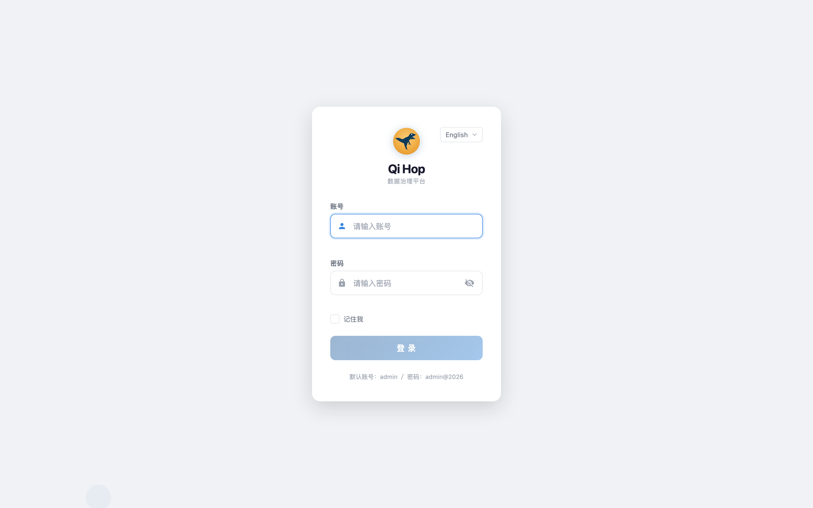
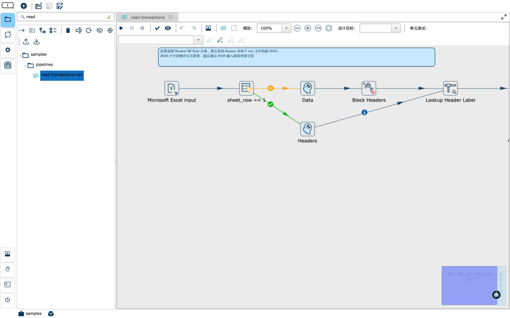
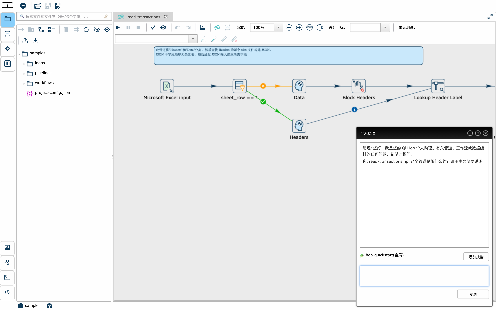
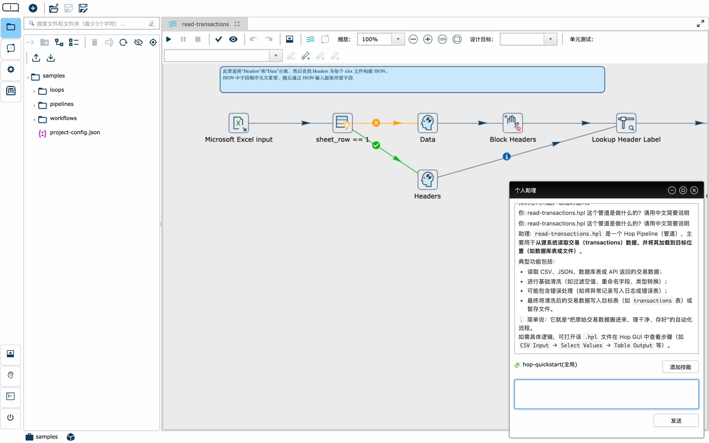
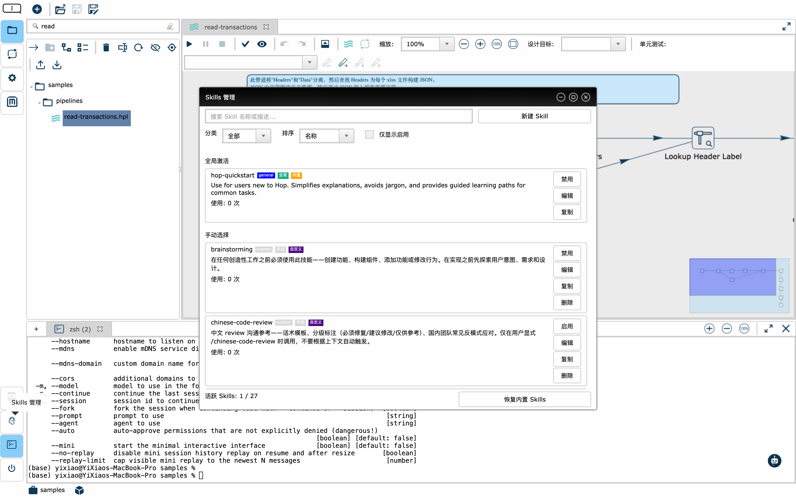
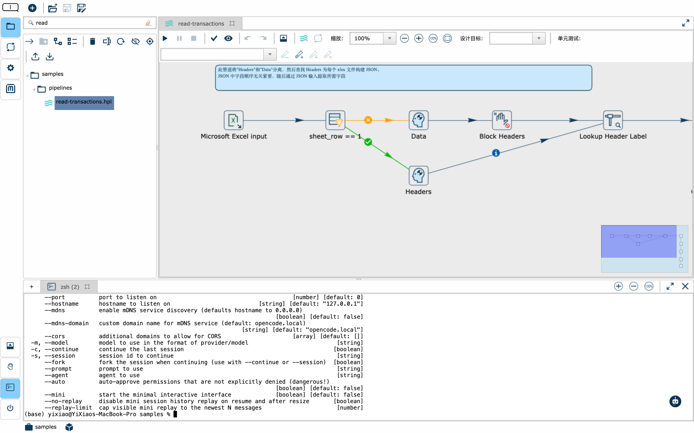

# Qi Hop 产品介绍

> 数据编排与 AI 智能化融合的数据集成平台，让数据流动简单可及。

***

## 一、产品定位

**Qi Hop** 是一款企业级数据/元数据编排平台（ETL/ELT），基于 Apache Hop 深度增强，在成熟的可视化管道设计能力之上，首创性地融入了 **大语言模型（LLM）AI 助手、技能管理系统、内置终端和中文本地化**，为数据团队提供从设计、开发到运维的一站式工作流。

无论是构建数据仓库、迁移遗留系统，还是搭建实时数据管道，Qi Hop 都能让团队用更少的人、更短的时间，交付更高质量的数据集成方案。

***

## 二、为什么选择 Qi Hop

传统数据集成工具面临三大挑战：

| 痛点        | 传统工具                 | Qi Hop 方案                    |
| --------- | -------------------- | ---------------------------- |
| **技术门槛高** | 需要专业的 ETL 工程师，学习曲线陡峭 | 可视化拖拽 + AI 自然语言交互，业务人员也能参与设计 |
| **工具割裂**  | 设计、调试、运维需要切换多个工具     | 画布 + 终端 + AI 助手集成于统一界面       |
| **知识难沉淀** | 经验留在个人脑中，团队协作成本高     | 技能管理系统让智能能力可复用、可传承           |

Qi Hop 的核心理念：**让数据集成像对话一样简单，让团队经验像技能一样累积**。

***

## 三、核心功能特性

### 1. 可视化 Pipeline 设计

Qi Hop 提供拖拽式画布编辑器，支持 **285+ 内置插件**（151 个数据转换、55 个工作流动作、46 种数据库连接），覆盖从数据读取、清洗、转换到写入的全链路需求。

- **所见即所得**：每个处理步骤以图标形式呈现在画布上，数据流向一目了然
- **双端一致体验**：桌面客户端（RCP）和 Web 浏览器（RAP）提供相同的编辑能力
- **元数据驱动**：所有配置以元数据形式存储，支持版本管理、可视化审计和血缘追踪
- **多引擎执行**：同一管道可在 Native、Apache Beam、Spark、Flink 等引擎上运行，无需修改设计

### 2. LLM AI 助手，自然语言交互

Qi Hop 内置大语言模型助手，用户可以直接在 Web 界面中用自然语言提问，获取关于管道、工作流和数据编排的智能解答。

- **即问即答**：选中管道后直接提问"这个管道是做什么的？"，AI 即刻给出结构化解读
- **RAG 知识库增强**：对接企业私有文档库，让 AI 回答基于内部规范，而非通用知识
- **技能上下文注入**：激活技能后，AI 的回答会自动遵循技能定义的专业规范
- **多模型支持**：通过 LiteLLM 代理接入通义千问、OpenAI、vLLM 等主流模型，灵活切换

### 3. AI 技能管理，可复用的智能能力

Qi Hop 独创的 **Skills 技能管理系统**，让团队的 AI 使用经验从"个人技巧"升级为"组织资产"。

- **双触发模式**：`GLOBAL` 技能全局自动生效（如代码规范、命名约定），`MANUAL` 技能按需手动激活（如特定项目的调试流程）
- **团队共享**：技能以 Markdown 文件存储，纳入 Git 版本管理（可选），团队成员共享同一套智能规范
- **内置技能库**：预置 `hop-quickstart` 等基础技能，新成员开箱即用，快速上手
- **深度集成**：技能内容自动注入 LLM 对话上下文，让 AI 的每一次回答都符合团队标准

### 4. 内置终端，开发运维一体化

Qi Hop 在 Web 界面中集成了完整的终端模拟器（基于 xterm.js），**无需离开浏览器即可执行任何命令行操作**。

- **浏览器内执行**：支持 Shell 命令、脚本运行、文件操作，与管道设计无缝切换
- **调用外部 CLI**：可直接运行 `opencode`、`git`、`curl` 等工具，打通 AI 编码工作流
- **多 Tab 管理**：同时运行多个终端会话，支持字体缩放、滚动回溯
- **零安装体验**：出差、远程办公时，只需一个浏览器即可完成所有运维操作

***

## 四、Qi Hop 的差异化优势

与原生 Apache Hop 相比，Qi Hop 增值了以下能力（原生 Hop 均不具备）：

| 能力              | 价值                                |
| --------------- | --------------------------------- |
| **LLM AI 助手**   | 降低 50%+ 的文档查阅与问题排查时间，新手也能快速理解复杂管道 |
| **Skills 技能系统** | 将团队最佳实践固化为可复用的 AI 指令，新人培训周期缩短 60% |
| **内置 Terminal** | 消除工具切换开销，设计-调试-运维全在一个界面内完成        |
| **中文本地化**       | 完整中文助手手册、中文 URL 映射服务，降低国内团队使用门槛   |

***

## 五、应用场景

- **数据仓库建设**：从多个源系统抽取、清洗、加载数据到数仓（ETL）
- **实时数据处理**：结合 Beam/Spark 引擎处理流式数据
- **遗留系统迁移**：可视化重构老旧 ETL 作业，支持增量切换
- **云数据集成**：对接 AWS、Azure、Google Cloud、阿里云等云平台
- **数据质量治理**：内置校验、去重、标准化等转换插件，保障数据质量

***

## 六、部署方式

Qi Hop 提供灵活的部署选项，适配不同规模和场景：

| 部署方式                  | 适用场景       | 特点                               |
| --------------------- | ---------- | -------------------------------- |
| **Docker 容器**         | 快速试用、CI/CD | 开箱即用，支持多架构（amd64/arm64）          |
| **Kubernetes (Helm)** | 生产环境、弹性伸缩  | 官方 Helm Chart，支持 HPA、持久化、Ingress |
| **Web 应用 (WAR)**      | 团队协作       | 部署到 Tomcat，浏览器访问，集中管理            |
| **桌面客户端**             | 个人开发       | 跨平台（Windows/macOS/Linux），离线可用    |

***

## 七、系统环境要求

### 7.1 硬件要求

| 部署场景       | CPU    | 内存   | 磁盘空间 |
|------------|--------|--------|-------|
| **开发/测试环境** | 4核    | 8 GB   | 60 GB |
| **生产环境（小型）** | 8核    | 16 GB  | 150 GB |
| **生产环境（中型）** | 16核   | 32 GB  | 300 GB |
| **生产环境（大型）** | 32核+  | 64 GB+ | 800 GB+ |

> **注**：以上配置已考虑 Dify（AI 应用开发平台）、OpenCode（AI 编码工具）等第三方依赖的资源需求。内存建议至少为 JVM 堆内存的 2 倍以上，以确保系统稳定性和 GC 效率。

### 7.2 软件要求

| 组件           | 版本要求              | 说明                                  |
|--------------|-------------------|-------------------------------------|
| **JDK**       | 21                | 开发与编译环境必需，生产环境可使用 JRE 21          |
| **Maven**     | 3.6.3+            | 构建工具，用于编译、打包项目                    |
| **操作系统**     | Linux / macOS / Windows | 跨平台支持，生产环境推荐 Linux（CentOS 7+ / Ubuntu 20.04+） |
| **Web 服务器**   | Tomcat 10+ / Jetty 12+ | 部署 Qi Hop Web（WAR）时需要                |
| **浏览器**       | Chrome 120+ / Firefox 115+ / Edge 120+ | 访问 Web 界面推荐使用最新版本浏览器              |

### 7.3 AI 助手依赖（可选）

使用 LLM AI 助手功能及第三方集成需要额外配置以下组件：

| 组件           | 版本要求 | 说明                                  |
|--------------|--------|-------------------------------------|
| **LiteLLM**   | 1.50+  | LLM 代理服务，用于接入通义千问、OpenAI 等模型    |
| **Dify**      | 0.6.0+ | AI 应用开发平台，提供可视化 Prompt 编排和应用管理能力 |
| **OpenCode**  | 最新版   | AI 编码工具，支持在终端中调用大模型辅助代码编写        |
| **LLM 模型 API** | -      | 接入外部大语言模型服务（如阿里云通义千问、OpenAI 等） |
| **向量数据库**    | -      | 可选，用于 RAG 知识库增强（推荐 Qdrant）        |
| **PostgreSQL** | 14+    | Dify 依赖的关系型数据库，用于存储应用配置和对话历史     |
| **Redis**     | 7.0+   | Dify 依赖的缓存服务，用于会话管理和消息队列          |

### 7.4 网络要求

- **端口**：8080（Qi Hop Web 界面）、8081（REST API）、8079（服务管理）、8000（Dify Web 界面）、4000（LiteLLM）、6333/6334（Qdrant）、5432（PostgreSQL）、6379（Redis）
- **网络策略**：允许客户端与服务器之间的双向通信；AI 助手需要访问外部 LLM API；各组件之间需要内网互通

***

## 八、总结

Qi Hop 不仅仅是一个 ETL 工具，更是一个 **AI 驱动的数据编排工作台**。它将可视化设计的直观性、大语言模型的智能性、技能系统的累积性和终端的灵活性融为一体，帮助企业在数据时代降本增效、加速数字化转型。

选择 Qi Hop，就是选择让数据集成从"专业门槛"变为"团队本能"。
