# Pipeline

在[核心概念](hop-concepts.md)中，我们介绍了 Pipeline、Transform 和 hop。
让我们回顾一下：

- Pipeline 由一系列读取、处理或写入数据的 Transform 组成。
Transform 通过 hop 连接。
Hop 有方向但不能形成循环，这使得 Pipeline 实际上是有向无环图（DAG）。
- Transform 是 Pipeline 中的每个基本操作。
每个 Transform 对数据执行一个操作：从源读取、在 Pipeline 中处理数据，或写入目标。
- Pipeline 中的 hop 在 Transform 之间传递数据。

## 创建 Pipeline

有两种方式可以创建 Pipeline。

- 点击水平工具栏上的 **New** 选项，然后选择 Pipeline 选项。

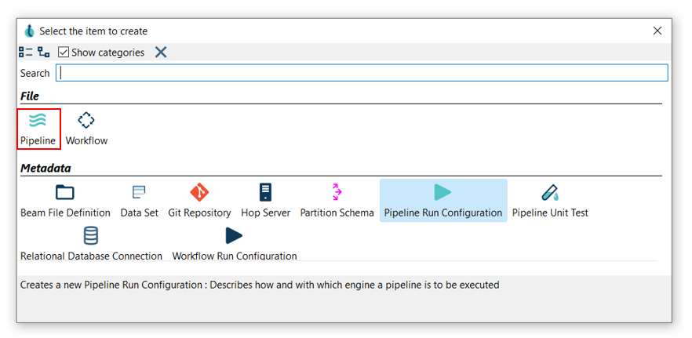

- File -> New -> Pipeline

你的新 Pipeline 已创建。
你将看到下面的对话框。

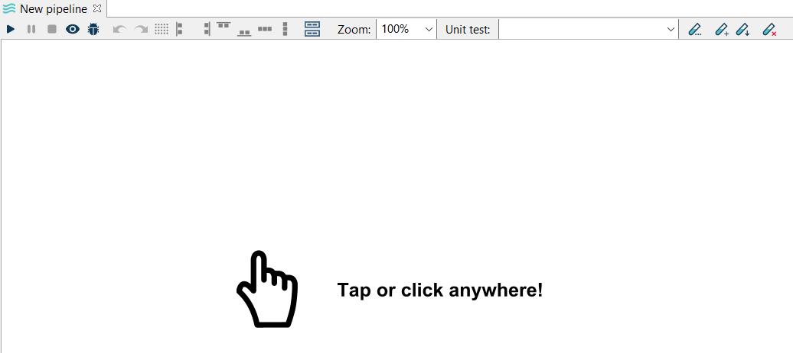

## 添加和连接 Transform

### 添加 Transform

现在你可以添加第一个 Transform 了。
在 Pipeline 画布的任意位置点击，你会看到下图所示的区域。

点击后你将看到上下文对话框。
每次需要选择 Transform 添加到 Pipeline 时，都会使用这个对话框。

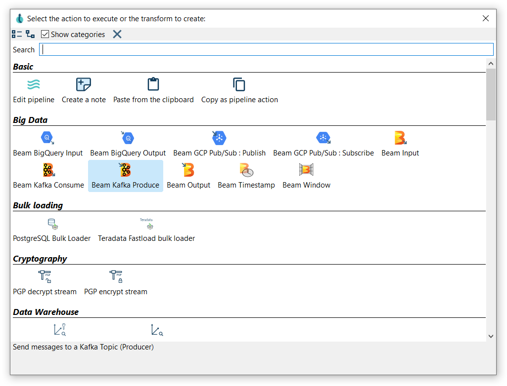

使用此对话框中的搜索框查找你需要的 Transform。
点击或使用方向键并按回车键，即可将 Transform 添加到 Pipeline 中。

现在，向你的 Pipeline 添加一个 [Generate Rows](../03-转换插件/输入类/rowgenerator.md) 和一个 [Add Sequence](../03-转换插件/计算与字段操作类/addsequence.md) Transform。

> **💡 提示:** 查看 [Transform 完整列表](../07-管道/transforms.md)。
Hop 0.99 中有 186 个 Transform 可用，但你很快就会熟悉最常用的那些。

### 创建 Hop

有多种方式可以创建 hop：

- **Shift 拖拽**：按住键盘上的 Shift 键，点击一个 Transform，按住鼠标主键，拖拽到第二个 Transform。
释放鼠标主键和 Shift 键。
- **滚轮拖拽**：用滚轮点击一个 Transform，按住鼠标滚轮按钮，拖拽到第二个 Transform。
释放滚轮按钮。
- 点击 Pipeline 中的某个 Transform 打开上下文对话框（即你在"**点击任意位置**"步骤中打开的对话框）。
点击 'Create hop'  按钮，选择你想要创建 hop 连接的目标 Transform。

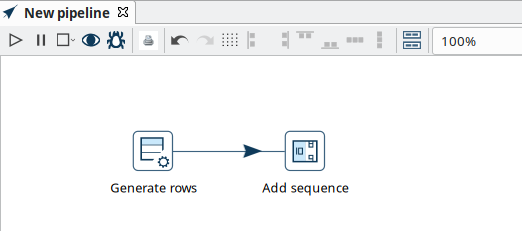

## 运行你的 Pipeline

运行 Pipeline 来查看其执行情况，可以通过以下任一方式：

- 使用 Run 图标。

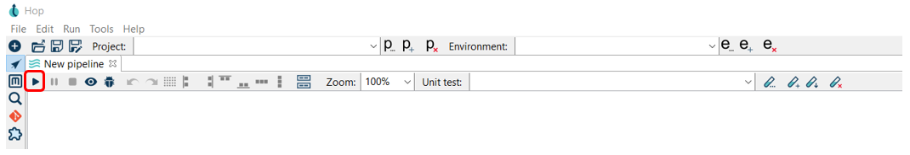

- 选择 Run 并从工具栏点击 Start Execution。

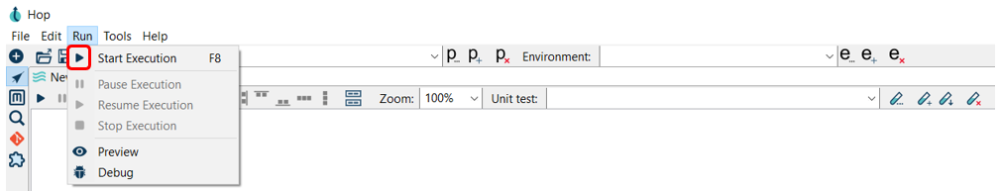

- 按 F8

你将看到运行选项对话框。

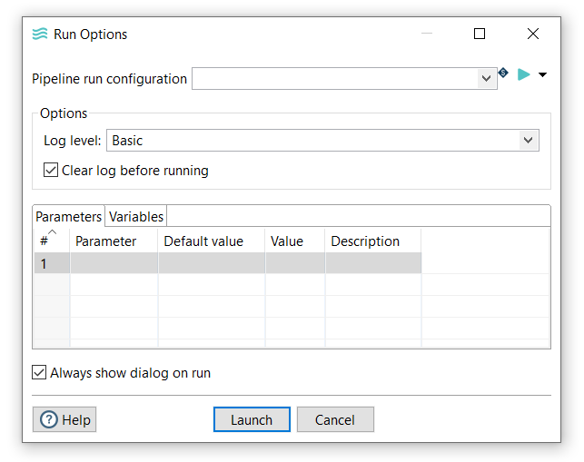
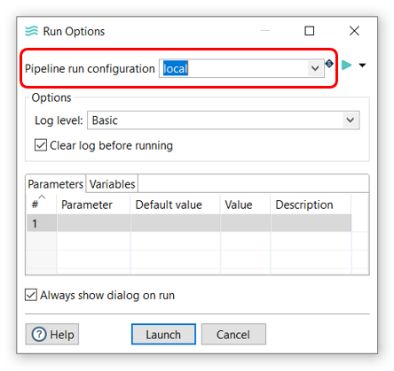

> **💡 提示:** 当你首次启动 Hop GUI 时，会创建一个 'local' 运行时配置。
查看可用的[运行时配置](../07-管道/pipeline-run-configurations.md)，以在其他引擎上运行你的 Pipeline。

确保选中了你的配置，然后点击 Launch。

当 Pipeline 成功运行时，你会在 Transform 的右上角看到绿色的勾号。

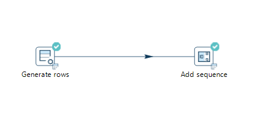

每次运行后，执行结果显示在窗口底部的面板中。
执行结果包含两个标签页：

- Transform 指标
- 日志

Transform Metrics 标签页显示每个 Transform 的指标。

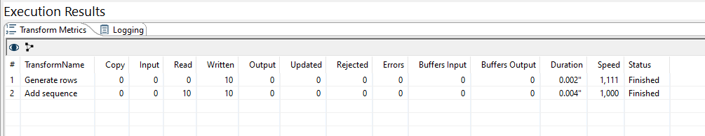

Logging 标签页根据执行时选择的日志级别显示 Pipeline 的日志。

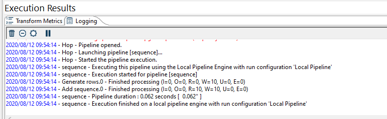

> **💡 提示:** 如需更详细的信息，请查看[运行、预览和调试 Pipeline](../07-管道/run-preview-debug-pipeline.md)页面。
