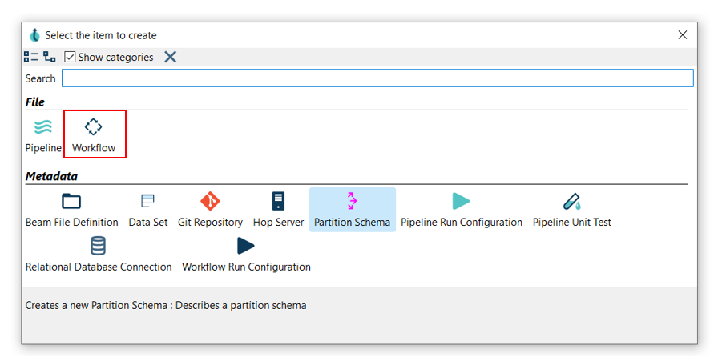
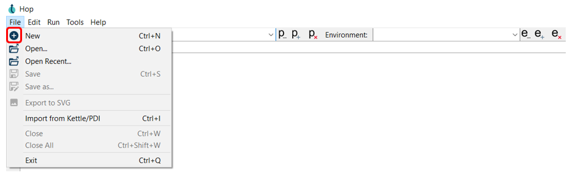
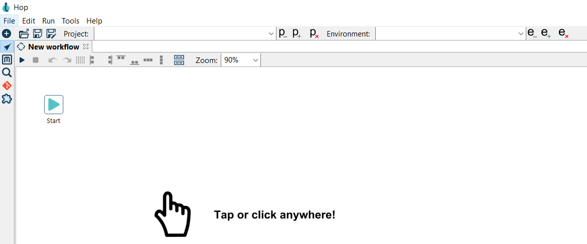
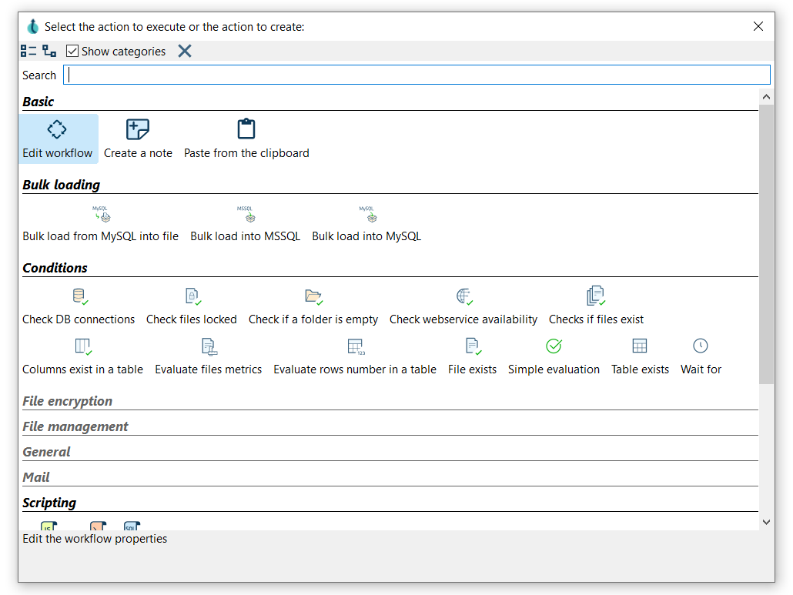
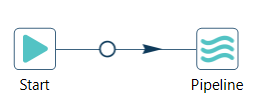
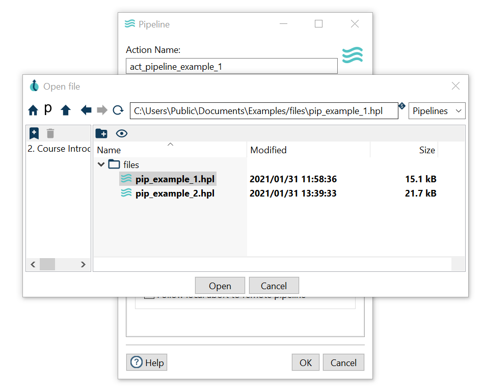
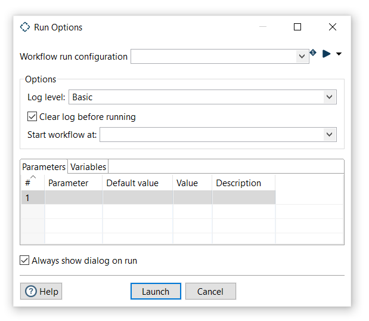

# Workflow

在[核心概念](getting-started/hop-concepts.md)中，我们介绍了 Workflow、Action 和 hop。
让我们回顾一下：

- _Workflow_ 默认是一个顺序执行的过程，有一个起点和一个或多个终点。
- _Action_ 是 Workflow 功能的一个单元，用于执行已实现的 Pipeline 或任何其他可以编排数据集成流程执行过程的元素。
- Workflow 中的 _hop_ 可以有条件地连接各个 _Action_，并决定 Workflow 下一步需要执行哪个 _Action_。

## 创建 Workflow

有两种方式可以创建 Workflow。

- 点击水平工具栏上的 New 选项，然后选择 Workflow 选项。

- File -> New -> Workflow

你的新 Workflow 已创建，你将看到下面的对话框。

> **📝 注意:** 请注意，创建 Workflow 时，Qi Hop 会默认自动添加 [Start](http://localhost:1313/manual/latest/workflow/actions/start) Action。

## 添加和连接 Action

### 添加 Action

现在你可以添加第一个 Action 了。
在 Workflow 画布的任意位置点击，你会看到下图所示的区域。

点击后你将看到一个对话框：

就像在 Pipeline 中一样，使用此对话框中的搜索框查找你需要的 Action。
点击或使用方向键并按回车键，即可将 Action 添加到 Workflow 中。

现在，向你的 Workflow 添加一个 [Pipeline](workflow/actions/pipeline.md) Action。

> **💡 提示:** 查看 [Action 完整列表](workflow/actions.md)。
Hop 0.70 中有超过 50 个 Action 可用，但你很快就会熟悉最常用的那些。

### 创建 hop

创建 hop 的方式与在 Pipeline 中创建 hop 完全相同：

- **Shift 拖拽**：按住键盘上的 Shift 键，点击一个 Action，按住鼠标主键，拖拽到第二个 Action。
释放鼠标主键和 Shift 键。
- **滚轮拖拽**：用滚轮点击一个 Action，按住鼠标滚轮按钮，拖拽到第二个 Action。
释放滚轮按钮。
- 点击 Workflow 中的某个 Action 打开"**点击任意位置**"对话框。
点击 'Create hop'  按钮，选择你想要创建 hop 连接的目标 Action。

保存你的 Workflow：

首先，我们有 Workflow 运行配置会话。
Workflow 运行配置是 Qi Hop 中的 metadata 对象，用于定义 Workflow 在哪里执行。

选择你的 Hop 安装中默认可用的 'local' Workflow 运行时配置，然后点击 'Launch'。

你现在将看到一个与 Pipeline 执行结果非常相似的执行结果面板。
