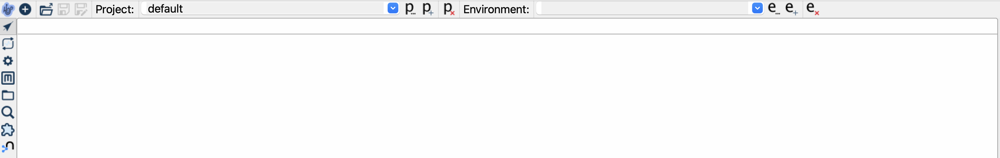
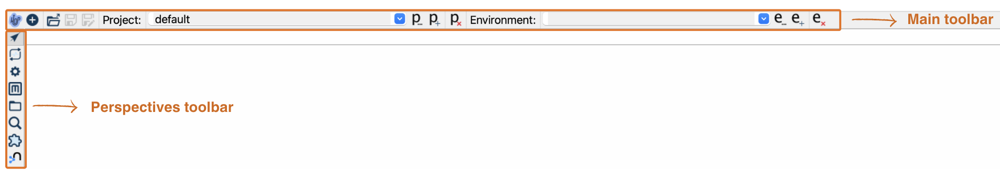

# Hop GUI

Qi Hop GUI 是你的本地开发环境，用于构建、运行、预览和调试 Workflow 和 Pipeline。

## 启动 Qi Hop GUI

正如我们在 [Hop 工具](getting-started/hop-tools.md)中看到的，启动 Hop GUI 非常简单：

====
Windows::
--

hop-gui.bat
--

Linux, macOS::
--

./hop-gui.sh
--
====

## 浏览 Hop GUI

启动 Qi Hop GUI 后，你将看到如下窗口。

{nbsp}
让我们把视图分为两部分：

- **主工具栏**提供一系列功能，包括创建新文件（如 Pipeline 和 Workflow）以及添加 metadata。它还提供了管理项目和环境的选项，以及专门用于处理 Pipeline、Workflow 和项目设置的工具。
- **透视图工具栏**包含各个透视图之间的切换图标。

**  [数据编排](hop-gui/perspective-data-orchestration.md)

**  [执行信息](hop-gui/perspective-execution-information.md)

**  [配置](hop-gui/perspective-configuration.md)

**  [元数据](hop-gui/perspective-metadata.md)

**  [文件浏览器](hop-gui/perspective-file-explorer.md)

**  [搜索](hop-gui/perspective-search.md)

**  [Plugin 浏览器](hop-gui/perspective-plugin.md)

**  [Neo4j](hop-gui/perspective-neo4j.md)

让我们看看如何使用 Hop GUI 来完成 Hop 的核心任务：创建 Pipeline 和 Workflow！

提示：请查看 Hop 文档中的 [Hop GUI](../hop-gui/index.md) 章节，获取更详细的 Hop GUI 导览。
