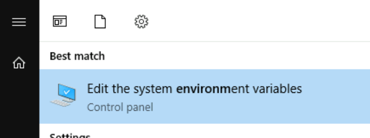
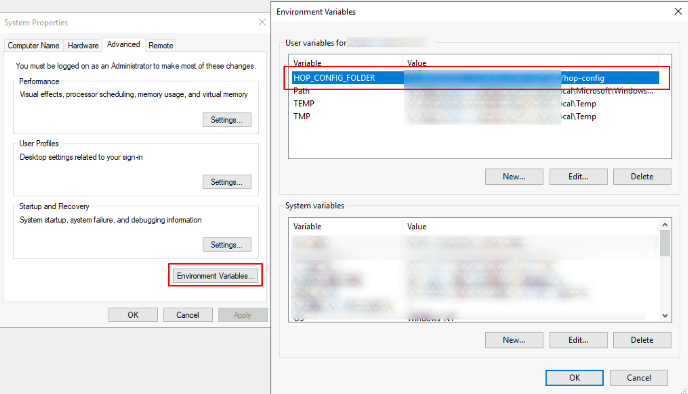

# Qi Hop 需求、安装和配置

## 概述

Qi Hop 的需求和安装过程被刻意保持得尽可能简单。

本页面涵盖了在本地桌面或服务器上安装和运行 Qi Hop 所需了解的所有内容，从最基础的到更高级的配置。

Hop 的设计尽可能灵活和轻量，旨在融入你的架构，而不是让你的架构适应 Hop。这使得基本安装过程极其简单，但有大量的配置可以让 Hop 完全按照你的意愿运行。

> **💡 提示:** 请查看 [Docker](https://hop.apache.org/tech-manual/latest/docker-container)页面，了解在容器和 Kubernetes 环境中运行 Hop 的说明。

## 系统要求

Hop 的占用空间很小，应该可以在任何现代物理或虚拟机上运行。

对于默认的 Hop 发行版，至少需要 1 个 CPU/核心和 4GB 内存，但你也可以调整 Hop 使其在内存更少的机器上运行。

Hop 可在以下操作系统上运行：

- Windows 7 或更高版本
- Linux（x86_64、ARM）
- MacOS
- 任何现代浏览器（Hop Web）

## Java 运行时

Hop 在任何受支持的操作系统上的唯一需求是 Java 运行时环境。

Qi Hop 已知可以在以下广泛使用的 Java 运行时上良好运行：

- [Oracle Java Runtime](https://www.java.com/)
- [Microsoft OpenJDK](https://www.microsoft.com/openjdk)（适用于 Windows、MacOS 和 Linux 的 OpenJDK 版本）。
- [OpenJDK Java Runtime](https://openjdk.java.net/install/)

Qi Hop 可以在以下 64 位 Java 21 运行时上良好运行。

其他 Java 运行时可能也能工作，但没有像 Oracle 和 OpenJDK JRE 那样经过广泛使用和测试，所以你可能是在尝鲜。如果遇到问题，欢迎提交 [GitHub Issue](https://hop.apache.org/community/tools/#GitHub-Issues)，但请注明你的 JRE 和版本。

如果你不确定系统上当前安装的是哪个 Java 版本，请运行 `java -version`。你的输出应该类似于下面显示的内容。

```shell
openjdk version "21.0.10" 2026-01-20
OpenJDK Runtime Environment Homebrew (build 21.0.10)
OpenJDK 64-Bit Server VM Homebrew (build 21.0.10, mixed mode, sharing)
```

请确保将操作系统的 `JAVA_HOME` 环境变量指向你所需的 JRE 安装路径。有关环境变量的更多信息，请参考你的操作系统文档。

> **💡 提示:** 你可以设置 `HOP_JAVA_HOME` 环境变量来为 Qi Hop 指定特定的 Java JRE 或 JDK，而无需更改系统的 JAVA_HOME。这样 Hop 可以使用与系统默认版本不同的 Java 版本，且不影响其他应用程序。

## 基本安装 [[basic]]

Qi Hop 的基本安装再简单不过了：

- [下载](https://hop.apache.org/download/)
- 解压
- 切换到新解压的 `hop` 目录
- 运行：
** `hop-gui.bat`（Windows）或 `hop-gui.sh`（Linux、MacOS）：运行 [Hop GUI](hop-gui/index.md)
** `hop-run.bat`（Windows）或 `hop-run.sh`（Linux、MacOS）：从命令行[运行 Workflow 或 Pipeline](/hop-run/index.md)。
** `hop-server.bat`（Windows）或 `hop-server.sh`（Linux、MacOS）：启动 [Hop Server](/hop-server/index.md) 实例。

## 设置（系统）环境变量

Qi Hop 的安装和配置默认是完全自包含的。

通过以下系统或环境变量，你可以使你的 Hop 配置独立于已安装的 Hop 版本。这让你可以在 Hop 版本或安装之间切换，同时保留你的项目和环境列表、最近打开的文件以及其他设置。

> **💡 提示:** 如果你已经使用 Qi Hop 一段时间后才设置以下环境变量，可以将 `hop/config/` 文件夹的内容移动到新的 `HOP_CONFIG_FOLDER` 位置。

### 在 Windows 中创建环境变量

在 Windows 中有多种方式可以访问环境变量。其中一种方式是在开始菜单中搜索 `environment variable`，然后点击"编辑系统环境变量"链接（或你本地语言的对应条目）。



在弹出的对话框中，点击 `Environment Variables` 按钮，然后添加一个新的 `HOP_CONFIG_FOLDER` 用户变量，将其指向你希望存储 Qi Hop 配置的文件夹。对你想要添加到配置中的其他下列变量重复此过程。



点击 `Ok` 关闭对话框，然后（重新）启动 Hop GUI 以激活环境变量。

### 在 MacOS 或 Linux 中创建环境变量

将环境变量添加到你的 `~/.bashrc`、`~/.zshrc` 或类似的配置文件中，如下所示：

`export HOP_CONFIG_FOLDER=<你偏好的_HOP_CONFIG_FOLDER_路径>`。

运行 `source ~/.bashrc` 或 `source ~/.zshrc` 以在当前会话中应用新的变量。

### 需要设置的环境变量

HOP_CONFIG_FOLDER::
Hop 默认将你的配置存储在 `config` 文件夹中。
设置此环境变量，将其指向 Hop 安装目录之外的文件夹，以保留你的配置、项目和环境列表等，无论你使用哪个 Hop 版本或安装。

> **💡 提示:** 将现有 `hop/conf` 文件夹的内容复制到 `HOP_CONFIG_FOLDER` 设置的路径，即可将配置从你的一个 Hop 安装移动到新的中心位置。
HOP_AUDIT_FOLDER::
将此变量设置为机器上的有效路径，用于存储 Hop 的审计信息。
这些信息包括每个项目最近打开的文件、缩放大小等等。

HOP_OPTIONS::
设置此变量以添加 JVM 选项，例如 `-Xmx=2g`。此变量的值会覆盖 Qi Hop 安装中各脚本里的设置。

查看环境变量章节，了解更多可以让你的多个 Hop 版本或安装使用更加方便的系统变量。

## 升级

可以按照与基本安装相同的流程并行安装多个 Hop 版本。

Hop 安装默认是自包含的，这意味着新安装 Hop 后，你将使用默认的配置以及项目和环境列表。

通过上一节描述的环境变量，你只需要在现有的 Hop 安装旁边升级 Qi Hop，然后从新位置启动 Hop GUI。你的项目和环境列表、最近打开的文件等应该都可用。

> **💡 提示:** Qi Hop 的发布版本经过升级测试。当新版本发布时，你可以替换现有安装。如果你想保留多个 Qi Hop 版本，可以考虑将解压后的 `hop` 文件夹重命名为 `hop-版本号`，例如 `hop-2.5.0`、`hop-2.60` 等。

## 附加配置

### JVM 内存设置

默认情况下，Hop 只设置了 Hop 可分配的 JVM 堆内存最大值。

此参数可以在 `hop-gui.bat` 或 `hop-gui.sh` 或 `hop-run` 和 `hop-server` 的类似脚本中修改。

找到以下行：
`HOP_OPTIONS="-Xmx2048m"`

`-Xmx` 参数决定 JVM 可分配的最大内存量，可以用 MB 或 GB 指定。

例如：

- `HOP_OPTIONS=-Xmx512m`：以最大 *512MB* 内存启动 Hop
- `HOP_OPTIONS=-Xmx2048m`：以最大 *2048MB*（即 2GB）内存启动 Hop
- `HOP_OPTIONS=-Xmx4g`：以最大 *4GB* 内存启动 Hop

有关额外的 JVM 配置、调优和垃圾回收参数的更多信息，请查看你的 JRE 文档。[这篇指南](https://www.baeldung.com/jvm-parameters)可能有助于你入门。

> **💡 提示:** **开发者**：在 `-Xmx` 参数下面几行，你会找到另一行包含 `-Xdebug` 的 `HOP_OPTIONS`。取消注释此行可允许调试器附加到你正在运行的 Hop 实例。查看[开发者文档](https://hop.apache.org/dev-manual/latest/setup-dev-environment)了解更多信息。

### Hop 环境变量 [[envvars]]

以下（操作系统）环境变量可以为配置 Hop 提供很大的灵活性，满足你的精确需求。

HOP_AUDIT_FOLDER::
将此变量设置为机器上的有效路径，用于存储 Hop 的审计信息。
这些信息包括每个项目最近打开的文件、缩放大小等等。

HOP_CONFIG_FOLDER::
Hop 默认将你的配置存储在 `config` 文件夹中。
设置此环境变量，将其指向 Hop 安装目录之外的文件夹，以保留你的配置、项目和环境列表等，无论你使用哪个 Hop 版本或安装。

> **💡 提示:** 将现有 `hop/conf` 文件夹的内容复制到 `HOP_CONFIG_FOLDER` 设置的路径，即可将配置从你的一个 Hop 安装移动到新的中心位置。
HOP_PLUGIN_BASE_FOLDERS::
设置此变量，将 Hop 指向一个以逗号分隔的文件夹列表，让 Hop 在这些文件夹中查找额外的 plugin。

> **❗ 重要:** 使用此变量时，它也会取消设置你的默认 plugin 文件夹，请务必将默认 plugin 文件夹添加到以逗号分隔的列表中。这可以是相对于安装目录的路径，例如 `export HOP_PLUGIN_BASE_FOLDERS=./plugins,/additional/plugin/folder`。
其中 `./plugins` 将指向基础安装文件夹中的 plugin。
HOP_SHARED_JDBC_FOLDERS::
这是一个以逗号分隔的文件夹列表，包含 JDBC 驱动，默认值为 lib/jdbc。如果更改此项时你仍需要默认的 JDBC 驱动，则需要包含默认文件夹路径。
HOP_JAVA_HOME::
将此环境变量设置为你希望 Qi Hop 使用的 Java JRE/JDK 路径。
这让 Hop 可以使用特定的 Java 版本运行，不受系统默认设置的影响。

HOP_OPTIONS::
设置此变量以添加 JVM 选项，例如 `-Xmx=2g`。此变量的值会覆盖 Qi Hop 安装中各脚本里的设置。

### JDBC 驱动、Jar 包、库和其他 plugin 依赖

Hop 内置支持数十种数据库和大量其他技术。

根据 Apache 和技术厂商的许可协议，所需的库可能无法包含在默认的 Qi Hop 发行版中。

请下载必要的驱动或其他所需库，并将它们添加到你的 plugin 的 `lib` 目录中。

例如，要为 MySQL 数据库添加 JDBC 驱动，请下载 MySQL JDBC jar 文件并将其添加到 `<PATH>/hop/plugins/databases/mysql`。

在你的 Hop 安装文件夹的 `lib/core` 中添加任何自定义 jar，可使这些库在整个 Hop 安装中可用。

将任何自定义 jar 添加到 `plugins/transforms/janino/lib`，可使它们用于用户自定义 Java 类 Transform。

### 技术配置

Hop 内置支持大量可能需要各自（安装和）配置的技术。

请查看 [技术](technology/technology.md)页面，了解你需要配置的平台以获取更多信息。
