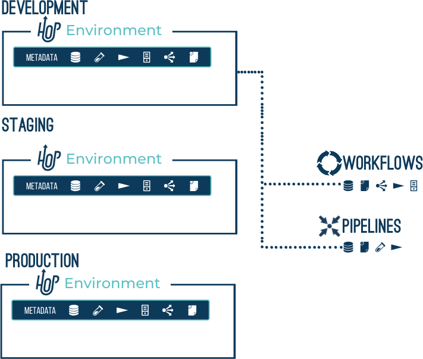

## 项目和环境

Project::
Hop 项目是配置、变量、元数据对象以及 Workflow 和 Pipeline 的概念性分组。
项目可以从父项目继承元数据。
一个项目包含一个或多个环境，实际配置在这些环境中定义。
示例：一个"销售"项目包含一个"客户"数据库连接和若干 Workflow 和 Pipeline。
运行时配置、数据库连接属性等在"开发"、"测试"和"生产"环境中定义。
Environment::
Hop 环境是项目的实例，持有项目的实际运行时配置和其他元数据对象。
示例："销售"项目的"开发"环境指定从主机 '10.0.0.1' 读取"客户"数据库连接

