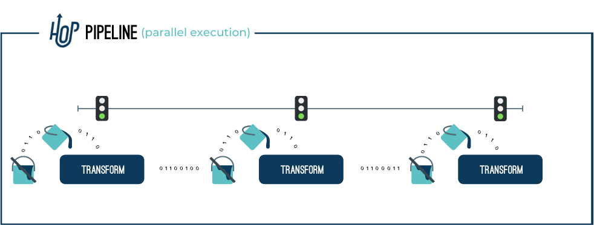
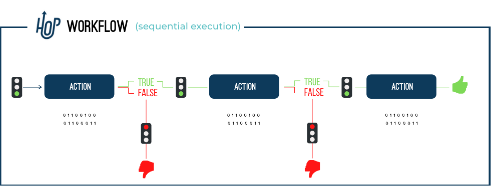

## 元素类型

Action::
Action 是 Workflow 中执行的一个操作。
Action 默认按顺序执行，也可以配置为并行执行。
Action 返回 true 或 false 退出码，可在 Workflow 执行中使用（或忽略）。
Hop::
Hop 连接 Workflow 中的 Action 或 Pipeline 中的 Transform。
在 Workflow 中，Hop 基于 Action 的退出状态进行操作；在 Pipeline 中，Hop 在 Transform 之间传递数据。
Pipeline::
Pipeline 是实际的数据处理者。
Pipeline 中的操作负责读取、修改、丰富、清洗和写入数据。
Pipeline 的编排通过其他 Pipeline 和/或 Workflow 来完成。

Transform::
Transform 是 Pipeline 中执行的工作单元。
典型的 Transform 操作包括从文件、数据库读取数据，执行查找或连接，丰富、清洗数据等。
Pipeline 中的所有 Transform 并行执行。
Transform 处理数据并将处理后的数据批次通过 Hop 传递给后续 Action 处理。
Workflow::
Workflow 是一系列操作的集合，默认按顺序执行（可选并行执行）。
Workflow 通常不直接操作数据，而是执行编排任务。
Workflow 中的典型任务包括获取和归档数据、发送邮件、错误处理等。
)

