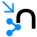

#  Neo4j Output

| Hop Engine |  |
|---|---|
| Spark |  |
| Flink |  |
| Dataflow |  |

## Usage

You can update one node or two nodes and a relationship.
Nodes and relationships can have properties and the appropriate MERGE statements will be generated based on the information you provided.
Make use of the "Get fields" buttons on the right hand side of the dialog to prevent you from having to type too much.

## Labels

You can get one node labels from a list of fields or you can use static values (with optionally variables).
If you specify both the static value will be used if the field value is null.
A label will not be used for the node if the label is null or empty.

## Array Properties

The Neo4j Output transform supports Array type properties for nodes and relationships. 
When a property is configured with type "Array", the transform will parse the input string 
value and convert it to a Neo4j array.

Array properties require two configuration options:

- **Array separator**: Character used to separate array elements (default: comma `,`)
  Examples: `,` (comma), `;` (semicolon), `|` (pipe)
  
- **Array enclosure**: Character used to enclose each array element (default: empty)
  Examples: `"` (double quotes), `'` (single quotes), empty for no enclosure

> **📝 注意:** Array values should be provided as strings in the input data, e.g., `"1.0,2.0,3.0"` or `"tag1,tag2,tag3"`.
The transform will automatically split and convert these to Neo4j array types based on the 
separator and enclosure settings.

## Notable options

| Option | Description |
|---|---|
| Batch size |  |
| for better performance the transform will group records together in a single transaction |  |
| Use CREATE instead of MERGE |  |
| this bypasses any lookup and is faster. |  |
| Create indexes |  |
| creates unique field constraints for all Primary properties in the nodes to make sure performance stays good when dealing with merges and lookup of nodes for relationships. |  |
| Array separator |  |
| comma (`,`) |  |
| Character used to separate array elements when property type is Array |  |
| Array enclosure |  |
| empty |  |
| Character used to enclose each array element when property type is Array. Leave empty for no enclosure. |  |

## Show Cypher Preview

The transform dialog includes a "Show Cypher" button that displays a preview of the 
generated Cypher statements without executing them. This preview shows:

- The UNWIND-based batch processing structure
- Node creation/merge statements with labels and properties
- Relationship creation/merge statements
- Property mappings and types

The preview is read-only and helps you verify the Cypher that will be generated before 
running the pipeline.
