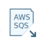

#  AWS SQS Reader

| Hop Engine |  |
|---|---|
| Spark |  |
| Flink |  |
| Dataflow |  |

## 前置条件

在首次执行之前，你需要创建一个 IAM-Role（例如用于 EC2/ECS）或一个带有 AWS Key 和 Secret 的 IAM-User，并附加通过 SNS 推送通知所需的策略。

你还需要创建一个或多个订阅主题，用于推送消息。

## 选项

### AWS 设置选项卡

| option | description |
|---|---|
| Use AWS Credentials chain | Qi Hop 尝试从主机环境获取 AWS 凭据。更多信息请查看 [Credentials](https://docs.aws.amazon.com/sdk-for-java/v1/developer-guide/credentials) 文档。 |
| AWS Access Key | 你的 AWS Access Key（`AWS_ACCESS_KEY_ID`） |
| AWS Secret Access Key | 你的 AWS Access Key 的密钥（`AWS_SECRET_ACCESS_KEY`） |
| AWS Region | 服务运行的 AWS 区域。 |
| SQS Queueu URL | SQS 队列的 URL（以 https:// 开头，不是 ARN！） |

### 输出定义

在输出定义选项卡上，你可以定义从 SQS 消息中读取的信息的输出字段，以及接收消息的一些初始设置。

#### 输出设置

| Option | Description |
|---|---|
| Delete Message(s) | 接收后是否从队列中删除消息？ |
| Maximum messages to retrieve | 达到此最大消息数后结束。零（0）将接收队列中的所有消息。 |

#### 输出设置

| Option | Description |
|---|---|
| MessageID | 每条消息都会从 SQS 获取一个唯一 ID。可以将其写入此处定义的输出字段。 |
| MessageBody | 消息的完整内容。 |
| ReceiptHandle | 用于接收消息的唯一标识符。 |
| MD5 Hash | 消息正文的 MD5 哈希值 |
| Message Node from SNS | 如果消息是从 SNS 发送的，该字段将包含消息正文中 JSON 节点 "Message" 的内容。 |
