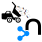

#  Neo4j Import

| Hop Engine |  |
|---|---|
| Spark |  |
| Flink |  |
| Dataflow |  |

| 选项 | 默认值 | 说明 |
|---|---|---|
| Transform name |  | 此 Transform 在 Pipeline 中的名称 |
| Filename field |  | 获取要导入的文件名的字段 |
| Fiel type field |  | 获取要导入的文件类型的字段 |
| Database filename | neo4j | 要导入到的 Neo4j 数据库 |
| neo4j-admin command path | neo4j-admin | `neo4j-admin` 命令的（完整）路径 |
| Neo4j version | 4.x | 选择 Neo4j 版本（4.x 或 5.x）以确定正确的命令语法。 |
| Base folder (below import/ folder) |  | 读取导入文件的文件夹 |
| Verbose output |  | 启用详细输出。 |
| High IO | true | 忽略基于环境的启发式规则，指定目标存储子系统是否可以支持高吞吐量的并行 IO。 |
| Cache on heap? | false | 确定是否允许在堆上为缓存分配内存。 |
| Ignore Empty Strings | false | 确定是否忽略输入源中的空字符串字段（如 ""），将其视为 null。 |
| Ignore extra columns? | false | 导入期间是否忽略未指定的列。 |
| Legacy style quoting? | false | 确定反斜杠转义引号（如 \"）是否被解释为内部引号。 |
| Fields can have multi-line data? | false | 确定输入源中的字段是否可以跨越多行，即包含换行符。 |
| Normalize types? | false | 确定是否将属性类型规范化为 Cypher 类型，例如 int 变为 long，float 变为 double。 |
| Skip logging bad entries during import? |  | 确定是否跳过记录导入期间检测到的错误条目。 |
| Skip bad relationships? | false | 确定是否跳过导入引用缺失节点 ID 的关系，即起始或结束节点 ID/组引用的节点未在节点输入数据中指定。 |
| Skip duplicate nodes? | false | 确定是否跳过导入具有相同 ID/组的节点。 |
| Trim strings? | false | 确定是否修剪字符串的空白字符。 |
| Bad tolerance | 1000 | 导入被认为失败之前的错误条目数。 |
| Max memory | false | neo4j-admin 可用于各种数据结构和缓存以提高性能的最大内存。 |
| Read buffer size | 4M | 读取输入数据的每个缓冲区大小。 |
| Processors | 90% | 导入器使用的最大处理器数量。 |
