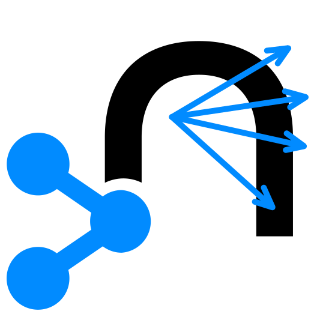

#  Neo4j Split Graph

| Hop Engine |  |
|---|---|
| Spark |  |
| Flink |  |
| Dataflow |  |

## 选项

| 选项 | 默认值 | 描述 |
|---|---|---|
| Transform name | Neo4j Split Graph | 此 Transform 在 Pipeline 中的名称 |
| Graph field | graph | Pipeline 中的 graph 字段 |
| Type output field (Node/Relationship) | type | 包含字段类型（Node 或 Relationship）的字段 |
| ID outputfield | id | 写入 ID 的输出字段 |
| Property set output field | propertySet | 写入节点或关系的属性集的字段名称 |
