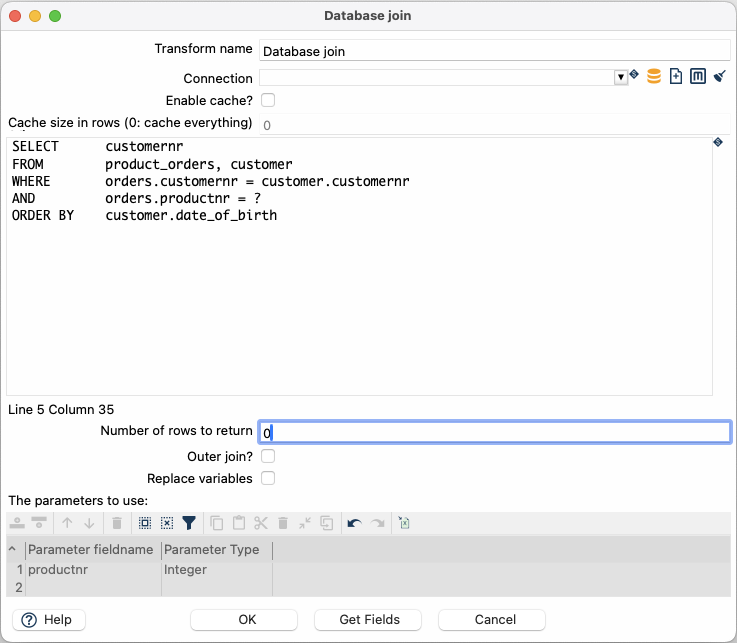

#  Database Join

| Hop Engine |  |
|---|---|
| Spark |  |
| Flink |  |
| Dataflow |  |

## 用法

此查询的参数按以下方式指定：

transform 属性对话框中的数据网格。
这允许您选择来自源 hop 的数据。
在 SQL 查询中作为问号（?）。
当 transform 运行时，这些将被从数据网格中定义的字段传入的数据替换。
问号将按数据网格中定义的顺序被替换。
例如，Database Join 允许您运行查询来查找购买特定产品的最年长客户，如下所示：

> **💡 提示:** Database Join transform 比标准的 [Database Lookup](pipeline/transforms/databaselookup.md) transform 提供更大的灵活性。请注意，您的查询决定了此 transform 的性能。

```sql
SELECT      customernr
FROM        product_orders, customer
WHERE       orders.customernr = customer.customernr
AND         orders.productnr = ?
ORDER BY    customer.date_of_birth
```

然后网格定义如下：



当 transform 运行时，SQL 查询中定义的 (?) 占位符将被源 hop 传入的 productnr 字段值替换。
要定义和使用多个参数，请按您希望它们在 SQL 语句中被替换的顺序列出字段。

## 选项

| 选项 | 描述 |
|---|---|
| Transform name | Transform 的名称；此名称在单个 pipeline 中必须唯一。 |
| Connection | 用于查询的数据库连接。 |
| Enable cache? | 启用数据库查找缓存。 |
| Cache size in rows | 缓存大小（行数），0 表示缓存所有内容。 |
| SQL | 用于形成连接的 SQL 查询；使用问号作为参数占位符。 |
| Number of rows to return | 零 (0) 返回所有行；其他数字限制返回的行数。 |
| Outer join? | 启用此项可始终返回结果，即使查询未返回结果。 |
| Parameters table | 指定包含参数的字段。 |
