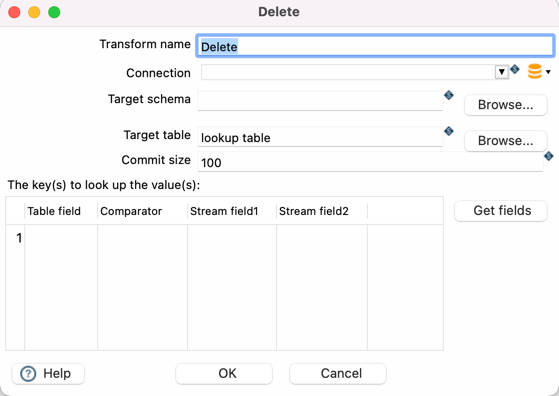

#  Delete

| Hop Engine |  |
|---|---|
| Spark |  |
| Flink |  |
| Dataflow |  |

## 选项

| 选项 | 描述 |
|---|---|
| Transform name | Transform 的名称。 |
| Connection | 数据写入的数据库连接。 |
| Target schema | 数据写入表的 schema 名称。 |
| Target table | 要执行插入或更新的表名。 |
| Commit size | 执行提交前要更改（插入/更新）的行数。 |
| The keys(s) to look up the value(s) | 指定要删除对应行的字段。 |
