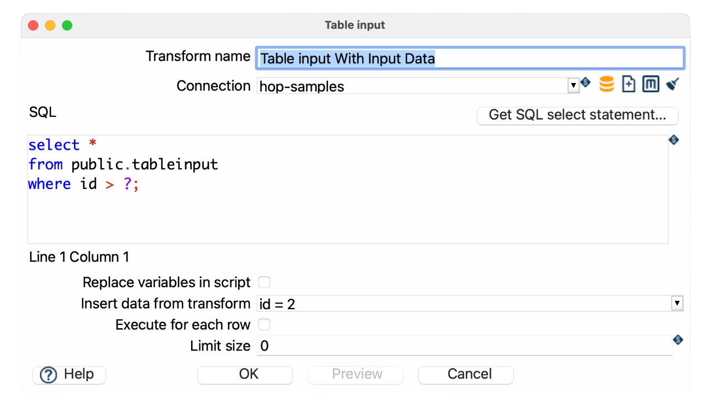
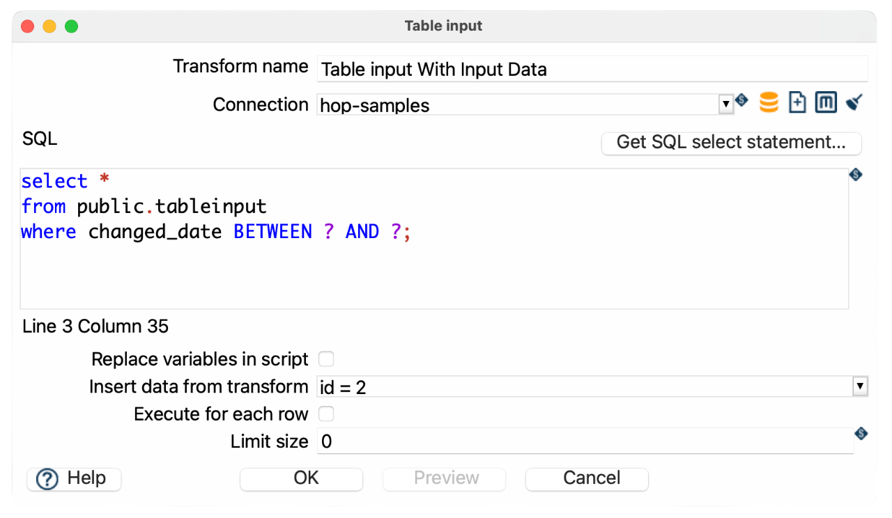
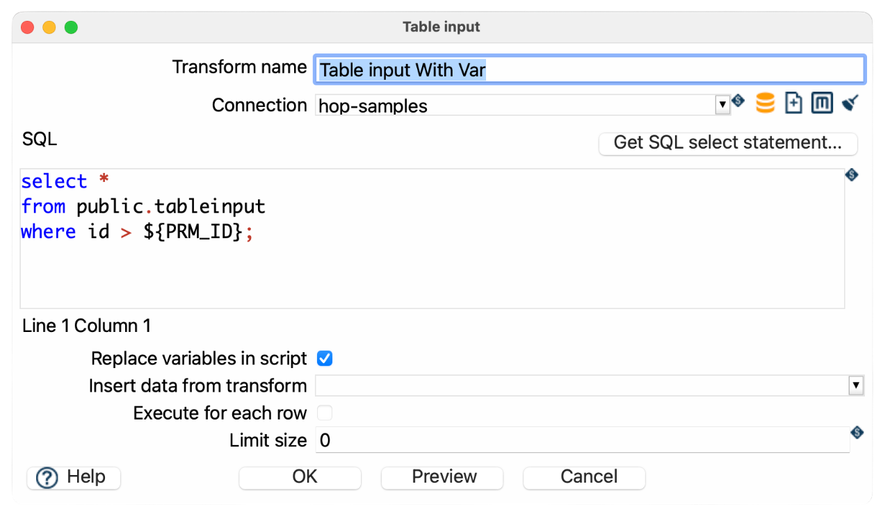
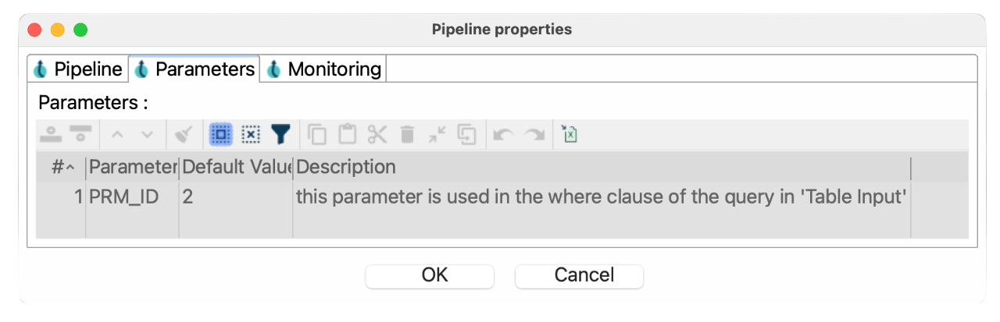
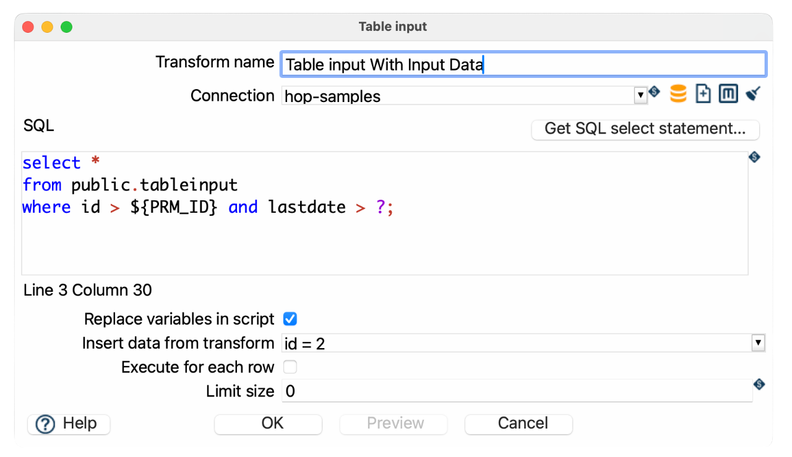

#  Table Input

| Hop Engine |  |
|---|---|
| Spark |  |
| Flink |  |
| Dataflow |  |

## Getting Started: Generate a Basic SQL Query

You can auto-generate a query using the `Get SQL select statement` button.

This opens the database explorer, allowing you to select a table or view. Once selected, you can choose to generate:

- A full column list: `SELECT col_a, col_b, col_c FROM my_table;`
- A wildcard query: `SELECT * FROM my_table;`

## Use Fields from a Previous Transform

To pass dynamic values into your SQL query at runtime, use the `Insert data from transform` option. This creates a JDBC Prepared Statement using `?` placeholders.

Use `?` in your SQL where values from the input transform should be inserted. Values are passed in the order of fields in the incoming stream. Use a `Select Values` transform to ensure the correct field order.

Prepared statements:

- Improve security by preventing SQL injection
- Cannot parameterize all parts of a SQL statement (e.g., `IN (?)` or table names)

You can also combine this with variable substitution.

### Examples

.Parameterized query using input fields:



```sql
SELECT *
FROM public.tableinput
WHERE id > ?;
```

- Replace variables in script: *unchecked*
- Insert data from transform: *Select the previous transform providing NameId and AddressId*

Sample pipeline:
link:[tableinput-accept-input.hpl](https://github.com/apache/hop/blob/main/plugins/transforms/tableinput/src/main/samples/transforms/tableinput-accept-input.hpl)

.Using a date range from a system transform:



```sql
SELECT *
FROM public.tableinput
WHERE changed_date BETWEEN ? AND ?;
```

- Use a `Get System Info` transform to generate the start and end dates
- Insert those dates using `Insert data from transform`

## Use Variables in Your SQL Query



If your query includes Hop variables, enable `Replace variables in script`. This performs a simple string replacement *before* the query is sent to the database.

```sql
SELECT *
FROM public.tableinput
WHERE id > {openvar}PRM_ID{closevar};
```

- `{openvar}PRM_ID{closevar}` is defined as a pipeline variable (e.g., via parameters or `Set Variables` transform)



- This gives you full control over the query structure
- Combine with `?` placeholders if needed

> **📝 注意:** Variable substitution happens before execution and does not protect against SQL injection.

- Replace variables in script: *checked*
- Insert data from transform: *leave empty*

Sample pipeline:
link:[tableinput-variables.hpl](https://github.com/apache/hop/blob/main/plugins/transforms/tableinput/src/main/samples/transforms/tableinput-variables.hpl)

## Using Both Variables and Prepared Statements

You can combine both techniques in a single query:



```sql
SELECT *
FROM public.tableinput
where id > {openvar}PRM_ID{closevar} AND lastdate > ?;
```

- `{openvar}startDate{closevar}` is a pipeline variable
- `?` is a parameter provided by the input stream

## Best Practices and Pro Tips

## Pro Tips

> **💡 提示:** The Table input transform does not pass input data to the output, only fields inside the query are returned to the pipeline so all other variables and data will be lost. You can solve this by adding the variable as a field in the query or put a Get variables transform behind the table input.

> **💡 提示:** If you are getting unexpected query results, try clearing the database cache. Click the *broom icon* or go to *Tools > Clear DB Cache*. After clearing, click OK, save your pipeline, and reopen it if needed.

> **💡 提示:** A cartesian join transform will combine a different number of fields from multiple table inputs without requiring key join fields.

> **💡 提示:** Using the "insert data from transform" drop down will block until the transform selected has completed.

> **💡 提示:** For better performance with large datasets you can use indexed columns in `WHERE` clauses and avoid `SELECT *` and only retrieve needed fields.

## Dynamic SQL with Metadata Injection

Table Input can be used in a metadata-driven pipeline. For example, create a template pipeline with a generic query:

```sql
SELECT *
FROM {openvar}tableName{closevar}
WHERE {openvar}condition{closevar}
```

Then use a Metadata Injection transform to inject actual values (e.g., from a CSV or database).

.Steps:
1. Create a template pipeline with Table Input
2. Use `{openvar}tableName{closevar}` and `{openvar}condition{closevar}` as placeholders
3. In a separate pipeline, use Metadata Injection to inject values into the SQL field
4. Execute the injected pipeline

This allows you to create **reusable and dynamic** pipelines without editing SQL manually.

You can inject metadata into the following fields of the Table Input transform:

- Connection
- SQL
- Replace variables in script?
- Insert data from transform
- Execute for each row?
- Limit size

## Preview

The *Preview* button opens a dialog where you set how many rows to fetch and a **query timeout** in seconds (JDBC `Statement#setQueryTimeout`).

- The timeout applies **only while the pipeline is running in preview mode** from the Hop GUI (not during a normal pipeline run from a run configuration or [Hop Run](hop-run/index.md)).
- You can set a default for the timeout field with the [`HOP_QUERY_PREVIEW_TIMEOUT`](variables.md#_available_global_variables.md) application variable (`0` = no default from the variable). When the variable is `0` or unset, the dialog still suggests `5` seconds for the initial value.

## Options

| Option | Description |
|---|---|
| Transform name | Name of the transform instance. |
| Connection | Database connection to execute the query against. |
| SQL | SQL statement used to retrieve data. Use `Get SQL select statement` to auto-generate. |
| Replace variables in script? | Enable to substitute variables (e.g., `{openvar}param{closevar}`) in your SQL before execution. |
| Insert data from transform | Select a transform to use its fields as input for `?` parameters in a prepared statement. |
| Execute for each row? | Runs the SQL query once for each incoming row, using that row’s values as parameters. Only applies when “Insert data from transform” is enabled. Useful for row-specific lookups, but may be slower on large datasets. |
| Limit size | Number of rows to return. `0` means no limit. |
