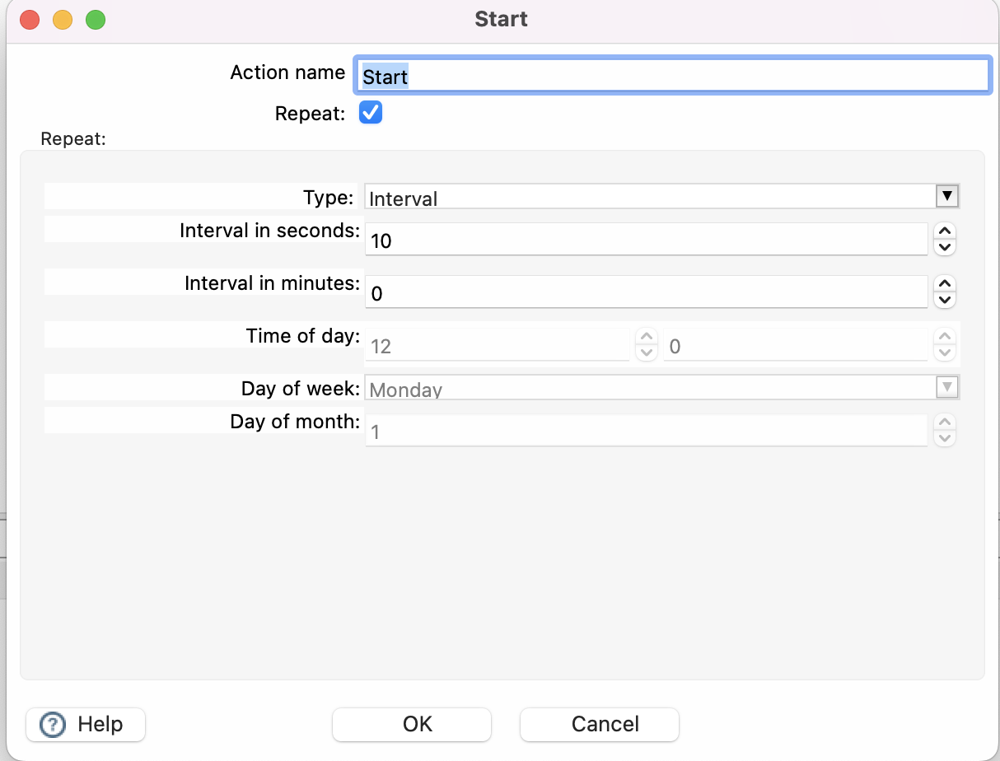

# 开始

## 描述

`Start` action 是一个特殊的 action，因为它是所有 workflow 执行的起始点。

> **📝 注意:** 每个 workflow 需要且仅需要一个 start action。

> **⚠️ 警告:** start action 具有重复 workflow 的附加选项。这在本地和远程 workflow 引擎中均可工作，但主要是出于历史原因保留，不应被视为 `cron`、Apache Airflow 或任何其他类型调度器的替代方案。

当您激活重复选项时，workflow 将根据您指定的间隔继续运行并重新启动。这可以是具有特定时间戳的固定日期，或者每隔 x 秒/分钟。

虽然这不能替代调度器，但可用于基本调度。请注意，使用此功能会使 workflow 保持运行状态，这意味着 Java 进程将继续存在并使用系统资源。
