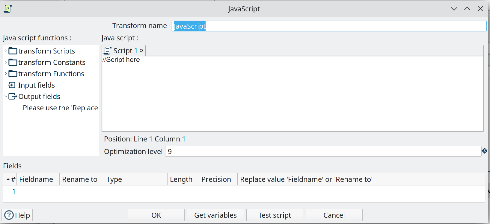
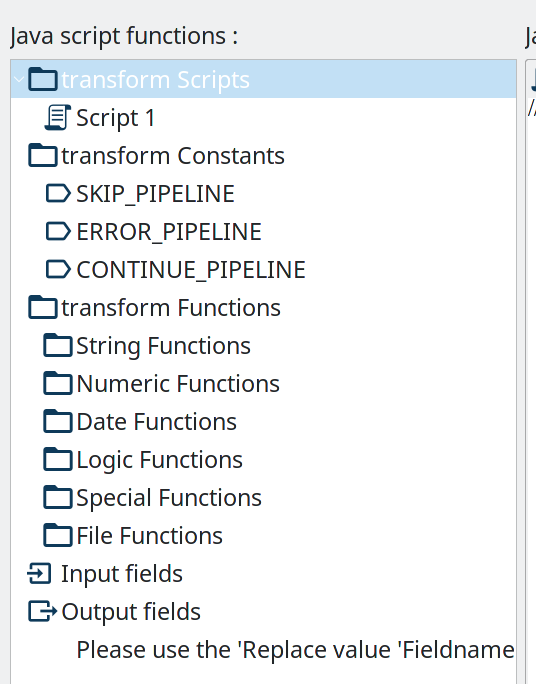
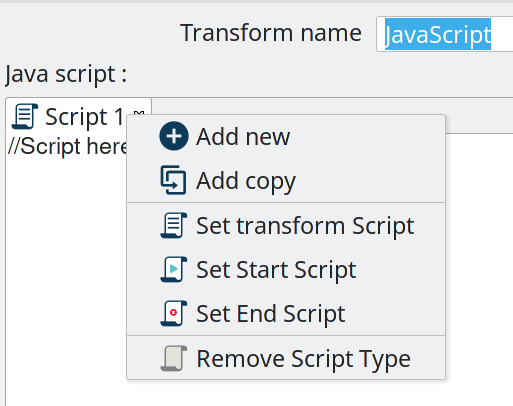

#  JavaScript

| Hop Engine |  |
|---|---|
| Spark |  |
| Flink |  |
| Dataflow |  |

## 用法

JavaScript transform 提供了一个用户界面来构建 JavaScript 表达式，您可以用它来修改数据。您在脚本区域中输入的代码对每个输入行执行一次。

此 transform 允许在单个 transform 实例中使用多个脚本。

Javascript transform 不是输入 transform，因此需要来自 pipeline 的输入流。

尽量减少脚本对于保持数据集成解决方案的可维护性非常重要。尽量避免使用 JavaScript。



## 故障排除
- Hop 使用较旧版本的 JavaScript（Rhino 引擎），支持 ECMA 5 和部分 ECMA 6。请参阅 https://mozilla.github.io/rhino/compat/engines.html 上的 Rhino ES2015/ES6、ES2016 和 ES2017 支持情况
- Get variables 按钮可能不总是有效，因此请手动输入变量。
- JavaScript transform 在空白和行延续较少时运行更好，尤其是在使用 GraphQL 时。避免多行表达式或语句。
- 确保为传出的 JavaScript 字段选择正确的 Type。

## 示例
例如，使用 JavaScript 创建 4 个新字段：
```
var myVar = incomingFieldFromHop;
var myTestString = "my test";
var myDate = str2date("2020-12-31", "yyyy-MM-dd");
var myDateTime = new Date("2023-10-01T01:40:26.210");
```
例如，使用 JavaScript 展平 JSON 键：
```
//var input_json = {
//    "c-102": "AIDS Healthcare",
//    "c-105": "AIDS Healthcare Direct",
//    "c-75": "Allied Physicians (ALIP)",
//    "c-59": "Asheville Endocrinology"};

var input_json = JSON.parse(incomingJSONFromHop);
var output_json = [];

for (var key in input_json) {
    var value = input_json[key];
    output_json.push({field1: key, field2: value });
}

var flattened_json = JSON.stringify(output_json);
```

## Javascript functions 面板



Javascript functions 面板包含一个树状视图，显示脚本、常量、函数、输入字段和输出字段，如下所述。

双击任何脚本、常量、函数或字段可将它们添加到脚本中。

Transform Scripts::
您在此 transform 中创建的脚本。

Transform Constants::
一些预定义的静态常量，用于控制数据行的处理方式。
要使用这些常量，您必须首先在脚本开头设置 pipeline_Status 变量为 CONTINUE_PIPELINE，以便将变量赋值作用于正在处理的第一行。否则，对 pipeline_Status 变量的任何后续赋值都将被忽略。
可用常量有：

- SKIP_PIPELINE：将当前行从输出行集中排除，并继续处理下一行。
- ERROR_PIPELINE：将当前行从输出行集中排除，生成错误，且不处理任何剩余行。
- CONTINUE_PIPELINE：将当前行包含在输出行集中。
- ABORT_PIPELINE：将当前行从输出行集中排除，且不处理任何剩余行，但不生成错误。

Transform Functions::
可在脚本中使用的字符串、数值、日期、逻辑、特殊和文件函数。这些内置函数用 Java 实现，执行速度比 JavaScript 函数更快。每个函数都有一个演示其用法的示例脚本。双击函数可将其添加到 Javascript 面板。右键单击并选择 Sample 可将示例添加到 Javascript 面板。

Input Fields::
此 transform 的输入字段。

Output Fields::
此 transform 的输出字段。

## Javascript 面板

Javascript 面板是编写代码的编辑区域。您可以通过双击要插入的节点或使用拖放将对象放到 Javascript 面板上，从左侧的 Javascript functions 面板中插入常量、函数、输入字段和输出字段。

Javascript 面板底部的位置显示光标的行号和位置。

`Optimization level` 选择 JavaScript 优化级别。值为：

- 1：JavaScript 在解释模式下运行。
- 0：不执行任何优化。
- 1-9：执行所有优化。9 执行最多优化，脚本执行更快，但编译速度较慢。默认为 9。

## 脚本类型



您可以右键单击 Javascript 面板中的选项卡以打开包含以下命令的上下文菜单：

- **Add new** – 添加新的脚本选项卡。
- **Add copy** – 在新选项卡中添加现有脚本的副本。
- **Set Transform Script** - 指定对每个输入行执行的脚本。只有一个选项卡可以设置为 transform 脚本。默认情况下第一个选项卡是 transform 脚本。
- **Set Start Script** - 指定在处理第一行之前执行的脚本。
- **Set End Script** – 指定在最后一行处理完成后执行的脚本。
- **Remove Script Type** - 指定不执行该脚本。脚本选项卡不会被移除。要移除脚本选项卡，请单击 Close 按钮（红色的"X"）并选择 Yes 以删除脚本选项卡。

脚本类型的图标显示在选项卡上，以表示选项卡上的脚本类型。要重命名脚本选项卡，请在 Javascript functions 面板的 Transform Scripts 部分右键单击选项卡名称，选择 Rename，然后输入新名称。

## Fields 表

Fields 表包含脚本中的变量列表，并允许您向字段添加元数据，例如描述性名称。

| 字段 | 描述 |
|---|---|
| Fieldname | 指定输入字段的名称。 |
| Rename to | 为输入字段指定新名称。 |
| Type | 为输出字段指定数据类型。 |
| Length | 指定输出字段的长度。 |
| Precision | 指定输出字段的精度值。 |
| Replace value 'Fieldname' or 'Rename to' | 指定是用另一个值替换所选字段的值，还是重命名字段。值为 Y（是）和 N（否）。 |
| Get variables | 从脚本中检索 Javascript 变量列表。您可以手动添加变量，因为 'Get variables' 按钮可能不总是有效。 |
| Test Script | 测试脚本的语法，并显示带有用于测试的一组行的 Generate Rows 对话框。 |

## Javascript 内部 API 对象

您可以使用以下内部 API 对象（有关参考，请参阅源代码中的类）：

- **_PipelineName_**: 包含 pipeline 名称的 String
- **_transform_**: 此 transform 的实际 transform 实例（org.apache.hop.pipeline.transforms.javascript.ScriptValues）
- **rowMeta**: org.apache.hop.core.row.IRowMeta 的实际实例
- **row**: 数据 Object[] 的实际实例

## 示例

### 检查行中字段是否存在：

```
var idx = getInputRowMeta().indexOfValue("lookup");
if ( idx < 0 )
{
   var lookupValue = 0;
}
else
{
   var lookupValue = row[idx];
}
```
### 在行中添加新字段

必须以相同的顺序将字段添加到行中，以保持行结构的一致性。

要添加字段，请在 Javascript 面板中将其定义为 var，并在 Fields 表中将其添加为字段。

### 数值

在 JavaScript 中赋值的大多数值默认是浮点值，即使您认为已赋了整数值。如果您在已知为整数的值上使用 == 或 switch/case 遇到问题，请使用以下结构：

```
switch(parseInt(valuename))
{
case 1:
case 2:
case 3:
 strvalueswitch = "one, two, three";
 break;
case 4:
 strvalueswitch = "four";
 break;
default:
 strvalueswitch = "five";
}
```
### 过滤行

要过滤行（例如从输出中移除行），请按如下方式设置 pipeline_Status 变量：

```javascript
pipeline_Status = CONTINUE_PIPELINE
if (/* your condition here */) pipeline_Status = SKIP_PIPELINE
```

所有匹配指定条件的行都将从输出中移除。

### 使用带空格的字段名

Javascript 不允许创建变量名中带空格的变量。但是，您_可以_使用包含空格的字段名。

例如，要将字段 `field name with spaces` 中的所有空格替换为下划线，请使用语法 `this["field name with spaces"]`。

`this` 关键字是必需的。没有它，Javascript 会将 `field name with spaces` 用作字符数组。

```
var new_field = replace(this["field name with spaces"], " ", "_");
```
### 生成包含嵌套数组的自定义 JSON
您可以使用类似以下的 javascript 创建自己的自定义 json 结构。
在此示例中，您需要创建两个输入字段 `short_filename` 和 `myField1`，例如使用 data grid transform。
生成的 JSON "myBodyJson" 随后可用于例如 REST Client transform。对于 POST 请求，只需将此 "myBodyJson" 映射到 "Body field"。

```
var json = {};
json.sourceProperties = {};
json.sourceProperties.properties = [];

json.filename = short_filename;
json.sourceCategory = "CategoryABC";

json.sourceProperties.properties.push({"key": "exampleArr", "values": [1000]})
json.sourceProperties.properties.push({"key": "exampleString", "values": "Some Testingtext"})
json.sourceProperties.properties.push({"key": "exampleUsingInputField", "values": myField1})

var myBodyJson = JSON.stringify(json);
```
