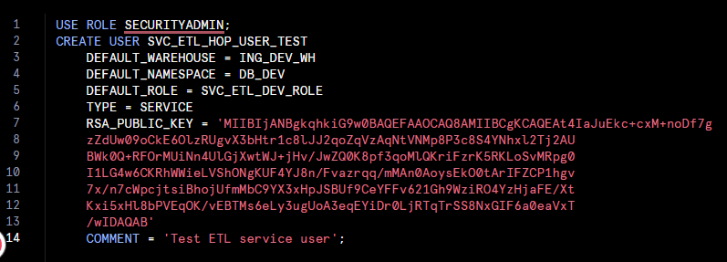
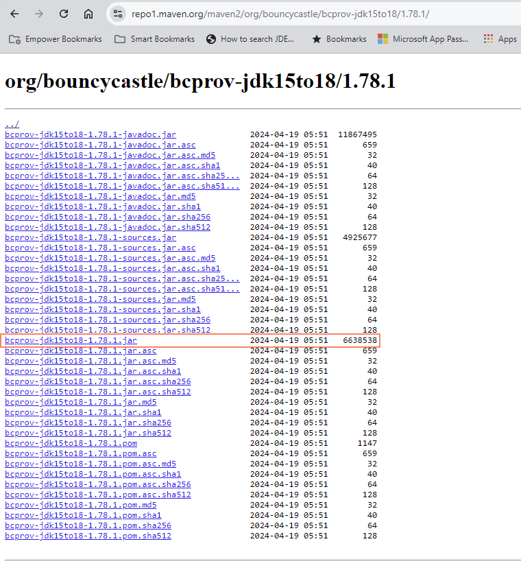
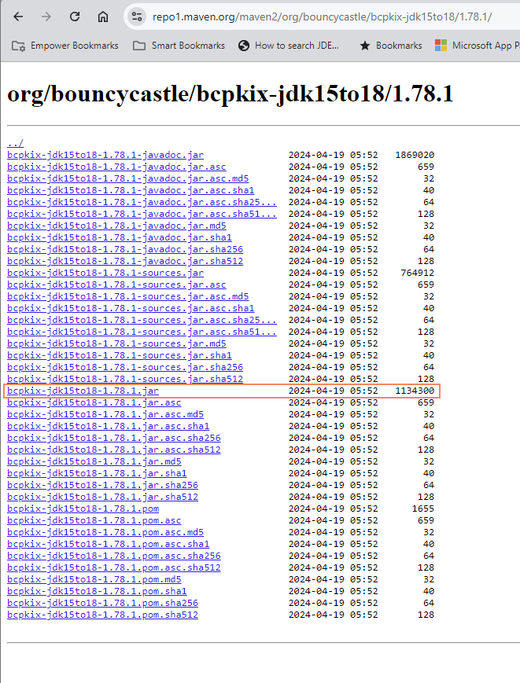
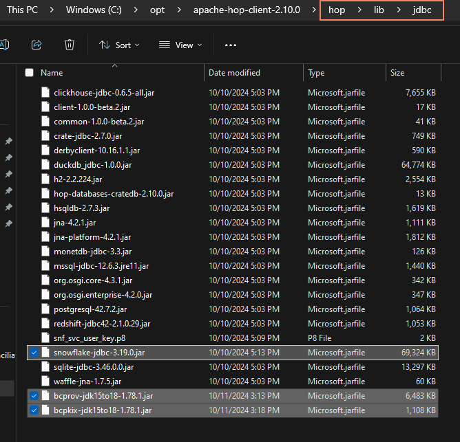
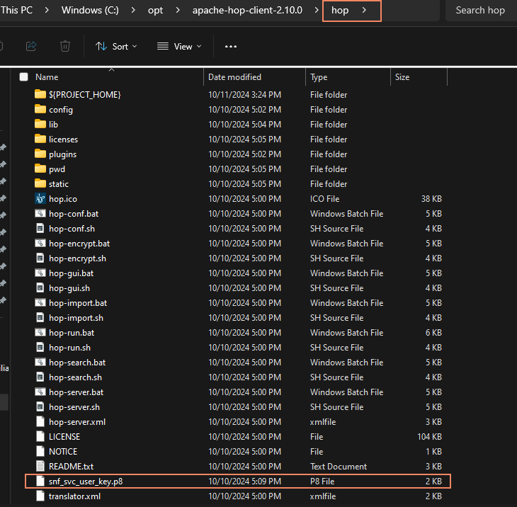
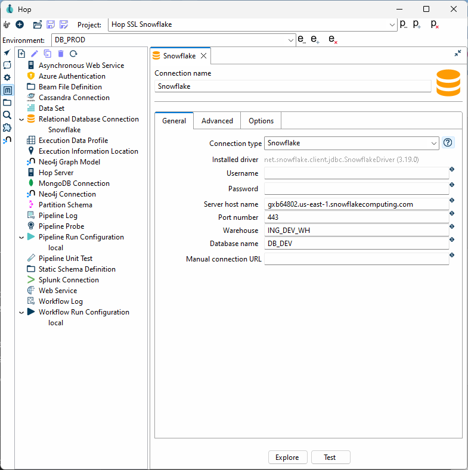
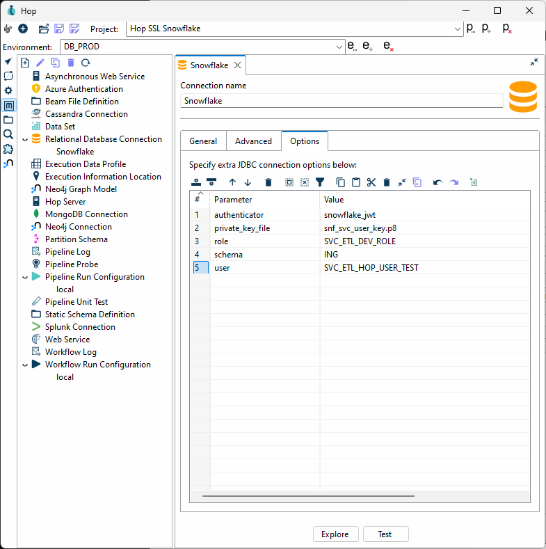
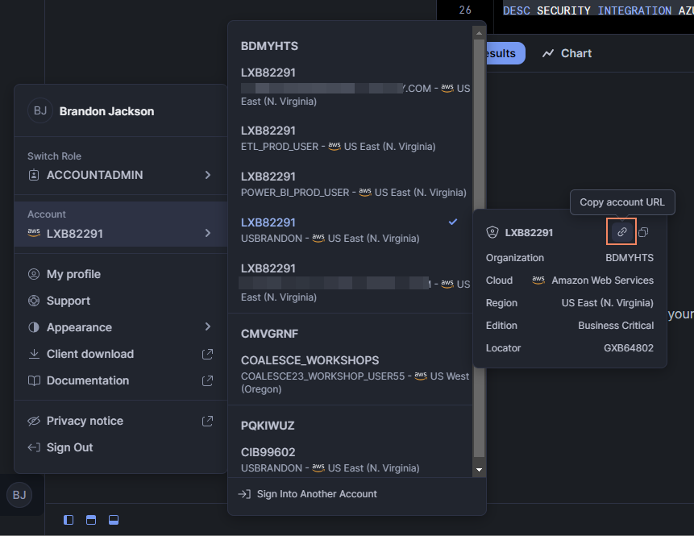

# Snowflake

## 配置

| 选项 | 信息 |
|---|---|
| 类型 | Relational |
| 驱动 | 已内置 |
| 内置版本 | 4.2.0 |
| Hop 依赖 | 无 |
| 文档 | [文档链接](https://docs.snowflake.net/manuals/user-guide/jdbc-configure) |
| JDBC Url | `jdbc:snowflake://<account_name>.snowflakecomputing.com/?<connection_params>` |
| 驱动文件夹 | <Hop Installation>/lib/jdbc |

## 建立 Snowflake SSL 认证连接

### 简介

本简短指南将带您创建一个 Snowflake 用户，将其配置为附加了公钥的服务账户，并对 Qi Hop 进行配置，使其能够使用私钥、角色、计算资源等建立连接以执行后续工作。

### 在 Snowflake 中创建 RSA 密钥对和 Hop 服务用户

首先，您需要为要通过 Hop 连接 Snowflake 时使用的服务用户创建一个 RSA 密钥对。

您可以在大多数 Linux / WSL（Windows Subsystem for Linux）上通过在终端窗口中运行以下命令来生成 RSA 密钥对

`openssl rsa -in rsa_key.p8 -pubout -out rsa_key.pub`

rsa_key.pub 文件的内容就是您将在 Snowflake `CREATE USER` 语句中使用的内容。

```sql
USE ROLE SECURITYADMIN;

CREATE USER SVC_ETL_HOP_USER_TEST
    DEFAULT_WAREHOUSE = ING_DEV_WH
    DEFAULT_NAMESPACE = DB_DEV
    DEFAULT_ROLE = SVC_ETL_DEV_ROLE
    TYPE = SERVICE
    RSA_PUBLIC_KEY = 'public key copy paste in single quotes'
    COMMENT = 'Test ETL service user';
```



在截图中，我们可以定义希望用户拥有的所有属性，包括使用哪个默认计算资源（warehouse）、命名空间（数据库）和角色。我们还定义了一个特殊属性 `TYPE
# SERVICE`，以确保用户无法通过登录页面登录，只能通过编程方式访问。

### 下载 Snowflake JDBC 驱动和加密库

[下载](https://repo1.maven.org/maven2/net/snowflake/snowflake-jdbc/)当前版本的 Snowflake JDBC 驱动。
文件名的命名模式为 *snowflake-jdbc-3.19.0.jar*

为支持基于证书的身份认证，我们还需要从 Bouncy Castle [下载](https://www.bouncycastle.org/download/bouncy-castle-java-lts/)
两个 jar 文件，Bouncy Castle 是一个著名的 Java 加密 API 库。

第一个是 provider jar，其名称指示了支持的 JRE/JDK 版本。请确保下载与 Hop 所需 JDK 版本匹配的正确版本。第一个要下载的文件是 `bcprov-jdk<VERSION>.jar`



其次，我们需要加密库，其文件名中同样包含 JDK 版本信息。文件名为 `*bcpkix-jdk<version>.jar*`



JDBC 驱动和两个 Bouncy Castle 加密库 jar 文件需要放入 `*hop/lib/jdbc*`。请务必删除 `hop/lib/jdbc` 中找到的任何旧版本 Snowflake JDBC 驱动 jar。Snowflake 驱动维护良好且经常更新。



### 将 RSA 私钥放入 Hop 的文件夹中

私钥文件必须存储在 Hop 的根文件夹中。

> **⚠️ 警告:** 可能存在从 Hop 根文件夹以外的路径引入私钥的方式（例如在连接的 `Options` 选项卡中定义），但目前尚不明确。



### 收集 Snowflake 连接属性

让我们先看最终结果，然后描述每个属性的来源和原因。

Hop 中的大多数连接使用典型字段，如 `Server host name`、`Port number`、`Warehouse`、`Database name`，但由于这是一个更高级的连接配置，我们需要利用可在如下所示 `Options` 选项卡上设置的额外 JDBC 参数。



查看 `Options` 选项卡，我们使用了几个关键字：*`authenticator`、`private_key_file`、`role`、`schema`* 和 *`user`*。这些参数来自 Snowflake JDBC 参数文档站点。

我们首先告诉 JDBC 驱动我们将使用 `*snowflake_jwt*` 进行认证，这意味着它将期望看到某种形式的私钥和公钥。

在这种情况下，使用了 `*private_key_file*` 参数。例如，它可以来自 AWS Secret Store 中的证书。在这种情况下，证书或密钥文件不必留在环境中，并在镜像销毁时被处理掉。
其他变量允许您对其进行编码（BASE64）等。



Server host name 的 URL 可以通过在 Snowflake 控制台左下角点击您的用户名、选择您的实例来获取，那里有一个小链接图标。
当您将其粘贴到 Hop 的对话框中时，请去掉 `HTTPS://` 部分，因为它不是必需的。连接始终是加密的。



### 参考资料

用于生成此可用配置的参考文档

[JDBC Configure](https://docs.snowflake.com/en/developer-guide/jdbc/jdbc-configure)

Snowflake Account Identifiers

[Admin account identifier](https://docs.snowflake.com/en/user-guide/admin-account-identifier)

Snowflake JDBC Connection Parameters
（`authenticator`、`private_key_file`、`role`、`schema`、`user`）

[JDBC parameters](https://docs.snowflake.com/en/developer-guide/jdbc/jdbc-parameters)
