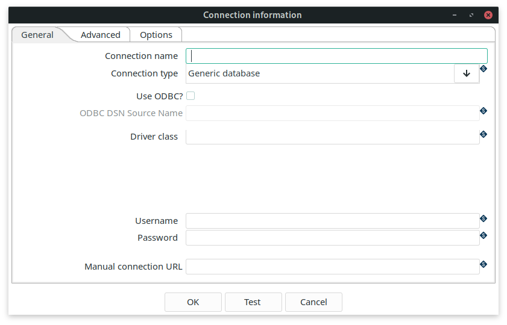

# 数据库插件

Qi Hop 对多种数据库类型提供了优化的支持。如果您使用的数据库不在支持列表中，始终可以创建一个通用连接。

要创建数据库连接，请转到 metadata 视图，右键点击 `Relational Database Connections` 并选择 `New`。

连接保存在一个中央位置，然后可以被所有 pipeline 和 workflow 使用。
如果您已将项目设置为与 Hop 配合使用，数据库信息将存储在 `{openvar}PROJECT_HOME{closevar}/metadata/rdbms` 文件夹中。每个连接都会在此文件夹中生成一个单独的 .json 文件。此 json 文件将以连接名称命名，并包含所有连接信息。

## 添加 JDBC 驱动

Qi Hop 为所有在兼容 Apache Public License 许可证下提供驱动的数据库内置了 JDBC 驱动。Qi Hop 附带的所有 JDBC 驱动可以在 Qi Hop 安装目录的 `lib/jdbc` 中找到。

以下各小节中各种数据库类型的文档将告诉您所使用的数据库驱动是否已内置。如果已内置，连接编辑器还会显示已安装驱动版本。如果驱动未内置，文档将引导您到下载地址。

将 `HOP_SHARED_JDBC_FOLDERS` 环境变量设置为包含您的额外 JDBC 文件夹的目录。将它们放在一个统一文件夹中有助于轻松升级或更换 Qi Hop 安装，而无需每次重新添加 JDBC 驱动。
此变量接受以逗号分隔的列表以指向多个目录，未设置时的默认值为 `lib/jdbc`，例如 `<PATH_TO_YOUR_HOP_INSTALLATION>/lib/jdbc,<PATH_TO_YOUR_JDBC_FOLDER>`。

为避免冲突，请确保每个数据库只有一个驱动，并且不要有多个驱动副本，例如同时存在于 `HOP_SHARED_JDBC_FOLDERS` 和 `hop/lib/jdbc` 文件夹中。

## 通用连接

当您想使用的数据库类型尚不可用时，可以使用通用连接。
要使用通用连接，您必须将 jdbc 驱动复制到 `<PATH_TO_YOUR_HOP_INSTALLATION>/lib/jdbc` 文件夹或您的 `HOP_SHARED_JDBC_FOLDERS` 文件夹中。



请查阅您的数据库驱动类和 URL 语法文档来创建连接。

在 Driver Class 字段中指定您的驱动类，例如如果您使用 PostgreSQL，则类为 `org.postgresql.Driver`。

## 高级属性

高级选项卡允许您为数据库连接指定一些额外的属性。

| 属性 | 描述 |
|---|---|
| 支持 Boolean 数据类型 | 是否支持 Boolean？ |
| 支持 Timestamp 数据类型 | 是否支持 Timestamp？ |
| 在数据库中为所有标识符加引号 | 为生成的 SQL 语句中的所有标识符添加引号。 |
| 将所有标识符强制转为小写 | 将生成的 SQL 语句中的所有标识符转为小写。 |
| 将所有标识符强制转为大写 | 将生成的 SQL 语句中的所有标识符转为大写。 |
| 保留保留字的大小写 | 不要更改生成的 SQL 语句中所有保留字的大小写。 |
| 首选 schema 名称 | 默认使用的 schema 名称（可被覆盖）。 |
| 连接后执行的 SQL 语句（以 ; 分隔） | 以分号（';'）分隔的 SQL 语句列表，在连接创建后需要执行。 |

## 选项

选项表包含一系列可添加到 JDBC 驱动的键/值对。请查阅您的数据库 JDBC 驱动文档以获取正确的语法。

例如，要为 MS SQL 数据库添加额外选项，您可以添加选项以实现如下所示的 JDBC URL。Qi Hop 会在后台处理这些属性，通常无需手动修改 JDBC URL（但您_可以_这样做，而在 `Generic` 连接中，您_必须_这样做）。

```
jdbc:sqlserver://localhost:1433;"
     "databaseName=AdventureWorks;integratedSecurity=true;"
     "encrypt=true;trustServerCertificate=true
```

| integratedSecurity | true |
|---|---|
| encrypt | true |
| trustServerCertificate | true |
