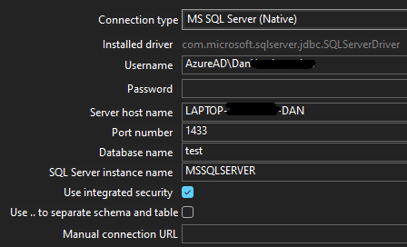
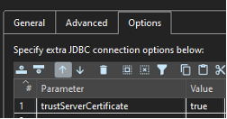
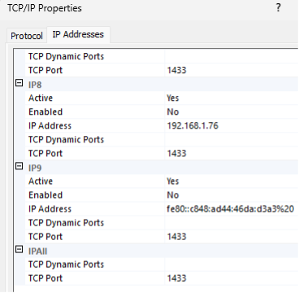

# MS SqlServer (Native)

| 选项 | 信息 |
|---|---|
| 类型 | Relational |
| 驱动 | [驱动链接](https://docs.microsoft.com/en-us/sql/connect/jdbc/download-microsoft-jdbc-driver-for-sql-server?view=sql-server-ver15) |
| 内置版本 | 13.2.1.jre11 |
| Hop 依赖 | 无 |
| 文档 | [文档链接](https://docs.microsoft.com/en-us/sql/connect/jdbc/setting-the-connection-properties?view=sql-server-ver15) |
| JDBC Url | jdbc:sqlserver://[serverName[\instanceName][:portNumber]][;property=value[;property=value]] |
| 驱动文件夹 | <Hop Installation>/lib/jdbc |

## 集成认证 / 基于 Windows 的认证

Microsoft SQL JDBC 原生驱动附带了额外的文件，支持使用您当前的 MS Windows 凭据进行认证。当您从 Microsoft 网站下载 JDBC 驱动并解压后，会看到如下目录结构：

sqljdbc_11.2\enu\auth\x64 ← 64 位认证支持文件。
sqljdbc_11.2\enu\auth\x86 ← 32 位认证支持文件。

*复制 Microsoft auth dll 文件：*
*从：* sqljdbc_11.2\enu\auth\x64\mssql-jdbc_auth-11.2.3.x64.dll
*到：* hop\lib\mssql-jdbc_auth-11.2.3.x64.dll
*同时复制到您的 Java 安装文件夹，在我的例子中是：*
C:\Program Files\Microsoft\jdk-17.0.6.10-hotspot\bin
C:\Program Files\Microsoft\jdk-17.0.6.10-hotspot\lib

*复制 JDBC 驱动：*
*从：* sqljdbc_11.2\enu\mssql-jdbc-11.2.3.jre11.jar
*到：* \hop\plugins\databases\mssqlnative\lib，替换任何已有版本。
### 连接关系型数据库和 JDBC 驱动

- 确保已安装正确的 JDBC 驱动（参见安装部分）
- 在 Metadata 按钮上，双击 Relational Database Connection
- 	*General 选项卡：* 更改连接类型以连接到数据库类型

### 连接 SQL Server SQL 数据库

- 要连接 SQL Server，首先安装必要的 JDBC 驱动（参见 Hop 安装文档）
**	如果您使用集成认证的 SQL Server，请确保在 Options 下设置 trustServerCertificate = true。可能还需要 encrypt = true。
- 打开 metadata，在 Relational Database Connection 下添加新项来创建到 SQL Server 的连接

*本地 SQL Server 数据库（集成安全）*

- *连接名称：* 给它起个名字，如 Local SQL Server（保存前需要填写名称）
- *General 选项卡：* 更改连接类型以连接到 SQL Server 等。
**	*连接类型：* MS SQL Server (Native)
**	*SQL Server 实例名称：* 请参见 SQL Server 配置管理器或查看 Windows 服务以获取实例名称。大多数情况下是"MSSQLSERVER"
***	*打开 SQL Server 配置管理器：* C:\Windows\System32\SQLServerManager15.msc

- *Options 选项卡：*

### 通过 TCP/IP 连接 SQL Server Native 的故障排除

https://stackoverflow.com/questions/18841744/jdbc-connection-failed-error-tcp-ip-connection-to-host-failed

*打开 SQL Server 配置管理器并设置 TCP/IP 和端口 1433*

- 打开 SQL Server 配置管理器，然后展开 SQL Server Network Configuration。
- 点击 Protocols for InstanceName，然后确保在右侧面板中 TCP/IP 已启用，并双击 TCP/IP。
- 在 Protocol 选项卡上，注意 Listen All 项的值。
- 点击 IP Addresses 选项卡（如下图所示）：如果 Listen All 的值为 yes，则此 SQL Server 实例的 TCP/IP 端口号是 IPAll 下 TCP Dynamic Ports 项的值。如果 Listen All 的值为 no，则此 SQL Server 实例的 TCP/IP 端口号是特定 IP 地址的 TCP Dynamic Ports 项的值。

- 确保 TCP Port 为 1433，点击 OK
- 在进行任何更改或新设置后，您必须重启 SQLSERVER 服务
- 如果您看到 Windows SQL Server / SQL Server Browser / SQL Server Agent 服务状态为"stopped"，右键点击 SQL Server/SQL Server Browser 并点击启动。
- 我经常使用的一个好检查方法是用 telnet，例如在 Windows 命令提示符中运行：telnet 127.0.0.1 1433
**	如果您得到一个空白屏幕，表示网络连接已成功建立，这不是网络问题。如果您得到"Could not open connection to the host"，则这是网络问题
- 或者，您可以使用 netstat -a 来查找开放和监听的端口
**	netstat -ab | find "1433"
**	netstat -abn |Select-String -Pattern sql -Context 0,1
