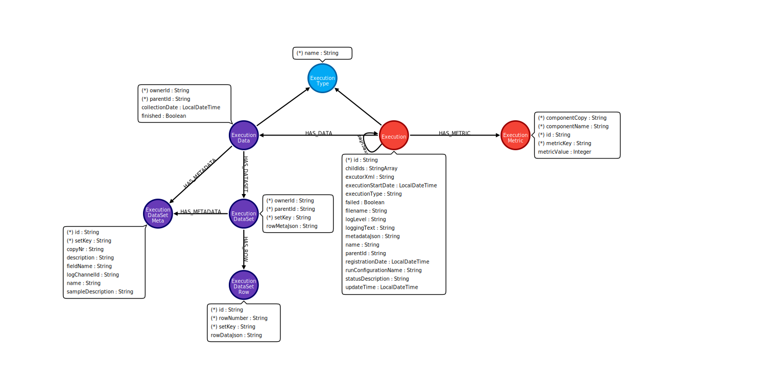

# Neo4j Location Type

## 描述

使用此 location type，你可以将执行信息存储在 [Neo4j](technology/neo4j/index.md) 图数据库中。

## 选项

- *Neo4j connection*：用于存储信息的 [Neo4j 连接](metadata-types/neo4j/neo4j-connection.md)名称。
- *Button 'Show indexes DDL'*：显示你要在 Neo4j 连接上执行的 CREATE INDEX 语句，以确保写入和读取信息时的性能良好且持续。
- *Button 'Copy a Neo4j Index action to clipboard'*：将 Neo4j Index action 复制到剪贴板，以便你可以将其直接粘贴到 Workflow 中。它将确保创建正确的索引（如果需要），以在使用 execution information location 时获得出色的性能。

## 图模型

这是由此 execution information location plugin 填充的图模型：

