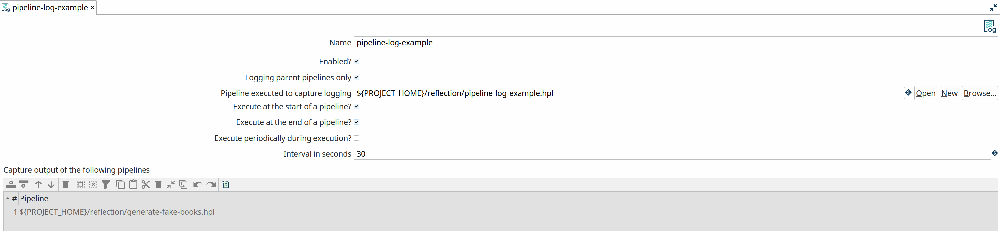

# Pipeline 日志

## 描述

允许用另一个 Pipeline 记录 Pipeline 的活动。

Pipeline 日志将正在运行的 Pipeline 的日志信息流式传输到另一个 Pipeline。

接收 Pipeline 的唯一要求是它以 [Pipeline Logging](pipeline/transforms/pipeline-logging.md) transform 开始。除此之外，日志 Pipeline 就是"另一个普通 Pipeline"。
在此日志 Pipeline 中，你可以处理日志信息，例如写入关系型或 NoSQL 数据库、Kafka topic 等。

## 示例

示例项目附带了一个 Pipeline 日志示例。

在 metadata perspective 中查看 Pipeline 日志 `pipeline-log-example`。此 Pipeline 日志配置为将 Pipeline `{openvar}PROJECT_HOME{closevar}/reflection/generate-fake-books.hpl` 的日志信息发送到日志 Pipeline `{openvar}PROJECT_HOME{closevar}/reflection/pipeline-log-example.hpl`。

## 相关 plugin

- [Pipeline Logging](pipeline/transforms/pipeline-logging.md)

## 选项

| 选项 | 默认值 | 描述 |
|---|---|---|
| Name | 此 Pipeline 日志的名称 |  |
| Enabled? | true |  |
| Logging parent pipelines only | false | 如果启用此项，仅记录由 Hop Run、GUI、Server 或 API 执行的父 Pipeline。禁用时，每次 Pipeline 执行都会被记录。 |
| Pipeline executed to capture logging |  | 用于处理此 Pipeline 日志日志信息的 Pipeline |
| Execute at the start of the pipeline? | true | 是否在 Pipeline 运行开始时执行此 Pipeline 日志 |
| Execute at the end of the pipeline? | false | 是否在 Pipeline 运行结束时执行此 Pipeline 日志 |
| Execute periodically during execution? | true | 是否在 Pipeline 运行期间定期执行此 Pipeline 日志 |
| Interval in seconds | 30 | 如果定期执行，指示 Pipeline 日志执行的间隔 |
