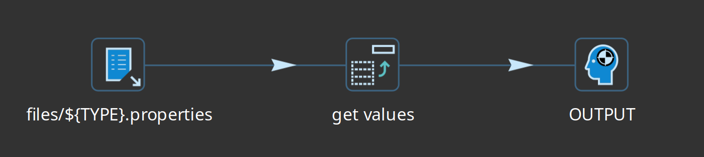
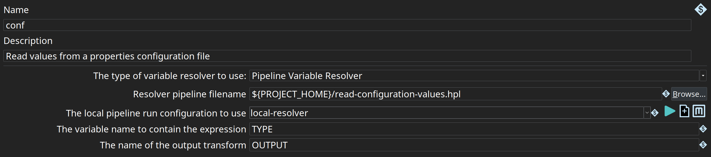

## 功能

我们可以创建一个类型为 `Pipeline Variable Resolver` 的新变量解析器元数据元素。
使用的选项非常简单：

- 要使用的 Pipeline 文件名：用于解析变量表达式而运行的 Pipeline 文件名。
- Pipeline 运行配置名称：必须引用类型为 [Native Local](pipeline/pipeline-run-configurations/native-local-pipeline-engine.md) 的运行配置。
- Pipeline 中包含要解析表达式的变量名称
- 用于获取字段值的输出字段名称

此设置为你提供了很大的灵活性。也许你每个数据库、每个系统都有一个配置文件...
在这种情况下，你可以设置变量以包含数据库、系统等的类型或名称，以读取相应的配置文件。
你可以从这些替代配置存储中获取多个值，并在一行中将它们发送到输出 transform。

> **❗ 重要:** 仅考虑 Pipeline 中的第一个输出行。

变量表达式（与以往一样）采用以下格式：

`{openvar}name:variable:field{closevar}`

- name：要使用的变量解析器元数据元素的名称
- variable：在元数据中指定的变量中设置的变量值（见上文）
- field：我们要在输出 transform 中检索字符串的字段名称。

## 示例

假设我们有多个数据库，每个数据库在单独的属性文件中都有配置文件：

- db1.properties
- db2.properties
- db3.properties
...

这些都包含相同的 5 个键，当然值不同：

```properties
username=user1
password=pwd1
hostname=hostname1
port=port1
db=db1
```

然后我们可以有一个 Pipeline 按类型读取和处理适当的文件：



变量解析器元数据如下所示：



以下是一些表达式及其返回结果的示例：

- `{openvar}conf:db1:username{closevar}` : user1
- `{openvar}conf:db2:db{closevar}` : db2
- `{openvar}conf:db3:port{closevar}` : port3

这为你提供了很大的灵活性。

> **📝 注意:** 如果你没有指定要检索的任何字段，整行将被编码为 JSON 值并返回。
