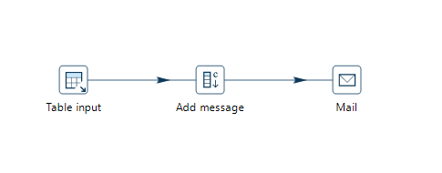
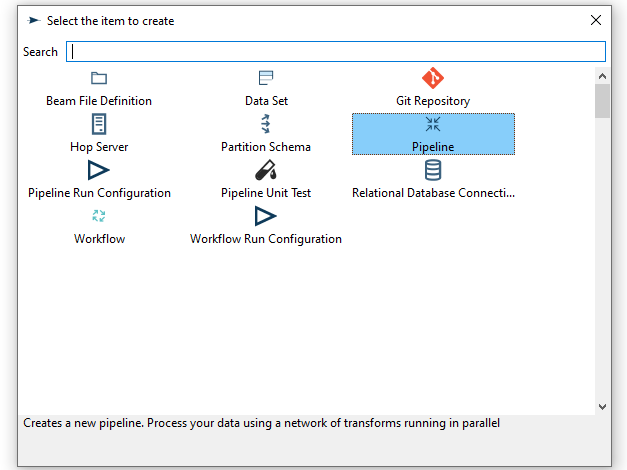
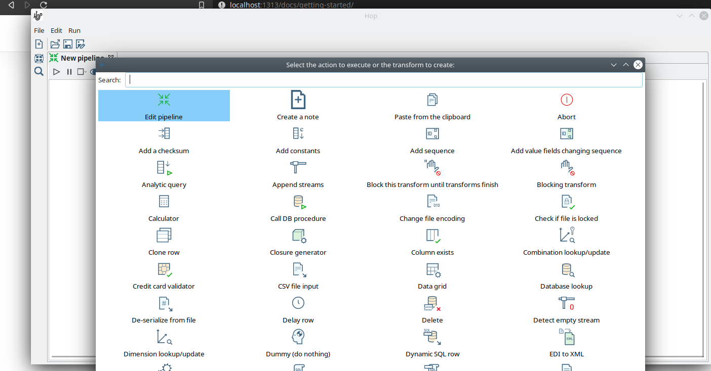
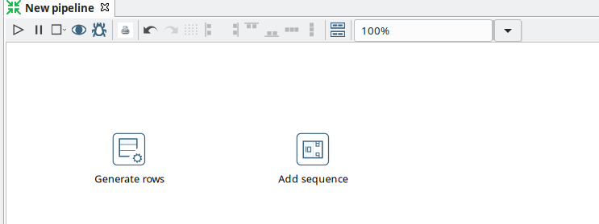
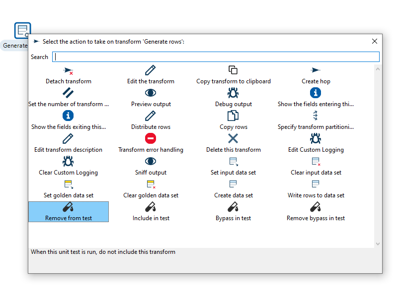
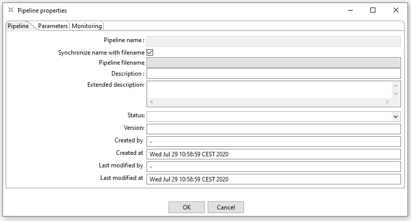
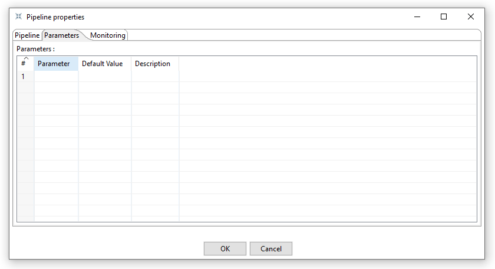
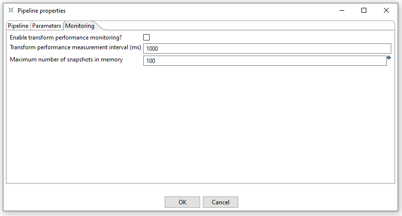

# 创建 Pipeline

## Pipeline 的工作原理

Pipeline 是 Hop 项目的基本构建块。

Pipeline 执行繁重的数据处理工作：从各种数据源读取数据，执行一系列操作（合并、清洗、丰富、转换等），并将数据写入目标平台。Pipeline 以_预定义的顺序_和_并行_方式执行所有这些操作。

在下图中，一个非常简单的 pipeline 从数据库读取数据，向数据添加消息并发送电子邮件。
所有这些操作都以预定义的顺序（从数据库读取、添加消息、发送邮件）和并行方式执行。
Pipeline 执行这些 transform，假设我们的数据库表或查询包含数千行数据。Pipeline 将开始读取查询结果，将其传递给 'Add message' transform。消息添加完成后，我们将从 Mail transform 发送邮件。所有这些操作将并行进行，因此当表输入仍在从表或查询中读取记录时，Mail transform 已经在发送邮件了。

## 概念

Pipeline 由通过 hop 连接的 transform 组成。
在邮件示例中，'Table input'、'Add message' 和 'Mail' 都是 transform。

- **transform** 是 pipeline 中的基本操作。
一个 pipeline 通常由许多通过 hop 链接在一起的 transform 组成。
Transform 是细粒度的，每个 transform 都被设计和优化为只执行一个且唯一的任务。
虽然单个 transform 本身可能不提供令人惊叹的功能，但 pipeline 中所有 transform 的组合使您的 pipeline 变得强大。

- **hop** 将 transform 连接在一起。
当一个 transform 完成处理接收到的数据集后，该数据集通过 hop 传递给下一个 transform。
Hop 是单向的（数据不能反向流动）。
Hop 只负责缓冲和传递数据，hop 本身与 transform 无关，它不了解数据从哪个 transform 传递来或传递到哪个 transform。
一些 transform 可以有条件地从多个其他 transform 读取或写入，但这是 transform 特定的配置。
Hop 对此并不知情。
可以通过点击 hop 或右键 -> 禁用来禁用 hop。

## 创建 Pipeline

通过工作项对话框创建新 pipeline。
您将看到如下所示的对话框。

完成 pipeline 后，保存它。
可以通过文件菜单、图标或使用 CTRL s 或 Command s 来完成。
对于新 pipeline，会显示文件浏览器以导航到您要存储文件的位置。

## 向 Pipeline 添加 Transform

在 pipeline 画布的任意位置点击，您将看到下图所示区域。

点击后，您将看到如下所示的对话框。
此对话框顶部的搜索框可用于搜索 transform、名称、标签（TODO）等。
找到您要的 transform 后，点击它将其添加到 pipeline 中。
除了点击，还可以使用方向键导航 + 回车键。
现在或在您想要向 pipeline 添加更多 transform 时重复此步骤。
将 transform 添加到 pipeline 后，您可以拖动来重新定位它。

查看可添加到 pipeline 的 [transform 列表](pipeline/transforms.md) 获取更多详细信息。

添加一个 'Generate Rows' 和一个 'Add Sequence' transform，您的 pipeline 应如下所示。

通过单击对象可以配置 transform 对象。
将根据您的 transform 对象显示如下所示的菜单。

| 操作 | 说明 |
|---|---|
| Detach transform | 将 transform 从 pipeline 分离 |
| Edit the transform | 编辑 transform 的 metadata |
| Copy transform to clipboard | 将选中项复制到剪贴板。 |
| Create hop | 在两个 transform 之间创建新 hop。 |
| Set the number of transforms | 并行启动多个 transform 实例。 |
| Preview & debug output | 运行 pipeline 以预览此 transform 的行，并可选择在断点条件匹配时暂停。 |
| Show the fields entering this transform | 显示进入 transform 的字段的 metadata，如字段名称和类型。 |
| Show the fields exiting this transform | 显示从 transform 输出的字段的 metadata，如字段名称和类型。 |
| Distribute rows | 当有多个 hop 时，数据将分配到下一个 transform。 |
| Copy rows | 当有多个 hop 时，数据将复制到下一个 transform。 |
| Specify transform partitioning | 指定如何将数据行分组到分区中，以便在类似行需要到达同一 transform 副本时进行并行执行 |
| Edit transform description | 为 transform 添加描述。 |
| Transform error handling | 设置 transform 的错误处理，并非所有 transform 都可用。 |
| Delete this transform | 从画布删除选中的 transform。 |
| Edit Custom Logging | 编辑此 transform 的自定义日志设置。 |
| Clear Custom Logging | 清除自定义日志设置。 |
| Sniff output | 查看此 transform 输出的 50 行数据。 |
| Set input data set | 定义要使用的数据，代替活动输入 transform，适用于选中的单元测试 |
| Clear input data set | 从选中的单元测试中移除已定义的数据集 |
| Set golden data set | 将此 transform 的输入与您选择的 golden 数据集进行比较。\n测试期间不执行 transform 本身 |
| Clear golden data set | 从此 transform 单元测试中移除已定义的输入数据集 |
| Create data set | 使用此 transform 的输出字段创建空数据集 |
| Write rows to data set | 运行当前 pipeline 并将数据写入数据集 |
| Remove from test | 当运行此单元测试时，不包含此 transform |
| Include in test | 运行当前 pipeline 并将数据写入数据集 |
| Bypass in tess | 当运行此单元测试时，绕过此 transform（用 dummy 替换） |
| Remove bypass in test | 测试期间不要在当前 pipeline 中绕过此 transform |

## 在 Transform 之间添加 Hop

有多种方式可以创建 hop：

- shift-drag：按住键盘上的 shift 键。
点击一个 transform，同时按住主鼠标按钮，拖动到第二个 transform。
释放主鼠标按钮和 shift 键。
- scroll-drag：在 transform 上滚动点击，同时按住鼠标滚轮按钮，拖动到第二个 transform。
释放滚轮按钮。
- 点击 pipeline 中的一个 transform 以打开 'click anywhere' 对话框。
点击 'Create hop'  按钮并选择要创建 hop 的目标 transform。

某些 transform 会产生不同类型的 hop。

| Hop | 说明 |
|---|---|
| Result is TRUE | 指定只有当前一个 transform 的结果为 true 时才执行此 transform |
| Result is FALSE | 指定只有当前一个 transform 的结果为 false 时才执行此 transform |
| Main output of transform | 两个 transform 之间的默认 hop |

## Pipeline 属性

Pipeline 属性是描述 pipeline 并配置其行为的属性集合。

双击 pipeline 画布可以打开属性对话框。

可以配置以下属性：

- Pipeline
- Parameters
- Monitoring

Pipeline 标签页允许您指定关于 pipeline 的一般属性，包括：

| 属性 | 说明 |
|---|---|
| Pipeline name | Pipeline 的名称 |
| Synchronize name with filename | 如果启用此选项，文件名和 pipeline 名称将同步。 |
| Pipeline filename | Pipeline 的文件名 |
| Description | Pipeline 的简短描述 |
| Extended description | Pipeline 的详细扩展描述 |
| Status | 草稿或生产状态 |
| Version | 版本描述 |
| Created by | 显示 pipeline 的原始创建者 |
| Created at | 显示 pipeline 创建的日期和时间。 |
| Last modified by | 显示最后修改 pipeline 的用户 |
| Last modified at | 显示 pipeline 最后修改的日期和时间。 |

Parameters 标签页允许您指定特定于 pipeline 的参数。
参数由名称、默认值和描述定义。

Monitoring 标签页允许您指定 pipeline 的监控。

此标签页中可设置的选项包括：

| 属性 | 说明 | 类型 |
|---|---|---|
| Enable transform performance monitoring | 为此 pipeline 中的 transform 启用性能监控 | boolean |
| Transform performance measurement interval (ms) | 监控此 pipeline 中 transform 性能的时间间隔（毫秒） | integer |
| Maximum number of snapshots in memory | 为此 pipeline 中的 transform 在内存中保留的性能监控快照数量 | integer |
