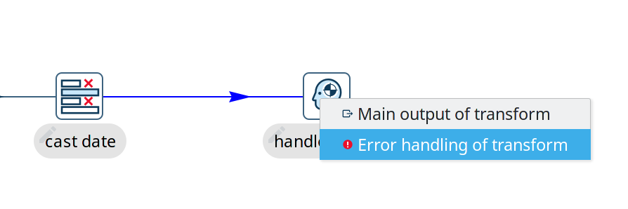
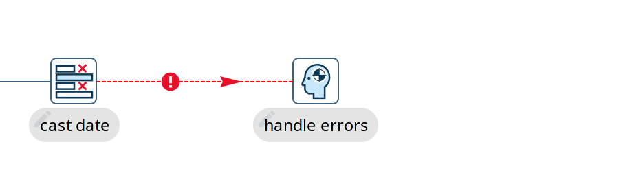
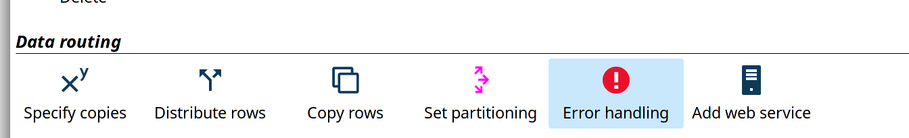
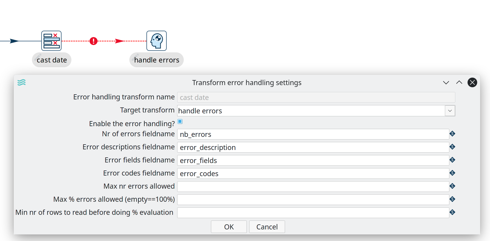
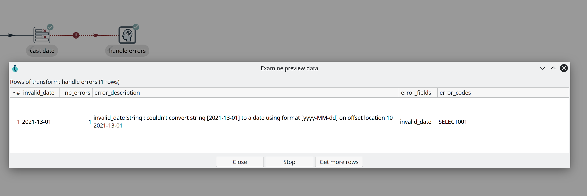

# Pipeline 错误处理

当某个 transform 发生严重故障时，pipeline 会收到通知并停止所有活动操作。在大多数情况下这是合理的，pipeline 故障通常在父 workflow 中处理（查看 [创建 workflow](../08-工作流/create-workflow.md) 页面了解 workflow 中的错误 hop）。
但在某些情况下，您可能希望优雅地处理错误而不停止整个 pipeline。

在这些情况下，当您不希望 pipeline 在发生错误时失败，Hop pipeline 支持在 transform 和 hop 上进行错误处理。

当您从支持错误处理的 transform 创建 hop 到另一个 transform 时，Hop pipeline 编辑器会询问您是否要为主输出或 transform 的错误处理创建 hop。

如果您选择创建错误处理 transform，hop 将以红色显示，而不是默认的黑色（或白色，如果您使用深色模式）。

对于每个支持错误处理的 transform，您可以配置多个选项。
点击 transform 图标打开上下文对话框并选择 'Error handling' 图标。

在错误处理对话框中，您可以指定将添加到 pipeline 流中的额外字段。

可用选项包括：

| 选项 | 说明 |
|---|---|
| target transform | 接收错误信息的 transform |
| enable the error handling | 从此 transform 启用错误处理 |
| nr of errors fieldname | pipeline 中发生的错误数量 |
| error description fieldname | 包含错误描述的字段名 |
| error fields fieldname | 发生错误的 pipeline 字段 |
| error codes fieldname | 发生错误对应的错误代码 |
| max nr errors allowed | pipeline 失败前允许的最大错误数量。 |
| max % errors allowed (empty = 100%) | pipeline 失败前允许的错误百分比 |
| min nr of rows to read before doing % evaluation | 进行百分比评估前需要读取的行数。这些行将纳入评估，但只有在处理完指定数量的行后才执行评估。 |

下面是尝试将无效日期字符串转换为日期时的输出示例。

