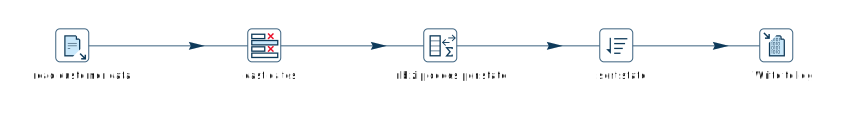
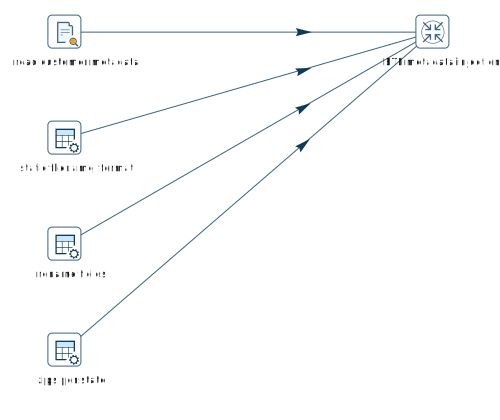

# Metadata Injection

## 什么是 Metadata Injection？

Metadata 是 Qi Hop 一切的核心。当您开发 pipeline 时，包含所有配置选项的 transform、这些 transform 之间的 hop 以及用于运行 pipeline 的 pipeline 运行配置都是 metadata 项。

在某些用例中，您会发现自己创建了基本上是同一个 pipeline 的不同变体。

以这个简单的 pipeline 为例：您需要从供应商加载交易数据值，过滤掉一些特定的值，并将所有内容输出到文件。

流程总是相同的，唯一的区别是不同的文件布局、可能需要过滤的不同值以及输出文件。

Metadata Injection 通过从各种来源获取此 pipeline 的 metadata 并在运行时将其注入到_模板 pipeline_中，可以使这个过程变得简单得多。

注入后，Qi Hop 拥有一个内存中的 pipeline，它根据您此次运行所需的精确 metadata 进行了配置。

每个供应商不再需要一个 pipeline，您只需要一个模板 pipeline 和一个注入 pipeline。这大大减少了需要维护的文件数量、重复任务的数量，从而提高了项目的稳定性和可维护性。

## Metadata Injection 的工作原理

> **💡 提示:** 下面的示例可从 `samples` 项目的 `metadata-injection` 文件夹中获取。

_模板 pipeline_ 是一个空 pipeline，包含 pipeline 流程所需的所有 transform 和 hop，但不包含任何配置。

_注入 pipeline_ 是一个标准的 pipeline，通过 [ETL Metadata Injection](./transforms/metainject.md) transform 收集和准备运行模板 pipeline 所需的所有 metadata。

Metadata Injection transform 读取模板 pipeline，并允许您将注入 pipeline 中的字段映射到模板 pipeline 中 transform 的目标字段。

以下示例中发生的事情：

- **read customer metadata** 解析示例文件并读取其文件布局。检测到的文件布局的各个项被注入到模板 pipeline 中 `read customer data` 的字段中。
- **static filename, format** 从数据网格提供文件名和文件格式。
- **rename fields** 提供将被注入到模板 pipeline 中 `cast dates` [Select Values](./transforms/selectvalues.md) transform 的字段原始名称和新名称。
- **zips per state** 提供配置模板 pipeline 中 `nb zip codes per state` [Memory Group By](./transforms/memgroupby.md) transform 所需的所有信息。

除了上面解释的注入之外，`sort state` [Sort Rows](./transforms/sort.md) transform 等也通过已经提供给 metadata injection transform 的信息（metadata）来配置。此外，metadata injection 可以配置为向模板 pipeline 提供静态（硬编码）值。

> **💡 提示:** [ETL Metadata Injection](./transforms/metainject.md) transform 覆盖了 pipeline 的默认行为：并非所有输入流都需要具有相同的布局。从不同布局的不同流向 metadata injection transform 提供输入是完全没问题的。

## Metadata Injection 调试和故障排除

[ETL Metadata Injection](./transforms/metainject.md) transform 默认生成并执行一个带有注入 metadata 的已生成 pipeline。

当您调试或排除使用 metadata injection 的 pipeline 故障时，这可能是过多层级的抽象。

此默认行为可以从 `Options` 标签页覆盖：

- Optional target file (hpl after injection)
- Run resulting pipeline

禁用 `run resulting pipeline` 并提供写入注入 pipeline 的文件名，可以让您像处理任何其他 pipeline 一样打开和排除已生成 pipeline 的故障。这可以使 metadata injection 的故障排除效率大大提高。

## Metadata Injection 建议

我们建议使用此 transform 注入 metadata 时遵循以下基本流程：

1. 优化您的数据以进行注入，例如准备文件夹结构和输入。

2. 为重复流程（模板 pipeline）、通过 ETL Metadata Injection transform 进行 metadata injection 以及处理多个输入开发 pipeline。

metadata 通过任何支持 metadata injection 的 transform 注入到模板 pipeline 中。

## 支持的 Transform

我们的目标是为所有 transform 添加 Metadata Injection 支持，当前状态如下：

&nbsp;

=====

| Transform | Supports MDI |
|---|---|
| (EXPERIMENTAL) Beam Hive Catalog Input | Y |
| Abort | Y |
| Add a checksum | Y |
| Add constants | Y |
| Add sequence | Y |
| Add value fields changing sequence | Y |
| Add XML | Y |
| Analytic query | Y |
| Apache Tika | Y |
| Append streams | Y |
| Avro Decode | Y |
| Avro Encode | Y |
| Avro File Input | Y |
| Avro File Output | Y |
| AWS SNS Notify | Y |
| AWS SQS Reader | Y |
| Azure Event Hubs Listener | Y |
| Azure Event Hubs Writer | Y |
| Beam BigQuery Input | Y |
| Beam BigQuery Output | Y |
| Beam Bigtable Input | Y |
| Beam Bigtable Output | Y |
| Beam File Input | Y |
| Beam File Output | Y |
| Beam GCP Pub/Sub : Publish | Y |
| Beam GCP Pub/Sub : Subscribe | Y |
| Beam Kafka Consume | Y |
| Beam Kafka Produce | Y |
| Beam Kinesis Consume | Y |
| Beam Kinesis Produce | Y |
| Beam Timestamp | Y |
| Beam Window | Y |
| Block until transforms finish | Y |
| Blocking transform | Y |
| Calculator | Y |
| Call DB procedure | Y |
| Cassandra input | Y |
| Cassandra output | Y |
| Change file encoding | Y |
| Check if file is locked | Y |
| Check if webservice is available | Y |
| Clone row | Y |
| Closure generator | Y |
| Coalesce Fields | Y |
| Column exists | Y |
| Combination lookup/update | Y |
| Concat Fields | Y |
| Copy rows to result | N |
| CrateDB bulk loader | Y |
| Credit card validator | Y |
| CSV file input | Y |
| Data grid | Y |
| Data validator | Y |
| Database join | Y |
| Database lookup | Y |
| De-serialize from file | Y |
| Delay row | Y |
| Delete | Y |
| Detect empty stream | N |
| Dimension lookup/update | Y |
| Doris bulk loader | Y |
| Dummy (do nothing) | N |
| Dynamic SQL row | Y |
| EDI to XML | Y |
| Email messages input | N |
| Enhanced JSON Output | N |
| ETL metadata injection | Y |
| Execute a process | Y |
| Execute row SQL script | Y |
| Execute SQL script | Y |
| Execute Unit Tests | Y |
| Execution Information | Y |
| Fake data | Y |
| File exists | Y |
| File Metadata | Y |
| Filter rows | Y |
| Formula | Y |
| Fuzzy match | Y |
| Generate random value | Y |
| Generate rows | Y |
| Get data from XML | N |
| Get file names | Y |
| Get files from result | N |
| Get files rows count | Y |
| Get JDBC Metadata | Y |
| Get Neo4j logging info | Y |
| Get records from stream (deprecated) | N |
| Get rows from result | N |
| Get Server Status | Y |
| Get subfolder names | Y |
| Get system info | Y |
| Get table names | Y |
| Get variables | Y |
| Google Analytics 4 | Y |
| Google Sheets Input | Y |
| Google Sheets Output | Y |
| Group by | Y |
| HTTP client | N |
| HTTP post | Y |
| Identify last row in a stream | Y |
| If Null | Y |
| Injector | Y |
| Insert / update | Y |
| Java filter | Y |
| JavaScript | Y |
| Join rows (cartesian product) | Y |
| JSON input | Y |
| JSON output | Y |
| Kafka Consumer | Y |
| Kafka Producer | Y |
| LDAP input | N |
| LDAP output | N |
| Load file content in memory | N |
| Mail | N |
| Mapping Input | Y |
| Mapping Output | N |
| Memory group by | Y |
| Merge join | Y |
| Merge rows (diff) | Y |
| Metadata Input | Y |
| Metadata structure of stream | Y |
| Microsoft Access output | Y |
| Microsoft Excel input | Y |
| Microsoft Excel writer | Y |
| MonetDB bulk loader | Y |
| MongoDB Delete | Y |
| MongoDB input | Y |
| MongoDB output | Y |
| Multiway merge join | Y |
| Neo4j Cypher | Y |
| Neo4j Cypher Builder | Y |
| Neo4j Generate CSVs | N |
| Neo4j Graph Output | Y |
| Neo4j Import | Y |
| Neo4J Output | Y |
| Neo4j Split Graph | N |
| Null if | Y |
| Number range | Y |
| Oracle bulk loader | Y |
| Parquet File Input | Y |
| Parquet File Output | Y |
| PGP decrypt stream | N |
| PGP encrypt stream | N |
| Pipeline executor | Y |
| Pipeline Logging | Y |
| Pipeline Probe | Y |
| PostgreSQL Bulk Loader | Y |
| Process files | Y |
| Properties input | Y |
| Properties output | N |
| Redshift bulk loader | Y |
| Regex evaluation | N |
| Replace in string | Y |
| Reservoir sampling | Y |
| REST client | N |
| Row denormaliser | Y |
| Row flattener | Y |
| Row normaliser | Y |
| Rules accumulator | Y |
| Rules executor | Y |
| Run SSH commands | Y |
| Salesforce delete | N |
| Salesforce input | Y |
| Salesforce insert | N |
| Salesforce update | N |
| Salesforce upsert | N |
| Sample rows | Y |
| SAS Input | N |
| Schema Mapping | Y |
| Script | Y |
| Select values | Y |
| Serialize to file | Y |
| Set field value | Y |
| Set field value to a constant | Y |
| Set files in result | Y |
| Set variables | Y |
| Simple Mapping (sub-pipeline) | Y |
| Snowflake Bulk Loader | Y |
| Sort rows | Y |
| Sorted merge | Y |
| Split field to rows | Y |
| Split fields | Y |
| Splunk Input | Y |
| SQL file output | N |
| SSTable output | Y |
| Standardize phone number | Y |
| Stream lookup | Y |
| Stream Schema Merge | N |
| String operations | Y |
| Strings cut | Y |
| Switch / case | Y |
| Synchronize after merge | Y |
| Table compare | Y |
| Table exists | Y |
| Table input | Y |
| Table output | Y |
| Teradata Fastload bulk loader | N |
| Text file input | Y |
| Text file input (deprecated) | N |
| Text file output | Y |
| Token Replacement | Y |
| Unique rows | Y |
| Unique rows (HashSet) | N |
| Update | Y |
| User defined Java class | Y |
| User defined Java expression | Y |
| Value mapper | Y |
| Vertica bulk loader | Y |
| Web services lookup | N |
| Workflow executor | N |
| Workflow Logging | Y |
| Write to log | Y |
| XML input stream (StAX) | N |
| XML join | Y |
| XML output | Y |
| XSD validator | N |
| XSL Transformation | N |
| YAML input | N |
| Zip file | Y |

=====
