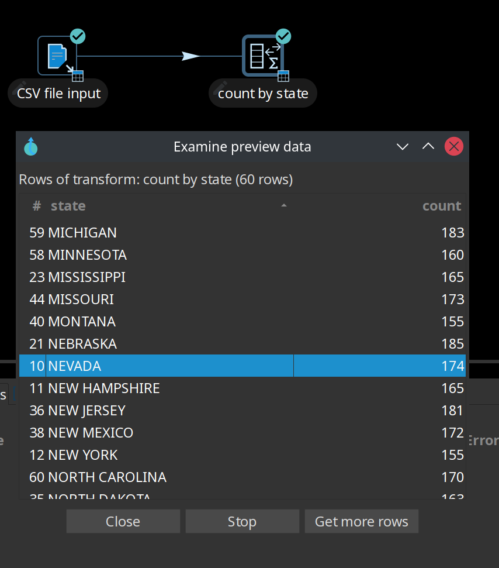
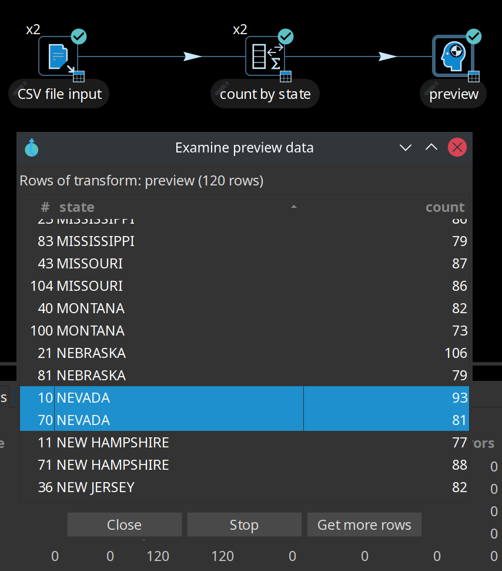
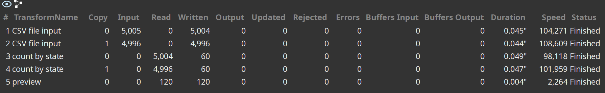
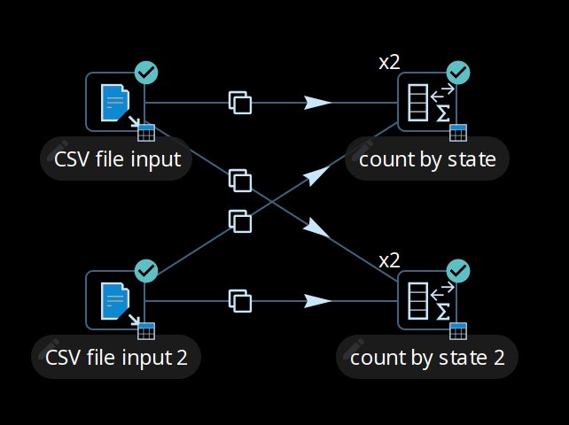
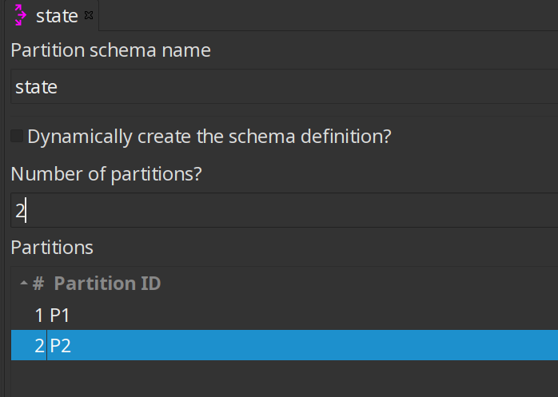
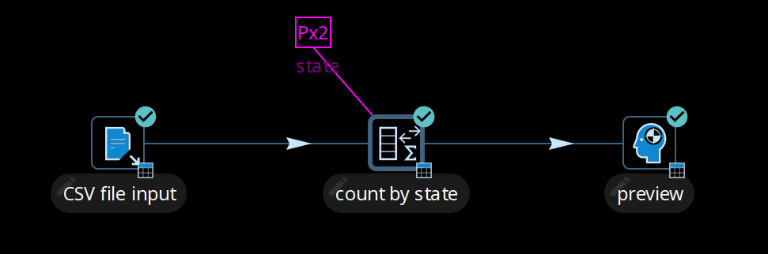
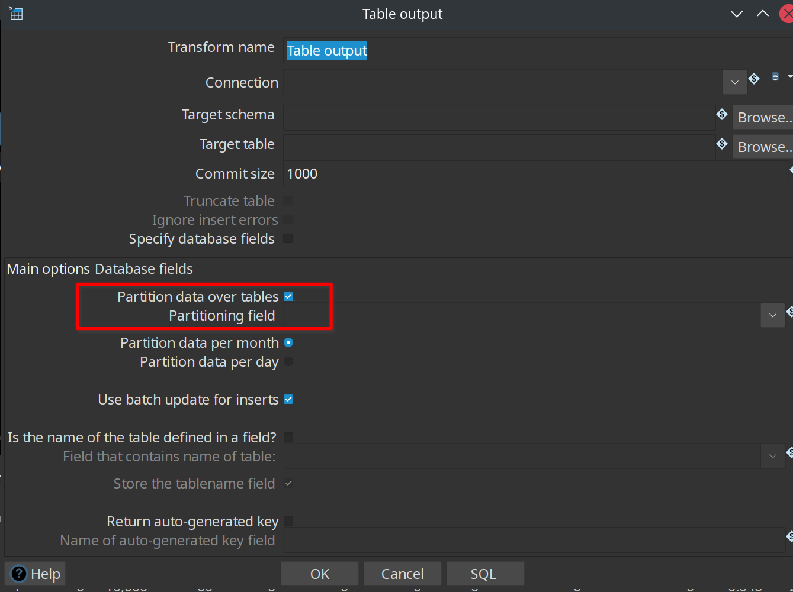
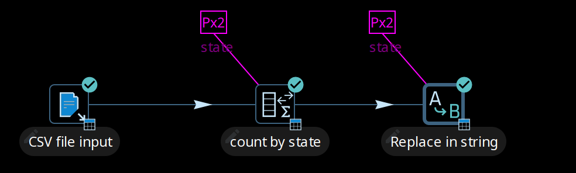
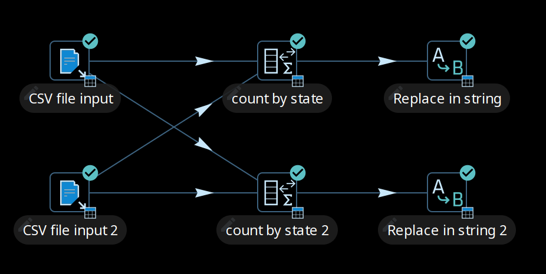

# 分区

分区允许您根据应用于表或行的规则，将数据集中的所有数据分配到不同的子集中，这些子集形成原始集合的一个分区，且没有项目被复制到多个组中。

数据分区是扩展 Hop pipeline 规模的重要功能。
向上扩展充分利用具有多 CPU 核心的单台服务器，而向外扩展则最大化并行运行的多台服务器的资源。

## 处理过程中的数据分区

默认情况下，pipeline 中的每个 transform 都在单独的线程中并行执行。
以下面的 pipeline 为例。
每个 transform 只有一个副本时，数据从 CSV file input transform 读取，然后在 count by state transform 中进行聚合。
可以通过查看预览数据来验证结果。

要利用运行配置中的处理资源，您可以使用多线程选项 `Change Number of Copies to Start` 来生成多个 transform 副本，从而向上扩展 pipeline（点击 transform 图标打开上下文对话框，在 'Data routing' 类别中选择 'Specify copies'）。

如下图所示，x2 标记表示运行时将启动两个副本。

默认情况下，从 CSV file input transform 到 count by state transform 的数据移动将以轮询顺序执行。
这意味着如果有 'N' 个副本，第一个副本获取第一行，第二个副本获取第二行，第 N 个副本获取第 N 行。
第 N+1 行再次回到第一个副本，依此类推，直到没有更多行需要分配。

从 CSV 文件读取数据是并行进行的。
然而，尝试并行聚合会产生不正确的结果，因为行被任意（没有特定规则）分配到 count by state 聚合 transform 的两个副本中，如预览数据所示。

## 理解重新分区逻辑

Transform 中的数据分布如下表所示。

如您所见，CSV file input transform 将工作分配到两个 transform 副本之间，每个副本读取 5000 行数据。
然而，这两个 transform 副本还需要确保行到达正确的 count by state transform 副本，它们以 5004/4996 的方式分配。
因此，一般规则是执行数据重新分区（行重新分配）的 transform（分区 transform 之前的非分区 transform）具有从每个源 transform 副本到每个目标 transform 副本的内部缓冲区，如下图所示。

这就是数据分区成为有用概念的地方，因为它为聚合应用了特定的基于规则的导向，将来自同一州的行导向同一个 transform 副本，使行不会被任意分配。
在下面的示例中，一个名为 State 的 [分区 schema](../06-元数据类型/partition-schema.md) 被应用到 count by state transform，并且对 State 字段应用了 Remainder of division 分区规则。
现在，count by state 聚合 transform 产生了一致正确的结果，因为行是按照分区 schema 和规则进行拆分的，如预览数据所示。

## 对表进行数据分区

Table output transform 支持将数据行分区到不同的表。
当配置为从分区字段接受表名时，PDI 客户端会将行输出到适当的表。
您还可以按月分区数据或按天分区数据。
为确保所有必要的表都存在，我们建议在单独的 pipeline 中创建它们。

## 使用分区

您使用的分区方法可以基于任何标准，可以不包含规则（轮询行分布），也可以使用分区方法 plugin 创建。
其理念是建立一个分区数据的标准，使生成的存储和处理组在逻辑上相互独立。

第一步：设置分区 schema：

. 首先，配置分区 schema。
分区 schema 定义了行流将被拆分的方式数量。
用于分区的名称可以是您喜欢的任何名称。
. 接下来，将分区 schema 应用到 Group By transform。
通过将分区 schema 应用于 transform，会自动启动一组匹配的 transform 副本（例如，如果应用具有三个分区的分区 schema，则启动三个 transform 副本）。

第二步：选择分区方法：

- 为 transform 建立分区方法，该方法定义了跨副本的行分布规则。
Remainder of division 规则允许将具有相同州值的行发送到同一个 transform 副本，并在 transform 之间分布类似的行。
如果对非整数值计算模数，Qi Hop 客户端会根据 String、Date 和 Number 值创建的校验和来计算模数。

> **📝 注意:** 当您运行 pipeline 时，无法保证哪个页面名称到哪个 transform 副本，只能保证遇到的任何页面名称都被一致地转发到同一个 transform 副本。

## 使用数据泳道

当一个分区 transform 将数据传递给具有相同分区 schema 的另一个分区 transform 时，数据保持在泳道中，因为不需要进行重新分区。
如下图所示，count by state 和 Replace in string 的 transform 副本之间不会分配额外的缓冲区（行集）。

Transform 副本之间保持隔离，数据行在泳道中流动。
不需要额外的工作来保持数据分区，因此您可以根据需要链接任意数量的分区 transform。
这将在内部按如下图所示的方式执行。

## 分区规则

当您使用分区时，用于分布、重新分区和缓冲区分配的逻辑取决于以下规则：

- 分区 transform 会导致分区 schema 中的每个分区执行一个 transform 副本。
- 当 transform 需要重新分区数据时，transform 会创建从每个源 transform 副本到每个目标 transform 副本（分区）的缓冲区（行集）。
- 当数据行从非分区 transform 传递到分区 transform 时，数据会被重新分区并分配额外的缓冲区。
- 当以相同分区 schema 分区的数据行从分区 transform 传递到另一个分区 transform 时，数据不会被重新分区。
- 当以不同分区 schema 分区的数据行从分区 transform 传递到另一个分区 transform 时，数据会被重新分区。
