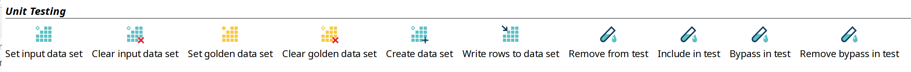
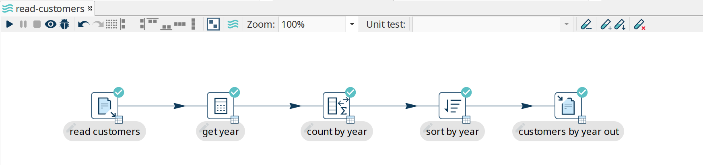
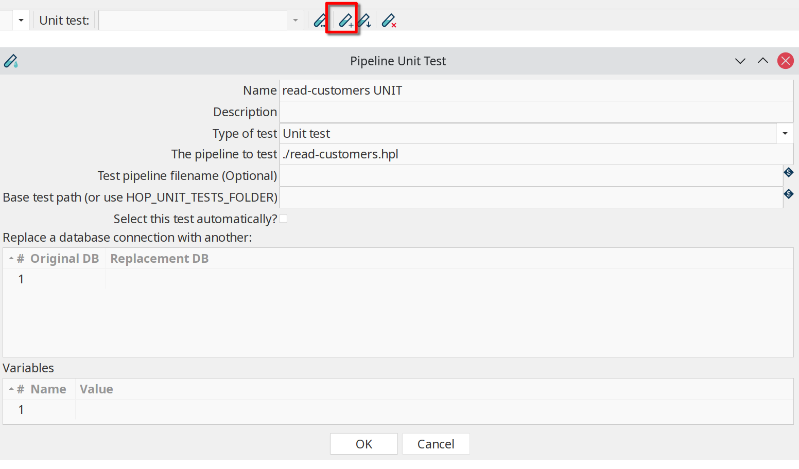
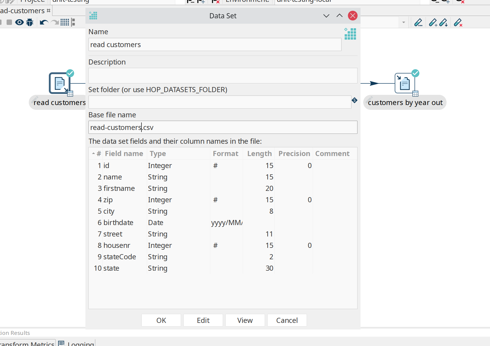
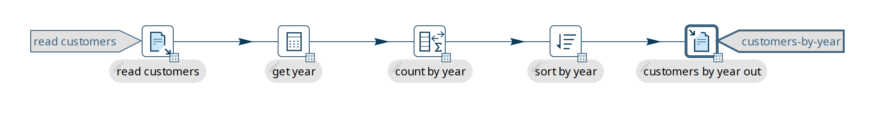
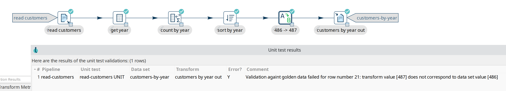
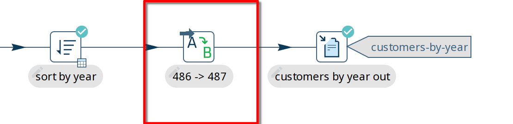
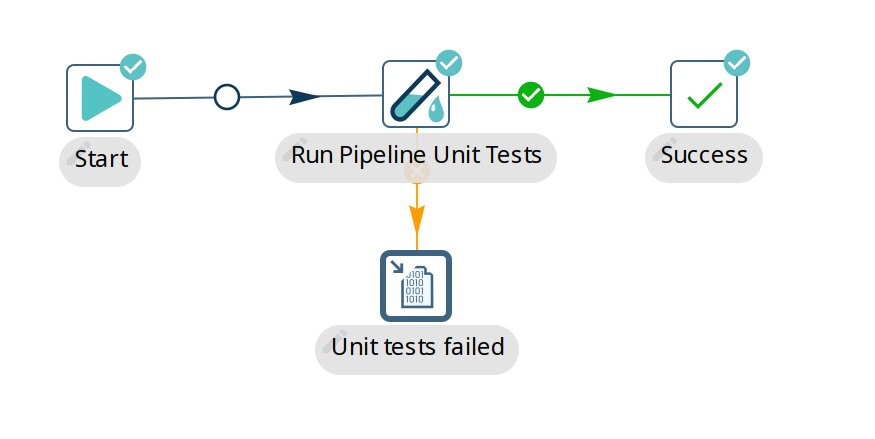
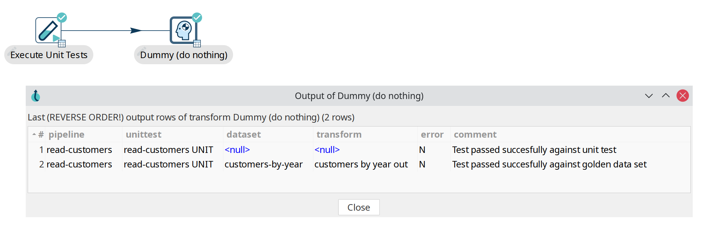

# Pipeline 单元测试

## 单元测试的必要性

Hop pipeline 处理来自各种数据源的数据，读取输入并产生输出。
Hop 单元测试以_输入数据集_的形式模拟输入，并根据_Golden 数据集_验证输出。
单元测试是零个或多个输入数据集和 golden 数据集的组合，以及您在测试前可以对 pipeline 做的一系列调整。

Hop pipeline 允许 Hop 开发者进行测试驱动开发，同时也允许执行回归测试，以确保曾经修复的旧问题保持修复状态。

Hop 单元测试可以在多种情况下加速开发：

- 没有设计时输入的 pipeline：映射、单线程器等...
- 当输入数据尚不存在、正在开发中或无法直接访问源系统时。
- 当需要很长时间才能获取输入数据、长时间运行的查询时...请注意，您可以标记一个单元测试在 pipeline 加载到 Hop Gui 时自动打开和选中。

## 单元测试的主要组件

Hop 使用以下概念（metadata 对象）来处理 pipeline 单元测试：

- 数据集：具有特定布局的一组行，存储在 CSV 数据集中。
用作输入时我们称之为输入数据集。
用于验证 transform 的输出时我们称之为 _golden_ 数据集。
- 单元测试调整：在测试期间移除或绕过 transform 的能力
- 单元测试：输入数据集、golden 数据集、调整和 pipeline 的组合。

您可以在一个单元测试中定义 0、1 或多个输入或 golden 数据集。
您可以为每个 pipeline 定义多个单元测试。

> **💡 提示:** 可以在项目对话框中指定默认数据集文件夹。
查看 'Data Sets CSV Folder (HOP_DATASETS_FOLDER)'。
默认情况下，`{openvar}HOP_DATASETS_FOLDER{closevar}` 变量的值设置为 `{openvar}PROJECT_HOME{closevar}/datasets`。

## 运行时的单元测试

当 pipeline 在 Hop Gui 中执行且选中了一个单元测试时，会发生以下操作：

- 所有标记有输入数据集的 transform 将被替换为 Injector transform
- 所有标记有 golden 数据集的 transform 将被替换为 dummy transform（什么也不做）。
- 所有标记为 "Bypass" 调整的 transform 将被替换为 dummy。
- 所有标记为 "Remove" 调整的 transform 将被移除

这些操作在 pipeline 的副本上进行，仅在内存中，除非您在单元测试对话框中指定了 hpl 文件位置。

执行后，transform 输出会与 golden 数据进行验证并记录。
如果测试中出现错误，在 Hop Gui 中运行时会弹出对话框。

## 创建单元测试

### 单元测试和数据集选项

Transform 上下文对话框（点击 transform 图标打开）中的 'Unit Testing' 类别包含可用的单元测试选项：



- **Set input data set**: 对于活动的单元测试，定义要使用的数据集，而不是 transform 的输出
- **Clear input data set**: 从此 transform 单元测试中移除已定义的输入数据集
- **Set golden data set**: 将此 transform 的输入与您选择的 golden 数据集进行比较。
- **Clear golden data set**: 为此 transform 单元测试移除已定义的输入数据集
- **Create data set**: 使用此 transform 的输出字段创建空数据集
- **Write rows to data set**: 运行当前 pipeline 并将数据写入数据集
- **Remove from test**: 当运行此单元测试时，不包含此 transform
- **Include in test**: 运行当前 pipeline 并将数据写入数据集
- **Bypass in test**: 当运行此单元测试时，绕过此 transform（用 dummy 替换）
- **Remove bypass in test**: 测试期间不要在当前 pipeline 中绕过此 transform

> **💡 提示:** 也可以从 'New' 上下文菜单或 metadata 视角创建数据集。

### 创建和添加数据集

考虑以下基本 pipeline。
此 pipeline 从 csv 文件读取数据，从出生日期中提取年份，按此年份计算行数，排序并写入文件。

我们将使用此示例创建一个测试来验证 pipeline 的输出是否符合预期。



点击单元测试工具栏中的 '+' 图标（高亮显示）来创建新单元测试。
之前创建的单元测试可从下拉框中进行编辑。



此对话框中的选项包括：

| Name | 用于此单元测试的名称 |
|---|---|
| Description | 此单元测试的描述 |
| Type of test | 'Unit test' 或 'Development' |
| The pipeline to test | 此测试适用的 pipeline。 |
| Test pipeline filename (Optional) | 用于此单元测试的文件名。 |
| Base test path (or use HOP_UNIT_TESTS_FOLDER) | 存储此单元测试的文件夹。 |
| Select this test automatically | 默认：false |
| Replace a database connection with another | 指定此 pipeline 中要替换为测试特定连接的数据库连接列表。 |
| Variables | 测试中使用的变量列表。 |

您会收到一个弹出对话框 `Do you want to use this unit test for the active pipeline '<YOUR PIPELINE NAME>?'`。
由于我们在本示例中是为活动 pipeline 创建单元测试，确认即可。

点击 'read customers' transform 图标打开上下文对话框，点击 'Create data set'。
弹出对话框的下半部分已经显示了字段布局。
为数据集指定名称和文件名。



对您要检查数据的输出 transform（示例中的 'customers by year out'）执行同样的操作。

> **💡 提示:** 查看 metadata 视角。
您现在应该有两个可用的数据集。

要将数据写入新创建的数据集，再次点击 'read customers' transform 图标，点击 'Write rows to data set'。
您会收到一个弹出对话框要求您选择数据集，然后是一个对话框，您可以在其中将 transform 输出字段映射到数据集字段。
对于此示例，只需点击 'guess'。

对 'customer by year out' transform 和数据集重复此操作。

再次点击 'read customers' transform 图标，选择 'set input data set'。
选择数据集并接受排序顺序。

对 'customers by year out' 重复此操作，但使用 'Set golden data set'。

您的 pipeline 现在有两个新指示器，分别用于输入和输出数据集。



### 运行单元测试

如果 pipeline 运行后所有测试通过，您将在日志中收到通知：

```bash
2025/04/02 21:16:43 - get year.0 - Finished processing (I=0, O=0, R=10000, W=10000, U=0, E=0)
2025/04/02 21:16:43 - count by year.0 - Finished processing (I=0, O=0, R=10000, W=22, U=0, E=0)
2025/04/02 21:16:43 - sort by year.0 - Finished processing (I=0, O=0, R=22, W=22, U=0, E=0)
2025/04/02 21:16:43 - customers by year out.0 - Finished processing (I=0, O=0, R=22, W=22, U=0, E=0)
2025/04/02 21:16:43 - read-customers - Unit test 'read-customers UNIT' passed succesfully
2025/04/02 21:16:43 - read-customers - ----------------------------------------------
2025/04/02 21:16:43 - read-customers - customers by year out - customers-by-year : Test passed succesfully against golden data set
2025/04/02 21:16:43 - read-customers - Test passed succesfully against unit test
2025/04/02 21:16:43 - read-customers - ----------------------------------------------
2025/04/02 21:16:43 - read-customers - Pipeline duration : 0.108 seconds [  0.108 ]
2025/04/02 21:16:43 - read-customers - Execution finished on a local pipeline engine with run configuration 'local'
```

如果对 pipeline 的更改导致测试失败，将弹出失败行的对话框。

在下面的示例中，1990 年的行数从 486 改为 487，导致测试失败：



成功的测试显示 'Test passed succesfully against golden data set' 和 'Test passed succesfully against unit test'，失败的单元测试可能显示以下列出的错误消息之一：

- `Incorrect number of rows received from transform, golden data set <GOLDEN_DATASET_NAME> has <GOLDEN_DATASET_ROWS> rows in it and we received <NB_ROWS_FOUND>`
- `Validation against golden data failed for row number <ROW_NUMBER>, field <FIELD_NAME>: transform value [<FIELD_VALUE>] does not correspond to data set value [<GOLDEN_DATASET_VALUE>]`

### 在单元测试中移除和绕过 transform

在开发 pipeline 时，您经常需要移除或禁用 pipeline 中的 transform。
我们可以在单元测试中做同样的操作。

在我们的示例中，我们可能想要移除或绕过导致测试失败的 transform（'486 -> 487'）。
点击 transform 图标并选择 'Bypass in Test' 或 'Remove from test'。
在测试中绕过 transform 会在执行测试时用 Dummy transform 替换该 transform。
顾名思义，'Remove from test' 会将 transform 从测试 pipeline 中移除，就像您从 pipeline 中移除 transform 一样。

在绕过 transform 的情况下，您的 pipeline 将如下图所示（'Remove' 会在 transform 图标上添加类似的图标，将其划掉）。



## 自动化单元测试执行

### 在 Workflow 中运行单元测试

有一个名为 "Run Pipeline Unit Tests" 的 workflow action，可以执行特定类型的所有已定义单元测试。
Transform 的输出可以通过常规 Hop transform 以任何格式或位置存储。
通过 hop-run、在调度器中或通过例如 Jenkins 的 CI/CD pipeline 执行 workflow。

使用此 action 中的 'Get test names' 来指定要在 workflow 中包含哪些可用的单元测试。



在 workflow 日志输出中，您会找到关于单元测试退出状态的信息：

```bash
2025/04/02 10:05:23 - read-customers - Unit test 'read-customers UNIT' passed succesfully
2025/04/02 10:05:23 - read-customers - ----------------------------------------------
2025/04/02 10:05:23 - read-customers - customers by year out - customers-by-year : Test passed succesfully against golden data set
2025/04/02 10:05:23 - read-customers - Test passed succesfully against unit test
2025/04/02 10:05:23 - read-customers - ----------------------------------------------
2025/04/02 10:05:23 - read-customers - Pipeline duration : 0.227 seconds [  0.227" ]
```

### 在 Pipeline 中运行单元测试

与 workflow action 类似，有一个 transform 可以运行您的单元测试：



## 示例

Qi Hop 项目每天运行数百个集成测试来测试 Qi Hop 功能。许多集成测试使用了单元测试。

我们 GitHub 上 [`integration-tests`](https://github.com/apache/hop/tree/main/integration-tests) 文件夹中的每个子文件夹都是一个独立的 Qi Hop 项目，可以添加到 Hop Gui 中打开（查看 `project-config.json`）。这些项目中提供了基本的环境配置文件 `dev-env-config.json`，可以添加到您的项目中。

例如，您可以将 [`transforms`](https://github.com/apache/hop/tree/main/integration-tests/transforms) 文件夹作为项目添加到本地 Qi Hop 安装中，并运行可用的 pipeline 以了解更多关于 Qi Hop 中单元测试的信息。
