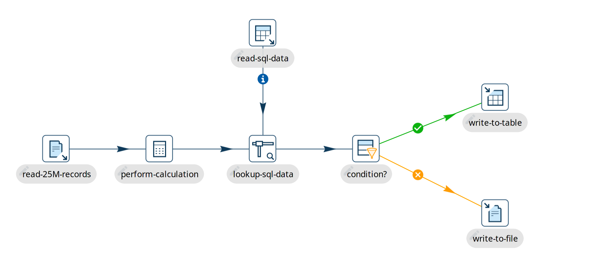

# Pipeline

## Pipeline 概述

Pipeline 和 workflow 一起是 Hop 中的主要构建块。Pipeline 执行繁重的数据工作：在 pipeline 中，您从一个或多个数据源读取数据，执行一系列操作（连接、查找、过滤等等），最后将处理后的数据写入一个或多个目标平台。

Pipeline 是由 hop 连接的 [transform](transforms.md) 网络。就像 workflow 中的 [action](../08-工作流/actions.md) 一样，每个 transform 都是一个小功能单元。多个 transform 的组合使 Hop 开发者能够构建强大的数据处理解决方案，并与 workflow 结合构建编排解决方案。

尽管有一些视觉上的相似之处，workflow 和 pipeline 的运行方式截然不同。

Pipeline 的核心原则：

- Pipeline 是网络。Pipeline 中的每个 transform 都是网络的一部分。
- Pipeline 并行运行其所有 transform。所有 transform 同时启动和处理数据。在一个简单的 pipeline 中，您从大文件读取数据，进行一些处理，最后写入数据库表，当您已经向数据库加载数据时，通常仍在从文件读取数据。
- 数据通过 hop 在 pipeline 中的各个 transform 之间流动。与 workflow hop 不同，pipeline hop 通常没有退出状态。Pipeline 确实有一些路由能力，例如通过 [Filter Rows](../03-转换插件/流程控制类/filterrows.md) transform 和[错误处理](errorhandling.md)，但核心 pipeline 原则仍然适用：pipeline 是一个网络，数据并行地在网络中流动。

## Pipeline 示例详解

下面的示例展示了一个非常基本的 pipeline。当我们运行此 pipeline 时会发生以下事情：

- 该 pipeline 有 7 个 transform。当我们启动 pipeline 时，所有 7 个 transform 都会被激活。
- "read-25M-records" transform 开始从文件读取数据，并将该数据推送到下游的 "perform-calculations" 和后续 transform。由于读取 2500 万条记录需要一些时间，当我们仍在从文件读取记录时，一些数据可能已经完成了处理。
- "lookup-sql-data" 将我们从文件读取的数据与从 "read-sql-data" transform 检索的数据进行匹配。[Stream Lookup](../03-转换插件/查找与连接类/streamlookup.md) 接受来自 "read-sql-data" 的输入，这在 hop 上以信息图标  显示。
- 一旦文件和 sql 查询的数据匹配完成，我们使用 [Filter Rows](../03-转换插件/流程控制类/filterrows.md) transform 在 "condition?" 中检查条件。此数据的输出传递给 "write-to-table" 或 "write-to-file"，具体取决于条件结果为 true 还是 false。

## 后续步骤

Pipeline 是一个广泛的话题。查看以下页面以了解更多关于使用 pipeline 的信息：

- [Pipeline 编辑器](hop-pipeline-editor.md)
- [创建 Pipeline](create-pipeline.md)
- [运行、预览和调试 Pipeline](run-preview-debug-pipeline.md)
- [Pipeline 运行配置](pipeline-run-configurations.md)
- [Metadata Injection](../13-最佳实践与技巧/metadata-injection.md)
- [分区](partitioning.md)
- [Apache Beam 入门](../11-Beam引擎/getting-started-with-beam.md)
- [Transform](transforms.md)
