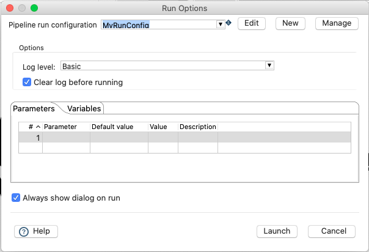
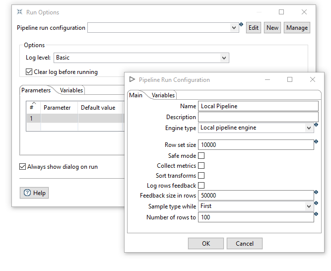
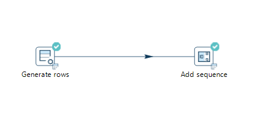
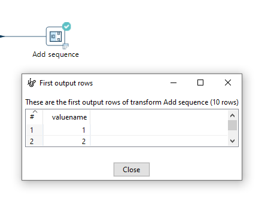
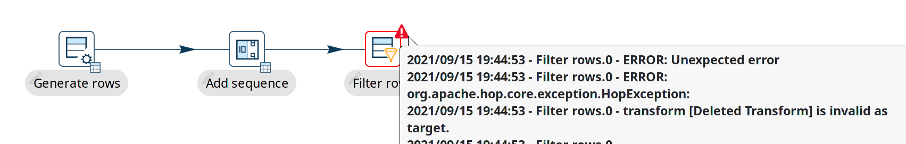
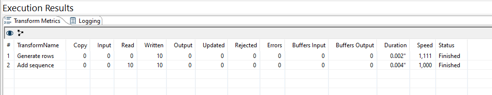
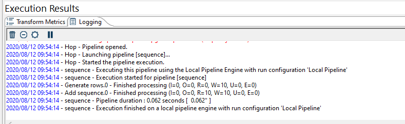
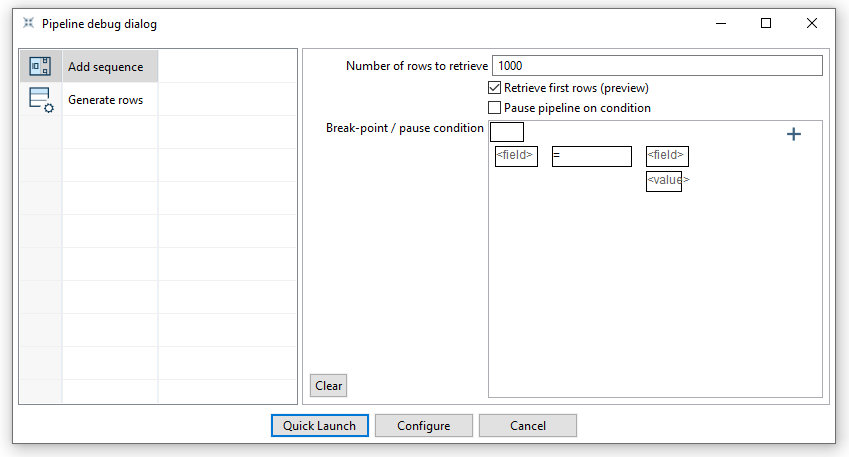

# 运行、预览和调试 Pipeline

## 运行 Pipeline

运行 pipeline 以查看其执行情况可以通过完成以下任务之一来实现：

- 使用 Run  图标
- 从顶部菜单选择 Run 和 Start execution
- 按 F8

在 pipeline 运行对话框中，点击右上角的 'New' 按钮创建新的 'Pipeline run configuration'。

在弹出的对话框中，添加 'Local Pipeline' 作为 pipeline 配置名称，并选择 'Local pipeline engine' 作为引擎类型。

点击 'Ok' 返回 pipeline 运行对话框。

选择如下所述的日志级别。

| LogLevel | 说明 |
|---|---|
| Nothing | 不记录任何日志输出。 |
| Error | 仅在日志输出中记录错误。 |
| Minimal | 仅使用最小日志。 |
| Basic | 这是默认日志级别。 |
| Detailed | 此日志级别提供详细的日志输出。 |
| Debugging | 产生用于调试目的的非常详细的输出。 |
| Row Level | 行级别日志。 |

确保选中了您的配置并点击 'Launch'。

当 pipeline 成功运行后，transform 的右上角会显示绿色勾号。

Transform 还显示一个小表格图标，让您可以访问该 transform 结果的预览。

当 pipeline 失败时，失败的 transform 右上角会显示红色三角形。
将鼠标悬停在红色错误三角形上可以快速查看错误消息。完整的堆栈跟踪可在日志中查看。查看[pipeline 错误处理](pipeline/errorhandling.md)了解如何优雅地处理 pipeline 中的错误（这不一定总是您想要的）。

每次运行后，执行结果显示在窗口底部的面板中。
执行结果包含两个标签页：

- Transform Metrics
- Logging

Transform Metrics 标签页按 transform 显示指标。

显示以下指标：

> **💡 提示:** 此表中的指标可以通过标准 pipeline 捕获和处理（例如写入数据库表或 Apache Kafka 主题），使用 [Pipeline Log](metadata-types/pipeline-log.md)

> **⚠️ 警告:** 此表中可用的指标取决于您的 Pipeline 运行配置。
[本地 pipeline engine](pipeline/pipeline-run-configurations/native-local-pipeline-engine.md) 始终实时显示这些指标。

| 指标 | 说明 |
|---|---|
| Copy | 这些指标适用的 transform 副本。详见[指定副本](pipeline/specify-copies.md) |
| Input | 从输入源（如文件、关系型或 NoSql 数据库等）读取的行数 |
| Read | 来自前一个 transform 的行数 |
| Written | 离开此 transform 向下一个 transform 的行数 |
| Output | 写入输出目标（如文件、关系型或 NoSql 数据库等）的行数 |
| Updated | 在输出目标（如文件、关系型或 NoSql 数据库等）中被 transform 更新的行数 |
| Rejected | 被 transform 拒绝并转移到错误处理 transform 的行数 |
| Errors | 此 transform 执行中未被转移到错误处理 transform 的错误数量（在 transform 上以红色错误三角标记） |
| Buffers Input | 此 transform 输入缓冲区中的行数（仅在执行期间可以大于 0） |
| Buffers Output | 此 transform 输出缓冲区中的行数（仅在执行期间可以大于 0） |
| Duration | 此 transform 的执行持续时间 |
| Speed | 此 transform 的执行速度（每秒行数）。这接近于此 transform 处理（写入或输出）的行数除以持续时间（由于持续时间的舍入不完全精确） |
| Status | Transform 状态：Running、Stopped、Finished、 |

Logging 标签页根据执行时选择的日志级别显示 pipeline 的日志。

## 预览和调试 Pipeline

要在控制执行暂停的同时检查 pipeline 数据，请使用 **Preview & debug**（工具栏、Run 菜单或 transform 操作）。这会打开一个用于预览行和可选断点行为的单一对话框。

您可以通过以下任何方式启动：

- 使用 pipeline 工具栏上的 preview  图标
- 从顶部菜单选择 **Run** 和 **Preview & debug**
- 从 transform 操作菜单选择 **Preview & debug output**
- 运行 pipeline 后点击右下角的小图标

在对话框中，选择要检查行的 transform。
设置要检索的行数（**Retrieve first rows**），并可选择启用 **Pause on breakpoint** 并定义**条件**，使 pipeline 在该条件匹配行时暂停。
完成后按 **Quick Launch**。
要更改 pipeline 运行配置，点击 **Configure**。

执行暂停或完成时，收集的行将显示在预览窗口中。

