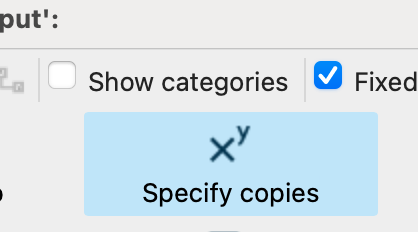
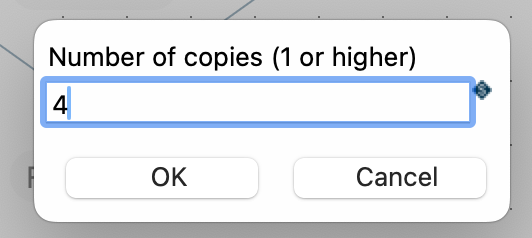
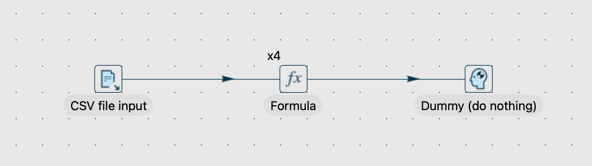
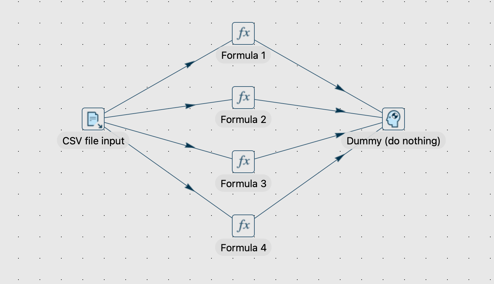
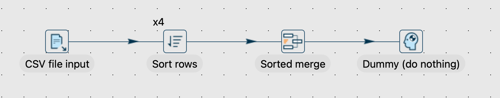

# 指定副本

[Hop Gui 弹出对话框](hop-gui/hop-gui-popup-dialog.md) 中的 `Specify copies` 选项是一个强大的选项，允许 pipeline 开发者以多个副本运行 transform。

为 transform 设置多个副本会为此 transform 生成多个线程，如果正确使用，可以提高 pipeline 的性能。

> **⚠️ 警告:** 增加 transform 的副本数量不是银弹或 `performance=fast` 选项。过度使用 `specify copies` 选项很容易使您的 pipeline 性能变差而不是更好。

## 更改 Transform 的副本数量

点击 transform 图标，然后在弹出对话框中点击 `Specify copies` 图标。

在弹出的对话框中更改所选 transform 的副本数量：

您的 transform 现在将在图标左上角显示您指定的副本数量。

当您的 pipeline 启动时，Qi Hop 将在后台为此 transform 创建指定数量的副本。上面示例中的 pipeline 执行时将如下图所示。

## 使用场景

为 pipeline 中有限数量的 transform 增加副本数量可以帮助提高 pipeline 的性能，但此选项应谨慎使用。

您的 CPU 或核心可以处理的线程数量是有限的。增加副本数量（从而增加线程）很容易超过系统的处理能力，产生与您想要达到的效果相反的结果。

没有硬性规则，请使用常识来决定何时（不）增加 transform 的副本数量。

以下是一些指导原则，用于判断是否为 transform 使用多个副本是有意义的：

- 是否存在性能问题？如果您的 pipeline 足够快，则不需要为任何 transform 使用多个副本。
- 识别 pipeline 中最慢的 transform。在 Hop Gui 中执行期间，作为瓶颈的 transform 会获得虚线边框。这些瓶颈 transform 是否受 CPU 限制？
如果 CPU 不是瓶颈，增加副本数量将无济于事。
- 为例如关系型数据库 transform（如 [Table output](pipeline/transforms/tableoutput.md)）增加副本数量取决于您使用的技术。某些数据库可以处理多个线程（事务）。请查看您数据架构中技术的文档。
- 以下一些 transform 可能会消耗大量 CPU，使用多个副本可能会有更好的性能。再次强调：如果没有性能问题或这些 transform 不是 pipeline 中的瓶颈，则不需要增加副本数量。
** [Calculator](pipeline/transforms/calculator.md)
** [Formula](pipeline/transforms/formula.md)
** [Javascript](pipeline/transforms/javascript.md)
** [Script](pipeline/transforms/script.md)
** [Sort rows](pipeline/transforms/sort.md)
** [User defined Java class](pipeline/transforms/userdefinedjavaclass.md)
** [User defined java expression](pipeline/transforms/userdefinedjavaexpression.md)

> **💡 提示:** 与任何性能优化实践一样，做微小的更改并在应用任何更改前后测量性能。

特别提醒：当在 [Sort rows](pipeline/transforms/sort.md) transform 上使用多个副本时，您**需要**添加一个 [Sorted merge](pipeline/transforms/sortedmerge.md) transform，如下面的截图所示。您的 `Sort rows` transform 的多个副本将各自排序流的一部分。`Sorted merge` transform 将每个 `Sort rows` 副本的（已排序）输出合并为一个完全排序的输出流。

