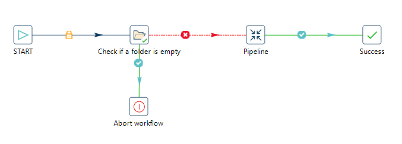
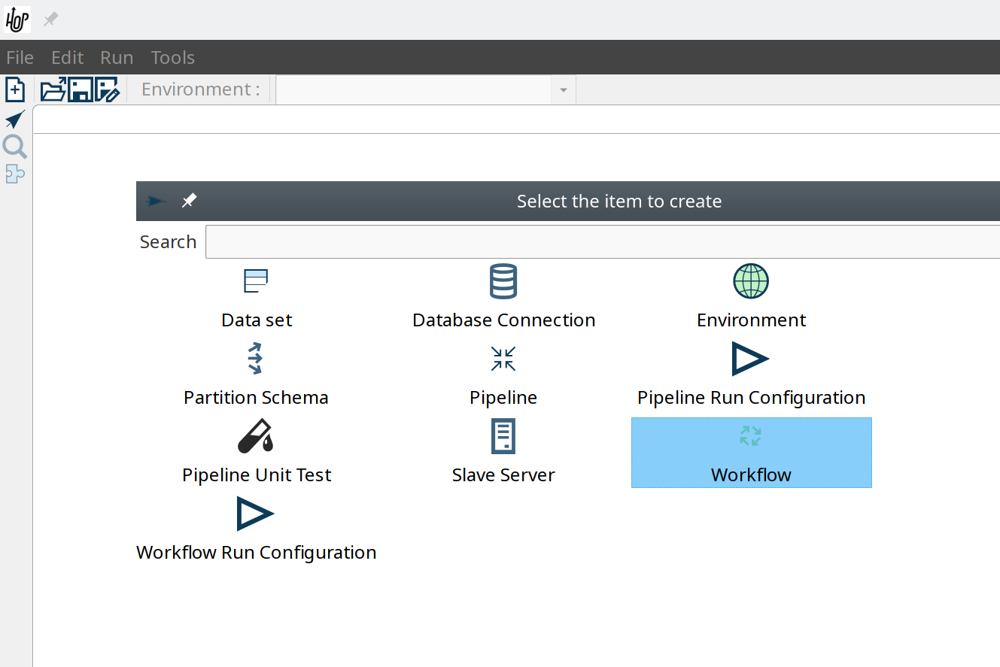
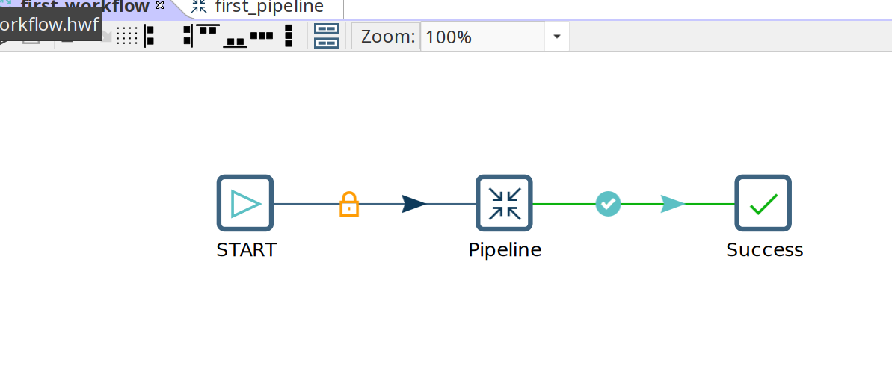
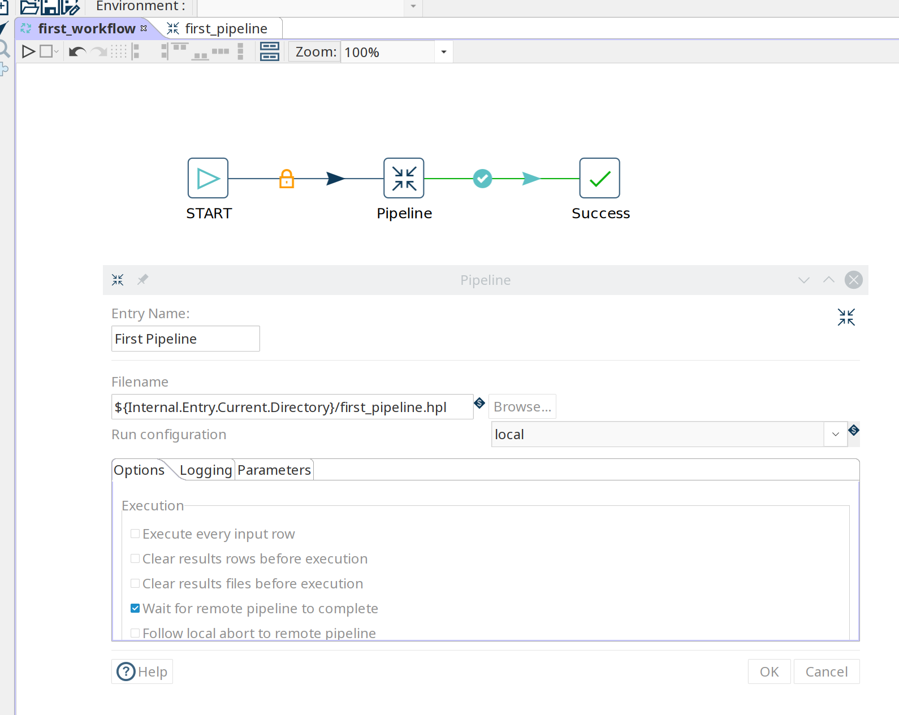
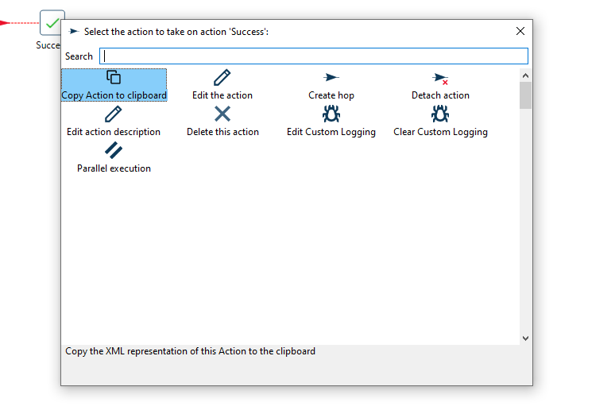
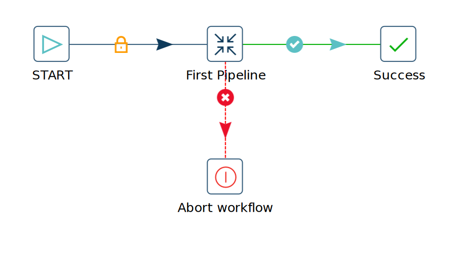
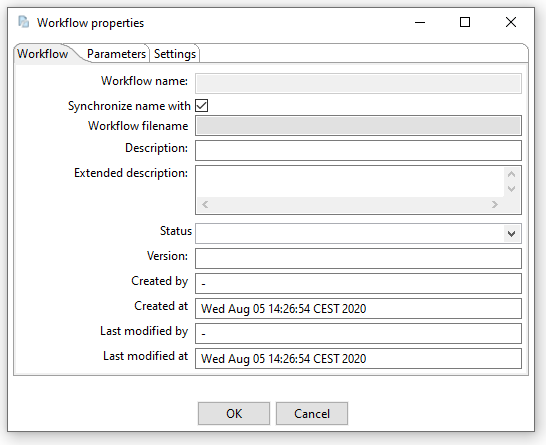
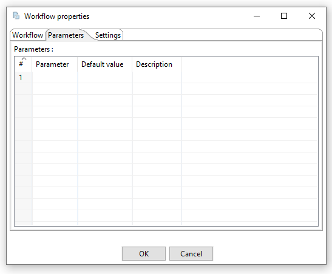
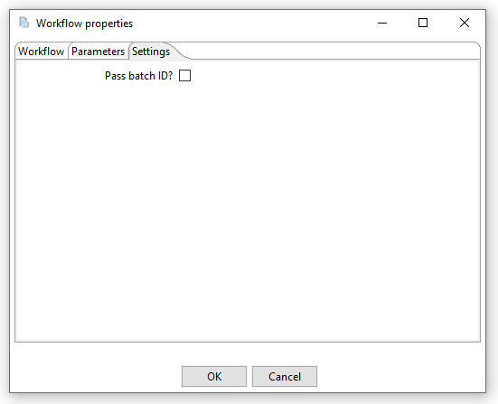

# 创建 Workflow

Workflow 是在起点和终点之间编排各种 action 的流程。
这些 action 可以是但不限于：

- 执行其他 workflow
- 执行 pipeline
- 文件处理
- 错误消息处理
- 通知处理

下面显示了一个简单的 workflow。此 workflow 将检查文件夹是否为空，如果不为空则执行一个 pipeline。

## 概念

Workflow 由通过 hop 连接的 action 组成。
在邮件示例中，'Start'、'Check if a folder is empty'、'Pipeline'、'Success' 和 'Abort workflow' 都是 action。

- **action** 是 workflow 中的基本操作。
一个 workflow 通常由通过 hop 链接在一起的 action 组成。

- **hop** 将 action 连接在一起。
可以通过点击 hop 或右键 -> 禁用来禁用 hop。

## 创建

Workflow 的设计和执行与 pipeline 非常相似。
但是，请记住 Hop 在底层处理 workflow 和 pipeline 的方式有显著差异。

要创建 workflow，点击 'new' 图标或按 'CTRL-N'。
从弹出对话框中选择 'New workflow'。

完成 workflow 后，保存它。
可以通过文件菜单、图标或使用 CTRL s 或 Command s 来完成。
对于新 workflow，会显示文件浏览器以导航到您要存储文件的位置。

## 向 Workflow 添加 Action

将以下 action 添加到您的 workflow 并创建 hop 连接它们：

- Start
- Pipeline
- Success

双击或单击并选择 'Edit action' 来配置您刚创建的 pipeline action。

在 pipeline 对话框中，使用 'Browse' 按钮选择您的 pipeline 并为 action 指定一个合适的名称，例如 'First Pipeline'。

点击 'OK'。

通过单击对象可以配置 action 对象。
将根据您的 action 对象显示如下所示的菜单。

| 操作 | 说明 |
|---|---|
| Copy Action to clipboard | 将选中的 action 复制到剪贴板。 |
| Edit the action | 编辑选中的 action。 |
| Create hop | 从选中的 action 创建 hop。 |
| Deteach action | 将 action 从 workflow 分离。 |
| Edit action description | 编辑 action 的描述。 |
| Delete this action | 从 workflow 删除 action |
| Edit Custom Logging | 编辑此 workflow 的自定义日志设置。 |
| Clear Custom Logging | 清除自定义日志设置。 |
| Parallel execution | 并行执行后续 action。 |

请注意，workflow 中的 hop 与您在 pipeline hop 中看到的略有不同。

添加第四个 action 'Abort' 并从您的 pipeline action 创建 hop。

注意您的 pipeline 和 Abort 之间的 hop 与 pipeline 和 Success 之间的 hop 不同。
Workflow 中使用的 hop 类型如下所列。

| Hop | 图标 | 说明 |
|---|---|---|
| Unconditional hop | 锁图标，黑色 hop | 无论前一个 action 的退出代码（true/false）是什么，无条件 hop 都会被执行 |
| Success hop | 勾号图标，绿色 hop | 当前一个 action 成功执行时使用 success hop。 |
| Failure hop | 错误图标，红色 hop | 当前一个 action 失败时执行 failure hop。 |

> **📝 注意:** 可以通过点击 hop 的图标来更改 hop 类型。

## Workflow 属性

Workflow 属性是描述 workflow 并配置其行为的属性集合。

双击 workflow 画布可以打开属性对话框。

可以配置以下属性：

- Workflow
- Parameters
- Settings

Workflow 标签页允许您指定关于 workflow 的一般属性，包括：

| 属性 | 说明 |
|---|---|
| Workflow name | Workflow 的名称 |
| Synchronize name with filename | 如果启用此选项，文件名和 workflow 名称将同步。 |
| Workflow filename | Workflow 的文件名 |
| Description | Workflow 的简短描述 |
| Extended description | Workflow 的详细扩展描述 |
| Status | 草稿或生产状态 |
| Version | 版本描述 |
| Created by | 显示 workflow 的原始创建者 |
| Created at | 显示 workflow 创建的日期和时间。 |
| Last modified by | 显示最后修改 workflow 的用户 |
| Last modified at | 显示 workflow 最后修改的日期和时间。 |

Parameters 标签页允许您指定特定于 workflow 的参数。
参数由名称、默认值和描述定义。

Settings 标签页允许您传递批处理 ID。

