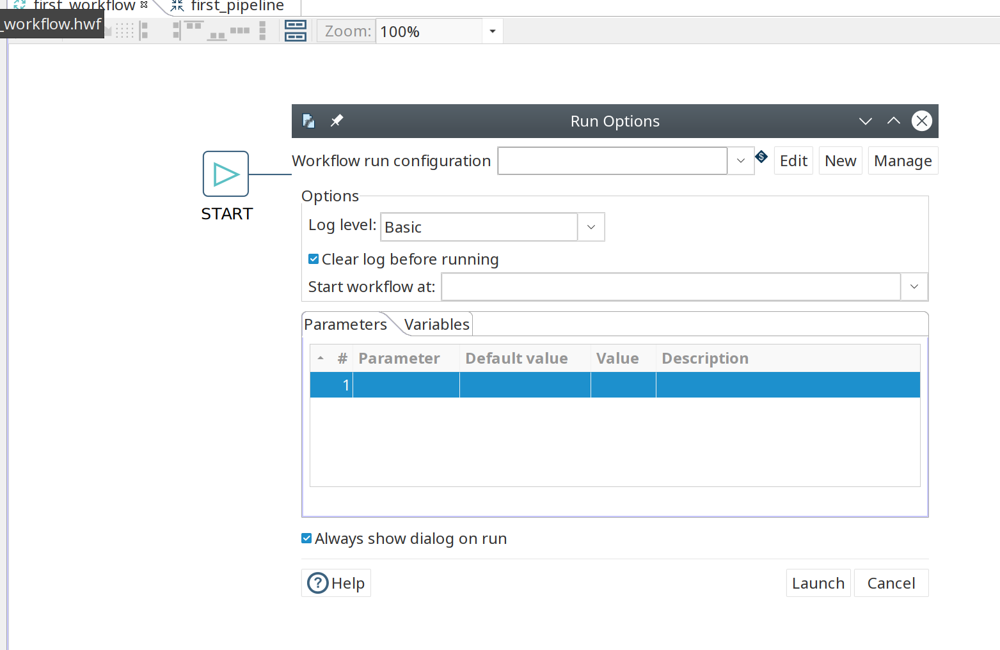
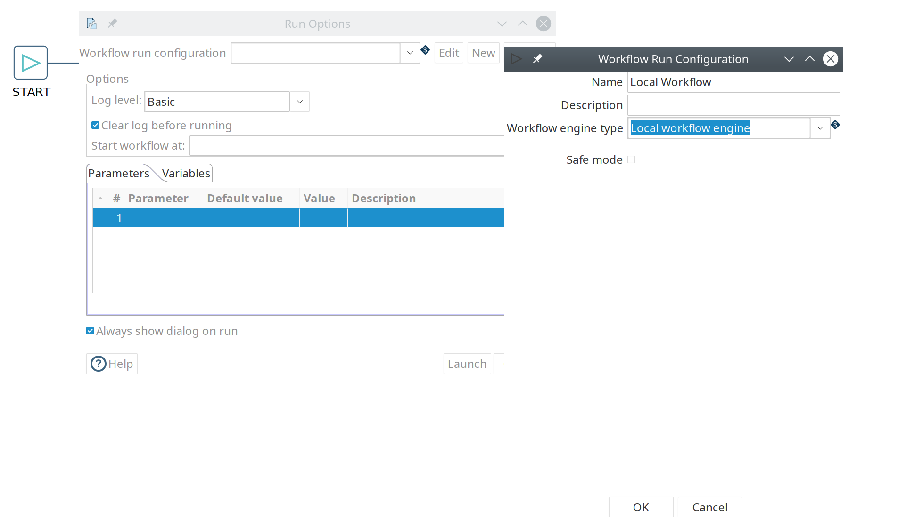
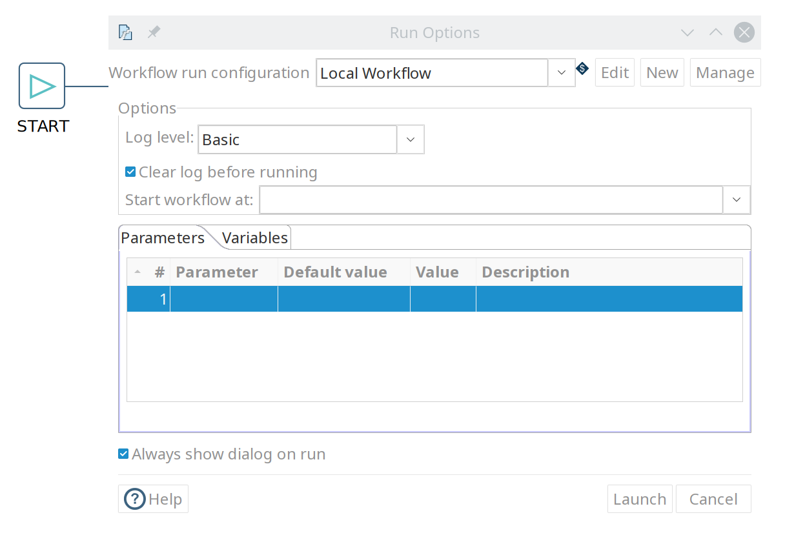

# 运行和调试 Workflow

## 运行您的第一个 Workflow

与设计 workflow 一样，运行 workflow 的步骤与运行 pipeline 非常相似。

在您的 workflow 工具栏中点击 'run' 按钮 

在 workflow 运行对话框中，点击右上角的 'New' 按钮创建新的 'Workflow run configuration'。

在弹出的对话框中，添加 'Local Workflow' 作为 workflow 配置名称，并选择 'Local workflow engine'。

点击 'OK' 返回 workflow 运行对话框。

选择如下所述的日志级别。

| LogLevel | 说明 |
|---|---|
| Nothing | 不记录任何日志输出。 |
| Error | 仅在日志输出中记录错误。 |
| Minimal | 仅使用最小日志。 |
| Basic | 这是默认日志级别。 |
| Detailed | 此日志级别提供详细的日志输出。 |
| Debugging | 产生用于调试目的的非常详细的输出。 |
| Row Level | 行级别日志。 |

确保选中了您的配置并点击 'Launch'。

这个包含我们非常基本的 pipeline 的 workflow 应该在不到一秒的时间内执行完成。
您现在将看到执行结果面板，它看起来与 pipeline 执行结果非常相似。
