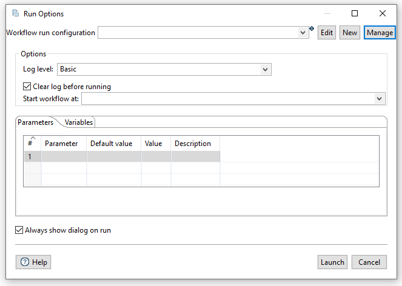

# Workflow 运行配置

## 说明

运行配置将 Hop workflow 开发的设计阶段和执行阶段解耦。
Workflow 是数据_如何_处理的定义，运行配置定义了 workflow _在哪里_执行。
Hop 支持多种不同的运行时引擎，每种引擎将在本节中更详细地描述。
每种运行配置都有自己的参数和配置选项，所有这些都作为 Hop Metadata 存储。

## 选择运行配置

启动新 workflow 时，点击 'Workflow run configuration' 旁边的 **New**。
所有运行配置都有一个名称、描述和引擎类型，每种引擎类型都有自己的配置选项。

创建后，运行配置可从 'Workflow run configuration' 列表中获取，随时可用。

## 选项

此标签页包含名称、描述和 workflow 引擎类型的下拉列表。

| 选项 | 说明 |
|---|---|
| Name | 您要用于此 workflow 运行配置的名称。 |
| Description | 您要用于此 workflow 运行配置的描述（可选）。 |
| Execution information location | 用于此 workflow 运行配置的 [metadata-types/execution-information-location.adoc](../06-元数据类型/execution-information-location.md)。 |
| Engine type |  |
