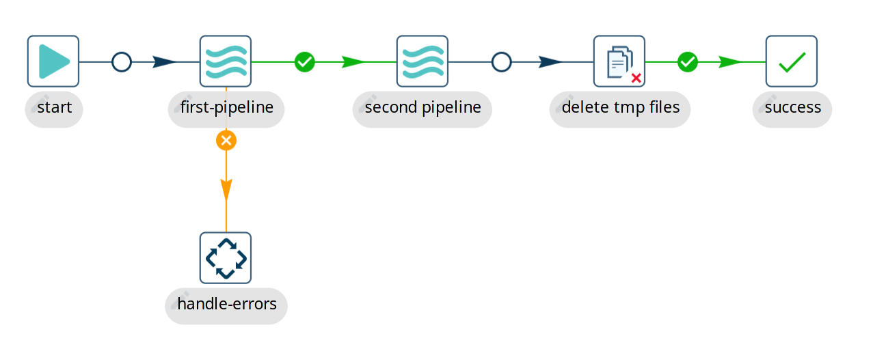

# Workflow

## Workflow 概述

Workflow 是 Qi Hop 中的核心构建块之一。Pipeline 负责繁重的数据处理工作，而 workflow 负责编排工作：准备环境、获取远程文件、执行错误处理以及执行子 workflow 和 pipeline。

Workflow 由一系列通过 hop 连接的 [action](workflow/actions.md) 组成。就像 [pipeline](pipeline/pipelines.md) 中的 [transform](pipeline/transforms.md) 一样，每个 action 都是一个小功能单元。多个 action 的组合使 Hop 开发者能够构建强大的数据编排解决方案。

尽管有一些视觉上的相似之处，workflow 和 pipeline 的运行方式截然不同。

- Workflow 执行编排任务。Workflow 中的 action 通常不直接操作数据（尽管您_可以_通过例如 [SQL](workflow/actions/sql.md) 更改数据）。
- Workflow 有一个（且只有一个）必填的起始点（[Start](workflow/actions/start.md) action），但可以有多个结束 action。
- Workflow 可以
- Workflow 默认按顺序工作。Workflow 中的每个 action 在 workflow 序列中都有一个位置，需要等待前一个 action 完成后才能开始。
- Workflow action 不通过 hop 传递数据。每个 workflow action 都有一个 `success` 或 `failure` 退出状态。此退出状态用于选择通过 workflow 的路由。
- Workflow 中 action 之间的 hop 有一个状态：根据前一个 action 的退出状态，workflow hop 可以跟随 success（绿色）、failure（橙色）或 unconditional（黑色）hop。无条件 hop 忽略前一个 action 的退出状态，无论前一个 action 失败还是成功都会被执行。

## Workflow 示例详解

与所有 workflow 一样，下面显示的示例 workflow 以 `start` action 开始。

Start action 只是一个占位符，不会真正失败，因此从 start action 出来的 hop 是无条件的。

Workflow 然后继续执行一个 [pipeline](workflow/actions/pipeline.md) action "first-pipeline"。顾名思义，此 action 执行一个 pipeline。

如果 "first-pipeline" 成功运行，workflow 继续到 "second-pipeline"。如果 "first-pipeline" 失败，则跟随到 "handle-errors" 的 failure hop。

在这个假设的示例中，我们不关心 "Second pipeline" 的结果，想要继续到 "delete-tmp-files"，在那里删除任何临时文件。

如果临时文件成功删除，我们进入 "success" action。与 Start action 类似，success 是此部分 workflow 成功完成的视觉指示。它不是必需的，也不添加任何功能，但它通常是 workflow 主流结束点的良好视觉指示。

## 后续步骤

以下页面将带您更深入地了解构建和运行 workflow 的过程：

** [创建 Workflow](workflow/create-workflow.md)
** [运行和调试 Workflow](workflow/run-debug-workflow.md)
** [Workflow 运行配置](workflow/workflow-run-configurations/workflow-run-configurations.md)
