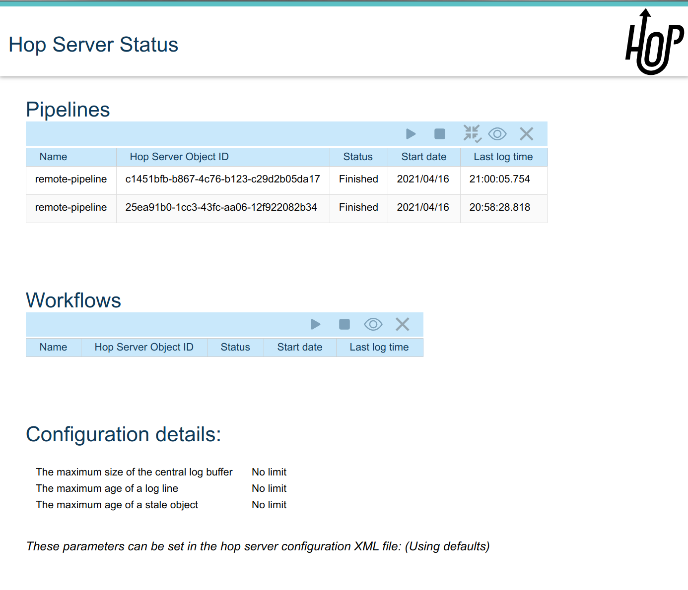

# Hop Server

Hop Server 是一个轻量级服务器，用于通过 [Remote pipeline](pipeline/pipeline-run-configurations/native-remote-pipeline-engine.md) 或 [Remote workflow](workflow/workflow-run-configurations/native-remote-workflow-engine.md) 运行配置来运行 workflow 和 pipeline。

## 启动和停止 Hop Server

### 一般用法

Hop Server 在 Hop 安装目录中以脚本形式提供。

不带任何参数运行 Hop Server 可显示其用法选项。
在 Windows 上是 `hop-server.bat`，在 Mac 和 Linux 上运行 `./hop-server.sh`。

&nbsp;
.Usage

=====

```bash
Usage: <main class> [-ahV] [-gs] [-e=<environmentOption>] [-id=<id>]
                    [-j=<projectOption>] [-l=<level>] [-n=<serverName>]
                    [-p=<password>] [-ps=<pipelineName>] [-u=<username>]
                    [-ws=<workflowName>] [-s=<systemProperties>[,
                    <systemProperties>...]]... [<parameters>...]
Run a Hop server
      [<parameters>...]   One XML configuration file or a hostname and port
  -a, --auth              Does the Hop web server have authentication enabled
  -e, --environment=<environmentOption>
                          The name of the lifecycle environment to use
  -gs, --general-status
                          List the general status of the server
  -h, --help              Show this help message and exit.
      -id=<id>            Specify the ID of the pipeline or workflow to query
  -j, --project=<projectOption>
                          The name of the project to use
  -l, --level=<level>     The debug level, one of NOTHING, ERROR, MINIMAL,
                            BASIC, DETAILED, DEBUG, ROWLEVEL
  -n, --server-name=<serverName>
                          The name of the server to start as defined in the
                            metadata.
  -p, --password=<password>
                          The server password.  Required for administrative
                            operations only, not for starting the server.
  -ps, --pipeline-status=<pipelineName>
                          List the status of the pipeline with this name (also
                            specify the -id option)
  -s, --system-properties=<systemProperties>[,<systemProperties>...]
                          A comma separated list of KEY=VALUE pairs
  -u, --userName=<username>
                          The server user name.  Required for administrative
                            operations only, not for starting the server.
  -V, --version           Print version information and exit.
  -ws, --workflow-status=<workflowName>
                          List the status of the workflow with this name (also
                            specify the -id option)
```

可用的 Hop Server 选项如下：

| 简写 | 完整选项 | 描述 |
|---|---|---|
| -h |  |  |
| --help |  |  |
| 此帮助文本 |  |  |
| -a |  |  |
| --auth |  |  |
| 默认：true |  |  |
| -p |  |  |
| --password |  |  |
| 服务器密码。 |  |  |
| -u |  |  |
| --userName |  |  |
| 服务器密码。 |  |  |
| -s |  |  |
| --system-properties |  |  |
| 手动设置系统环境变量。 |  |  |
| -e |  |  |
| --environment |  |  |
| 启动前要启用的项目生命周期环境名称。 |  |  |
| -n |  |  |
| --server-name |  |  |
| 要启动的服务器 metadata 对象名称，必须与 -e 结合使用以知道从哪个环境加载 |  |  |
| -j |  |  |
| --project |  |  |
| 启动前要启用的项目名称。 |  |  |
| -gs |  |  |
| --general-status |  |  |
| 列出服务器的一般状态。 |  |  |
| -ps |  |  |
| --pipeline-status |  |  |
| 列出具有该名称的 pipeline 的状态（还需指定 -id 选项） |  |  |
| -ws |  |  |
| --workflow-status |  |  |
| 列出具有该名称的 workflow 的状态（还需指定 -id 选项） |  |  |
| -id |  |  |
| 指定要查询的 pipeline 或 workflow 的 ID |  |  |

=====

&nbsp;
### 使用命令行参数启动 Hop Server

Hop Server 可以通过主机名或 IP 地址和端口号作为未命名参数来启动：

示例：`./hop-server.sh 0.0.0.0 8080`

示例：`hop-server.bat 192.168.1.221 8081`

示例：`./hop-server.sh -e aura-gcp gs://apachehop/hop-server-config.xml`

示例：`hop-server.bat 127.0.0.1 8080 --userName cluster --password cluster`

hop-server <Interface address> <Port> [ShutdownPort] [-h] [-p <arg>] [-s] [-u <arg>]

示例启动命令：

&nbsp;

====
Windows::
--

hop-server.bat 127.0.0.1 8080

hop-server.bat 192.168.1.221 8081

--

Linux, macOS::
--

 ./hop-server.sh 127.0.0.1 8080

 ./hop-server.sh 192.168.1.221 8081

 监听服务器上的所有接口：

 ./hop-server.sh 0.0.0.0 8080--
--
====

### 使用配置文件启动 Hop Server

将 XML 配置文件作为唯一参数指定：

hop-server <Configuration File>

此配置文件的语法非常简单。主机名和端口是必填的，其他配置选项是可选的。

```xml
<hop-server-config>

  <hop-server>
    <name>server-8181</name>
    <hostname>localhost</hostname>
    <port>8181</port>
    <shutdownPort>8182</shutdownPort>
    <webAppName></webAppName>
    <username></username>
    <password></password>

    <!-- Proxy settings -->
    <proxy_hostname></proxy_hostname>
    <proxy_port></proxy_port>
    <non_proxy_hosts></non_proxy_hosts>
    <get_properties_from_master></get_properties_from_master>
    <override_existing_properties></override_existing_properties>

    <!-- Add the following line to support querying over https -->
    <sslMode>Y</sslMode>
    <!-- Configure SSL if enabled -->
    <sslConfig>
      <keyStore>/path/to/keystore</keyStore>
      <keyStorePassword>password</keyStorePassword>
      <keyPassword>keyPassword</keyPassword>
    </sslConfig>

    <!-- the network interface to use and then override the host name -->
    <network_interface></network_interface>
  </hop-server>

  <!-- Join the web server thread and wait until it's finished.
       The default is true
  -->
  <joining>true</joining>

  <!-- The maximum number of log lines kept in memory by the server.
       The default is 0 which means: keep all lines
   -->
  <max_log_lines>0</max_log_lines>

  <!-- The time (in minutes) it takes for a log line to be cleaned up in memory.
       The default is 0 which means: never clean up log lines
  -->
  <max_log_timeout_minutes>1440</max_log_timeout_minutes>

  <!-- The time (in minutes) it takes for a pipeline or workflow execution to be removed from the server status.
       The default is 0 which means: never clean executions
  -->
  <object_timeout_minutes>1440</object_timeout_minutes>

  <!-- The folder to read metadata objects from so that web services and database connections for sequences can be found.
       The default is that no metadata is configured: remotely executed pipelines and workflows will have their own metadata.
  -->
  <metadata_folder></metadata_folder>

  <!-- Configure the Jetty server that powers Hop Server.
       Check the Jetty docs for more information: https://jetty.org/docs/jetty/12/programming-guide/server/http.html#connector
  -->
  <jetty_options>
     <!-- The number of thread dedicated to accepting incoming connections. The number of acceptors should be below or equal to the number of CPUs. -->
     <acceptors></acceptors>

     <!-- Number of connection requests that can be queued up before the operating system starts to send rejections. -->
     <acceptQueuSize></acceptQueuSize>

     <!-- This allows the server to rapidly close idle connections in order to gracefully handle high load situations. -->
     <lowResourcesMaxIdleTime></lowResourcesMaxIdleTime>
  </jetty_options>

</hop-server-config>
```

使用配置文件的示例启动命令：

====
Windows::
--

hop-server.bat C:\<YOUR_PATH>\hop-server-config.xml

或使用远程配置文件：

hop-server.bat http://www.example.com/hop-server-config.xml

你也可以为 Hop Server 启用项目生命周期环境：

hop-server.bat -e graph-aws hop-server.xml

--

Linux, macOS::
--

 ./hop-server.sh /foo/bar/hop-server-config.xml

或使用远程配置文件：

 ./hop-server.sh http://www.example.com/hop-server-config.xml

你也可以为 Hop Server 启用项目生命周期环境：

 ./hop-server.sh -e graph-aws hop-server.xml

--
====

在上面的示例中，环境包含带有变量的配置文件，这些变量会被加载。
通过环境，服务器还能知道项目主文件夹。
服务器配置文件通过隐式相对路径自动在主文件夹中找到。

### SSL 配置

为了保护 Hop Server 与其客户端（[Hop Run](hop-run/index.md)、[Hop GUI](hop-gui/index.md)、浏览器、[Hop Server 命令行查询](hop-server/index.md#_query_a_server_from_the_command_line.md)、...）之间的通信，可以在常规 Web 流量的超文本传输协议（HTTP）之上使用安全套接字层（SSL）连接来加密数据。
两者的结合称为 HTTPS。
要使用此 `https://` 协议运行 Hop 服务器，你可以在 `hop-server-config/hop-server` 路径中添加 `sslConfig` 部分。

3 个主要选项是：

- `keyStore` : 使用 `keytool` 创建的 Java keystore 文件路径
- `keyStorePassword` : keystore 文件的密码
- `keyPassword` : 密钥密码。
如果与 keystore 密码相同，可以省略此选项。

使用的 HTTP 协议版本为 1.1 或 `HTTP/1.1`。
读取的 keystore 类型为 Java Keystore，类型为：`JKS`。
让我们看看如何生成示例 keystore：

```bash
# Generate a new key
#
openssl genrsa -des3 -out hop.key

# Make a new certificate
#
openssl req -new -x509 -key hop.key -out hop.crt

# Create a PKCS12 keystore and import it into a JKS keystore
# The resulting file is: keystore
#
keytool -keystore keystore -import -alias hop -file hop.crt -trustcacerts
openssl req -new -key hop.key -out hop.csr
openssl pkcs12 -inkey hop.key -in hop.crt -export -out hop.pkcs12
keytool -importkeystore -srckeystore hop.pkcs12 -srcstoretype PKCS12 -destkeystore keystore
```

以下是要包含在服务器 XML 中的信息示例：

```xml
<hop-server-config>
<hop-server>
...

    <sslConfig>
      <keyStore>/path/to/keystore</keyStore>
      <keyStorePassword>password</keyStorePassword>
      <keyPassword>keyPassword</keyPassword>
    </sslConfig>

    <!-- Add the following line to support querying over https -->
    <sslMode>Y</sslMode>
  </hop-server>
  ...
</hop-server-config>
```

### 启用详细服务器日志

Hop Server 提供 `-l` 或 `--level` 选项来设置服务器上运行的 workflow 和 pipeline 的日志级别。

在某些场景下，你可能希望看到关于服务器本身的更详细日志。
由于 Hop Server 运行在 Jetty 服务器上，你可以通过在 `hop-server.sh` 或 `hop-server.bat` 末尾扩展 `HOP_OPTIONS` 变量来增加 Jetty 服务器日志。

原始：
```bash
"$_HOP_JAVA" ${HOP_OPTIONS} -Djava.library.path=$LIBPATH -classpath "${CLASSPATH}" org.apache.hop.www.HopServer "$@"
EXITCODE=$?
```

启用 DEBUG 日志：
```bash
"$_HOP_JAVA" ${HOP_OPTIONS} -Dorg.eclipse.jetty.util.log.class=org.eclipse.jetty.util.log.StdErrLog -Dorg.eclipse.jetty.LEVEL=DEBUG -Djava.library.path=$LIBPATH -classpath "${CLASSPATH}" org.apache.hop.www.HopServer "$@"
EXITCODE=$?
```

如果正确应用，你的 Hop Server 将开始生成_大量_日志信息，类似于以下行：

```text
2022/07/15 14:18:00 - HopServer - Installing timer to purge stale objects after 1440 minutes.
2022-07-15 14:18:00.267:INFO::main: Logging initialized @3732ms to org.eclipse.jetty.util.log.StdErrLog
2022-07-15 14:18:00.276:DBUG:oejuc.ContainerLifeCycle:main: Server@3749c6ac{STOPPED}[9.4.35.v20201120] added {QueuedThreadPool[qtp1195781551]@47462daf{STOPPED,8<=0<=200,i=0,r=-1,q=0}[NO_TRY],AUTO}
2022-07-15 14:18:00.283:DBUG:oejuc.ContainerLifeCycle:main: ConstraintSecurityHandler@3f473daf{STOPPED} added {org.eclipse.jetty.util.component.DumpableCollection@390e814c,POJO}
2022-07-15 14:18:00.286:DBUG:oejuc.ContainerLifeCycle:main: HashLoginService@7bfedfb7[null] added {org.eclipse.jetty.security.DefaultIdentityService@6d3194ff,POJO}
2022-07-15 14:18:00.290:DBUG:oejuc.ContainerLifeCycle:main: HashLoginService@7bfedfb7[Hop] added {PropertyUserStore@213c812a[users.count=0,identityService=org.eclipse.jetty.security.DefaultIdentityService@25814d3c],AUTO}
2022-07-15 14:18:00.290:DBUG:oejuc.ContainerLifeCycle:main: ConstraintSecurityHandler@3f473daf{STOPPED} added {HashLoginService@7bfedfb7[Hop],AUTO}
2022-07-15 14:18:00.302:DBUG:oejsh.ContextHandlerCollection:main: ->[{o.e.j.s.ServletContextHandler@1a6df932{/,null,STOPPED},[o.e.j.s.ServletContextHandler@1a6df932{/,null,STOPPED}]}]
2022-07-15 14:18:00.303:DBUG:oejuc.ContainerLifeCycle:main: ContextHandlerCollection@74120029{STOPPED} added {o.e.j.s.ServletContextHandler@1a6df932{/,null,STOPPED},AUTO}
2022-07-15 14:18:00.304:DBUG:oeju.DecoratedObjectFactory:main: Adding Decorator: org.eclipse.jetty.util.DeprecationWarning@48cbb4c5
```

### 使用 Docker 启动 Hop Server

运行 Hop Docker 容器通常非常方便，因为它会自动交付所有必需的软件。
有关标准 Hop Docker 容器的完整描述，请参阅技术文档中的[完整参考](https://hop.apache.org/tech-manual/latest/docker-container)。
以下是如何启动"长生命周期"Docker 容器的示例：

```bash
docker run \
  -p 8080:8080 \
  -p 8079:8079 \
  -e HOP_SERVER_PORT=8080 \
  -e HOP_SERVER_SHUTDOWNPORT=8079 \
  -e HOP_SERVER_USER=username \
  -e HOP_SERVER_PASS=password \
  apache/hop
```

### 停止 Hop Server

在从终端启动 Hop Server 的测试环境中，可以通过 `CTRL-C` 终止进程。

在无头环境中，用于启动服务器的相同 hop-server 命令可用于停止它：
当未在命令中指定时，关闭端口上的默认监听器配置为端口号 `8079`。

====
Windows::
--

hop-server.bat 127.0.0.1 8080 -k -u cluster -p cluster
--

Linux, macOS::
--

 ./hop-server.sh 127.0.0.1 8080 -k -u cluster -p cluster
--
====

你也可以在特定的关闭端口上触发该命令

====
Windows::
--

hop-server.bat 127.0.0.1 8080 8079 -k -u cluster -p cluster
--

Linux, macOS::
--

 ./hop-server.sh 127.0.0.1 8080 8079 -k -u cluster -p cluster
--
====

## 验证启动

在本地机器上启动 Hop Server（例如端口 8081）只需 1 到 2 秒。

控制台输出将类似于以下内容：

2020/06/20 18:35:12 - HopServer - Installing timer to purge stale objects after 1440 minutes.
2020/06/20 18:35:12 - HopServer - Created listener for webserver @ address : localhost:8081

## 从命令行查询服务器

你可以使用另一个 hop-server 命令查询新服务器：

&nbsp;

====
Windows::
--
```shell
hop-server.bat -gs -u cluster -p cluster 127.0.0.1 8080
```

预期输出：

```shell
C:\<YOUR_PATH>\hop>echo off                                                          ===[Environment Settings - hop-server.bat]====================================
Java identified as "C:\Program Files\Microsoft\jdk-11.0.17.8-hotspot\\bin\java"
HOP_OPTIONS=-Xmx2048m -DHOP_AUDIT_FOLDER=.\audit -DHOP_PLATFORM_OS=Windows -DHOP_PLATFORM_RUNTIME=GUI
-DHOP_AUTO_CREATE_CONFIG=Y
Command to start Hop will be:
"C:\Program Files\Microsoft\jdk-11.0.17.8-hotspot\\bin\java" -classpath lib\core\*;lib\beam\*;lib\swt\win64\*
-Djava.library.path=lib\core;lib\beam -Xmx2048m -DHOP_AUDIT_FOLDER=.\audit -DHOP_PLATFORM_OS=Windows
-DHOP_PLATFORM_RUNTIME=GUI -DHOP_AUTO_CREATE_CONFIG=Y org.apache.hop.www.HopServer  -gs -u cluster -p cluster localhost 8181
===[Starting HopServer]=========================================================
2022/12/16 14:02:13 - HopServer - Enabling project 'default'
Pipelines: 0 found.

Workflows: 0 found.
```
--

Linux, macOS::
--
```shell
./hop-server.sh -gs -u cluster -p cluster 127.0.0.1 8080
```

预期输出：

```shell
Pipelines: 0 found.

Workflows: 0 found.
```
--
====

## 从命令行查询 pipeline

```log
sh hop-server.sh -id 375c9113-b538-4559-8e98-ee02a435fbb9 -u cluster -p cluster -ps service-example -j my-project hop-server.xml
2021/10/01 13:27:04 - HopServer - Enabling project 'my-project'
  ID: 375c9113-b538-4559-8e98-ee02a435fbb9
      Name:     service-example
      Status:   Finished
      Start:    2021/10/01 13:26:45.128
      End:      2021/10/01 13:26:45.220
      Log date: 2021/10/01 13:27:04.363
      Errors:   0
      Transforms: 4 found.
        1
          Name:      a,b
          Copy:      0
          Status:    Finished
          Input:     0
          Output:    0
          Read:      1
          Written:   1
          Rejected:  0
          Updated:   0
          Errors:    0
        2
...
        3
...
        4
...
      Logging:
          2021/10/01 13:26:45 - service-example - Executing this pipeline using the Local Pipeline Engine with run configuration 'local'
          2021/10/01 13:26:45 - service-example - Execution started for pipeline [service-example]
          2021/10/01 13:26:45 - a,b.0 - Finished processing (I=0, O=0, R=1, W=1, U=0, E=0)
          2021/10/01 13:26:45 - c,d.0 - Finished processing (I=0, O=0, R=1, W=1, U=0, E=0)
          2021/10/01 13:26:45 - build JSON.0 - Finished processing (I=0, O=1, R=1, W=1, U=0, E=0)
          2021/10/01 13:26:45 - OUTPUT.0 - Finished processing (I=0, O=0, R=1, W=1, U=0, E=0)
          2021/10/01 13:26:45 - service-example - Pipeline duration : 0.092 seconds [  0.092" ]
          2021/10/01 13:26:45 - service-example - Execution finished on a local pipeline engine with run configuration 'local'
```

## 从命令行查询 workflow

```log
sh hop-server.sh -ws test-workflow -id e24b4549-edf0-4d77-987e-f103b630b4cc -u cluster -p cluster localhost 8181
  ID: e24b4549-edf0-4d77-987e-f103b630b4cc
      Name:     test-workflow
      Status:   Finished
      Log date: 2021/10/01 14:27:45.891
      Result:   true
      Errors:   0
      Logging:
          2021/10/01 14:27:45 - test-workflow - Start of workflow execution
          2021/10/01 14:27:46 - test-workflow - Starting action [sample]
          2021/10/01 14:27:46 - sample - Using run configuration [remote-8181]
          2021/10/01 14:27:46 - sample - Executing this pipeline using the Remote Pipeline Engine with run configuration 'remote-8181'
          2021/10/01 14:27:46 - sample - 2021/10/01 14:27:46 - sample - Executing this pipeline using the Local Pipeline Engine with run configuration 'local'
          2021/10/01 14:27:46 - sample - 2021/10/01 14:27:46 - sample - Execution started for pipeline [sample]
          2021/10/01 14:27:47 - sample - 2021/10/01 14:27:47 - 1M.0 - Finished processing (I=0, O=0, R=0, W=1000000, U=0, E=0)
          2021/10/01 14:27:47 - sample - 2021/10/01 14:27:47 - someString,someInt.0 - Finished processing (I=0, O=0, R=1000000, W=1000000, U=0, E=0)
          2021/10/01 14:27:47 - sample - 2021/10/01 14:27:47 - id.0 - Finished processing (I=0, O=0, R=1000000, W=1000000, U=0, E=0)
          2021/10/01 14:27:47 - sample - 2021/10/01 14:27:47 - sample - Pipeline duration : 0.977 seconds [  0.977" ]
          2021/10/01 14:27:47 - sample - 2021/10/01 14:27:47 - sample - Execution finished on a local pipeline engine with run configuration 'local'
          2021/10/01 14:27:47 - sample - Execution finished on a remote pipeline engine with run configuration 'remote-8181'
          2021/10/01 14:27:48 - test-workflow - Starting action [true]
          2021/10/01 14:27:48 - test-workflow - Starting action [false]
          2021/10/01 14:27:48 - test-workflow - Starting action [log-something]
          2021/10/01 14:27:48 - Subject - Message
          2021/10/01 14:27:48 - test-workflow - Starting action [Success]
          2021/10/01 14:27:48 - test-workflow - Finished action [Success] (result=[true])
          2021/10/01 14:27:48 - test-workflow - Finished action [log-something] (result=[true])
          2021/10/01 14:27:48 - test-workflow - Finished action [false] (result=[true])
          2021/10/01 14:27:48 - test-workflow - Finished action [true] (result=[true])
          2021/10/01 14:27:48 - test-workflow - Finished action [sample] (result=[true])
          2021/10/01 14:27:48 - test-workflow - Workflow execution finished
          2021/10/01 14:27:48 - test-workflow - Workflow duration : 2.715 seconds [  2.714" ]
```

## 连接到 Hop Server UI

要连接到之前启动的服务器，请在浏览器中访问 `http://localhost:8081`。

系统将提示你输入用户名和密码。
默认用户名和密码均为 `cluster`。
在超越简单本地开发者设置的任何环境中，显然应该更改默认值。

> **💡 提示:** 启动时，下面显示的 pipeline 和 workflow 列表将为空。
通过 [Hop Remote pipeline engine](pipeline/pipeline-run-configurations/native-remote-pipeline-engine.md) 运行配置或通过 [REST api](hop-server/web-service.md) 运行 workflow 或 pipeline。
当 pipeline 或 workflow 在服务器上执行时，你可以从终端或日志文件（例如从启动命令管道输出）跟踪日志输出。



对于下面描述的 pipeline 和 workflow 对话框中的每个选项，从列表中选择一个 pipeline 和 workflow，然后选择所需的选项。

workflow 和 pipeline 的顶部栏几乎相同（从左到右）。

| 运行 |  |
|---|---|
| 停止正在运行的 pipeline/workflow |  |
| 清理 pipeline | 清理 pipeline：关闭远程套接字等 |
| 查看 pipeline/workflow 详情 |  |
| 从列表中移除 pipeline/workflow |  |

## Hop Server Web 服务

Hop Server 也可以通过多个 Web 服务直接访问，并结合 [Web Service](hop-server/web-service.md) 和 [Asynchronous Web Service](hop-server/async-web-service.md) metadata 类型使用。
