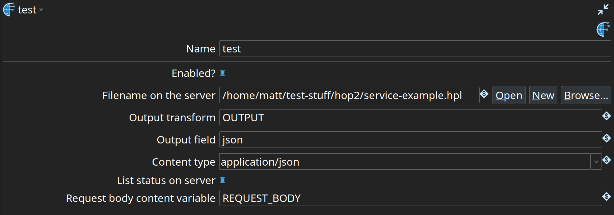
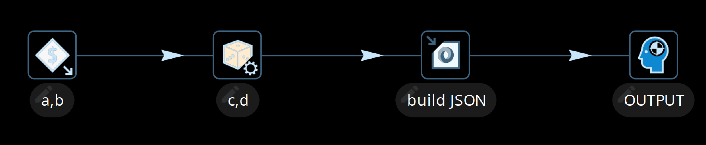

# Web Service

## 简介

Hop 有一种通过 servlet 暴露数据的简单方式。

有关配置 Hop Server 的更多信息，请查看 [Hop Server 文档](hop-server/index.md)
## Web Service Metadata

### 截图



### 选项

| 选项 | 描述 |
|---|---|
| Name |  |
| Web 服务的名称。 |  |
| Enabled |  |
| 启用或禁用 Web 服务 |  |
| Filename on the server |  |
| 服务器上的文件名。 |  |
| Output transform |  |
| 此服务将从中获取输出行的 Transform 名称。 |  |
| Output field |  |
| 此服务将从中获取数据的输出字段，将其转换为 String 并输出。 |  |
| Status field |  |
| 包含服务返回状态码的字段，留空时默认状态码为 `200` |  |
| Content type |  |
| webService servlet 报告的内容类型。 |  |
| List status on server |  |
| 如果希望 Web 服务 pipeline 的执行被列在服务器状态中，请启用此选项。 |  |
| Request body content variable |  |
| 运行时将包含请求体内容的变量名称。当对 Web 服务执行 POST 操作时非常有用。 |  |
| Request header content variable |  |
| 运行时将包含请求头内容的变量名称。这将返回一个包含请求中所有头的 JSON 对象。 |  |

## Hop Server 配置

你的 Hop Server 需要知道你定义的 metadata。
如上所述，你需要确保服务器能够访问你要执行的 pipeline 以及服务器 metadata。

最好的方法是在你的 XML 配置文件中设置以下选项：

Linux
```xml
<metadata_folder>/path/to/your/metadata</metadata_folder>
```

Windows
```xml
<metadata_folder>C:\\path\\to\\your\\metadata</metadata_folder>
```

一个简单的示例：

```xml
<hop-server-config>
  <hop-server>
    <name>8181</name>
    <hostname>localhost</hostname>
    <port>8181</port>
  </hop-server>
  <metadata_folder>/home/hop/project/services/metadata</metadata_folder>

</hop-server-config>
```

## 使用服务

### 基本请求（注意：S 必须大写）

```
http://<hop-server-url>/hop/webService
```
### 请求参数

| 参数 | 描述 |
|---|---|
| `service` |  |
| 服务名称。 |  |
| `runConfig` |  |
| pipeline 运行配置的名称。 |  |
| 任意参数名称 |  |
| 任何参数都可以通过请求 URL 传递值来设置 |  |
| 任意变量名称 |  |
| 任何变量都可以通过请求 URL 传递值来设置 |  |

### POST

除了默认的 GET 之外，你还可以对 Web 服务执行 POST 操作并传入请求体。如果你设置了请求体内容变量，此正文内容将被获取。每次 POST 请求触发底层 pipeline 执行时，该变量都将包含正文内容。

### 请求示例

以下执行上面截图中的 Hop Web Service `test`。
它传递了参数 B 和变量 A，并输出由 JSON Output Transform 生成的 JSON。

```
http://localhost:8181/hop/webService/?service=test&A=valueA&B=valueB
```
Web 服务 pipeline 如下所示：


