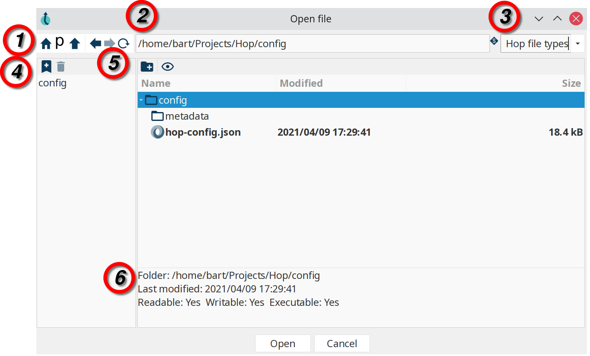

# Hop 文件对话框

Hop 文件对话框是你在 Hop Gui 中经常使用的多功能工具。

这个对话框提供的功能远不止基本的文件选择和保存。
除其他功能外，它还使你能够直接操作 VFS 文件系统，提供文件/文件夹信息，以及为文件和文件夹添加书签。

下面的列表将引导你了解 Hop 文件对话框中可用的选项。

> **💡 提示:** 如果你更喜欢使用操作系统的原生文件对话框而不是 Hop 对话框，请在 `Tools -> Edit Config Variables` 中将变量 `HOP_USE_NATIVE_FILE_DIALOG` 设置为 `Y`。

{nbsp}

. **主工具栏**
..  导航到用户主文件夹
.. 导航到 project 主文件夹
.. 导航到父文件夹
.. 导航到历史记录中的上一个路径
.. 导航到历史记录中的下一个路径
.. 刷新
. **文件路径**。
显示当前文件路径。
文件路径可用于直接输入（复制/粘贴）你想要的路径。
这不仅适用于本地文件，你还可以使用所有受支持的 [VFS 文件系统](../14-虚拟文件系统/vfs.md)。
. **文件扩展名**。
此列表由 plugin 填充，因此你可用的文件类型可能有所不同。
默认情况下，此列表包括：
.. Workflows
.. Pipelines
.. CSV 文件
.. JSON 文件
.. 日志文件
.. Markdown 文件
.. SAS 7 BDAT 文件
.. SVG 文件
.. TXT 文件
.. XML 文件
. **书签**：为你喜爱的文件和文件夹添加书签，以便快速访问。
Tools -> Options 中包含一个选项，用于指定你是否希望在文件对话框中使用全局书签（默认为全局）。
.. 将所选文件或文件夹添加为书签
.. 移除所选书签
. **文件/文件夹浏览器**：浏览当前文件系统，创建文件夹，切换隐藏文件和文件夹的显示。
.. 创建文件夹
.. 显示或隐藏隐藏文件和目录
. **文件/文件夹信息**
.. 文件和文件夹名称
.. 最后修改日期
.. 可读、可写、可执行标志
