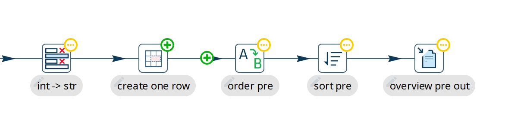

# 使用 Git

版本控制是任何严肃的数据编排项目的重要组成部分。
Hop 致力于通过 [File Explorer perspective](hop-gui/perspective-file-explorer.md) 中集成的 git 选项，让你尽可能轻松地管理 workflow 和 pipeline 的版本。

## File Explorer 工具栏

如果你为一个未在 git 中进行版本控制的项目打开文件浏览器，文件浏览器主工具栏（左上角）中的 git 图标将显示为灰色且禁用状态。

如果找到了 git（即项目根目录中有 `.git` 文件夹），此工具栏中的这些按钮就会被启用。

下面简要介绍此工具栏中可用的文件操作和 git 操作选项。

| 图标 | 操作 | 描述 | 快捷键 |
|---|---|---|---|
|  | 打开所选文件 | 在相应的编辑器中打开所选文件（workflow 和 pipeline 使用 workflow 或 pipeline 编辑器，其他文件使用文本编辑器）。 | 双击 |
|  | 添加文件夹 | 在所选位置添加新文件夹。会弹出输入文件夹名称的对话框。 |  |
|  | 展开所有文件夹 | 显示目录树中的所有嵌套文件夹。 |  |
|  | 折叠所有文件夹 | 隐藏目录树中的所有嵌套文件夹。 |  |
|  | 删除所选文件 | 删除所选文件。 | DEL |
|  | 重命名所选文件 | 使所选文件名可编辑以允许重命名。 | F2 |
|  | 刷新 | 刷新项目的文件夹和文件结构。 |  |
|  | 显示或隐藏文件 | 显示或隐藏文件或目录。 |  |
|  | Git 信息 | 使用所选文件的版本信息填充文件浏览器的 git 对话框。 |  |
|  | Git Add | 将所选文件添加到版本控制。 |  |
|  | Git Revert | 将文件恢复到上次提交的版本（HEAD）。 |  |
|  | Git commit | 提交所选文件的最新更改（需提供提交消息）。 |  |
|  | Git push | 将最近的更改推送到远程仓库。 |  |
|  | Git pull | 从远程仓库拉取最新更改。 |  |

> **📝 注意:** 在给定时间只有可用选项才会显示。例如，对于已经在版本控制中的文件，`git add` 将不可用。

## File Explorer 树

在工具栏下方的文件夹和文件结构树中，文件使用颜色编码方案来指示文件的 git 状态：

- 黑色：未更改。
这是 git 中可用的最新文件版本，未检测到更改。
- 灰色：此文件被忽略
- 蓝色：已暂存待提交。
此文件已准备好提交（'Git Commit'）
- 红色：未暂存待提交。
在更改可以提交之前，请先将此文件添加到 git（'Git Add'）。

## 在 git 中操作文件

添加文件::
点击尚未暂存待提交的文件（红色），点击 'Git Add'。
文件颜色变为蓝色（已暂存待提交）。

提交文件::
点击已暂存待提交的文件（蓝色），点击 'Git Commit'。
弹出对话框将要求确认要提交的文件，并显示输入提交消息的弹出窗口。
将默认的 'Commit Message' 更改为描述你对文件所做更改的提交消息。
文件颜色变为黑色（无更改）。

查看 git 信息::
点击受版本控制的文件（黑色或蓝色）。
文件浏览器将显示此文件的 git 状态：文件或文件夹、状态、分支和修订版本表（之前的提交列表）。
选择其中一个可用的提交，以显示该修订版本的已更改文件。
从 'Changed files' 列表中选择修订中的任何文件，以在右侧显示 git diff 信息。
对于 workflow 和 pipeline，点击 'Visual diff' 在 Data Orchestration perspective 中打开文件。
Hop 会在 action 或 transform 图标的右上角显示一个额外的图标，以指示所做的 git 更改（绿色表示添加，黄色表示更改）

## Git 配置选项

git GUI plugin 有一些可用的全局配置选项。
你可以在 configuration perspective 的 "Plugins" 标签页和 "git" 部分中找到这些选项。

| 选项 | 描述 |
|---|---|
| 启用 git plugin | 如果禁用，plugin 将被加载但不会尝试在项目文件夹中检测 git 仓库。 |
| 搜索父文件夹中的 git 仓库 | 此选项不仅会在项目文件夹中搜索 git 仓库（`.git/config` 文件检测），还会在所有父文件夹中搜索。请注意，启用此选项可能导致 git plugin 需要处理大量并不总是与你正在使用的 Hop 项目相关的文件。因此，此选项默认禁用。 |
