# Hop Gui 弹出（上下文）对话框

Hop Gui 弹出对话框是一个上下文对话框，允许你对 metadata、workflow 和 pipeline 执行大量操作。

弹出对话框的设计初衷是通过搜索和单击实现快速开发。

将鼠标悬停在弹出对话框中的任何可用选项上，即可查看该选项的描述。下面的示例展示了 workflow 弹出对话框中 `Copy as workflow action` 选项的描述。

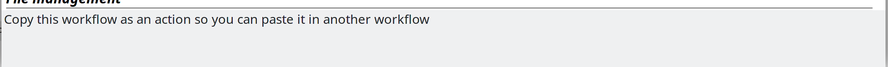

对话框顶部的搜索栏使 Hop 开发者能够：

- 搜索对话框中的可用项。可用项列表会随着你输入的内容实时更新。使用方向键导航到所需项，然后按回车键或单击该项来选择一个项，或将 action 或 transform 添加到你的 workflow 或 pipeline 中。
- 折叠或展开所有类别
- 显示类别：以分类列表或一个大的项目列表的形式显示可用项
- 固定宽度：以固定宽度的表格布局显示所有项

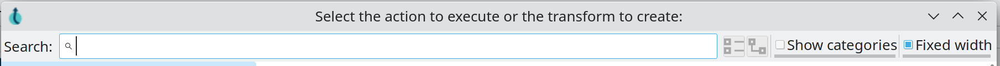

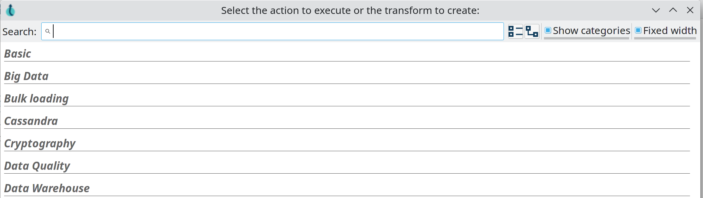

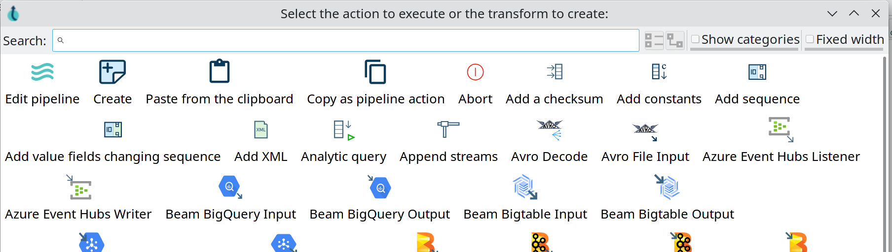

## 创建项目

当你创建新项目时，对话框会显示一个可以通过单击按钮创建的 metadata 项目列表。

> **💡 提示:** 通过点击左上角的 ，通过 File -> New 或按 `CTRL-N` 来创建新项目。

- File
** [Pipeline](../07-管道/create-pipeline.md)
** [Workflow](../08-工作流/create-workflow.md)
- Metadata
** [Beam File Definition](../06-元数据类型/beam-file-definition.md)
** [Cassandra Connection](../06-元数据类型/cassandra-connection.md)
** [Data Set](../06-元数据类型/data-set.md)
** [Hop Server](../09-Hop工具/hop-server.md)
** [MongoDB Connection](../06-元数据类型/mongodb-connection.md)
** [Neo4j Connection](../06-元数据类型/neo4j-connection.md)
** [Neo4j Graph Model](../06-元数据类型/neo4j-graphmodel.md)
** [Partition Schema](../06-元数据类型/partition-schema.md)
** [Pipeline Log](../06-元数据类型/pipeline-log.md)
** [Pipeline Probe](../06-元数据类型/pipeline-probe.md)
** [Pipeline Run Configuration](../06-元数据类型/pipeline-run-config.md)
** [Pipeline Unit Test](../06-元数据类型/pipeline-unit-test.md)
** [Relational Database Connection](../06-元数据类型/rdbms-connection.md)
** [Splunk Connection](../06-元数据类型/splunk-connection.md)
** [Web Service](../09-Hop工具/web-service.md)
** [Workflow Log](../06-元数据类型/workflow-log.md)
** [Workflow Run Configuration](../06-元数据类型/workflow-run-config.md)

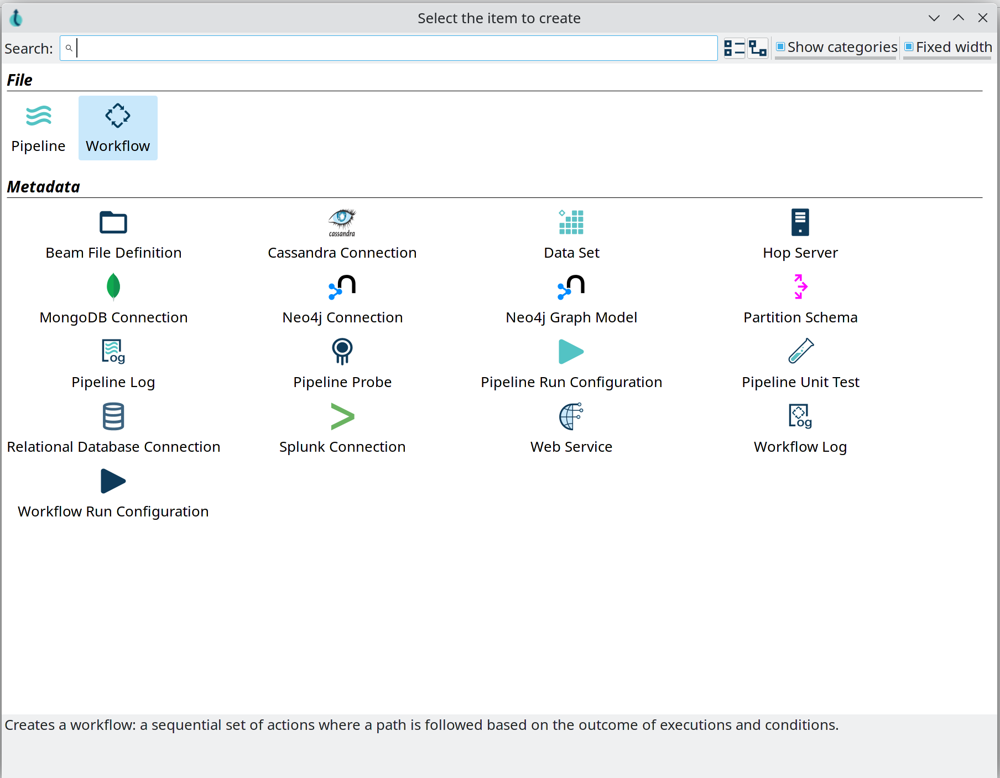

## Workflow 选项

'Basic' 类别包含你可以对当前 workflow 执行的一些操作。

- **edit workflow**：编辑此 workflow 的属性：描述、参数等。
- **create a note**：向此 workflow 添加注释
- **paste from the clipboard**：从剪贴板粘贴 action、注释或整个 workflow
- **copy as workflow action**：将此 workflow 作为 workflow action 复制到剪贴板，以便你可以将其作为预配置的 [workflow](../04-动作插件/工作流控制类/workflow.md) action 粘贴到另一个 workflow 中

所有其他类别包含你可以添加到 workflow 中的 action。

查看 [完整列表](../08-工作流/actions.md) 以获取可用 action 选项的详细信息。

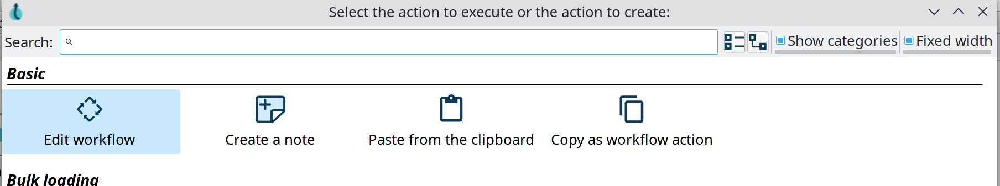

## Workflow Action 选项

点击 action 图标时，弹出对话框包含多个用于操作 action 的操作：

- Basic
** **Open: _Action Type_**：打开所选的 action 类型。适用于 workflow、pipeline action 等。
** **Copy Action to clipboard**：将此 action 复制到剪贴板，以便你可以将其粘贴到当前或另一个 workflow 中。
** **Edit the action**：编辑当前 action 的属性
** **Create hop**：此选项关闭对话框并添加一个开放的 hop。点击 workflow 中的任何其他 action 图标以创建指向该 action 的 hop。
** **Detach action**：移除指向和来自此 action 的所有 hop。如果此 action 通过 hop 连接了另外 2 个 action，则会在这些 action 之间创建一个 hop。
** **Edit action description**：打开此 action 的描述对话框
** **Delete this action**：从 workflow 中删除此 action。如果此 action 已连接到其他 action，则不会创建新的 hop。
- Advanced
** **Parallel execution**：为当前 action 之后的 action 启用或禁用并行执行。
- Logging
** **Edit Custom Logging**：为当前 action 设置自定义日志级别
** **Clear Custom Logging**：将此 action 的日志级别重置为 `Basic`

> **💡 提示:** 打开 action 中指定的 workflow 或 pipeline 的两个快捷方式是：将鼠标悬停在图标上并按 `z` 键，或 `CTRL-SHIFT-click` action 图标。

> **💡 提示:** 点击 action 图标可打开弹出对话框。点击 action 名称可直接打开 action 的属性。这是点击图标并从弹出对话框中选择 `Edit` 的快捷方式。

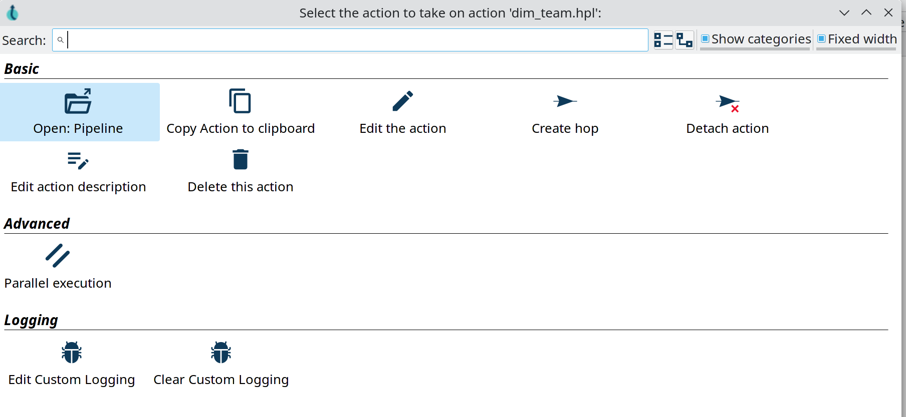

## Pipeline 选项

'Basic' 类别包含你可以对当前 pipeline 执行的一些操作。

- **edit pipeline**：编辑此 pipeline 的属性：描述、参数等。
- **create**：向此 pipeline 添加注释
- **paste from the clipboard**：从剪贴板粘贴 transform、注释或整个 pipeline
- **copy as pipeline action**：将此 pipeline 作为 workflow action 复制到剪贴板，以便你可以将其作为预配置的 [pipeline](../04-动作插件/工作流控制类/pipeline.md) action 粘贴到 workflow 中

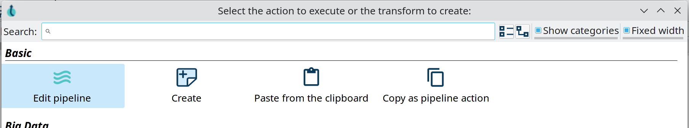

## Pipeline Transform 选项

点击 transform 图标时，弹出对话框包含多个用于操作 transform 的操作：

- Basic
** **Edit**：编辑当前 transform 的属性
** **Copy to clipboard**：将此 transform 复制到剪贴板，以便你可以将其粘贴到当前或另一个 pipeline 中。
** **Create hop**：此选项关闭对话框并添加一个开放的 hop。点击 pipeline 中的任何其他 transform 图标以创建指向该 transform 的 hop。
** **Detach transform**：移除指向和来自此 transform 的所有 hop。如果此 transform 通过 hop 连接了另外 2 个 transform，则会在这些 transform 之间创建一个 hop。
** **Show input fields**：显示进入此 transform 的所有字段
** **Show output fields**：显示此 transform 产生的所有输出字段
** **Edit description**：打开此 transform 的描述对话框
** **Delete**：从 pipeline 中删除此 transform。如果此 transform 已连接到其他 transform，则不会创建新的 hop。
- Data Routing
** [**Specify copies**](../07-管道/specify-copies.md)：设置执行期间要使用的 transform 副本数量
** **Copy/distribute rows**：使 transform 在执行期间复制/分发数据行。该选项是上下文相关的：如果 transform 正在复制行，则只会显示分发选项，反之亦然。
** **Set [partitioning](../07-管道/partitioning.md)**：指定数据行需要如何分组到分区中，以便在相似行需要到达同一 transform 副本时实现并行执行。
** **Error handling**：为此 transform 配置错误处理（适用于支持的 transform）
** **Add web service**：将此 transform 的输出用作 [Hop Server](../index.md) 的 [web service](../09-Hop工具/web-service.md)。
- Preview
** **View output**：在运行中或已完成的 pipeline 中查看此 transform 的输出。
** **Preview & debug output**：执行 pipeline，检查此 transform 的数据行，并在满足断点条件时选择性地暂停（参见 [Run, Preview and Debug a Pipeline](../07-管道/run-preview-debug-pipeline.md)）
** **Sniff output**：在运行的 pipeline 中查看所选 transform 的 50 行输出
** **Add data probe**：将此 transform 的输出数据行流式传输到 [pipeline probe](../06-元数据类型/pipeline-probe.md) 中定义的 pipeline。
- Logging
** **Edit Custom Logging**：为当前 transform 设置自定义日志级别
** **Clear Custom Logging**：将此 transform 的日志级别重置为 `Basic`
- Unit Testing
** **Unit testing**：使用此 transform 的输出字段和布局创建一个空的 [data set](../06-元数据类型/data-set.md)
** **Write rows to data set**：运行当前 pipeline 并将当前 transform 的输出写入 data set。

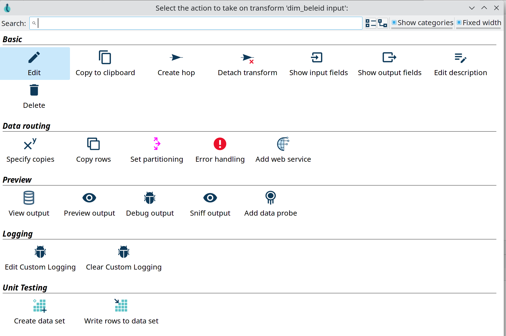

> **💡 提示:** Unit Testing 中显示的选项只是可用选项的一部分。查看 [unit testing](../07-管道/pipeline-unit-testing.md) 文档以获取所有单元测试选项的详细说明。

> **💡 提示:** 点击 transform 图标可打开弹出对话框。点击 transform 名称可直接打开 transform 属性。这是点击图标并从弹出对话框中选择 `Edit` 的快捷方式。

## Hop 选项

Hop 选项可从 workflow 和 pipeline 编辑器中使用，提供了多种可对一个或多个 hop 执行的操作。

对于 pipeline，对话框提供以下选项：

- Basic
** **disable/enable hop**：启用当前 hop（如果已禁用）或禁用当前 hop（如果已启用）。此选项只会显示适用的选项（例如，对于活跃的 hop 不会显示 'enable hop'，反之亦然）
** **delete hop**：删除当前 hop
- Bulk
** **Enable downstream hops**：启用当前 hop，以及 workflow（或 pipeline）中后续的所有 hop。
** **Disable downstream hops**：禁用当前 hop 以及当前 workflow（或 pipeline）中后续的所有 hop。

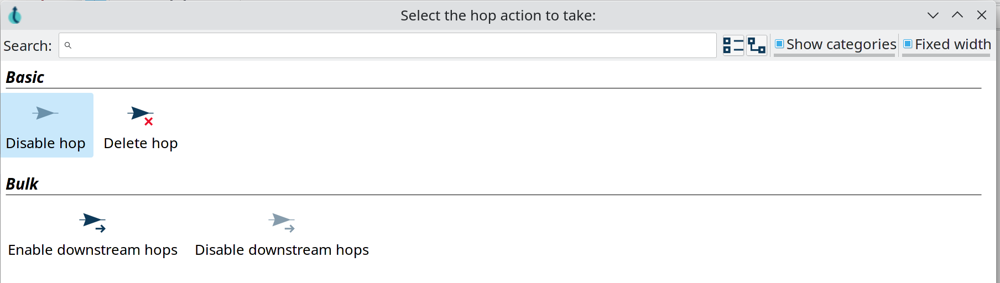

在 workflow 中工作时，hop 弹出对话框具有 pipeline hop 对话框的所有选项，外加一个额外的类别：

- Routing
** **Unconditional hop**：使当前 hop 无条件（忽略前一个 action 的结果，无论如何都跟随此 hop）
** **Success hop**：将当前 hop 设为成功 hop（仅在前一个 action 的结果为 'success' 时跟随）
** **Failure hop**：将当前 hop 设为失败 hop（仅在前一个 action 的结果为 'failure' 时跟随）

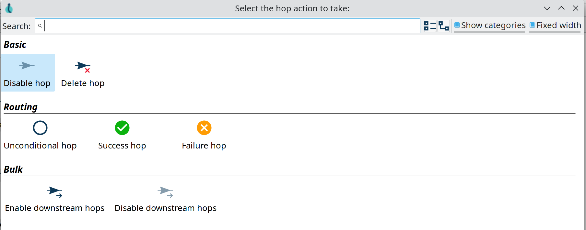
