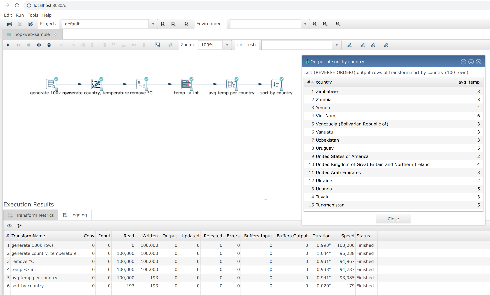
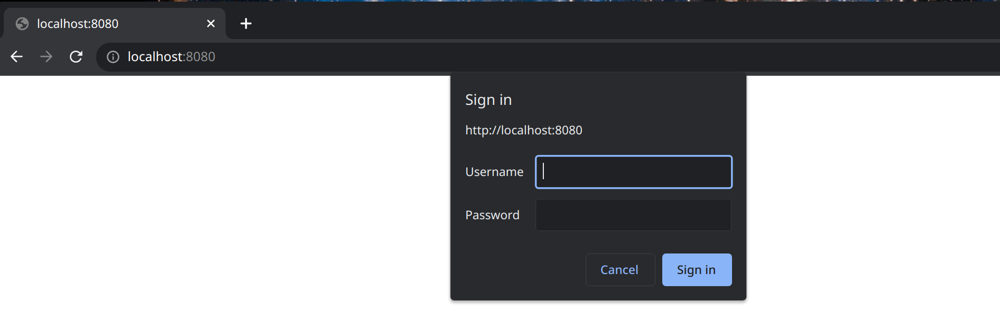

# Hop Web

Hop Web 是基于 Web 的 Hop Gui 版本。它使用代码转换技术将默认的 Hop Gui 桌面应用程序转换为基于 Web 的版本。虽然并不完美，但 Hop Web 在浏览器中提供了默认的 Hop Gui 用户体验。

## 获取 Hop Web

Hop Web 包含在默认的 Hop 构建中。
每次构建时，都会将更新推送到 [Docker Hub](https://hub.docker.com/r/apache/hop-web)。

这个持续更新的 docker 镜像是体验 Hop Web 最简单的方式：

使用以下命令拉取最新构建：`docker pull apache/hop-web`。

镜像拉取完成后，使用 `docker run -p 8080:8080 apache/hop-web:latest` 启动 Hop Web。

Hop Web 容器应该只需要几秒钟即可启动。
你的容器日志应该输出类似于以下示例的内容：

```bash
22-Apr-2021 18:13:39.786 INFO [main] org.apache.catalina.startup.HostConfig.deployDirectory Deployment of web application directory [/usr/local/tomcat/webapps/ROOT] has finished in [8,274] ms
22-Apr-2021 18:13:39.790 INFO [main] org.apache.coyote.AbstractProtocol.start Starting ProtocolHandler ["http-nio-8080"]
22-Apr-2021 18:13:39.797 INFO [main] org.apache.catalina.startup.Catalina.start Server startup in [8319] milliseconds
2021/04/22 18:14:37 - Hop - Projects enabled
2021/04/22 18:14:37 - Hop - Enabling project : 'default'
```

容器启动后，Hop Web 可通过 http://localhost:8080/ui 访问。
你会感到宾如其归！



## 使用 project 和 environment 启动 Hop Web

Hop Web 接受与默认 Qi Hop 容器镜像相同的变量，以允许 Hop Web 用户在启动 Hop Web 容器时指定其 project 和 environment：

| Environment Variable | Description |
|---|---|
| ```HOP_PROJECT_NAME``` |  |
| Name of the Hop project to create in the container. |  |
| ```HOP_PROJECT_FOLDER``` |  |
| Path to the home of the Hop project. |  |
| ```HOP_ENVIRONMENT_NAME``` |  |
| The name of the Hop environment to create in the container. |  |
| ```HOP_ENVIRONMENT_CONFIG_FILE_NAME_PATHS``` |  |
| This is a comma separated list of paths to environment config files (including filename and file extension). |  |

使用 project 和 environment 启动 Hop Web 的示例 `docker run` 命令：

```
docker run -it --rm \
  --env HOP_PROJECT_FOLDER=/project \
  --env HOP_PROJECT_NAME=web-samples \
  --env HOP_ENVIRONMENT_NAME=web-samples-test \
  --env HOP_ENVIRONMENT_CONFIG_FILE_NAME_PATHS=/config/web-samples-test.json \
  --name hop-web-test-container \
  -p 8080:8080 \
  -v <PATH_TO_YOUR_PROJECT>:/project \
  -v <PATH_TO_YOUR_ENVIRONMENT>:/config \
  hop-web
```
## 在 Hop Web 中使用 Hop CLI 工具

Hop Web 包含默认的 [Hop 工具](hop-tools/index.md)，如 [hop-conf](hop-tools/hop-conf/hop-conf.md)、[hop-run](hop-run/index.md) 等。

这些工具位于运行中的 Hop Web 容器的 `/usr/local/tomcat/webapps/ROOT` 目录中。

## 身份验证

Hop Web 默认运行在 Tomcat 服务器上。你可以扩展 Hop Web 的 tomcat 配置来添加身份验证。

默认的 Hop Web docker 镜像会在 Hop Web 启动之前拾取 `tomcat-users.xml` 和 `web.xml` 文件，并将它们移动到正确的位置。

一个最小化的 `tomcat-users.xml` 示例文件：

```xml
<?xml version='1.0' encoding='utf-8'?>
<!--
  ~ Licensed to the Apache Software Foundation (ASF) under one or more
  ~ contributor license agreements.  See the NOTICE file distributed with
  ~ this work for additional information regarding copyright ownership.
  ~ The ASF licenses this file to You under the Apache License, Version 2.0
  ~ (the "License"); you may not use this file except in compliance with
  ~ the License.  You may obtain a copy of the License at
  ~
  ~       http://www.apache.org/licenses/LICENSE-2.0
  ~
  ~ Unless required by applicable law or agreed to in writing, software
  ~ distributed under the License is distributed on an "AS IS" BASIS,
  ~ WITHOUT WARRANTIES OR CONDITIONS OF ANY KIND, either express or implied.
  ~ See the License for the specific language governing permissions and
  ~ limitations under the License.
  ~
  -->
<tomcat-users>
  <role rolename="apachehop"/>
  <user username="apachehop" password="password" roles="apachehop" />
</tomcat-users>
```

以下示例 `web.xml` 使用基本身份验证所需的 `<security-constraint />` 和 `<login-config />` 元素扩展了 Hop Web 的默认 `web.xml`。

```
<?xml version="1.0" encoding="UTF-8"?>
<!--
  ~ Licensed to the Apache Software Foundation (ASF) under one or more
  ~ contributor license agreements.  See the NOTICE file distributed with
  ~ this work for additional information regarding copyright ownership.
  ~ The ASF licenses this file to You under the Apache License, Version 2.0
  ~ (the "License"); you may not use this file except in compliance with
  ~ the License.  You may obtain a copy of the License at
  ~
  ~       http://www.apache.org/licenses/LICENSE-2.0
  ~
  ~ Unless required by applicable law or agreed to in writing, software
  ~ distributed under the License is distributed on an "AS IS" BASIS,
  ~ WITHOUT WARRANTIES OR CONDITIONS OF ANY KIND, either express or implied.
  ~ See the License for the specific language governing permissions and
  ~ limitations under the License.
  ~
  -->

<web-app xmlns="http://java.sun.com/xml/ns/j2ee"
         xmlns:xsi="http://www.w3.org/2001/XMLSchema-instance"
         xsi:schemaLocation="http://java.sun.com/xml/ns/j2ee http://java.sun.com/xml/ns/j2ee/web-app_2_4.xsd"
         version="2.4">

    <context-param>
        <param-name>org.eclipse.rap.applicationConfiguration</param-name>
        <param-value>org.apache.hop.ui.hopgui.HopWeb</param-value>
    </context-param>

    <listener>
        <listener-class>org.apache.hop.ui.hopgui.HopWebServletContextListener</listener-class>
    </listener>

    <servlet>
        <servlet-name>HopGui</servlet-name>
        <servlet-class>org.eclipse.rap.rwt.engine.RWTServlet</servlet-class>
    </servlet>

    <servlet-mapping>
        <servlet-name>HopGui</servlet-name>
        <url-pattern>/ui</url-pattern>
    </servlet-mapping>

    <servlet>
        <servlet-name>welcome</servlet-name>
        <jsp-file>/docs/English/welcome/index.html</jsp-file>
    </servlet>
    <servlet-mapping>
        <servlet-name>welcome</servlet-name>
        <url-pattern>/docs/English/welcome/index.html</url-pattern>
    </servlet-mapping>

    <servlet>
        <servlet-name>Server</servlet-name>
        <servlet-class>org.apache.hop.www.HopServerServlet</servlet-class>
    </servlet>
    <servlet-mapping>
        <servlet-name>Server</servlet-name>
        <url-pattern>/hop/*</url-pattern>
    </servlet-mapping>

    <security-constraint>
      <web-resource-collection>
        <web-resource-name>Wildcard means whole app requires authentication</web-resource-name>
          <url-pattern>/*</url-pattern>
          <http-method>GET</http-method>
          <http-method>POST</http-method>
        </web-resource-collection>
      <auth-constraint>
        <role-name>apachehop</role-name>
      </auth-constraint>

      <user-data-constraint>
        <!-- transport-guarantee can be CONFIDENTIAL, INTEGRAL, or NONE -->
        <transport-guarantee>NONE</transport-guarantee>
      </user-data-constraint>
    </security-constraint>

    <login-config>
      <auth-method>BASIC</auth-method>
    </login-config>

</web-app>
```
查看 [Apache Tomcat 文档](https://tomcat.apache.org/tomcat-9.0-doc/realm-howto) 中关于 REALM 配置的部分以获取更多高级配置。

将包含这两个文件的本地配置文件夹挂载到 Qi Hop Web 容器的 `/config` 文件夹中：

```bash
docker run -it --rm \
    -p 8080:8080 \
    -v <PATH_TO_YOUR_LOCAL_CONFIG_DIRECTORY>:/config/ \
    apache/hop-web`
```

Hop Web 现在会要求你输入用户名和密码：


