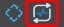
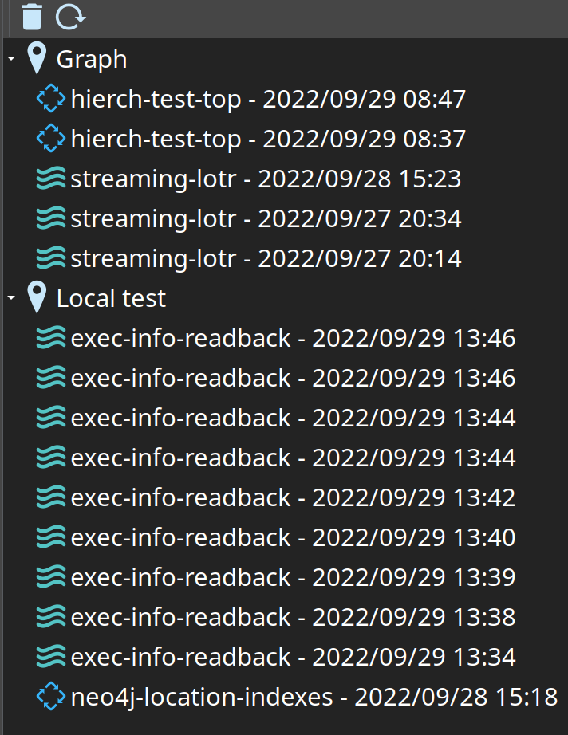
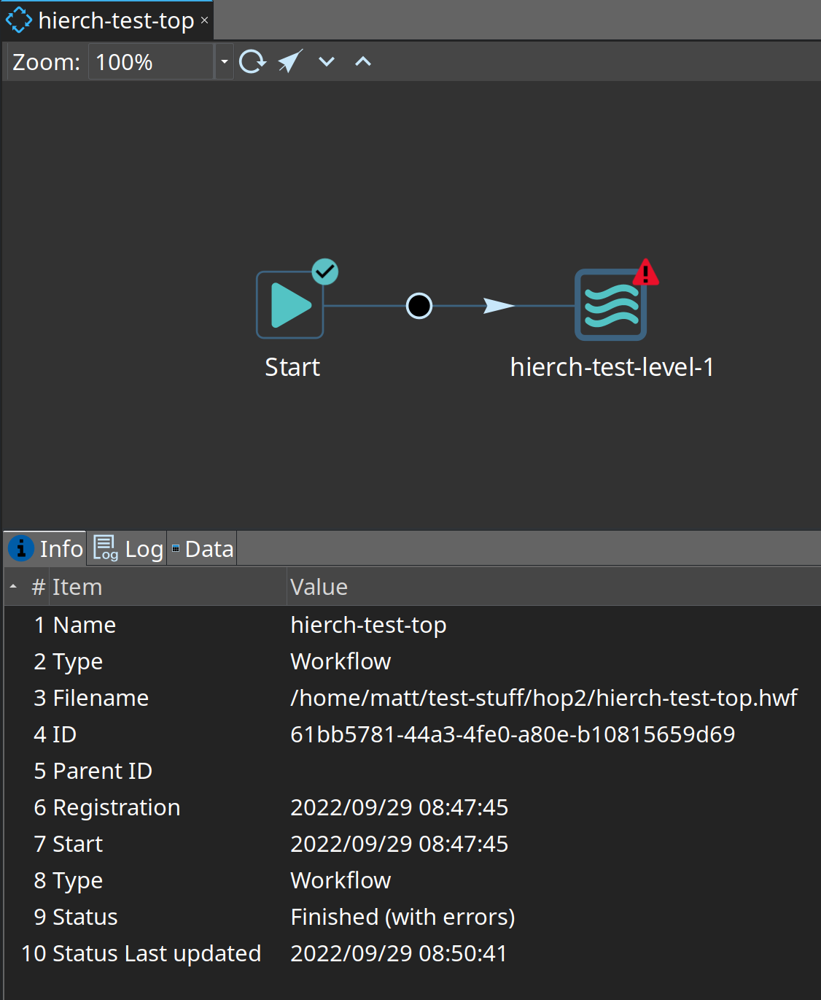
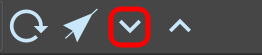
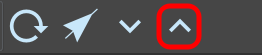
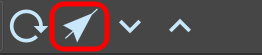

# Execution Information Perspective

图标：

## 描述

Execution Information perspective 提供了先前执行的 workflow 和 pipeline 的执行信息概览。该 perspective 允许你浏览执行列表，并向上或向下钻取到父级或子级 workflow 和/或 pipeline。此外，此 perspective 还提供有关执行状态、日志信息、（pipeline）指标和分析数据的信息。

## 信息收集

此 perspective 中显示的执行信息不会自动收集。你需要在你选择的 [Pipeline run configuration](../06-元数据类型/pipeline-run-config.md) 或 [Workflow run configuration](../06-元数据类型/workflow-run-config.md) 中指定要将执行信息发送到哪个[位置](../06-元数据类型/execution-information-location.md)。

## 导航

你可以通过点击 Hop GUI 中垂直 perspective 工具栏上的  图标来导航到此处。

执行相同操作的键盘快捷键是：`CTRL-Shift-I`。

如果你想查看有关当前加载 pipeline（从 data orchestration perspective）的_最近一次_执行的信息，可以点击工具栏中的位置图标：

如果你正在编辑 workflow，你也可以执行相同的操作：

## 用法

### 左侧面板

此 perspective 的左侧面板包含一个树形结构，其中包含所有已定义的 [Execution Information Location](../06-元数据类型/execution-information-location.md) metadata 元素。在这些位置的名称下方，你会看到有信息的 pipeline 和 workflow 的图标、名称和注册日期。
例如：

可能的操作：

| 操作 | 结果 |
|---|---|
| 双击列出的执行 |  |
| pipeline 或 workflow 的信息将被加载到 perspective 右侧的新标签页中。 |  |
| 点击刷新图标 |  |
| 将从该位置加载没有父级的最近 100 次执行 |  |
| 点击删除图标 |  |
| 当前选中的执行将被删除，或当前所选位置的所有执行将被删除（确认后）。 |  |

### 右侧标签页文件夹

右侧是在不同标签页中打开的执行。
例如，这是一个已完成 workflow 的单个执行信息标签页：

底部有不同的标签页：

| 标签页 | 描述 |
|---|---|
| Info |  |
| 这里你可以找到有关你正在查看的 pipeline 或 workflow 的常规信息 |  |
| Metrics |  |
| 如果你正在查看 pipeline 执行，你可以看到整体的 transform 指标（如果有）。 |  |
| Log |  |
| 这里你可以找到 pipeline 或 workflow 的日志文本。日志文本在选中标签页时延迟加载。日志的第一部分显示到 configuration perspective 中 `Maximum execution logging text size` 选项指定的限制为止，该限制以字符数为单位。 |  |
| Data |  |
| 在 pipeline 或 workflow 执行期间，Hop 可以捕获各种数据。捕获哪些数据取决于正在进行的工作类型以及捕获方式的配置。例如，捕获的数据量取决于你为 pipeline 设置的 [Execution Data Profile](../06-元数据类型/execution-data-profile.md)，或者 action 执行后是否有有趣的信息。 |  |

### 选择图标

如果你点击 transform 或 workflow 图标，perspective 会自动尝试加载其所有数据。它会切换到底部的 "Data" 标签页。在那里你会找到可以查看的数据集列表。

以下是 workflow action 的可用数据集：

| 数据集 | 描述 |
|---|---|
| Result details of action |  |
| 你将了解是否有错误、结果（true/false）是什么，或者 action 是否被停止。 |  |
| Result files of action |  |
| 如果 action 结果包含任何文件名，它们将在此数据集中 |  |
| Result rows of action |  |
| 如果 action 结果包含任何行，它们将在此数据集中 |  |
| Variables before execution |  |
| action 执行前与 workflow 开始时不同（有趣）的变量列表。 |  |
| Variables after execution |  |
| action 执行后有趣的变量（及其值）列表。 |  |

以下是你可以使用 [Execution Data Profile](../06-元数据类型/execution-data-profile.md) 在 workflow transform 中捕获的一些数据集：

| 数据集 | 描述 |
|---|---|
| First rows of ... |  |
| 显示 transform 写入的前几行。 |  |
| Last rows of ... |  |
| 显示 transform 写入的最后几行。 |  |
| Random rows of ... |  |
| 显示 transform 写入的行的随机选择 |  |
| Data profiling data sets |  |
| 根据你启用的数据分析选项，你可以找到每列的统计信息以及示例行。 |  |

### 向下钻取

如果你想了解某个特定 action 或 transform 执行期间发生了什么，可以选择它并点击工具栏中的向下箭头：

如果 transform 在多个副本中执行了 pipeline 或 workflow，你可以选择要跟随哪个执行。对于在 [repeat](../04-动作插件/工作流控制类/repeat.md) action 或 [Start](../04-动作插件/工作流控制类/start.md) 循环中执行多次的 workflow 或 pipeline 也是如此。结果将是底层执行将在 perspective 的新标签页中打开。

### 导航到父级

如果你正在查看由另一个 pipeline 或 workflow 启动的执行，可以通过点击 "arrow up" 工具栏图标导航到此父级：

### 编辑 pipeline 或 workflow

如果你想从 pipeline 或 workflow 的执行信息快速导航到其编辑器，可以点击工具栏中的 data orchestration 图标：

