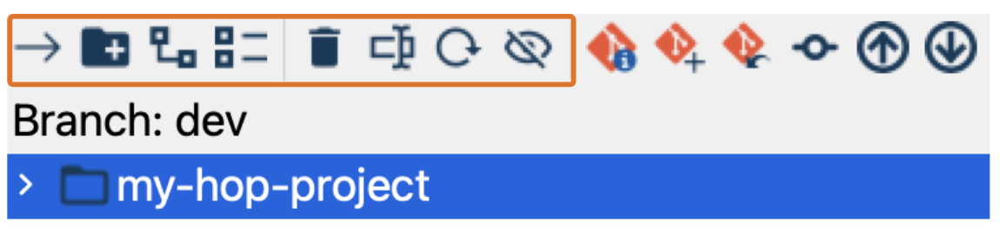
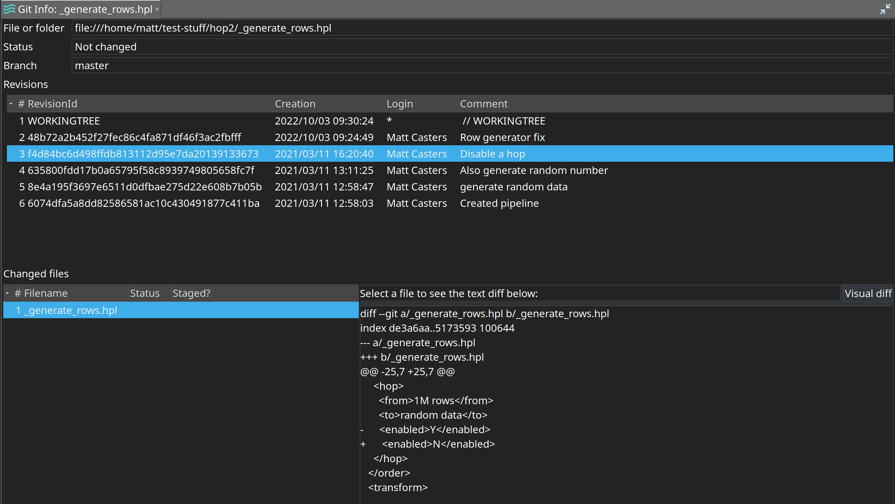
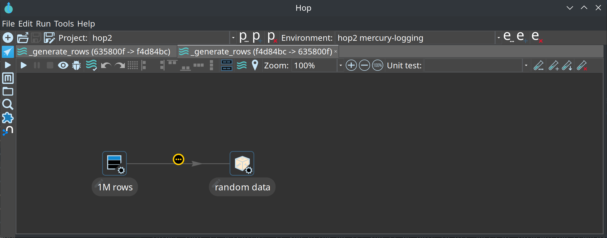
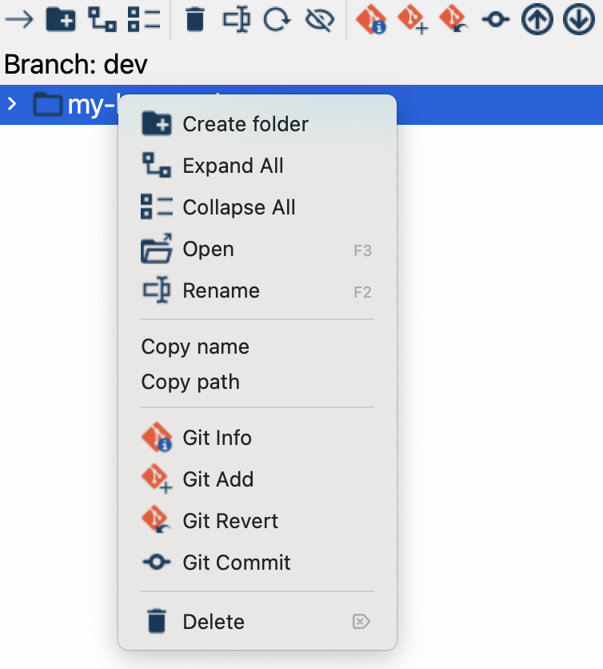
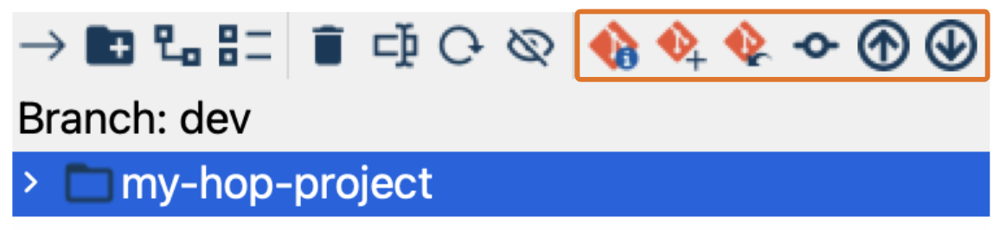

# File Explorer Perspective

图标：

键盘快捷键：`CTRL-Shift-E`

## 描述

File Explorer perspective 是你执行大量文件操作的地方。
此 perspective 包含 Hop 已知的最常见文件类型的处理器。
这些显然包括 hwf（workflow）和 hpl（pipeline），还包括 JSON、CSV、TXT、XML、Markdown、SVG、Log 和 SAS 7 BDAT 文件。
File Explorer perspective 也是你通过 [Git 集成](hop-gui/hop-gui-git.md) 管理项目版本控制的地方。

> **💡 提示:** 尽管功能完备，但 File Explorer 中大多数文件类型的编辑器比较基础。
预计这些编辑器会在未来的 Hop 版本中改进，或者如果你愿意通过贡献文件编辑器来帮助我们改进 Hop，请查看[代码贡献指南](http://hop.apache.org/community/contribution-guides/code-contribution-guide/)。

## 文件操作

文件操作可通过多个工具栏选项使用：

- 打开所选文件：使用右箭头或双击打开所选文件。你也可以直接双击文件来打开它。如果是 workflow 或 pipeline，它将在 [Data Orchestation](hop-gui/perspective-data-orchestration.md) perspective 中打开。在所有其他情况下，文件将在新标签页中打开。
- 创建文件夹：添加一个新文件夹。
- 展开所有文件夹：显示目录树中的所有嵌套文件夹。
- 折叠所有文件夹：隐藏目录树中的所有嵌套文件夹。
- 删除：删除所选文件或文件夹。
- 重命名：重命名文件或文件夹。
- 刷新：刷新文件列表。
- 显示或隐藏文件：显示或隐藏文件或目录。

## 切换 File Explorer 面板

当 File Explorer perspective 已处于活动状态时，点击 perspective 工具栏（左侧）中的 File Explorer 按钮将切换文件浏览器面板（项目树）的可见性。这允许你在不需要查看文件树时最大化工作区面积。

- 面板可见时：点击 File Explorer 按钮隐藏面板，最大化编辑器区域。
- 面板隐藏时：点击 File Explorer 按钮再次显示面板，恢复分屏视图。

> **💡 提示:** File Explorer 按钮上的工具提示会指示你何时可以切换面板："File Explorer (Ctrl`Shift`E). Click the folder to show/hide the project tree"

## 配置选项

File Explorer perspective 可通过 [Configuration perspective](hop-gui/perspective-configuration.md) 的 Plugins 标签页进行配置。以下选项可用：

- **非延迟加载的初始深度**：控制打开文件浏览器树中的文件夹时立即加载多少层文件夹级别。
- **最大文件加载大小**：设置在 explorer 中打开文件时将加载的最大文件大小（以 MB 为单位）。
- **默认显示文件浏览器面板**：启用后，打开 explorer perspective 时默认显示文件浏览器面板（项目树）。禁用后，面板初始隐藏，为你提供更多文件编辑工作区。

## Git 集成

### 描述

如果已安装 git plugin（文件夹 `plugins/misc/git`），文件浏览器将在 project 主文件夹中查找 `.git/config` 文件。如果存在，explorer perspective 将开始对列出的文件进行颜色编码：

- 红色：文件尚未添加到 git（未暂存）。
- 蓝色：文件已更改（已暂存）。
- 灰色：文件被 git 忽略。

### Git

#### Git 信息

如果有所选文件或文件夹的相关信息，工具栏中的 "Git Info" 图标将被启用。如果你点击它，你将能够在新标签页中查看有关 git 历史的各种信息：

在修订历史下方，你可以查看文件的修订版本。如果你选择一个修订版本，你不仅可以查看两个修订版本之间的文本差异，还可以使用标签页右侧的 "Visual diff" 按钮。如果你选择 "visual diff" 选项，GUI 将切换到 data orchestration perspective，在那里将打开 2 个新标签页，分别显示更改前后的 pipeline 或 workflow 状态。

各种 transform、action 和 hop 上会添加小信息图标，以指示它们是否被更改、删除或添加。

### 右键菜单选项
Qi Hop Git 集成中的右键菜单提供了几个有用的选项，帮助你直接从界面管理文件和 Git 操作。以下是每个选项的详细说明：

- 创建文件夹：在所选目录中创建新文件夹。这对于组织 workflow、pipeline 和其他项目资源非常有用。
- 展开所有文件夹：展开项目目录树中的所有嵌套文件夹。便于无需逐个打开文件夹即可全面查看项目结构。
- 折叠所有文件夹：关闭所有展开的文件夹，仅显示顶层目录。有助于重置视图或减少视觉混乱。
- 打开：打开所选文件或文件夹。对于 workflow 和 pipeline，它在 Data Orchestration perspective 中启动它们，而其他文件类型将在新标签页中打开。
- 重命名：允许你更改所选文件或文件夹的名称，帮助你保持项目文件的有序和清晰标注。
- 复制名称：将所选文件或文件夹的名称复制到剪贴板，方便粘贴和在别处引用。
- 复制路径：将所选文件或文件夹的完整路径复制到剪贴板，便于快速导航或与他人共享位置。
- Git Info：显示所选文件 Git 状态的详细信息，包括最近的更改。
- Git Add：将所选文件暂存以提交，意味着更改已准备好包含在下一次 Git 提交中。
- Git Revert：撤销对所选文件所做的任何更改，将其恢复到上次提交的状态。当你需要撤销意外修改时非常有用。
- Git Commit：打开一个对话框，将暂存的更改提交到本地 Git 仓库。你可以添加一条描述性提交消息来总结你的更新。
- Delete：从项目中删除所选文件或文件夹。请谨慎使用，因为它会永久删除目录中的项目。

#### Git 操作

以下是支持的基本 git 操作：

- Git Add：暂存文件以将其包含在提交中。
- Git Commit：将更改提交到 origin。
- Git Revert：检出文件或文件夹以撤销更改。
- Git Push：推送更改。
- Git Pull：拉取更改。

你可以从文件浏览器树上方的工具栏访问这些操作：

