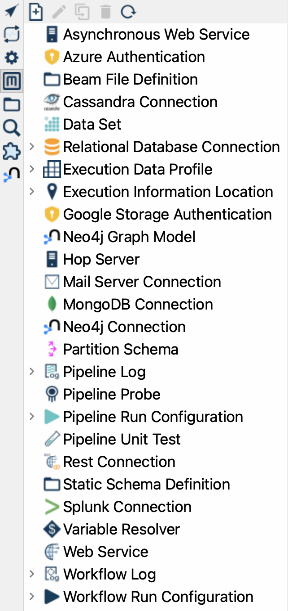

# Metadata Perspective

图标：

键盘快捷键：`CTRL-Shift-M`

## 描述

Metadata perspective 是你管理 Hop 项目中可用的各种 [metadata 类型](metadata-types/index.md) 的地方。

## 用法

### 类型树

此 perspective 左侧有一个树形结构，其中 metadata 类型显示为顶层，其下方是各个元素：

### 管理元素

你可以右键点击任何元素来编辑、重命名、复制或删除元素。你也可以使用此菜单创建新元素。
要创建新元素，你还可以双击元素类型本身。
你也可以使用位于 metadata 树正上方工具栏中的工具栏图标。

### 标签页

创建或编辑 metadata 元素时，信息将显示在右侧的单独标签页中。这将使你在项目中工作时能够轻松切换各种 metadata 元素。
