# 在 Google Cloud Dataflow 上运行 Apache Beam 示例

## 前提条件

我们将首先准备一个 Google Cloud 项目，启用所需的 API，创建一个服务账号和一个 Google Cloud Storage 存储桶。

前往 Google Cloud Console 并创建一个项目。

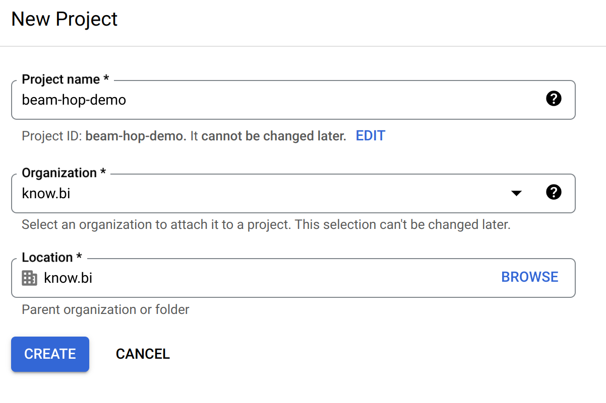

接下来，确保选中了您的项目，然后进入"APIs & Services"，启用 Google Cloud Storage API 和 Google Dataflow API。

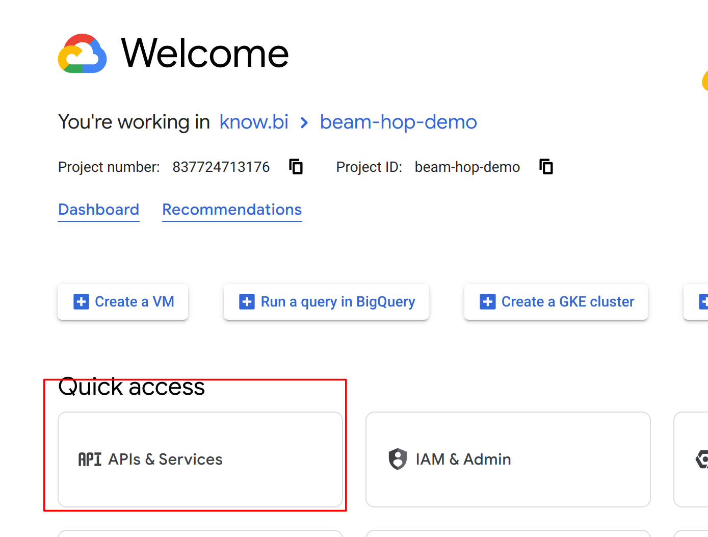

在 Google Dataflow API 主界面的"Credentials"标签页中，您会看到启用 API 后创建的服务账号。稍后您将需要此服务账号。

接下来，我们需要创建一个 Google Cloud Storage 存储桶。转到您项目的 Google Cloud Storage 页面并创建一个存储桶。我们在"europe-west1 (Belgium)"区域创建了一个名为"apache-beam-hop"的存储桶。所有其他设置可以保留默认值。

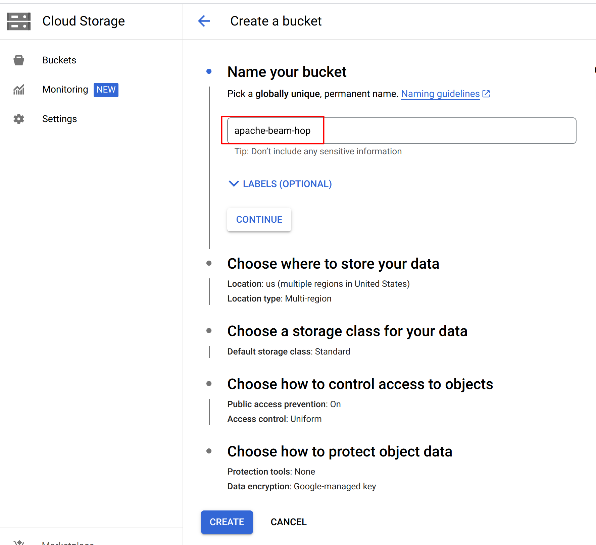

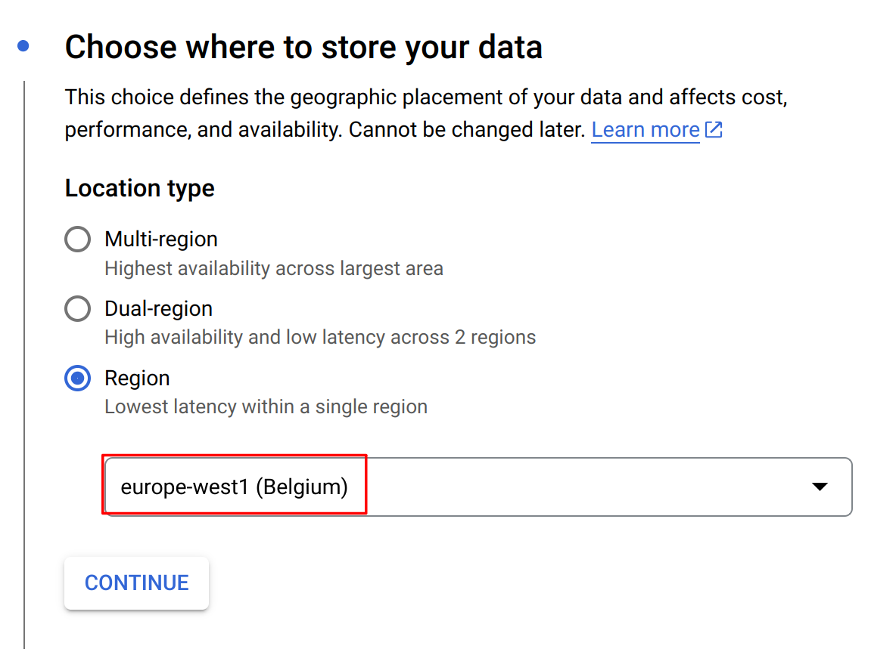

在此存储桶中创建两个文件夹"input"和"output"，并将 Qi Hop 示例项目中"beam/input"文件夹中的两个 .txt 文件上传到 input 文件夹。

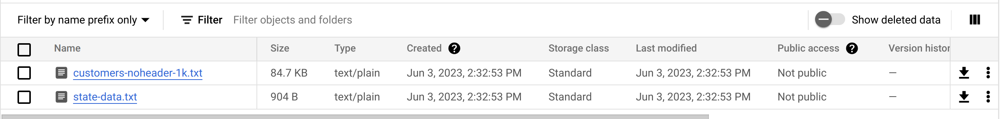

在 Google Cloud Storage 界面中，选择您的存储桶，然后选择"Permissions"，确保切换到"Fine grained access control"，并确保服务账号有权访问您的存储桶。

最后，转到您 Google Cloud 项目的 IAM & Admin -> Service Accounts 页面，点击启用 Dataflow API 时创建的服务账号。在此页面中，转到 Keys 标签页，创建并下载一个 JSON 密钥。

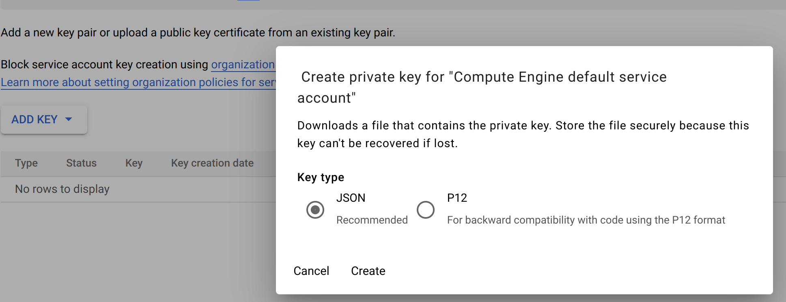

接下来，我们需要确保您的系统知道如何使用此密钥。有多种选项，最简单的方法是设置一个环境变量。我在 Linux 系统上使用了以下命令：

```
export GOOGLE_APPLICATION_CREDENTIALS=<PATH_TO_MY_KEY_FILE>/beam-hop-demo-<project-hash>.json
```
## 在 Qi Hop 示例项目中运行 Apache Beam pipeline

Qi Hop 在示例项目中附带了许多 Apache Beam pipeline。让我们在我们新创建的 Google Cloud 项目中运行这些 pipeline。

首先，我们需要创建一个 fat jar。这个 fat jar 是一个自包含的库，包含了 Apache Beam 和 Google Dataflow 运行我们的 pipeline 所需的一切。这个 jar 文件将有数百 MB，并将上传到我们之前创建的 Google Cloud Storage 存储桶。

点击 Hop GUI 左上角的 Hop 图标，选择"Generate a Hop fat jar"。指定目录和文件名（我们使用 /tmp/hop-fat.jar）来存储 fat jar 后，Hop 将需要几分钟来生成您的 fat jar。

有了 fat jar 后，在 Qi Hop GUI 中打开示例项目并切换到 metadata 视图。示例项目附带了一个预配置的 DataFlow pipeline 运行配置，我们将修改它以使用我们新创建的 Google Cloud 项目。

编辑运行配置以使用我们刚创建的项目的设置：

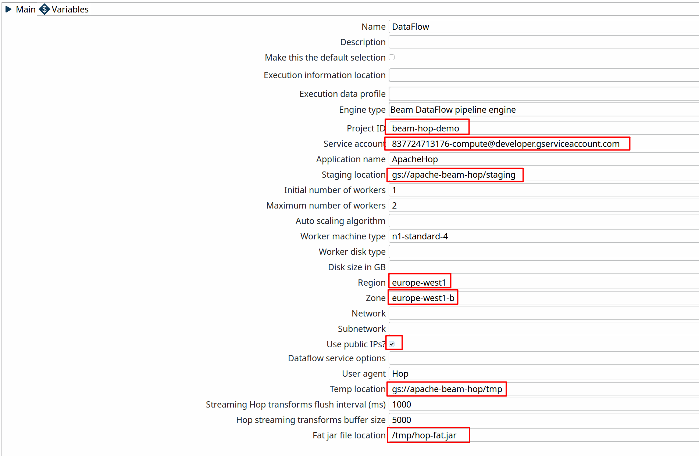

为简单起见，勾选"Use public IPs?"选项。查看 Google Cloud 文档以了解有关配置项目以使用私有 IP 地址运行的更多信息。

在 Dataflow pipeline 运行配置的 variables 标签页中，将 DATA_INPUT、STATE_INPUT 和 DATA_OUTPUT 变量的值更改为您刚创建的存储桶名称。同时将文件名 customers-noheader-1M.txt 更改为 customers-noheader-1k.txt。

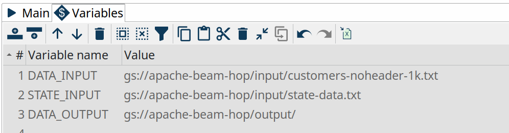

**信息**：如引言中所述，像 Google Dataflow 这样的分布式引擎只有在您需要处理大量数据时才有意义。在真实场景中，处理像我们即将处理的客户文件这样的小文件是没有任何意义的。对于少量数据，在原生的本地或远程 pipeline 运行配置中处理总是会快得多。

您现在已经准备好在 Google Dataflow 中运行您的第一个 pipeline 了。回到数据编排视图，从示例项目中打开 beam/pipelines/switch-case.hpl。

pipeline 开头的 Beam File Input 和 Beam File Output transform 是特殊的 Beam transform。两者都指向您可以在 metadata 视图中找到的 Beam File Definition。这些 transform 唯一要做的是指定文件布局和路径（您之前更改的 `${openvar}DATA_DIR${closevar}` 变量），Dataflow 可以在该路径中找到要读取的输入文件和要写入的输出文件。此 pipeline 的其余部分就是另一个普通 pipeline。

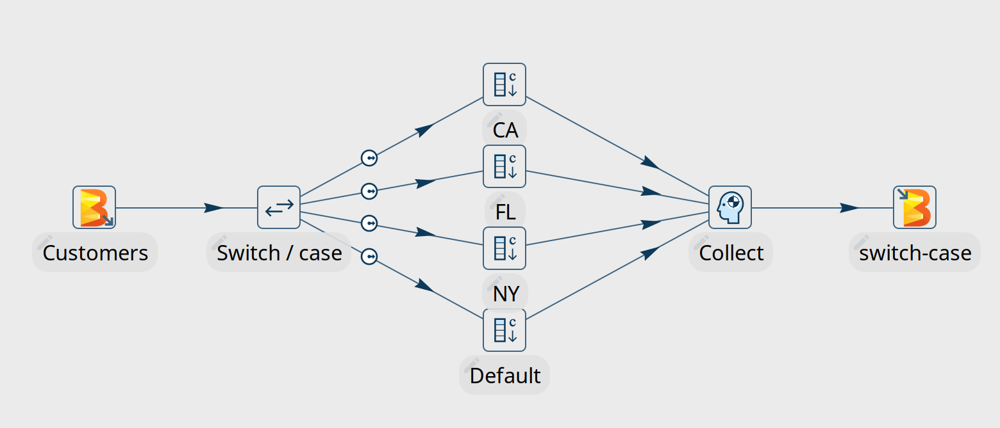

点击运行按钮，选择 Dataflow 运行配置并点击"Launch"。

Qi Hop 会将您的 fat jar 上传到 Google Cloud Storage 存储桶的 staging 文件夹中，这需要几分钟时间（检查您存储桶中的"staging"文件夹）。完成后，将创建并启动一个 Dataflow 作业。创建作业、启动 pod 和运行 pipeline 还需要几分钟时间。

Dataflow 作业应该在几分钟后成功完成。请记住：分布式引擎不是为处理小数据文件而设计的，原生（本地或远程）pipeline 运行配置在处理少量数据时总是会表现得更好。

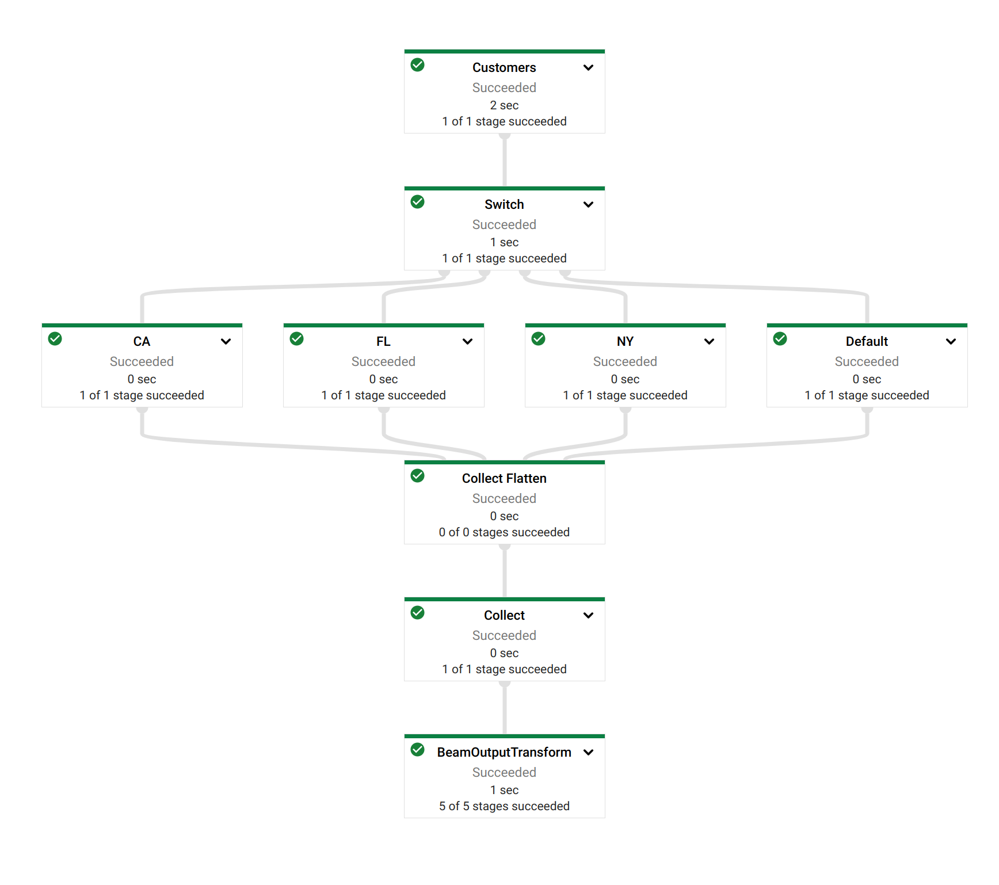

注意 Dataflow 如何创建一个作业，其中的视觉布局和 transform 名称可以直接从您的 Qi Hop pipeline 中识别出来。

查看页面底部的日志。

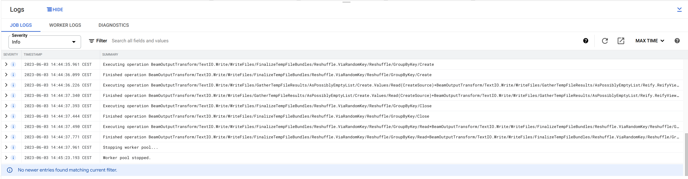

现在，切回 Hop GUI，注意您的 Switch Case pipeline 如何更新为带有绿色成功标记和 transform 指标。日志标签页看起来与您在原生引擎中运行的 pipeline 略有不同。Qi Hop 依赖于它从 Apache Beam 接收的日志信息和指标，而 Apache Beam 又需要从被调用的分布式平台（在本例中为 Dataflow）接收日志和指标。

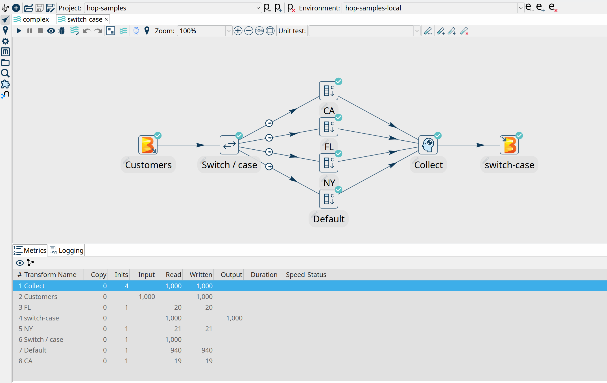

```
2023/06/03 15:44:18 - Hop - Pipeline opened.
2023/06/03 15:44:18 - Hop - Launching pipeline [switch-case]...
2023/06/03 15:44:18 - Hop - Started the pipeline execution.
2023/06/03 15:44:19 - General - Created Apache Beam pipeline with name 'switch-case'
2023/06/03 15:44:19 - General - Handled transform (INPUT) : Customers
2023/06/03 15:44:19 - General - Handled generic transform (TRANSFORM) : Switch / case, gets data from 1 previous transform(s), targets=4, infos=0
2023/06/03 15:44:19 - General - Transform NY reading from previous transform targeting this one using : Switch / case - TARGET - NY
2023/06/03 15:44:19 - General - Handled generic transform (TRANSFORM) : NY, gets data from 1 previous transform(s), targets=0, infos=0
2023/06/03 15:44:19 - General - Transform CA reading from previous transform targeting this one using : Switch / case - TARGET - CA
2023/06/03 15:44:19 - General - Handled generic transform (TRANSFORM) : CA, gets data from 1 previous transform(s), targets=0, infos=0
2023/06/03 15:44:19 - General - Transform Default reading from previous transform targeting this one using : Switch / case - TARGET - Default
2023/06/03 15:44:19 - General - Handled generic transform (TRANSFORM) : Default, gets data from 1 previous transform(s), targets=0, infos=0
2023/06/03 15:44:19 - General - Transform FL reading from previous transform targeting this one using : Switch / case - TARGET - FL
2023/06/03 15:44:19 - General - Handled generic transform (TRANSFORM) : FL, gets data from 1 previous transform(s), targets=0, infos=0
2023/06/03 15:44:19 - General - Handled generic transform (TRANSFORM) : Collect, gets data from 4 previous transform(s), targets=0, infos=0
2023/06/03 15:44:19 - General - Handled transform (OUTPUT) : switch-case, gets data from Collect
2023/06/03 15:44:19 - switch-case - Executing this pipeline using the Beam Pipeline Engine with run configuration 'DataFlow'
2023/06/03 15:47:25 - switch-case - Beam pipeline execution has finished.
```
## 后续步骤

您现在已经使用 Hop 的 Dataflow pipeline 运行配置成功配置并执行了您的第一个 Qi Hop pipeline。
