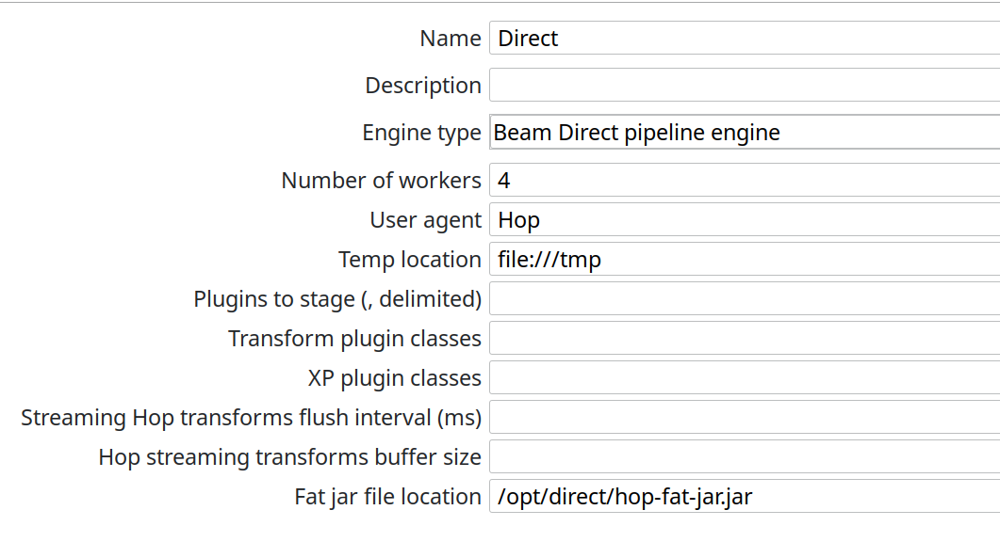

# 使用 Beam Direct Runner 运行 Apache Beam 示例

Direct Runner 在您的机器上执行 pipeline，旨在尽可能验证 pipeline 是否遵循 Apache Beam 模型。Direct Runner 不关注高效的 pipeline 执行，而是执行额外的检查以确保用户不依赖模型不保证的语义。

使用 Direct Runner 进行测试和开发有助于确保 pipeline 在不同 Beam runner 之间是健壮的。此外，当 pipeline 在远程集群上执行时，调试失败的运行可能是一项复杂的任务。相反，在本地对 pipeline 代码进行单元测试通常更快更简单。在本地对 pipeline 进行单元测试还允许您使用首选的本地调试工具。

查看 [Apache Beam Direct Runner 文档](https://beam.apache.org/documentation/runners/direct/) 了解更多详情。

Direct runner 的默认设置应该默认可用，您只需要指定 fat jar 位置。



与 [Flink](pipeline/beam/beam-samples-flink.md) 和 [Spark](pipeline/beam/beam-samples-spark.md) runner 不同，direct runner 可以直接从 Hop GUI 启动。

`beam/pipelines/generate-synthetic-data.hpl` 的输出（减少了行数）如下所示。

```
2022/02/11 11:28:36 - Hop - Projects enabled
2022/02/11 11:28:36 - Hop - Enabling project : 'samples'
2022/02/11 11:29:24 - Hop - Pipeline opened.
2022/02/11 11:29:24 - Hop - Launching pipeline [generate-synthetic-data]...
2022/02/11 11:29:24 - Hop - Started the pipeline execution.
2022/02/11 11:29:26 - General - Created Apache Beam pipeline with name 'generate-synthetic-data'
2022/02/11 11:29:26 - General - Handled transform (ROW GENERATOR) : 100M rows
2022/02/11 11:29:26 - General - Handled generic transform (TRANSFORM) : random data, gets data from 1 previous transform(s), targets=0, infos=0
2022/02/11 11:29:26 - General - Handled transform (OUTPUT) : generate-synthetic-data, gets data from random data
2022/02/11 11:29:26 - generate-synthetic-data - Executing this pipeline using the Beam Pipeline Engine with run configuration 'Direct'
2022/02/11 11:30:44 - generate-synthetic-data - Beam pipeline execution has finished.
```
