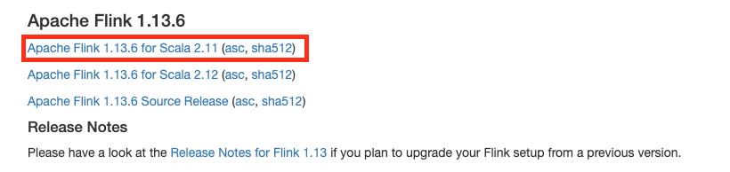
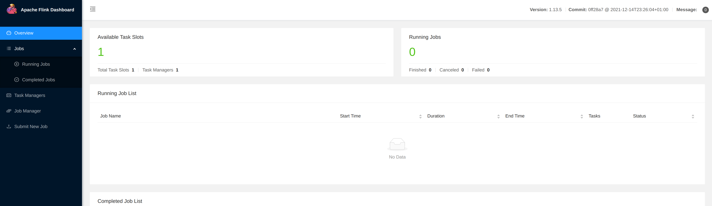
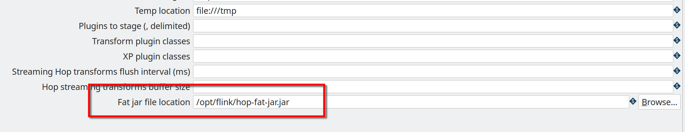
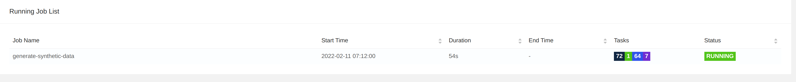
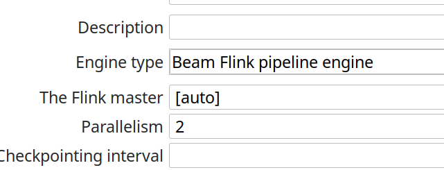
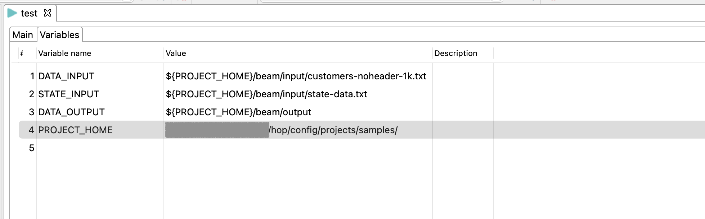
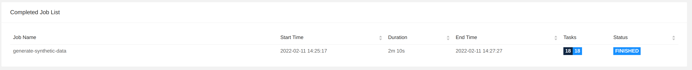

# 使用 Apache Flink 运行 Apache Beam 示例

## 获取 Flink

查看 Beam 入门页面上的[支持版本](getting-started-with-beam.md#supportedversions.md)，找到您的 Hop 版本支持的最新 Flink 版本。

例如，对于 Hop 1.2，目前支持的最新版本是 1.13。请确保下载与最近的 JDK 8 兼容的 Scala 版本对应的 Flink。对于 Flink 1.3.6，这是 Scala 2.11。

下载您选择的 Flink 版本并解压到方便的位置。



## 启动本地 Flink 单节点集群

为了尽可能保持简单，我们将用一条命令运行一个本地单节点 Flink 集群。

在您解压 Flink 的文件夹中，运行：

`bin/start-cluster.sh`

您的输出应该类似于下面的样子：

```shell
Starting cluster.
Starting standalonesession daemon on host <HOSTNAME>.
Starting taskexecutor daemon on host <HOSTNAME>.
```

集群启动不应超过几秒钟。一旦 Flink 可用，您就可以通过 http://localhost:8081/ 访问 Flink Dashboard。



## Flink 运行配置设置

在 Hop GUI 的 Samples 项目 metadata 视图中，编辑 `Flink` pipeline 运行配置，确保 `Fat jar file location`（最后一个选项）指向您之前在[前提条件](running-the-beam-samples.md#prerequisites.md)中创建的 Hop fat jar。



## 从 Hop GUI 运行

> **💡 提示:** 通过 Hop GUI 在嵌入式 Flink 上运行 Hop pipeline 可以正常工作，但这仅用于测试目的，不会显示在您的 Flink Dashboard 中。您可以将默认 Flink master 保留为 `[local]` 以从 Hop GUI 运行嵌入式 Flink 引擎。

将您的 Flink master 设置为集群的 master。对于嵌入式 Flink，`[local]` 即可。

回到数据编排视图，运行示例项目中的一个 Beam pipeline。在此示例中，我们使用了 `samples/beam/pipelines/generate-synthetic-data.hpl`

当您从 Hop GUI 启动 pipeline 时，它将出现在您的 Flink Dashboard 中。



## 从 Flink Run 运行

在实际环境中，您将通过 `flink run` 从 Flink master 运行您的 Flink pipeline。

将您的 Flink master 设置为 `[auto]` 并再次导出您的 Hop metadata（参见[前提条件](running-the-beam-samples.md#prerequisites.md)）。



与 Spark 不同，您无法在运行时向 TaskManager 传递 Java 选项。因此，我们还希望在运行配置中设置 `PROJECT_HOME` 变量。此变量在执行期间用于知道源文件的位置。（metadata 视图 -> Pipeline Run Configuration -> Flink -> Variables）
或者，您可以在运行配置名称后提供第 4 个参数：要使用的环境配置文件的名称。



使用类似下面的命令来传递 `flink run` 所需的所有信息。

```
bin/flink run \
  --class org.apache.hop.beam.run.MainBeam \
  --parallelism 2 \
  /opt/flink/hop-fat-jar.jar \
  <PATH>/hop/config/projects/samples/beam/pipelines/generate-synthetic-data.hpl \
  /opt/flink/hop-metadata.json \
  Flink
```
如果您的 Hop 和 Flink 设置正确，您的输出将类似于下面显示的内容：

```
Argument 1 : Pipeline filename (.hpl)   : <YOUR_PATH>/hop/config/projects/samples/beam/pipelines/generate-synthetic-data.hpl
Argument 2 : Metadata filename (.json)  : /opt/flink/hop-metadata.json
Argument 3 : Pipeline run configuration : Flink
>>>>>> Initializing Hop...
Hop configuration file not found, not serializing: <YOUR_FLINK_PATH>/flink/flink-1.13.5/config/hop-config.json

>>>>>> Loading pipeline metadata
>>>>>> Building Apache Beam Pipeline...
>>>>>> Found Beam Input transform plugin class loader
>>>>>> Pipeline executing starting...

2022/02/11 12:50:25 - General - Created Apache Beam pipeline with name 'generate-synthetic-data'
2022/02/11 12:50:26 - General - Handled transform (ROW GENERATOR) : 100M rows
2022/02/11 12:50:26 - General - Handled generic transform (TRANSFORM) : random data, gets data from 1 previous transform(s), targets=0, infos=0
2022/02/11 12:50:26 - General - Handled transform (OUTPUT) : generate-synthetic-data, gets data from random data
2022/02/11 12:50:26 - General - Executing this pipeline using the Beam Pipeline Engine with run configuration 'Flink'
Job has been submitted with JobID 83f34cefa8d061994b7028df2dcebfcd
Program execution finished
Job with JobID 83f34cefa8d061994b7028df2dcebfcd has finished.
Job Runtime: 129625 ms
Accumulator Results:
- __metricscontainers (org.apache.beam.runners.core.metrics.MetricsContainerStepMap): {
  "metrics": {
    "attempted": [{
      "urn": "beam:metric:user:sum_int64:v1",
      "type": "beam:metrics:sum_int64:v1",
      "payload": "Ag==",
      "labels": {
        "NAMESPACE": "startBundle",
        "NAME": "random data",
        "PTRANSFORM": "random data/ParMultiDo(Transform)"
      }
    }, {
      "urn": "beam:metric:user:sum_int64:v1",
      "type": "beam:metrics:sum_int64:v1",
      "payload": "oI0G",
      "labels": {
        "NAMESPACE": "read",
        "NAME": "random data",
        "PTRANSFORM": "random data/ParMultiDo(Transform)"
      }
    }, {
      "urn": "beam:metric:user:sum_int64:v1",
      "type": "beam:metrics:sum_int64:v1",
      "payload": "Ag==",
      "labels": {
        "NAMESPACE": "init",
        "NAME": "random data",
        "PTRANSFORM": "random data/ParMultiDo(Transform)"
      }
    }, {
      "urn": "beam:metric:user:sum_int64:v1",
      "type": "beam:metrics:sum_int64:v1",
      "payload": "oI0G",
      "labels": {
        "NAMESPACE": "written",
        "NAME": "random data",
        "PTRANSFORM": "random data/ParMultiDo(Transform)"
      }
    }, {
      "urn": "beam:metric:user:sum_int64:v1",
      "type": "beam:metrics:sum_int64:v1",
      "payload": "oI0G",
      "labels": {
        "NAMESPACE": "output",
        "NAME": "generate-synthetic-data",
        "PTRANSFORM": "BeamOutputTransform/generate-synthetic-data/ParMultiDo(HopToString)"
      }
    }, {
      "urn": "beam:metric:user:sum_int64:v1",
      "type": "beam:metrics:sum_int64:v1",
      "payload": "oI0G",
      "labels": {
        "NAMESPACE": "read",
        "NAME": "generate-synthetic-data",
        "PTRANSFORM": "BeamOutputTransform/generate-synthetic-data/ParMultiDo(HopToString)"
      }
    }]
  }
}

2022/02/11 12:52:45 - General - Beam pipeline execution has finished.
>>>>>> Execution finished...
```
在您的 pipeline 完成且 flink run 命令结束后，您的 Flink Dashboard 将在"Completed Job List"中显示一个新条目。您可以在"Running Job List"中跟进任何正在运行的应用程序，并在运行时深入查看其执行详细信息。


