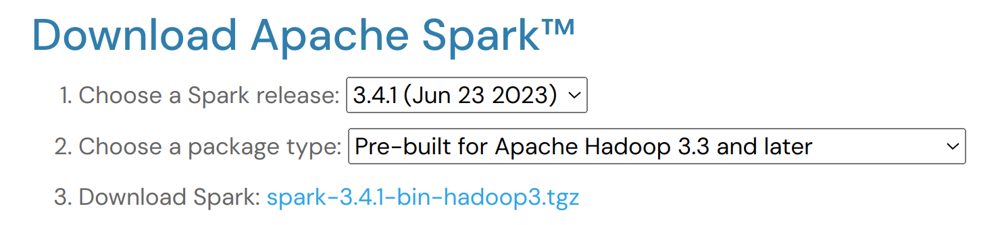
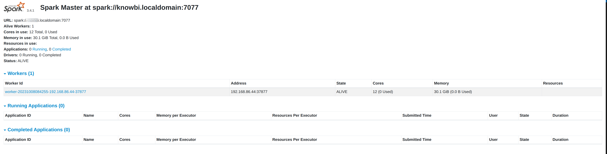
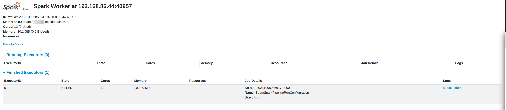

# 使用 Apache Spark 运行 Apache Beam 示例

## 前提条件

检查[前提条件](pipeline/beam/running-the-beam-samples.md#prerequisites.md)以确保您有正确的 Java 版本、已构建 Qi Hop fat jar 并已将项目 metadata 导出为 JSON 文件。

## 获取 Spark

查看 Beam 入门页面上的[支持版本](pipeline/beam/getting-started-with-beam.md#supportedversions.md)，找到您的 Hop 版本支持的最新 Spark 版本。

例如，对于 Hop 2.7，目前支持的最新版本是 3.4.x。

下载您选择的 Spark 版本并解压到方便的位置。



## 启动本地 Spark 单节点集群

为了尽可能保持简单，我们将运行一个本地单节点 Spark 集群。

首先我们需要启动本地 master。这可以从您解压 Spark 的文件夹用单条命令完成：

运行 `<SPARK_FOLDER>/sbin/start-master.sh`。

您的输出应该类似于下面的样子：

```
starting org.apache.spark.deploy.master.Master, logging to <PATH>/spark-3.1.2-bin-hadoop3.2/logs/spark-<USER>-org.apache.spark.deploy.master.Master-1-<HOSTNAME>.out
```
您现在应该可以在 http://localhost:8080 访问 Spark Master 的 Web UI。

从 master 页面头部复制 master 的 URL，例如 `spark://<YOUR_HOSTNAME>.localdomain:7077`。



有了 master 之后，我们可以启动一个 worker（以前称为 slave）。与 master 类似，这是一条接受 master URL 的单条命令

`sbin/start-worker.sh spark://<YOUR_HOSTNAME>.localdomain:7077`.

您的输出应该类似于下面的样子：

```
starting org.apache.spark.deploy.worker.Worker, logging to <PATH>/spark-3.1.2-bin-hadoop3.2/logs/spark-<USER>-org.apache.spark.deploy.worker.Worker-1-<HOSTNAME>.out
```
## 使用 Spark Submit 运行示例 pipeline

由于 Spark 不支持远程执行，我们将通过 Spark Submit 运行其中一个示例 pipeline。

信息：我们在此示例中运行的示例 pipeline 从 `Spark` pipeline 运行配置中读取文件输入和输出的变量。查看 metadata 视图中 `Spark` pipeline 运行配置的 `variables` 标签页以获取更多详细信息。

下面的命令将使用 `spark-submit` 在我们的本地 Spark 集群上运行示例 `input-process-output.hpl` pipeline 所需的所有信息传递进去。

```
bin/spark-submit \
  --master spark://localhost.localdomain:7077 \
  --class org.apache.hop.beam.run.MainBeam \
  --driver-java-options '-DPROJECT_HOME=<PATH>/hop/config/projects/samples' \
  /opt/spark/hop-fat-jar.jar \
  <PATH>/hop/config/projects/samples/beam/pipelines/input-process-output.hpl \
  /opt/spark/hop-metadata.json \
  Spark
```
提示：您可以选择在运行配置名称后提供第 4 个参数：要使用的环境配置文件的名称。

在此情况下，fat jar 和 metadata 导出文件已保存到 `/opt/spark`。最后一个参数 `Spark` 是示例项目中 Spark pipeline 运行配置的名称。替换为您环境中所需的参数并运行。

您应该会看到类似于以下输出的详细日志：

```
23/10/08 08:52:35 WARN Utils: Your hostname, knowbi resolves to a loopback address: 127.0.0.1; using 192.168.86.44 instead (on interface wlan0)
23/10/08 08:52:35 WARN Utils: Set SPARK_LOCAL_IP if you need to bind to another address
>>>>>> Initializing Hop
Hop configuration file not found, not serializing: /opt/spark/spark-3.4.1-bin-hadoop3/config/hop-config.json
Argument 1 : Pipeline filename (.hpl)   : /home/bart/projects/tech/hop/projects/hop-tests/code/beam/input-process-output.hpl
Argument 2 : Environment state filename: (.json)  : /tmp/hop-metadata.json
Argument 3 : Pipeline run configuration : spark
>>>>>> Loading pipeline metadata
>>>>>> Building Apache Beam Pipeline...
>>>>>> Pipeline executing starting...
23/10/08 08:52:44 WARN S3FileSystem: You are using a deprecated file system for S3. Please migrate to module 'org.apache.beam:beam-sdks-java-io-amazon-web-services2'.
2023/10/08 08:52:45 - General - Created Apache Beam pipeline with name 'input-process-output'
2023/10/08 08:52:46 - General - Handled transform (INPUT) : Customers
2023/10/08 08:52:46 - General - Handled generic transform (TRANSFORM) : Only CA, gets data from 1 previous transform(s), targets=0, infos=0
2023/10/08 08:52:46 - General - Handled generic transform (TRANSFORM) : Limit fields, re-order, gets data from 1 previous transform(s), targets=0, infos=0
2023/10/08 08:52:46 - General - Handled transform (OUTPUT) : input-process-output, gets data from Limit fields, re-order
2023/10/08 08:52:46 - General - Executing this pipeline using the Beam Pipeline Engine with run configuration 'spark'
23/10/08 08:52:46 INFO SparkRunner: Executing pipeline using the SparkRunner.
23/10/08 08:52:47 INFO SparkContextFactory: Creating a brand new Spark Context.
23/10/08 08:52:47 INFO SparkContext: Running Spark version 3.4.1
23/10/08 08:52:47 WARN NativeCodeLoader: Unable to load native-hadoop library for your platform... using builtin-java classes where applicable
23/10/08 08:52:47 INFO ResourceUtils: ==============================================================
23/10/08 08:52:47 INFO ResourceUtils: No custom resources configured for spark.driver.
23/10/08 08:52:47 INFO ResourceUtils: ==============================================================
23/10/08 08:52:47 INFO SparkContext: Submitted application: BeamSparkPipelineRunConfiguration
23/10/08 08:52:47 INFO ResourceProfile: Default ResourceProfile created, executor resources: Map(memory -> name: memory, amount: 1024, script: , vendor: , offHeap -> name: offHeap, amount: 0, script: , vendor: ), task resources: Map(cpus -> name: cpus, amount: 1.0)
23/10/08 08:52:47 INFO ResourceProfile: Limiting resource is cpu
23/10/08 08:52:47 INFO ResourceProfileManager: Added ResourceProfile id: 0
23/10/08 08:52:47 INFO SecurityManager: Changing view acls to: bart
23/10/08 08:52:47 INFO SecurityManager: Changing modify acls to: bart
23/10/08 08:52:47 INFO SecurityManager: Changing view acls groups to: 
23/10/08 08:52:47 INFO SecurityManager: Changing modify acls groups to: 
##
##

Lots of output omitted.

##
##
23/10/08 09:01:07 INFO MemoryStore: MemoryStore cleared
23/10/08 09:01:07 INFO BlockManager: BlockManager stopped
23/10/08 09:01:07 INFO BlockManagerMaster: BlockManagerMaster stopped
23/10/08 09:01:07 INFO OutputCommitCoordinator$OutputCommitCoordinatorEndpoint: OutputCommitCoordinator stopped!
23/10/08 09:01:07 INFO SparkContext: Successfully stopped SparkContext
2023/10/08 09:01:07 - General - Beam pipeline execution has finished.
>>>>>> Execution finished...
23/10/08 09:01:07 INFO ShutdownHookManager: Shutdown hook called
23/10/08 09:01:07 INFO ShutdownHookManager: Deleting directory /tmp/spark-69bffb6a-90e2-415d-b4bc-63fcaf649999
23/10/08 09:01:07 INFO ShutdownHookManager: Deleting directory /tmp/spark-14f01b28-130c-48b4-93dc-49465cbb1392
```
当您的 pipeline 完成且 spark-submit 命令结束后，您的 Spark master UI 将在 "Finished Applications" 列表中显示一个新条目。您可以在 "Running Applications" 中跟进任何正在运行的应用程序，并在运行时深入查看其执行详细信息。


