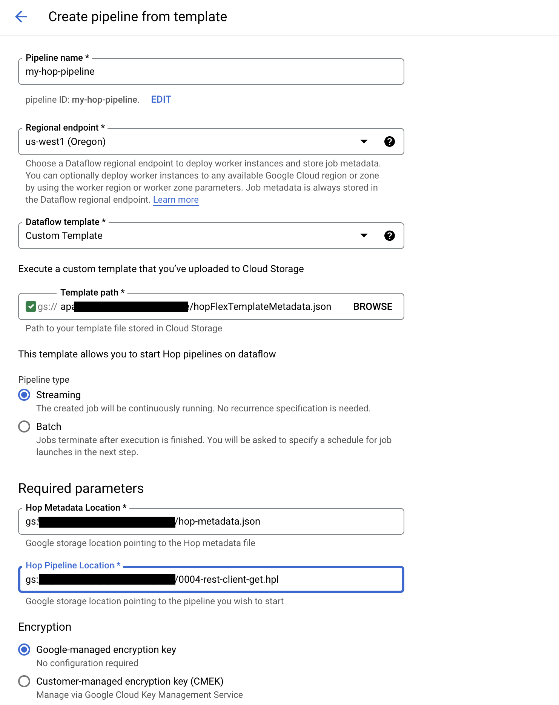

# Google Dataflow Pipeline（模板）

Qi Hop pipeline 可以通过多种方式调度和触发。在本节中，我们将介绍使用 [Dataflow Templates](https://cloud.google.com/dataflow/docs/concepts/dataflow-templates) 在 Google Dataflow 上调度 pipeline 的步骤。Qi Hop 使用 [flex template](https://cloud.google.com/dataflow/docs/guides/templates/using-flex-templates) 在 Google Dataflow 上启动作业。

## 准备您的环境

在我们可以在 Google Cloud Platform [控制台](https://console.cloud.google.com/dataflow/pipelines)中添加新 pipeline 之前，我们需要创建一个包含 3 种类型文件的 Google Storage 存储桶。

### Hop pipeline

您使用 Hop GUI 创建并希望在 Google Dataflow 中调度的 pipeline。

提示:: 您还可以使用 Google Storage 存储桶创建 Hop 项目，这样您可以直接在 GS 中创建和编辑 Hop pipeline

### Hop Metadata

为了让 pipeline 能够使用 Hop metadata 对象和其他运行配置，我们需要生成一个 hop metadata.json 文件。
此文件可以从 GUI 中通过 Tools -> Export metadata to JSON 生成，或使用 [Hop conf](hop-tools/hop-conf/hop-conf.md) 工具的 export-metadata 功能生成。

### Beam Flex template metadata 文件
让一切正常工作的最后一部分是一个由 Dataflow 用于将所有部分整合在一起的 metadata 文件。

```json
{
    "defaultEnvironment": {},
    "image": "apache/hop-dataflow-template:latest",
    "metadata": {
        "description": "This template allows you to start Hop pipelines on dataflow",
        "name": "Template to start a hop pipeline",
        "parameters": [
            {
                "helpText": "Google storage location pointing to the Hop metadata file",
                "label": "Hop Metadata Location",
                "name": "hopMetadataLocation",
                "regexes": [
                    ".*"
                ]
            },
            {
                "helpText": "Google storage location pointing to the pipeline you wish to start",
                "label": "Hop Pipeline Location",
                "name": "hopPipelineLocation",
                "regexes": [
                    ".*"
                ]
            }
        ]
    },
    "sdkInfo": {
        "language": "JAVA"
    }
}
```

重要提示:: 您可以更改 metadata 文件中使用的 Docker 镜像

## 创建 Dataflow pipeline

现在我们可以回到[控制台](https://console.cloud.google.com/dataflow/pipelines)并"Create data pipeline"



选择 Beam Flex template metadata 文件时，您会注意到所需的参数会出现。然后您可以添加存储在 Cloud Storage 中的 Hop metadata 和 Hop pipeline 的路径。
