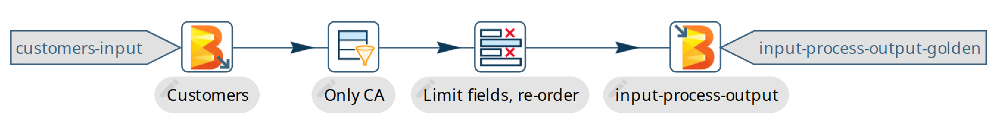
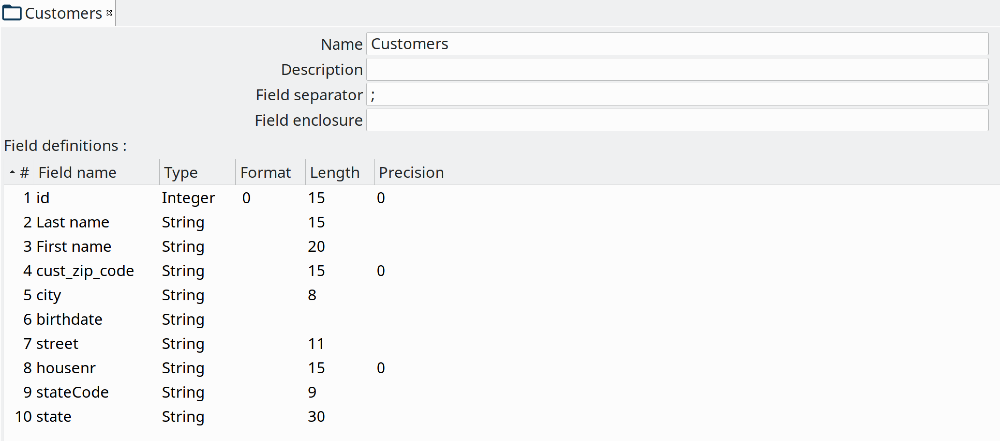

# Apache Beam 入门

## 什么是 Apache Beam？

[Apache Beam](https://beam.apache.org) 是一个高级的统一编程模型，允许您实现可在任何执行引擎上运行的批处理和流处理数据作业。流行的执行引擎包括 [Apache Spark](https://spark.apache.org)、[Apache Flink](https://flink.apache.org) 或 [Google Cloud Platform Dataflow](https://cloud.google.com/dataflow)。

## 它是如何工作的？

Apache Beam 允许您使用标准的 [Beam API](https://beam.apache.org/documentation/programming-guide/) 以 Java、Python 和 Go 等多种编程语言创建程序。这些程序构建数据 [pipeline](https://beam.apache.org/documentation/programming-guide/#creating-a-pipeline)，然后可以在各种执行引擎上使用 Beam [runner](https://beam.apache.org/documentation/runners/capability-matrix/) 执行。

## Hop 如何使用 Beam？

Hop 使用 Beam API 根据您可视化设计的 Hop pipeline 创建 Beam pipeline。Hop 和 Beam 的术语是一致的，因为它们表示相同的意思。Hop 提供了 4 种标准方式来执行您在 Spark、Flink、Dataflow 或 Direct runner 上设计的 pipeline。

以下是相关 plugin 的文档：

- [Beam Spark pipeline engine](../07-管道/beam-spark-pipeline-engine.md)
- [Beam Flink pipeline engine](../07-管道/beam-flink-pipeline-engine.md)
- [Beam Dataflow pipeline engine](../07-管道/beam-dataflow-pipeline-engine.md)
** [Dataflow pipeline 模板](dataflowPipeline/google-dataflow-pipeline.md)
- [Beam Direct pipeline engine](../07-管道/beam-direct-pipeline-engine.md)

## 支持的软件版本

| Hop 版本 | Beam 版本 | Spark 版本 | Flink 版本 |
|---|---|---|---|
| 2.18.0 |  |  |  |
| 2.71.0 |  |  |  |
| 3.5.X (scala 2.12) |  |  |  |
| 1.19.x |  |  |  |
| 2.17.0 |  |  |  |
| 2.70.0 |  |  |  |
| 3.5.X (scala 2.12) |  |  |  |
| 1.19.x |  |  |  |
| 2.16.0 |  |  |  |
| 2.62.0 |  |  |  |
| 3.4.X (scala 2.12) |  |  |  |
| 1.17.x |  |  |  |
| 2.9.0 |  |  |  |
| 2.56.0 |  |  |  |
| 3.4.X (scala 2.12) |  |  |  |
| 1.17.x |  |  |  |
| 2.8.0 |  |  |  |
| 2.50.0 |  |  |  |
| 3.4.X (scala 2.12) |  |  |  |
| 1.16.x |  |  |  |
| 2.7.0 |  |  |  |
| 2.50.0 |  |  |  |
| 3.4.X (scala 2.12) |  |  |  |
| 1.16.x |  |  |  |
| 2.6.0 |  |  |  |
| 2.50.0 |  |  |  |
| 3.4.X (scala 2.12) |  |  |  |
| 1.16.x |  |  |  |
| 2.5.0 |  |  |  |
| 2.48.0 |  |  |  |
| 3.4.X (scala 2.12) |  |  |  |
| 1.16.x |  |  |  |
| 2.4.0 |  |  |  |
| 2.46.0 |  |  |  |
| 3.3.X (scala 2.12) |  |  |  |
| 1.15.x |  |  |  |
| 2.3.0 |  |  |  |
| 2.43.0 |  |  |  |
| 3.3.X (scala 2.12) |  |  |  |
| 1.15.x |  |  |  |
| 2.2.0 |  |  |  |
| 2.43.0 |  |  |  |
| 3.3.X (scala 2.12) |  |  |  |
| 1.15.x |  |  |  |
| 2.1.0 |  |  |  |
| 2.41.0 |  |  |  |
| 3.3.0 (scala 2.12) |  |  |  |
| 1.15.2 |  |  |  |
| 2.0.0 |  |  |  |
| 2.38.0 |  |  |  |
| 3.1.3 (scala 2.12) |  |  |  |
| 1.14.4 (scala 2.11) |  |  |  |
| 1.2.0 |  |  |  |
| 2.35.0 |  |  |  |
| 3.1.2 (scala 2.12) |  |  |  |
| 1.13 (scala 2.11) |  |  |  |
| 1.1.0 |  |  |  |
| 2.35.0 |  |  |  |
| 3.1.2 |  |  |  |
| 1.13 |  |  |  |
| 1.0.0 |  |  |  |
| 2.32.0 |  |  |  |
| 2.4.8 |  |  |  |
| 1.11 |  |  |  |

## 我的 pipeline 如何执行？

Qi Hop pipeline 只是 metadata。各种 Beam pipeline engine plugin 逐个查看此 metadata。它根据提供的 Hop transform handler 决定如何处理。transform 通常分为以下描述的不同类型。

重要的是要记住，Beam pipeline 尝试以"令人尴尬的并行"方式解决每个操作。这意味着每个 transform 都可以并且通常会以超过 1 个副本运行。在大型集群上，您应该期望同一代码的许多副本在任何给定时间运行。

### Beam 特定 transform

有一些 Beam 特定 transform 只在提供的 Beam pipeline 执行引擎上工作。例如：[Beam Input](../03-转换插件/其他转换/beamfileinput.md) 从一个或多个文件读取文本文件数据，或 [Beam BigQuery Output](../03-转换插件/其他转换/beambigqueryoutput.md) 将数据写入 BigQuery。

您可以在 `Big Data` 类别中找到这些 transform，它们的名称都以 `Beam` 开头以便于识别。

这是一个简单 pipeline 的示例，它读取文件夹中（`gs://` 上）的文件，过滤掉加利福尼亚的数据，删除和重命名几个字段，然后将数据写回另一组文件：



### 通用 transform

有一些 transform 被翻译成 Beam 变体：

- [Memory Group By](../03-转换插件/其他转换/memgroupby.md)：此 transform 允许您跨大数据量聚合数据。使用 Beam 引擎时，它使用 `org.apache.beam.sdk.transforms.GroupByKey`。
- [Merge Join](../03-转换插件/其他转换/mergejoin.md)：您可以使用此 transform 连接 2 个数据源。主要区别在于在 Beam 引擎中输入数据不需要排序。用于执行此操作的 Beam 类是：`org.apache.beam.sdk.extensions.joinlibrary.Join`。
- [Generate Rows](../03-转换插件/输入类/rowgenerator.md)：此 transform 用于生成（空/静态）数据行。它可以是固定数量，也可以无限生成行。使用 Beam 引擎时，它使用 `org.apache.beam.sdk.io.synthetic.SyntheticBoundedSource` 或 `org.apache.beam.sdk.io.synthetic.SyntheticUnboundedSource`。

### 不支持的 transform

有一些 transform 不被支持，因为我们还没有找到在 Beam 上实现的好方法：

- [Unique Rows](../03-转换插件/其他转换/uniquerows.md)
- [Group By](../03-转换插件/统计与分组类/groupby.md)：请改用 `Memory Group By`
- [Sort Rows](../03-转换插件/流程控制类/sort.md)

[Denormaliser](../03-转换插件/其他转换/rowdenormaliser.md) transform 在 1.1.0 及更高版本的 Apache Beam 中技术上是正确的。即便如此，您需要考虑该 transform 中键值对的聚合（在一般情况下）只在行的子集上发生。这是因为在 Beam pipeline 中，行到达的顺序会丢失，因为它们会被不断重新打乱以最大化并行度。这与"Local" Hop pipeline 引擎的行为不同。

要解决此问题，您可以对整个数据集应用 [Memory Group By](../03-转换插件/其他转换/memgroupby.md) transform 来获取您反规范化的每个字段的第一个非空值。这将产生正确的结果。

### 所有其他

所有其他 transform 都被简单支持。它们被包装在一些代码中，使在 Hop 本地 pipeline 引擎上运行的相同代码能够在 Beam pipeline 中工作。不过有几点需要说明。

| 特殊情况 | 解决方案 |
|---|---|
| Info transform |  |
| 一些 transform 如 `Stream Lookup` 从其他 transform 读取数据。 |  |
| Target transform |  |
| 有时您想指定特定目标 transform，如 `Switch Case` 或 `Filter Rows`。 |  |
| 非 Beam 输入 transform |  |
| 当您使用非 Beam transform 读取数据时（参见上面的 `Beam 特定 transform`），我们需要确保此 transform 恰好在一个线程中执行。 |  |
| 非 Beam 输出 transform |  |
| Beam pipeline 坚持以令人尴尬的并行方式运行工作，这可能会在输出方面给您带来麻烦。通常，不可能限制特定 transform 的副本数量。Hop 尝试做的是执行一系列操作来尝试强制单线程。然而，这在所有 runner 上都不起作用。例如，Flink 坚持以并行方式执行：`GroupByKey(Void)` -> `Values()` -> `Flatten()`。 |  |
| 使用非 Beam transform 的行批处理 |  |
| 许多目标数据库喜欢以记录批次的方式接收行。 |  |

## Fat jar？

Fat jar 通常用于打包特定项目所需的所有代码。Spark、Flink 和 Dataflow 执行引擎喜欢它，因为它极大地简化了执行 pipeline 时的 Java classpath。Qi Hop 允许您在 Hop GUI 中通过 `Tools/Generate a Hop fat jar...` 菜单或使用以下命令创建 fat jar：

```
sh hop-conf.sh -fj /path/to/fat.jar
```
此 fat jar 的路径可以在各种 Beam 运行配置中被引用。请注意，当前版本的 Hop 及其所有 plugin 都用于构建 fat jar。如果您安装或移除 plugin 或更新 Hop 本身，请确保记住生成新的 fat jar 或更新它。

## Beam 文件定义

[Beam Input](../03-转换插件/其他转换/beamfileinput.md) 和 [Beam Output](../03-转换插件/其他转换/beamfileoutput.md) transform 期望您定义正在读取或写入的文件的布局。



## 当前限制

使用 Spark、Flink 和 Dataflow 等引擎有一些特定的优势。然而，也带来了一些限制...

- 数据预览（尚）不可用。由于执行的分布式特性，我们没有很好的方法获取预览数据。
- 单元测试：由于与预览或调试类似的原因而不可用。要测试您的 Beam pipeline，请在 pipeline 完成后获取数据，并将其与在另一个使用"Local Hop" pipeline 引擎运行的 pipeline 中的黄金数据集进行比较。
- 不支持调试或暂停 pipeline
